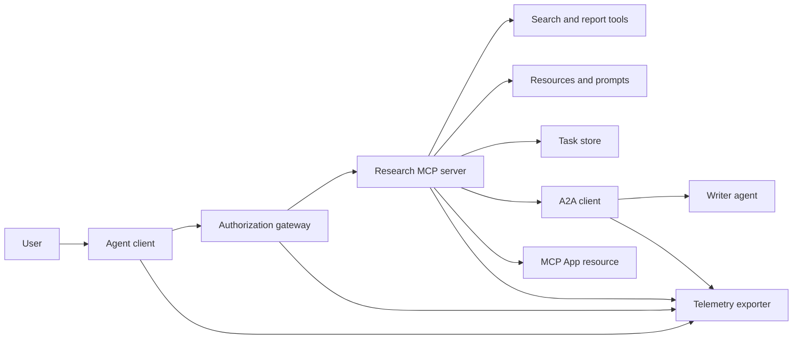
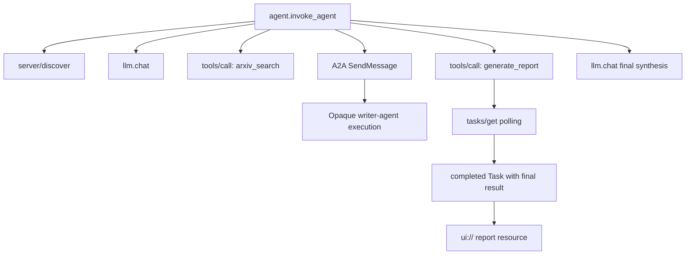
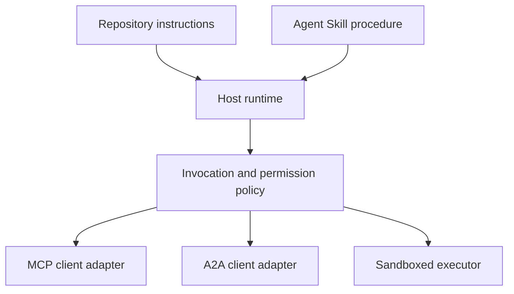

# Capstone: Stateless Tool Ecosystem | 毕业项目：无状态工具生态系统

> A production agent system is a set of boundaries, not a pile of features. This capstone separates a readable in-process simulation from the protocol clients, authorization server, sandbox, and telemetry exporter a real deployment still needs.

> **【中文解读】** 生产级 Agent 系统是一组边界，不是一堆功能。本毕业项目按 MCP 2026-07-28 规范把一个"研究与报告"场景拆成可读的进程内模拟：协议版本/客户端身份/能力随每个请求携带、先 `server/discover` 再用工具、长任务走 Tasks 扩展、A2A 委托写作 Agent、`ui://` 报告资源、OTel 全链路 span。模拟与生产的边界被显式标注——每个模拟层都对应一个必须替换的真实组件。

> **【拓展：为什么强调"无状态"】** MCP 2026-07-28 移除了协议会话与 `initialize` 握手，也移除了 `Mcp-Session-Id`：版本、能力、身份全部改走每个请求的 `_meta` 字段，服务器必须实现 `server/discover`。这意味着网关不能再在会话上缓存授权决定（呼应第 18 课"每个请求独立验证"），长任务必须落在持久的 Tasks 存储而不是连接上。本毕业项目正是围绕这条新集成边界组织的。

> 🔗 **【前置】** 本课是 Phase 13 的收官，综合 01-22 全部课程：01-05（工具接口与 Schema）、06-14（无状态 MCP 信封、发现、传输、资源、prompts、扩展与 Apps）、15-18（投毒防御、OAuth、网关、生产认证）、19（A2A 委托）、20（OTel GenAI 追踪）、21（模型路由）、22（skill 契约）。建议先完成第 18 课和第 22 课再学本课。

**Type:** Build | **类型:** 构建
**Languages:** Python (stdlib, in-process simulation) | **语言:** Python（标准库，进程内模拟）
**Prerequisites:** Phase 13 · 01 through 22, using MCP revision `2026-07-28` | **前置知识:** Phase 13 · 01 至 22（基于 MCP `2026-07-28` 修订版）
**Time:** ~120 minutes | **时间:** 约 120 分钟

## Learning Objectives | 学习目标

- Compose tool calls, task-shaped results, delegated work, UI resources, authorization policy, and trace records into one flow.
  中文翻译：把工具调用、任务形态的结果、委托工作、UI 资源、授权策略和 trace 记录组合进一条流程。
- Carry protocol version, client identity, and capabilities on every MCP request instead of relying on a connection session.
  中文翻译：在每个 MCP 请求上携带协议版本、客户端身份和能力，而不是依赖连接会话。
- Discover a server before use and drive long work through the official Tasks extension.
  中文翻译：使用前先发现服务器，并通过官方 Tasks 扩展驱动长时工作。
- Distinguish a protocol-shaped simulation from an MCP, A2A, OAuth, or OpenTelemetry implementation.
  中文翻译：区分"形似协议的模拟"与真正的 MCP、A2A、OAuth 或 OpenTelemetry 实现。
- Map each simulated boundary to the production component that must replace it.
  中文翻译：把每个模拟边界映射到必须替换它的生产组件。
- Keep `AGENTS.md`, an Agent Skill, runtime adapters, tools, and security policy in their correct roles.
  中文翻译：让 `AGENTS.md`、Agent Skill、运行时适配器、工具和安全策略各居其位。
- Explain which claims can be verified from local output and which need live integration tests.
  中文翻译：说明哪些断言能从本地输出验证，哪些需要真实集成测试。

## The Problem | 问题引入

> **【中文解读】** 设计一个"研究与报告"系统：用户要 Agent 协议论文，系统搜索论文目录、委托摘要、生成报告、返回 UI 资源并记录全链路。这句话背后藏着八个独立契约：工具 Schema、无状态请求信封与服务器发现、网关决策、长时操作、委托协议、宿主-应用桥、trace 传播与导出、可复用操作流程。`code/main.py` 用普通函数和字典把这些边界保持可见，不打开传输、不联系 arXiv、不做 OAuth、不渲染 App、不导出遥测——不把模拟伪装成合规服务。

Design a research-and-report system. A user asks for papers on agent protocols. The system searches a paper catalog, delegates summarization, generates a report, returns a UI resource, and records the path through the system.

> 设计一个研究与报告系统。用户要 Agent 协议相关的论文。系统搜索论文目录、委托摘要、生成报告、返回 UI 资源，并记录贯穿系统的路径。

That sentence hides several independent contracts:

> 这句话背后藏着若干独立契约：

- a model-facing tool schema;
  中文翻译：面向模型的工具 schema；
- a stateless request envelope and server discovery contract;
  中文翻译：无状态请求信封与服务器发现契约；
- a gateway decision for actor, scope, and tool identity;
  中文翻译：针对 actor、scope 与工具身份的网关决策；
- a long-running operation contract;
  中文翻译：长时操作契约；
- a delegation protocol;
  中文翻译：委托协议；
- a host-to-app bridge;
  中文翻译：宿主到应用的桥接；
- trace propagation and export;
  中文翻译：trace 传播与导出；
- a reusable operating procedure.
  中文翻译：可复用的操作流程。

`code/main.py` keeps those boundaries visible with ordinary Python functions and dictionaries. It does not open a transport, contact arXiv, perform OAuth, call an A2A server, render an MCP App, or export telemetry. This makes the control flow easy to inspect without presenting a simulation as a compliant service.

> `code/main.py` 用普通 Python 函数和字典把这些边界保持可见。它不打开传输、不联系 arXiv、不执行 OAuth、不调用 A2A 服务器、不渲染 MCP App、不导出遥测。这让控制流易于检视，同时不把模拟包装成合规服务。

## The Concept | 核心概念

> **【中文解读】** 本节给出目标架构与目标 trace（Mermaid）、当前协议面速查表、2026-07-28 无状态 MCP 对集成边界的改变、安全态势、skill 是流程而非传输、课程工件元数据是本地适配器、模拟与生产的逐层对照表，以及 Phase 13 全课程贡献图。

### Target architecture



The architecture is a conceptual composition of public protocol patterns. It is not a claim about the private internals of any product.

> 该架构是公开协议模式的概念组合，不是对任何产品私有内幕的断言。

### Target trace



In a real implementation, every hop propagates trace context. Span names and attributes must follow the OpenTelemetry semantic conventions supported by the chosen instrumentation version. A shared trace identifier alone does not prove correct parentage, export, or backend ingestion.

> 在真实实现中，每一跳都要传播 trace 上下文。Span 名称与属性必须遵循所选 instrumentation 版本支持的 OpenTelemetry 语义约定。只有一个共享的 trace id 并不能证明父子关系、导出或后端摄取正确。

### Current protocol surfaces

Use the method names defined by the current protocol, not names remembered from an older draft:

> 使用当前协议定义的方法名，而不是旧草案记忆里的名字：

| Boundary | Current surface | What the capstone simulates |
|---|---|---|
| MCP discovery | Mandatory `server/discover` | A direct function returning versions, capabilities, and server identity |
| MCP request context | Version, capabilities, and client identity in every `params._meta` | Fresh request metadata passed to every simulated call |
| MCP tool call | `tools/call` | Direct Python function dispatch |
| MCP task polling | `io.modelcontextprotocol/tasks` with `tasks/get` | A working handle followed by a completed task carrying its final result |
| A2A delegation | `SendMessage` in gRPC and JSON-RPC; `POST /message:send` in HTTP+JSON | One nested span with no remote call or artificial delay |
| MCP App calling a server tool | `app.callServerTool({ name, arguments })` | An HTML string with no live bridge |
| OAuth authorization | Authorization server, protected-resource metadata, audience and scope validation | Static token lookup and scope membership |
| OpenTelemetry | SDK, propagator, exporter, and collector or backend | In-memory span dictionaries |

Protocol names are only the first layer. Production tests must exercise serialization, authentication failures, cancellation, timeouts, retries, and version compatibility across the real wire.

> 协议名只是第一层。生产测试必须在真实线缆上演练序列化、认证失败、取消、超时、重试和版本兼容。

### Stateless MCP changes the integration boundary

> **【中文解读】** 2026-07-28 修订版移除协议会话与 `initialize`/`notifications/initialized` 握手，也移除 `Mcp-Session-Id`。每个请求携带命名空间的 `_meta` 字段（协议版本、客户端能力、客户端身份）。服务器必须实现 `server/discover`；普通结果用 `resultType: "complete"`，任务句柄用 `resultType: "task"`。Tasks 扩展只有 `tasks/get`、`tasks/update`、`tasks/cancel`——`tasks/result` 和 `tasks/list` 已不属于当前扩展；客户端必须在可能收到任务句柄的同一请求里声明 `io.modelcontextprotocol/tasks` 能力，否则服务器返回 `-32021` 并附 `requiredCapabilities`。

Revision `2026-07-28` removes protocol sessions and the `initialize` / `notifications/initialized` handshake. It also removes `Mcp-Session-Id`. Every request carries these namespaced `_meta` fields:

> `2026-07-28` 修订版移除了协议会话与 `initialize` / `notifications/initialized` 握手，也移除了 `Mcp-Session-Id`。每个请求携带这些命名空间化的 `_meta` 字段：

```json
{
  "io.modelcontextprotocol/protocolVersion": "2026-07-28",
  "io.modelcontextprotocol/clientCapabilities": {
    "extensions": {
      "io.modelcontextprotocol/tasks": {}
    }
  },
  "io.modelcontextprotocol/clientInfo": {
    "name": "capstone-client",
    "version": "1.0.0"
  }
}
```

The server must implement `server/discover`. Ordinary results use `resultType: "complete"`; a task handle uses `resultType: "task"`. Each result should identify the server in `_meta.io.modelcontextprotocol/serverInfo`.

> 服务器必须实现 `server/discover`。普通结果使用 `resultType: "complete"`；任务句柄使用 `resultType: "task"`。每个结果都应在 `_meta.io.modelcontextprotocol/serverInfo` 中标明服务器身份。

The task extension has `tasks/get`, `tasks/update`, and `tasks/cancel`. A tool may first return `resultType: "task"`; `tasks/get` itself returns `resultType: "complete"`, and the completed `Task` contains the final result. The old `tasks/result` and `tasks/list` methods are not part of the current extension. A client must advertise `io.modelcontextprotocol/tasks` in the same request that may receive a task handle. If it does not, the server returns `-32021` with `requiredCapabilities` shaped as the missing client-capability object, including `extensions.io.modelcontextprotocol/tasks`.

> Tasks 扩展有 `tasks/get`、`tasks/update`、`tasks/cancel`。工具可以先返回 `resultType: "task"`；`tasks/get` 自身返回 `resultType: "complete"`，完成的 `Task` 里装着最终结果。旧的 `tasks/result` 与 `tasks/list` 不属于当前扩展。客户端必须在可能收到任务句柄的同一请求里声明 `io.modelcontextprotocol/tasks` 能力；若不声明，服务器返回 `-32021`，并在 `requiredCapabilities` 中给出缺失的客户端能力对象形态（含 `extensions.io.modelcontextprotocol/tasks`）。

### Security posture

> **【中文解读】** 目标部署采用纵深防御：PKCE（按客户端类型）、资源与受众绑定、网关 RBAC 检查工具与 scope、上游凭证置于模型可见上下文之外、锁定或审查过的工具描述清单、针对不可信输入/敏感数据/后果性行为的 Rule of Two 审查、以及由宿主在 skill 之外强制执行的沙箱（文件系统/进程/网络/凭证/资源限额）。演示只实现了静态 token、scope 检查和描述哈希——适用于演练策略流，不适用于安全验证。

The intended deployment uses defense in depth:

> 目标部署采用纵深防御：

- OAuth authorization with PKCE where the client type requires it;
  中文翻译：按客户端类型需要启用带 PKCE 的 OAuth 授权；
- resource and audience binding for issued access tokens;
  中文翻译：对签发的 access token 做资源与受众绑定；
- gateway RBAC that checks the requested tool and scope;
  中文翻译：网关 RBAC 检查被请求的工具与 scope；
- upstream credentials held outside model-visible context;
  中文翻译：上游凭证保存在模型可见上下文之外；
- a pinned or reviewed tool-description manifest;
  中文翻译：锁定或经审查的工具描述清单；
- a Rule of Two review for untrusted input, sensitive data, and consequential actions;
  中文翻译：对不可信输入、敏感数据和后果性行为执行 Rule of Two 审查；
- an execution sandbox whose filesystem, process, network, credential, and resource limits are enforced outside the skill.
  中文翻译：执行沙箱的文件系统、进程、网络、凭证与资源限额在 skill 之外强制执行。

The demo implements only static tokens, scope checks, and description hashes. It is useful for policy flow, not security validation.

> 演示只实现了静态 token、scope 检查和描述哈希。它对演练策略流有用，不能用于安全验证。

### Skills are procedure, not transport

An Agent Skill can tell the runtime how to perform the research workflow, which tool contracts to expect, what evidence to save, and when to stop. It cannot make an MCP server exist, establish A2A compatibility, grant scopes, or create a sandbox.

> Agent Skill 可以告诉运行时如何执行研究工作流、期望哪些工具契约、保存什么证据、何时停止。它不能让 MCP 服务器凭空存在、建立 A2A 兼容性、授予 scope 或创建沙箱。



Ship the complete skill directory when the procedure references companion files. The flat artifact in this older capstone is a course blueprint, not evidence that a host preserves a portable bundle. Lessons 24 through 27 build and test the full bundle lifecycle.

> 当流程引用伴生文件时，要交付完整的 skill 目录。本毕业项目中的扁平工件是课程蓝图，不能证明宿主会保留可移植包。第 24 至 27 课构建并测试完整的包生命周期。

### Course artifact metadata is a local adapter

The course catalog and installer recognize flat files named `skill-*.md`, but that is a repository convention rather than the portable Agent Skills package contract. Their minimal frontmatter parser reads only top-level keys. This lesson therefore keeps the portable identity fields and the course catalog fields at the same level:

> 课程目录与安装器识别名为 `skill-*.md` 的扁平文件，但那是仓库约定而非可移植 Agent Skills 包契约。它们的最小 frontmatter 解析器只读顶层键。因此本课把可移植身份字段与课程目录字段放在同一层级：

```yaml
---
name: ecosystem-blueprint
description: Produce a full Phase 13 ecosystem architecture for a product need.
version: "1.0.0"
phase: "13"
lesson: "23"
tags: [mcp, capstone, ecosystem, architecture, a2a, otel]
---
```

`name` and `description` are the portable identity fields. `version`, `phase`, `lesson`, and `tags` are course-specific catalog extensions. The course parser requires `tags` as an inline list so `--tag capstone` can match it.

> `name` 与 `description` 是可移植身份字段。`version`、`phase`、`lesson`、`tags` 是课程专属的目录扩展。课程解析器要求 `tags` 为内联列表，`--tag capstone` 才能匹配到它。

A portable directory skill may use the optional `metadata` map for string-valued extension data. That does not make `metadata` interchangeable with this repository's catalog schema. If this flat file nests `version` or `tags` below `metadata`, the minimal parser skips those indented keys, the catalog records an empty version, and tag filtering cannot find the artifact. Production hosts should use a safe YAML parser and validate their own documented schema.

> 可移植目录 skill 可以用可选的 `metadata` map 承载字符串值扩展数据。但这不意味着 `metadata` 与本仓库的目录 schema 可以互换。若这个扁平文件把 `version` 或 `tags` 嵌套进 `metadata`，最小解析器会跳过那些缩进键，目录记下空版本号，标签过滤也找不到该工件。生产宿主应使用安全的 YAML 解析器并验证自己文档化的 schema。

### Simulation versus production

> **【中文解读】** 逐层对照表就是交接边界：发现、认证、授权、搜索、任务、委托、App、遥测、沙箱——每一层都写明 `code/main.py` 里的模拟物、生产替代件和必需证据。本地绿灯只验证模拟，不能当作生产断言。

| Layer | `code/main.py` | Production replacement | Required evidence |
|---|---|---|---|
| Discovery | `server_discover()` plus static `TOOLS` | `server/discover` followed by cache-aware `tools/list` | Wire transcript, deterministic order, and schema validation |
| Authentication | Token-keyed dictionary | OAuth authorization and resource server validation | Issuer, audience, scope, expiry, and failure tests |
| Authorization | Scope membership | Gateway policy bound to actor, tool, target, and tenant | Allow and deny audit cases |
| Search | Static paper fixtures | Search API or MCP server | Source provenance, ranking, and error tests |
| Tasks | Local handle plus immediate `tasks/get` | Durable `io.modelcontextprotocol/tasks` store with `tasks/get`, `tasks/update`, `tasks/cancel`, and TTL | State-transition, input, cancellation, and recovery tests |
| Delegation | Sleep plus nested span | A2A client and remote Agent Card | Contract, timeout, retry, and opacity tests |
| App | HTML string and URI | MCP Apps resource and `App` bridge | CSP, permissions, tool-call, and browser tests |
| Telemetry | In-memory list | OTel SDK and exporter | Collector receipt and trace-parent assertions |
| Sandbox | None | Host-enforced isolated executor | Escape, egress, secret, and resource-limit tests |

This table is the handoff boundary. A green local run validates the simulation only.

> 这张表就是交接边界。本地绿灯只验证模拟本身。

### Phase 13 map

| Lessons | Contribution |
|---|---|
| 01-05 | Tool interfaces, calls, schemas, structured results, and deterministic validation |
| 06-14 | Stateless MCP request envelopes, discovery, transports, resources, prompts, extensions, and Apps |
| 15-18 | Poisoning defenses, OAuth, gateways, registries, and production authentication |
| 19 | A2A message and task delegation |
| 20 | OpenTelemetry GenAI trace design |
| 21 | Model-provider routing |
| 22 | Portable skill contract and runtime boundary |

```figure
t3-capstone-chain
```

## Build It | 动手构建

> **【中文解读】** 运行进程内线束后检视五件事：`server/discover` 公布 2026-07-28 与 Tasks 扩展；Alice 可读可生成报告而 Bob 的写 scope 被拒；一次编排运行内所有 span 共享同一 trace id 并记录父 span；报告先以任务句柄出现、`tasks/get` 返回携带最终结果与 `ui://` 引用的完成任务；被委托的写作 Agent 保持不透明。脚本运行两次产生两个根 trace；审计条目是进程本地的。

Run the in-process harness:

> 运行进程内线束：

```bash
cd phases/13-tools-and-protocols/23-capstone-tool-ecosystem
python3 code/main.py
```

Inspect five things:

> 检视五件事：

1. `server/discover` advertises revision `2026-07-28` and the Tasks extension.
  中文翻译：`server/discover` 公布 `2026-07-28` 修订版与 Tasks 扩展。
2. Alice can read and generate a report, while Bob's write-scoped call is denied.
  中文翻译：Alice 能读也能生成报告，而 Bob 的写 scope 调用被拒。
3. Every local span in one orchestrator run shares one trace identifier and records parent span identifiers.
  中文翻译：一次编排运行中的每个本地 span 共享同一个 trace 标识符并记录父 span 标识符。
4. The report begins as a task handle. `tasks/get` returns a completed task whose final result contains text and a `ui://` reference.
  中文翻译：报告先以任务句柄出现。`tasks/get` 返回完成的任务，其最终结果包含文本和 `ui://` 引用。
5. The delegated writer remains opaque because the orchestrator records only the boundary span.
  中文翻译：被委托的写作 Agent 保持不透明，因为编排者只记录边界 span。
6. No output claims a network connection, OAuth exchange, collector export, browser render, or sandbox execution occurred.
  中文翻译：任何输出都不得声称发生了网络连接、OAuth 交换、collector 导出、浏览器渲染或沙箱执行。

The script runs twice, so it produces two root traces. Audit entries are process-local and reset on the next run.

> 脚本运行两次，因此产生两个根 trace。审计条目是进程本地的，下次运行即重置。

## Use It | 实际运用

> **【中文解读】** 逐层晋升：先换真实的 `server/discover` 与 `tools/list`，再换授权服务器，然后实现 Tasks 扩展（不要加 `tasks/result` 或 `tasks/list`），接着 A2A 客户端、官方 SDK 的 App、OTel 导出、第 26 课的沙箱契约、第 27 课的发布门。每次晋升都要一条跨新边界的集成测试；线缆变真之后不要删掉底层的策略测试。

Promote one layer at a time:

> 一次晋升一层：

1. Replace `server_discover()` and the static tool list with real `server/discover` and `tools/list` calls. Send version, identity, and capabilities in every request.
  中文翻译：用真实的 `server/discover` 与 `tools/list` 调用替换 `server_discover()` 和静态工具列表。每个请求都发送版本、身份和能力。
2. Replace static tokens with an authorization server and protected resource validation.
  中文翻译：用授权服务器与受保护资源验证替换静态 token。
3. Implement the `io.modelcontextprotocol/tasks` extension and test `tasks/get`, `tasks/update`, `tasks/cancel`, timeout, TTL, and restart recovery. Do not add `tasks/result` or `tasks/list`.
  中文翻译：实现 `io.modelcontextprotocol/tasks` 扩展并测试 `tasks/get`、`tasks/update`、`tasks/cancel`、超时、TTL 和重启恢复。不要添加 `tasks/result` 或 `tasks/list`。
4. Replace the delegation stub with an A2A client that resolves an Agent Card and sends a message.
  中文翻译：用能解析 Agent Card 并发送消息的 A2A 客户端替换委托桩。
5. Build the App with the official SDK and call server tools through `app.callServerTool`.
  中文翻译：用官方 SDK 构建 App，经 `app.callServerTool` 调用服务器工具。
6. Export spans to a test collector and assert parentage at the receiver.
  中文翻译：把 span 导出到测试 collector，并在接收端断言父子关系。
7. Run tool and script execution inside the sandbox contract from Lesson 26.
  中文翻译：在第 26 课的沙箱契约内运行工具与脚本执行。
8. Package the procedure as a complete directory bundle and pass the Lesson 27 release gate.
  中文翻译：把流程打包为完整目录包并通过第 27 课的发布门。

Each promotion needs an integration test that crosses the new boundary. Do not delete the lower-level policy tests when the wire becomes real.

> 每次晋升都需要一条跨过新边界的集成测试。线缆变真之后，不要删掉底层的策略测试。

## Ship It | 产出物

This lesson produces `outputs/skill-ecosystem-blueprint.md`, a legacy single-file course artifact. It asks for a one-page architecture covering primitives, security, delegation, telemetry, packaging, and the hardest operational risk. Its top-level catalog fields are exercised by the repository's real catalog and installer parsers.

> 本课产出 `outputs/skill-ecosystem-blueprint.md`——一个遗留的单文件课程工件。它要求一页架构，覆盖原语、安全、委托、遥测、打包和最难运维的风险。它的顶层目录字段由本仓库真实的目录与安装器解析器演练。

Because it is not a directory bundle, it cannot carry references, scripts, assets, or eval fixtures. Use the package format from Lessons 22 and 24 through 27 when publishing a reusable skill outside this course.

> 因为它不是目录包，无法携带参考文件、脚本、资产或评测夹具。在本课程之外发布可复用 skill 时，请使用第 22 课与第 24 至 27 课的包格式。

## Exercises | 练习题

1. Run `code/main.py`. Separate facts proven by the output from production claims that still need integration evidence.
   中文翻译：运行 `code/main.py`。把输出证明了的事实与仍需集成证据的生产断言分开。

2. Add a second static backend and define the collision rule for two tools with the same name. Then replace both lists with real `tools/list` calls.
   中文翻译：添加第二个静态后端并定义两个同名工具的冲突规则。然后把两个列表都换成真实的 `tools/list` 调用。

3. Replace the writer stub with an A2A test server. Record the Agent Card, message request, timeout path, and returned artifact.
   中文翻译：用 A2A 测试服务器替换写作桩。记录 Agent Card、消息请求、超时路径和返回的工件。

4. Add a task store that survives a process restart. Prove a client can resume with `tasks/get`, respect `pollIntervalMs`, and read the completed task's final result without `tasks/result`.
   中文翻译：添加一个能挺过进程重启的任务存储。证明客户端可以用 `tasks/get` 恢复、遵守 `pollIntervalMs`、并在不使用 `tasks/result` 的情况下读取完成任务的最终结果。

5. Build a minimal MCP App and verify `app.callServerTool` in a browser with a restrictive CSP and explicit permissions.
   中文翻译：构建一个最小 MCP App，并在带严格 CSP 与显式权限的浏览器中验证 `app.callServerTool`。

6. Export the simulated spans through an OTel SDK to a local collector. Assert receipt, trace identifiers, parentage, and error status.
   中文翻译：把模拟 span 经 OTel SDK 导出到本地 collector。断言接收、trace 标识符、父子关系和错误状态。

7. Write `AGENTS.md` for repository-wide maintenance rules and a separate skill bundle for the reusable research procedure. Explain why neither file grants tool authority.
   中文翻译：为仓库级维护规则编写 `AGENTS.md`，并为可复用研究流程编写独立的 skill 包。解释为什么这两个文件都授予不了工具权限。

## Key Terms | 术语速查表

| Term | What people say | What it actually means |
|---|---|---|
| Capstone | "Everything wired together" | A staged integration whose simulated and live boundaries remain explicit |
| Protocol-shaped simulation | "It is basically MCP" | Local data and calls that resemble a protocol without implementing its wire contract |
| Tasks extension | "Long tool call" | An optional `io.modelcontextprotocol/tasks` lifecycle with durable identity, polling, client input, final result, and cancellation semantics |
| Opacity boundary | "The other agent handles it" | The caller sees the declared interface and artifacts, not private reasoning or internal state |
| Runtime adapter | "Skill integration" | Host code that maps portable procedure to discovery, invocation, tools, policy, and context |
| Integration evidence | "It passed" | A transcript, artifact, or receiver-side observation proving the real boundary was crossed |

## Further Reading | 延伸阅读

- [MCP specification 2026-07-28](https://modelcontextprotocol.io/specification/2026-07-28) for stateless requests, discovery, tools, authorization, and transport behavior.
  中文翻译：MCP 2026-07-28 规范——无状态请求、发现、工具、授权与传输行为
- [MCP 2026-07-28 key changes](https://modelcontextprotocol.io/specification/2026-07-28/changelog) for session removal, per-request metadata, MRTR, extensions, and deprecations.
  中文翻译：MCP 2026-07-28 关键变更——会话移除、每请求元数据、MRTR、扩展与弃用项
- [MCP Tasks extension](https://tasks.extensions.modelcontextprotocol.io/specification/draft/tasks) for `tasks/get`, `tasks/update`, `tasks/cancel`, and final results carried by terminal tasks.
  中文翻译：MCP Tasks 扩展——`tasks/get`、`tasks/update`、`tasks/cancel` 与终态任务携带的最终结果
- [MCP Apps SDK](https://github.com/modelcontextprotocol/ext-apps/blob/main/docs/overview.md) for `App` and `app.callServerTool`.
  中文翻译：MCP Apps SDK——`App` 与 `app.callServerTool`
- [A2A protocol](https://a2a-protocol.org/latest/) for Agent Cards, message delivery, tasks, artifacts, and transport bindings.
  中文翻译：A2A 协议——Agent Card、消息投递、任务、工件与传输绑定
- [OpenTelemetry GenAI semantic conventions](https://opentelemetry.io/docs/specs/semconv/gen-ai/) for trace and attribute conventions.
  中文翻译：OpenTelemetry GenAI 语义约定——trace 与属性约定
- [Agent Skills specification](https://agentskills.io/specification) for the portable package contract used by the procedural layer.
  中文翻译：Agent Skills 规范——流程层使用的可移植包契约
