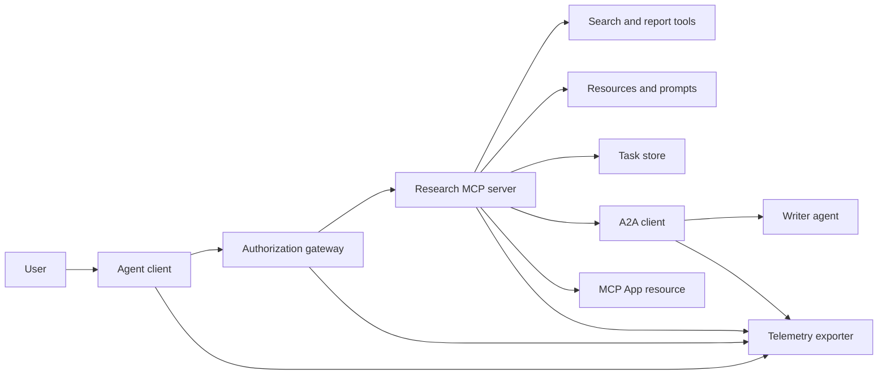
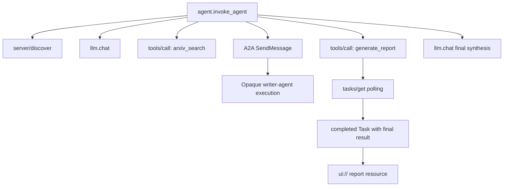
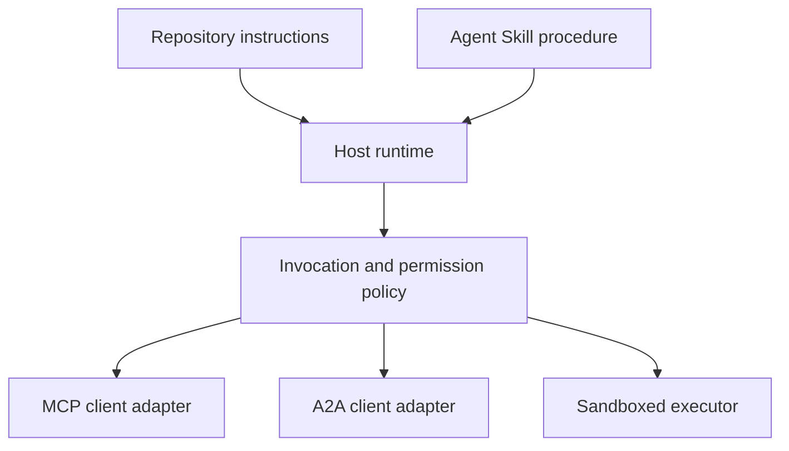

# 毕业项目：无状态工具生态系统

> 生产级 Agent 系统是一组边界，不是一堆功能。本毕业项目把一个可读的进程内模拟与真实部署仍需的协议客户端、授权服务器、沙箱和遥测导出器区分开来。

> **【中文解读】** 生产级 Agent 系统是一组边界，不是一堆功能。本毕业项目按 MCP 2026-07-28 规范把一个"研究与报告"场景拆成可读的进程内模拟：协议版本/客户端身份/能力随每个请求携带、先 `server/discover` 再用工具、长任务走 Tasks 扩展、A2A 委托写作 Agent、`ui://` 报告资源、OTel 全链路 span。模拟与生产的边界被显式标注——每个模拟层都对应一个必须替换的真实组件。

> **【拓展：为什么强调"无状态"】** MCP 2026-07-28 移除了协议会话与 `initialize` 握手，也移除了 `Mcp-Session-Id`：版本、能力、身份全部改走每个请求的 `_meta` 字段，服务器必须实现 `server/discover`。这意味着网关不能再在会话上缓存授权决定（呼应第 18 课"每个请求独立验证"），长任务必须落在持久的 Tasks 存储而不是连接上。本毕业项目正是围绕这条新集成边界组织的。

> 🔗 **【前置】** 本课是 Phase 13 的收官，综合 01-22 全部课程：01-05（工具接口与 Schema）、06-14（无状态 MCP 信封、发现、传输、资源、prompts、扩展与 Apps）、15-18（投毒防御、OAuth、网关、生产认证）、19（A2A 委托）、20（OTel GenAI 追踪）、21（模型路由）、22（skill 契约）。建议先完成第 18 课和第 22 课再学本课。

**类型：** 构建
**语言：** Python（标准库，进程内模拟）
**前置条件：** Phase 13 · 01 至 22（基于 MCP `2026-07-28` 修订版）
**时间：** 约 120 分钟

## 学习目标

- 把工具调用、任务形态的结果、委托工作、UI 资源、授权策略和 trace 记录组合进一条流程。
- 在每个 MCP 请求上携带协议版本、客户端身份和能力，而不是依赖连接会话。
- 使用前先发现服务器，并通过官方 Tasks 扩展驱动长时工作。
- 区分"形似协议的模拟"与真正的 MCP、A2A、OAuth 或 OpenTelemetry 实现。
- 把每个模拟边界映射到必须替换它的生产组件。
- 让 `AGENTS.md`、Agent Skill、运行时适配器、工具和安全策略各居其位。
- 说明哪些断言能从本地输出验证，哪些需要真实集成测试。

## 问题引入

> **【中文解读】** 一句"搜索-委托-生成-渲染-记录"背后藏着八个独立契约。`code/main.py` 用普通函数和字典把这些边界保持可见，不打开传输、不联系 arXiv、不做 OAuth、不渲染 App、不导出遥测——不把模拟伪装成合规服务。

设计一个研究与报告系统。用户要 Agent 协议相关的论文。系统搜索论文目录、委托摘要、生成报告、返回 UI 资源，并记录贯穿系统的路径。

这句话背后藏着若干独立契约：

- 面向模型的工具 schema；
- 无状态请求信封与服务器发现契约；
- 针对 actor、scope 与工具身份的网关决策；
- 长时操作契约；
- 委托协议；
- 宿主到应用的桥接；
- trace 传播与导出；
- 可复用的操作流程。

`code/main.py` 用普通 Python 函数和字典把这些边界保持可见。它不打开传输、不联系 arXiv、不执行 OAuth、不调用 A2A 服务器、不渲染 MCP App、不导出遥测。这让控制流易于检视，同时不把模拟包装成合规服务。

## 核心概念

> **【中文解读】** 本节给出目标架构与目标 trace（Mermaid）、当前协议面速查表、2026-07-28 无状态 MCP 对集成边界的改变、安全态势、skill 是流程而非传输、课程工件元数据是本地适配器、模拟与生产的逐层对照表，以及 Phase 13 全课程贡献图。

### 目标架构



该架构是公开协议模式的概念组合，不是对任何产品私有内幕的断言。

### 目标 trace



在真实实现中，每一跳都要传播 trace 上下文。Span 名称与属性必须遵循所选 instrumentation 版本支持的 OpenTelemetry 语义约定。只有一个共享的 trace id 并不能证明父子关系、导出或后端摄取正确。

### 当前协议面

使用当前协议定义的方法名，而不是旧草案记忆里的名字：

| 边界 | 当前协议面 | 毕业项目模拟什么 |
|---|---|---|
| MCP 发现 | 强制 `server/discover` | 一个直接返回版本、能力与服务器身份的函数 |
| MCP 请求上下文 | 版本、能力与客户端身份进每个 `params._meta` | 每次模拟调用都传入新鲜请求元数据 |
| MCP 工具调用 | `tools/call` | 直接的 Python 函数分发 |
| MCP 任务轮询 | `io.modelcontextprotocol/tasks` 与 `tasks/get` | 一个工作句柄加一个携带最终结果的完成任务 |
| A2A 委托 | gRPC 与 JSON-RPC 的 `SendMessage`；HTTP+JSON 的 `POST /message:send` | 一个嵌套 span，无远程调用或人工延迟 |
| MCP App 调用服务器工具 | `app.callServerTool({ name, arguments })` | 一个 HTML 字符串，无活动桥接 |
| OAuth 授权 | 授权服务器、受保护资源元数据、受众与 scope 验证 | 静态 token 查找与 scope 成员检查 |
| OpenTelemetry | SDK、propagator、exporter 与 collector/后端 | 内存中的 span 字典 |

协议名只是第一层。生产测试必须在真实线缆上演练序列化、认证失败、取消、超时、重试和版本兼容。

### 无状态 MCP 改变了集成边界

> **【中文解读】** 会话没了、握手没了、`Mcp-Session-Id` 没了；版本、能力、身份全走每请求 `_meta`；`server/discover` 必须实现；Tasks 扩展只有 `tasks/get`/`tasks/update`/`tasks/cancel`；未声明任务能力的请求收到任务句柄时服务器以 `-32021` 拒绝。

`2026-07-28` 修订版移除了协议会话与 `initialize` / `notifications/initialized` 握手，也移除了 `Mcp-Session-Id`。每个请求携带这些命名空间化的 `_meta` 字段：

```json
{
  "io.modelcontextprotocol/protocolVersion": "2026-07-28",
  "io.modelcontextprotocol/clientCapabilities": {
    "extensions": {
      "io.modelcontextprotocol/tasks": {}
    }
  },
  "io.modelcontextprotocol/clientInfo": {
    "name": "capstone-client",
    "version": "1.0.0"
  }
}
```

服务器必须实现 `server/discover`。普通结果使用 `resultType: "complete"`；任务句柄使用 `resultType: "task"`。每个结果都应在 `_meta.io.modelcontextprotocol/serverInfo` 中标明服务器身份。

Tasks 扩展有 `tasks/get`、`tasks/update`、`tasks/cancel`。工具可以先返回 `resultType: "task"`；`tasks/get` 自身返回 `resultType: "complete"`，完成的 `Task` 里装着最终结果。旧的 `tasks/result` 与 `tasks/list` 不属于当前扩展。客户端必须在可能收到任务句柄的同一请求里声明 `io.modelcontextprotocol/tasks` 能力；若不声明，服务器返回 `-32021`，并在 `requiredCapabilities` 中给出缺失的客户端能力对象形态（含 `extensions.io.modelcontextprotocol/tasks`）。

### 安全态势

> **【中文解读】** 纵深防御七件套：PKCE、资源与受众绑定、网关 RBAC、上游凭证出模型上下文、锁定描述清单、Rule of Two 审查、宿主强制的沙箱。演示只实现静态 token、scope 检查和描述哈希——适用于演练策略流，不适用于安全验证。

目标部署采用纵深防御：

- 按客户端类型需要启用带 PKCE 的 OAuth 授权；
- 对签发的 access token 做资源与受众绑定；
- 网关 RBAC 检查被请求的工具与 scope；
- 上游凭证保存在模型可见上下文之外；
- 锁定或经审查的工具描述清单；
- 对不可信输入、敏感数据和后果性行为执行 Rule of Two 审查；
- 执行沙箱的文件系统、进程、网络、凭证与资源限额在 skill 之外强制执行。

演示只实现了静态 token、scope 检查和描述哈希。它对演练策略流有用，不能用于安全验证。

### skill 是流程，不是传输

Agent Skill 可以告诉运行时如何执行研究工作流、期望哪些工具契约、保存什么证据、何时停止。它不能让 MCP 服务器凭空存在、建立 A2A 兼容性、授予 scope 或创建沙箱。



当流程引用伴生文件时，要交付完整的 skill 目录。本毕业项目中的扁平工件是课程蓝图，不能证明宿主会保留可移植包。第 24 至 27 课构建并测试完整的包生命周期。

### 课程工件元数据是本地适配器

课程目录与安装器识别名为 `skill-*.md` 的扁平文件，但那是仓库约定而非可移植 Agent Skills 包契约。它们的最小 frontmatter 解析器只读顶层键。因此本课把可移植身份字段与课程目录字段放在同一层级：

```yaml
---
name: ecosystem-blueprint
description: Produce a full Phase 13 ecosystem architecture for a product need.
version: "1.0.0"
phase: "13"
lesson: "23"
tags: [mcp, capstone, ecosystem, architecture, a2a, otel]
---
```

`name` 与 `description` 是可移植身份字段。`version`、`phase`、`lesson`、`tags` 是课程专属的目录扩展。课程解析器要求 `tags` 为内联列表，`--tag capstone` 才能匹配到它。

可移植目录 skill 可以用可选的 `metadata` map 承载字符串值扩展数据。但这不意味着 `metadata` 与本仓库的目录 schema 可以互换。若这个扁平文件把 `version` 或 `tags` 嵌套进 `metadata`，最小解析器会跳过那些缩进键，目录记下空版本号，标签过滤也找不到该工件。生产宿主应使用安全的 YAML 解析器并验证自己文档化的 schema。

### 模拟对生产

> **【中文解读】** 逐层对照表就是交接边界：每一层写明模拟物、生产替代件和必需证据。本地绿灯只验证模拟，不能当作生产断言。

| 层 | `code/main.py` | 生产替代件 | 必需证据 |
|---|---|---|---|
| 发现 | `server_discover()` 加静态 `TOOLS` | `server/discover` 加缓存感知的 `tools/list` | 线缆记录、确定性顺序、schema 验证 |
| 认证 | 按 token 做键的字典 | OAuth 授权与资源服务器验证 | 签发者、受众、scope、过期与失败测试 |
| 授权 | scope 成员检查 | 绑定 actor、工具、目标与租户的网关策略 | 允许与拒绝的审计用例 |
| 搜索 | 静态论文夹具 | 搜索 API 或 MCP 服务器 | 来源溯源、排序与错误测试 |
| 任务 | 本地句柄加即时 `tasks/get` | 持久的 `io.modelcontextprotocol/tasks` 存储（`tasks/get`、`tasks/update`、`tasks/cancel`、TTL） | 状态迁移、输入、取消与恢复测试 |
| 委托 | sleep 加嵌套 span | A2A 客户端与远程 Agent Card | 契约、超时、重试与不透明性测试 |
| App | HTML 字符串与 URI | MCP Apps 资源与 `App` 桥 | CSP、权限、工具调用与浏览器测试 |
| 遥测 | 内存列表 | OTel SDK 与 exporter | collector 接收与 trace-parent 断言 |
| 沙箱 | 无 | 宿主强制的隔离执行器 | 逃逸、出网、机密与资源限额测试 |

这张表就是交接边界。本地绿灯只验证模拟本身。

### Phase 13 全景图

| 课程 | 贡献 |
|---|---|
| 01-05 | 工具接口、调用、schema、结构化结果与确定性验证 |
| 06-14 | 无状态 MCP 请求信封、发现、传输、资源、prompts、扩展与 Apps |
| 15-18 | 投毒防御、OAuth、网关、注册中心与生产认证 |
| 19 | A2A 消息与任务委托 |
| 20 | OpenTelemetry GenAI trace 设计 |
| 21 | 模型提供方路由 |
| 22 | 可移植 skill 契约与运行时边界 |

```figure
t3-capstone-chain
```

## 动手构建

> **【中文解读】** 运行进程内线束后检视五件事：发现公布 2026-07-28 与 Tasks 扩展；Alice 可写 Bob 被拒；同一次编排内 span 共享 trace id 且记录父 span；报告从任务句柄到携带 `ui://` 引用的完成任务；被委托方保持不透明。脚本运行两次产生两个根 trace。

运行进程内线束：

```bash
cd phases/13-tools-and-protocols/23-capstone-tool-ecosystem
python3 code/main.py
```

检视五件事：

1. `server/discover` 公布 `2026-07-28` 修订版与 Tasks 扩展。
2. Alice 能读也能生成报告，而 Bob 的写 scope 调用被拒。
3. 一次编排运行中的每个本地 span 共享同一个 trace 标识符并记录父 span 标识符。
4. 报告先以任务句柄出现。`tasks/get` 返回完成的任务，其最终结果包含文本和 `ui://` 引用。
5. 被委托的写作 Agent 保持不透明，因为编排者只记录边界 span。
6. 任何输出都不得声称发生了网络连接、OAuth 交换、collector 导出、浏览器渲染或沙箱执行。

脚本运行两次，因此产生两个根 trace。审计条目是进程本地的，下次运行即重置。

## 实际运用

> **【中文解读】** 逐层晋升：发现与工具列表 → 授权服务器 → Tasks 扩展（不要加 `tasks/result`/`tasks/list`）→ A2A 客户端 → 官方 SDK 的 App → OTel 导出 → 沙箱契约 → 发布门。每次晋升都要一条跨新边界的集成测试；线缆变真之后不要删掉底层的策略测试。

一次晋升一层：

1. 用真实的 `server/discover` 与 `tools/list` 调用替换 `server_discover()` 和静态工具列表。每个请求都发送版本、身份和能力。
2. 用授权服务器与受保护资源验证替换静态 token。
3. 实现 `io.modelcontextprotocol/tasks` 扩展并测试 `tasks/get`、`tasks/update`、`tasks/cancel`、超时、TTL 和重启恢复。不要添加 `tasks/result` 或 `tasks/list`。
4. 用能解析 Agent Card 并发送消息的 A2A 客户端替换委托桩。
5. 用官方 SDK 构建 App，经 `app.callServerTool` 调用服务器工具。
6. 把 span 导出到测试 collector，并在接收端断言父子关系。
7. 在第 26 课的沙箱契约内运行工具与脚本执行。
8. 把流程打包为完整目录包并通过第 27 课的发布门。

每次晋升都需要一条跨过新边界的集成测试。线缆变真之后，不要删掉底层的策略测试。

## 产出物

本课产出 `outputs/skill-ecosystem-blueprint.md`——一个遗留的单文件课程工件。它要求一页架构，覆盖原语、安全、委托、遥测、打包和最难运维的风险。它的顶层目录字段由本仓库真实的目录与安装器解析器演练。

因为它不是目录包，无法携带参考文件、脚本、资产或评测夹具。在本课程之外发布可复用 skill 时，请使用第 22 课与第 24 至 27 课的包格式。

## 练习题

1. 运行 `code/main.py`。把输出证明了的事实与仍需集成证据的生产断言分开。

2. 添加第二个静态后端并定义两个同名工具的冲突规则。然后把两个列表都换成真实的 `tools/list` 调用。

3. 用 A2A 测试服务器替换写作桩。记录 Agent Card、消息请求、超时路径和返回的工件。

4. 添加一个能挺过进程重启的任务存储。证明客户端可以用 `tasks/get` 恢复、遵守 `pollIntervalMs`、并在不使用 `tasks/result` 的情况下读取完成任务的最终结果。

5. 构建一个最小 MCP App，并在带严格 CSP 与显式权限的浏览器中验证 `app.callServerTool`。

6. 把模拟 span 经 OTel SDK 导出到本地 collector。断言接收、trace 标识符、父子关系和错误状态。

7. 为仓库级维护规则编写 `AGENTS.md`，并为可复用研究流程编写独立的 skill 包。解释为什么这两个文件都授予不了工具权限。

## 术语速查表

| 术语 | 人们怎么说 | 实际含义 | 英文 |
|------|-----------|---------|------|
| 毕业项目 | "所有东西接在一起" | 模拟与真实边界始终保持显式的分阶段集成 | Capstone |
| 形似协议的模拟 | "它基本上就是 MCP" | 本地数据与调用形似协议，却未实现其线缆契约 | Protocol-shaped simulation |
| Tasks 扩展 | "长工具调用" | 可选的 `io.modelcontextprotocol/tasks` 生命周期：持久身份、轮询、客户端输入、最终结果与取消语义 | Tasks extension |
| 不透明边界 | "另一个 Agent 会处理" | 调用方看到声明式接口与工件，看不到私有推理或内部状态 | Opacity boundary |
| 运行时适配器 | "skill 集成" | 把可移植流程映射到发现、调用、工具、策略与上下文的宿主代码 | Runtime adapter |
| 集成证据 | "它通过了" | 证明真实边界确被跨越的记录、工件或接收端观察 | Integration evidence |

## 延伸阅读

- [MCP 规范 2026-07-28](https://modelcontextprotocol.io/specification/2026-07-28)——无状态请求、发现、工具、授权与传输行为
- [MCP 2026-07-28 关键变更](https://modelcontextprotocol.io/specification/2026-07-28/changelog)——会话移除、每请求元数据、MRTR、扩展与弃用项
- [MCP Tasks 扩展](https://tasks.extensions.modelcontextprotocol.io/specification/draft/tasks)——`tasks/get`、`tasks/update`、`tasks/cancel` 与终态任务携带的最终结果
- [MCP Apps SDK](https://github.com/modelcontextprotocol/ext-apps/blob/main/docs/overview.md)——`App` 与 `app.callServerTool`
- [A2A 协议](https://a2a-protocol.org/latest/)——Agent Card、消息投递、任务、工件与传输绑定
- [OpenTelemetry GenAI 语义约定](https://opentelemetry.io/docs/specs/semconv/gen-ai/)——trace 与属性约定
- [Agent Skills 规范](https://agentskills.io/specification)——流程层使用的可移植包契约
