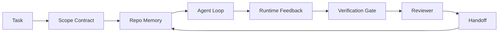

# 工程 工作台 为什么

> A capable model is not enough. Reliable agents need a workbench: instructions, state, scope, feedback, verification, review, and handoff. Strip those away and even a frontier model produces work that is unsafe to ship.


**类型：** 学习 + 构建
**语言：** Python (stdlib)
**前置条件：** Phase 14 · 01 (Agent Loop), Phase 14 · 26 (Failure Modes)
**预计时间：** ~45 minutes

## 学习目标

- Separate model capability from execution reliability.
- Name the seven workbench surfaces that decide whether an agent ships.
- Compare a prompt-only run against a workbench-guided run on a small repo task.
- Produce a failure-mode report that maps each missed surface to the symptom it caused.

## 问题引入

> **【中文解读】** Agent 在真实仓库中失败的原因分析：(1) 指令遵循失败——忽略约束或编造不存在的能力；(2) 上下文窗口耗尽——长代码库超出窗口导致关键信息丢失；(3) 错误累积——小错误在多步执行中雪崩式放大；(4) 缺乏项目记忆——不知道代码库的约定和架构。

## 核心概念

A workbench is the operating environment that wraps the model during a task. It has seven surfaces:
| Surface | What it carries | Failure when missing |
|---------|-----------------|----------------------|
| Instructions | Startup rules, forbidden actions, definition of done | Agent guesses what shipping means |
| State | Current task, touched files, blockers, next action | Each session restarts from zero |
| Scope | Allowed files, forbidden files, acceptance criteria | Edits leak into unrelated code |
| Feedback | Real command output captured into the loop | Agent declares success on a 400 |
| Verification | Tests, lint, smoke run, scope check | "Looks good" reaches main |
| Review | A second pass with a different role | Builder marks own homework |
| Handoff | What changed, why, what is left | Next session re-discovers everything |
> **【中文解读】** Agent 在真实仓库中失败的原因分析：(1) 指令遵循失败——忽略约束或编造不存在的能力；(2) 上下文窗口耗尽——长代码库超出窗口导致关键信息丢失；(3) 错误累积——小错误在多步执行中雪崩式放大；(4) 缺乏项目记忆——不知道代码库的约定和架构。
The workbench is independent of the model. You can swap the model and keep the surfaces. You cannot swap the surfaces and keep reliability.

The loop closes on the state file, not on chat history. Chat is volatile. The repo is the system of record.
### Workbench versus prompt engineering
Prompting tells the model what you want this turn. A workbench tells the model how to do work across turns and across sessions. Most agent failure stories are workbench failures wearing prompt-engineering clothes.
### Workbench versus framework
A framework gives you a runtime (LangGraph, AutoGen, Agents SDK). A workbench gives the agent a place to work inside that runtime. You need both. This mini-track is about the second one.
### Reasoning from primitives, not from vendor taxonomies
There is a lot of writing on "harness engineering" right now. Addy Osmani, OpenAI, Anthropic, LangChain, Martin Fowler, MongoDB, HumanLayer, Augment Code, Thoughtworks, the walkinglabs awesome list, and a steady drumbeat of Medium and Hacker News pieces are all carrying it. They disagree on the boundary of what a harness is, what is in scope, and which vocabulary to use. We do not need to pick a side. The seven surfaces are a UX layer; underneath every workbench is the same set of distributed-systems primitives that hold up any reliable backend.
Strip the agent label off for a moment. An agent run is computation that crosses time, processes, and machines. To make that reliable you need the same primitives any production system needs.
| Primitive | What it is | What it carries for an agent |
|-----------|------------|------------------------------|
| Function | Typed handler. Pure where possible. Owns its inputs and outputs. | A tool call, a rule check, a verification step, a model invocation |
| Worker | Long-lived process that owns one or more functions and a lifecycle | The builder, the reviewer, the verifier, an MCP server |
| Trigger | Event source that invokes a function | Agent loop tick, HTTP request, queue message, cron, file change, hook |
| Runtime | The boundary that decides what runs where, with what timeouts and resources | Claude Code's process, LangGraph's runtime, a worker container |
| HTTP / RPC | The wire between caller and worker | Tool-call protocol, MCP request, model API |
| Queue | Durable buffer between trigger and worker; back-pressure, retry, idempotency | The task board, the feedback log, the review inbox |
| Session persistence | State that survives crashes, restarts, model swaps | `agent_state.json`, checkpoints, KV stores, the repo itself |
| Authorization policy | Who can call what function with which scope | Allowed/forbidden files, approval boundaries, MCP capability lists |
Now map the seven workbench surfaces onto those primitives.
- **Instructions** — policy + function metadata. Rules are checks (functions). The router (`AGENTS.md`) is policy attached to the runtime's startup.
- **State** — session persistence. A keyed store the runtime reads at every step. File, KV, or DB; the persistence semantics matter, the storage backend does not.
- **Scope** — authorization policy per task. Allowed/forbidden globs are an ACL. Approvals required are a permission lattice.
- **Feedback** — invocation log written into a queue. Every shell call is a record, durable, replayable.
- **Verification** — a function. Deterministic over inputs. Triggered on task close. Fails closed.
- **Review** — a separate worker with read-only authz on builder artifacts and write-only authz on review reports.
- **Handoff** — a durable record emitted by a session-end trigger. The next session's startup trigger reads it.
The agent loop itself is a worker that consumes events (user message, tool result, timer tick), calls functions (the model, then the tools the model picks), writes records (state, feedback), and emits triggers (verify, review, handoff). No mystery; the same shape as a job processor.
### Patterns in circulation, translated to primitives
Every popular harness pattern reduces to the eight primitives. Translation table.
| Vendor or community pattern | What it actually is |
|------------------------------|--------------------|
| Ralph Loop (Claude Code, Codex, agentic_harness book) — re-inject original intent into a fresh context window when the agent tries to stop early | A trigger that re-enqueues a task with a clean context; session persistence carries the goal forward |
| Plan / Execute / Verify (PEV) | Three workers, one per role, communicating via state and a queue between phases |
| Harness-compute separation (OpenAI Agents SDK, April 2026) — split control plane from execution plane | Restating control-plane / data-plane. Predates the agent label by decades |
| Open Agent Passport (OAP, March 2026) — sign and audit every tool call against a declarative policy before execution | An authorization policy enforced by a pre-action worker, with a signed audit queue |
| Guides and Sensors (Birgitta Böckeler / Thoughtworks) — feedforward rules + feedback observability | Authorization policy + verification functions + observability traces |
| Progressive compaction, 5-stage (Claude Code reverse engineering, April 2026) | A state-management worker that runs cron-like over session persistence to keep it within a budget |
| Hooks / middleware (LangChain, Claude Code) — intercept model and tool calls | Triggers + functions wrapped around the runtime's invocation path |
| Skills as Markdown with progressive disclosure (Anthropic, Flue) | A function registry where the function metadata is loaded into context just-in-time |
| Sandbox agents (Codex, Sandcastle, Vercel Sandbox) | The compute plane: a runtime with isolated filesystem, network, and lifecycle |
| MCP servers | Workers exposing functions over a stable RPC, with capability lists as authorization |
Every entry in that table is the agent community arriving at a primitive that already had a name in distributed systems and giving it a new one. Useful labels for marketing; not useful as engineering vocabulary.
### What the receipts actually say
The harness-over-model claim has numbers behind it now. Worth knowing, because they are also the only honest argument against "just wait for a smarter model."
- Terminal Bench 2.0 — same model, harness change moved a coding agent from outside the top 30 to rank five (LangChain, *Anatomy of an Agent Harness*).
- Vercel — deleted 80% of its agent's tools; success rate jumped from 80% to 100% (MongoDB).
- Harvey — legal agents more than doubled accuracy through harness optimization alone (MongoDB).
- 88% of enterprise AI agent projects fail to reach production. The failures cluster around runtime, not reasoning (preprints.org, *Harness Engineering for Language Agents*, March 2026).
- A 2025 benchmark study across three popular open-source frameworks reported ~50% task completion; long-context WebAgent collapsed from 40-50% to under 10% in long-context conditions, mostly from infinite loops and goal loss (covered widely in early 2026 writeups).
The takeaway is not "harness wins forever." Models do absorb harness tricks over time. The takeaway is that today, the load-bearing engineering is around the model, not inside it, and the primitives that carry that load are the ones every production system has always needed.
### Where vendor writeups stop short
This is the part you do not need to be polite about.
- LangChain's *Anatomy of an Agent Harness* enumerates eleven components — prompts, tools, hooks, sandboxes, orchestration, memory, skills, subagents, and a runtime "dumb loop." It does not name queues, workers as a deployment unit, trigger semantics, session persistence as a separate concern, or authorization policy. It treats the harness as an object you configure, not as a system you deploy.
- Addy Osmani's *Agent Harness Engineering* lands the framing `Agent = Model + Harness` and the ratchet pattern, but stops short of saying what a harness is built out of. It reads as a stance, not a spec.
- Anthropic and OpenAI go deepest on the surfaces but stay inside their own runtimes. The "harness-compute separation" announcement in the April 2026 Agents SDK is the first vendor piece that explicitly endorses the control-plane / data-plane split. That is a primitive idea, not a new one.
- The agentic_harness book treats harness as a config object (Jaymin West's *Agentic Engineering*, chapter 6) and the strongest line in it is "the harness is the primary security boundary in an agentic system." That is just authorization policy, restated.
- Hacker News threads keep arriving at the same place. The April 2026 thread *The agent harness belongs outside the sandbox* argues the harness should sit "more like a hypervisor that sits outside everything and authorises access based on context and user." That is, again, authorization policy as a separate plane.
You do not need to disagree with any of these pieces to notice the gap. They are writing UX descriptions of a system that already exists. We are writing the system. When the system is built right, the seven surfaces fall out of the primitives. When it is built wrong, no amount of `AGENTS.md` polish fixes the missing queue.
So when you hear "harness engineering" elsewhere, translate to primitives. Prompts and rules are policy and functions. Scaffolding is the runtime. Guardrails are authorization + verification. Hooks are triggers. Memory is session persistence. The Ralph Loop is requeue. Subagents are workers. Sandboxes are compute planes. The vocabulary changes; the engineering does not. The workbench is the agent-facing UX; the harness, in the sense that survives the next vendor reframe, is functions, workers, triggers, runtimes, queues, persistence, and policy wired together correctly.

## 动手实现

`code/main.py` runs a tiny repo task twice. First as prompt only, then with the seven surfaces wired in. Same model, same task. The script counts which surfaces were missing on the failed run and prints a failure-mode report.
The repo task is small on purpose: add input validation to a one-file FastAPI-style handler and write a passing test.
Run it:
```
python3 code/main.py
```
Output: a side-by-side log of the two runs, a `failure_modes.json` summarizing the prompt-only run, and a one-line verdict for the workbench run.
The agent is a tiny rule-based stub; the point is the surfaces, not the model. Across the rest of this mini-track you will rebuild each surface as a real, reusable artifact.

## 用框架实现

- **Claude Code, Codex, Cursor.** `AGENTS.md` and `CLAUDE.md` are the instructions surface. Slash commands are scope. Hooks are verification.
- **LangGraph, OpenAI Agents SDK.** Checkpoints and session stores are the state surface. Handoffs are the handoff surface.
- **CI on a real repo.** Tests, lint, and type-check are verification. The PR template is handoff. CODEOWNERS is review.

## 产出物

`outputs/skill-workbench-audit.md` is a portable skill that audits an existing repo for the seven workbench surfaces and reports which are missing, which are partial, and which are healthy. Drop it next to any agent setup; it tells you what to fix first.

## 练习题

1. Pick a repo where you already run an agent. Score the seven surfaces from 0 (missing) to 2 (healthy). What is your weakest surface?
   *思考并实践此练习*
2. Extend `main.py` so the prompt-only run also produces a fake "success" claim. Verify the verification gate would have caught it.
   *思考并实践此练习*
3. Add an eighth surface for your own product. Justify why it does not collapse into one of the existing seven.
   *思考并实践此练习*
4. Re-run the script with a different stub agent that hallucinates an extra file write. Which surface catches it first?
   *思考并实践此练习*
5. Map the five industry-recurring failure modes from Phase 14 · 26 onto the seven surfaces. Which mode is each surface designed to absorb?
   *思考并实践此练习*

## 术语速查表

| 术语 | 实际含义 |
|------|---------|
| Workbench | "The setup" |
| Surface | "A doc" or "a script" |
| System of record | "The notes" |
| Definition of done | "Acceptance" |
| Workbench audit | "Repo readiness check" |

## 延伸阅读

