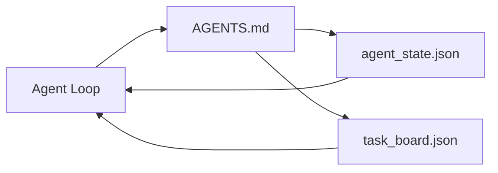

# 工作台 最小化

> The smallest useful workbench is three files: a root instructions router, a state file, and a task board. Everything else is layered on top. If a repo cannot carry these three, no model will save it.


**类型：** 构建
**语言：** Python (stdlib)
**前置条件：** Phase 14 · 31 (Why Capable Models Still Fail)
**预计时间：** ~45 minutes

## 学习目标

- Define the three files that form the minimum viable workbench.
- Explain why a short root router beats a long monolithic `AGENTS.md`.
- Build a state file the agent can read at every turn and write at the end.
- Build a task board that survives multi-session work without chat history.

## 问题引入

> **【中文解读】** 最小化 Agent 工作台是理解编码 Agent 内部机制的起点。它包含五个核心组件：(1) 文件读写工具；(2) 代码执行沙盒；(3) 简单的 ReAct 循环；(4) 消息缓冲区；(5) 停止条件。目标是让学习者从头理解每个组件的作用和交互。

## 核心概念


> **【中文解读】** 最小化 Agent 工作台是理解编码 Agent 内部机制的起点。它包含五个核心组件：(1) 文件读写工具；(2) 代码执行沙盒；(3) 简单的 ReAct 循环；(4) 消息缓冲区；(5) 停止条件。目标是让学习者从头理解每个组件的作用和交互。
### AGENTS.md is a router, not a manual
A good `AGENTS.md` is short. It points the agent at:
- The state file (where you are).
- The task board (what is left).
- The deeper rules (under `docs/agent-rules.md`).
- The verification command (how to know it works).
Anything longer goes in deeper docs, loaded only when needed. Long manuals get ignored. Short routers get followed.
### agent_state.json is the system of record
State carries: the active task id, the touched files, the assumptions made, the blockers, and the next action. The agent reads it at every turn. The next session reads it instead of replaying chat.
State lives in a file because chat history is unreliable. Sessions die. Conversations get trimmed. The file does not.
### task_board.json is the queue
The task board carries every task with status `todo | in_progress | done | blocked`. It is the queue the agent pulls from when state is empty, and the queue you read when you want to know whether the agent is on track.
A task on the board has an id, a goal, an owner (`builder`, `reviewer`, or `human`), and acceptance criteria. The board is small on purpose: when it grows past a screen, you have a planning problem, not a board problem.
### Three files is the floor, not the ceiling
Later lessons add scope contracts, feedback runners, verification gates, reviewer checklists, and handoff packets. The three files here are what they all assume.

## 动手实现

`code/main.py` writes the minimal workbench into an empty repo and demonstrates a single agent turn that:
1. Reads `agent_state.json`.
2. Pulls the next task from `task_board.json` if state is empty.
3. Touches a single file inside scope.
4. Writes back updated state.
Run it:
```
python3 code/main.py
```
The script creates `workdir/` next to itself, lays down the three files, runs one turn, and prints the diff. Re-run it to see how the second turn picks up where the first left off.

## 用框架实现

- **Claude Code:** `AGENTS.md` or `CLAUDE.md` for the router, `.claude/state.json`-style stores for state, hooks for the board.
- **Codex / Cursor:** workspace rules for the router, session memory for state, queued tasks in the chat sidebar for the board.
- **Custom Python agent:** the same files you just wrote.

## 产出物

`outputs/skill-minimal-workbench.md` generates the three-file workbench for any new repo: an `AGENTS.md` router tuned to the project, an `agent_state.json` with the right keys, and a `task_board.json` seeded with the current backlog.

## 练习题

1. Add a `last_run` timestamp to `agent_state.json`. Refuse to run if the file is older than 24 hours unless an operator confirms.
   *思考并实践此练习*
2. Add a `priority` field to the task board and change the puller to always pick the highest priority `todo`.
   *思考并实践此练习*
3. Migrate `task_board.json` to JSON Lines so each task is a line and diffs are clean in version control.
   *思考并实践此练习*
4. Write a `lint_workbench.py` that fails if `AGENTS.md` is over 80 lines or references a file that does not exist.
   *思考并实践此练习*
5. Decide which one of the three files would hurt the most to lose. Defend it.
   *思考并实践此练习*

## 术语速查表

| 术语 | 实际含义 |
|------|---------|
| Router | `AGENTS.md` |
| State file | "The notes" |
| Task board | "The backlog" |
| System of record | "Source of truth" |

## 延伸阅读

