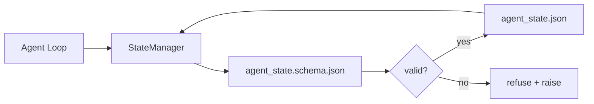

# 持久 记忆 状态 仓库

> Chat history is volatile. The repo is durable. The workbench stores agent state in versioned files so the next session, the next agent, and the next reviewer all read from the same source of truth.


**类型：** 构建
**语言：** Python (stdlib + `jsonschema` optional)
**前置条件：** Phase 14 · 32 (Minimal Workbench)
**预计时间：** ~60 minutes

## 学习目标

- Define what belongs in repo memory and what belongs in chat history.
- Author JSON Schemas for `agent_state.json` and `task_board.json`.
- Build a state manager that loads, validates, mutates, and persists state atomically.
- Use the schema to refuse bad writes before they corrupt the workbench.

## 问题引入

> **【中文解读】** 仓库记忆与状态管理——让 Agent 维护对代码库的理解。两种记忆：(1) 结构性记忆——文件树、依赖关系、API 接口；(2) 语义性记忆——代码意图、设计决策、变更历史。状态管理确保 Agent 在多轮交互中保持一致的代码库理解。

## 核心概念


> **【中文解读】** 仓库记忆与状态管理——让 Agent 维护对代码库的理解。两种记忆：(1) 结构性记忆——文件树、依赖关系、API 接口；(2) 语义性记忆——代码意图、设计决策、变更历史。状态管理确保 Agent 在多轮交互中保持一致的代码库理解。
### What belongs in repo memory
| Belongs | Does not belong |
|---------|-----------------|
| Active task id | Raw chat transcripts |
| Touched files this session | Token-level reasoning traces |
| Assumptions the agent made | "The user seemed frustrated" |
| Open blockers | Sampled completions |
| Next action | Vendor-specific model ids |
The test is durability: would this be useful three months from now in a CI rerun? If yes, repo. If no, telemetry.
### Schema-first state
JSON Schema is the contract. Without it, every agent invents new fields, every reviewer learns a new shape, and every CI script has to special-case past versions. With it, a bad write is a refused write.
The schema covers:
- Required keys.
- Allowed `status` values.
- Forbidden values (e.g. `null` for arrays).
- Pattern constraints (task ids match `T-\d{3,}`).
- Version field for migrations.
### Atomic writes
State writes need to survive partial failures: write to a tempfile, fsync, rename over the target. The state file is the source of truth; a half-written one is worse than no file at all.
### Migrations
When the schema changes, ship a migration script next to the schema bump. The state file carries a `schema_version` field; the manager refuses to load a file from a version it cannot migrate.

## 动手实现

`code/main.py` implements:
- `agent_state.schema.json` and `task_board.schema.json`.
- A stdlib-only validator (subset of JSON Schema: required, type, enum, pattern, items).
- `StateManager.load`, `StateManager.update`, `StateManager.commit` with atomic temp-and-rename writes.
- A demo that mutates state, persists, reloads, and proves the round-trip.
Run it:
```
python3 code/main.py
```
The script writes `workdir/agent_state.json` and `workdir/task_board.json`, mutates them across two turns, and prints the validated state at each step.
## Production patterns in the wild
Four patterns turn the lesson's minimum into something a multi-agent monorepo can survive.
**Atomic temp-and-rename is not optional.** A March 2026 Hive project bug report documents the failure mode cleanly: `state.json` was written via `write_text()` and exceptions were caught and silenced. Partial writes left sessions resuming against corrupt state with no signal. The fix is always: `tempfile.mkstemp` in the same directory as the target, write, `fsync`, `os.replace` (atomic rename on POSIX and Windows). This lesson's `atomic_write` does exactly that.
**Idempotency keys on every non-idempotent tool call.** If an agent crashes after calling a tool but before checkpointing the result, recovery retries the tool call. Safe for reads; dangerous for emails, DB inserts, file uploads. The pattern: log every tool call ID before execution into a `pending_calls.jsonl`. On retry, check for the ID; if present, skip the call and use the cached result. Anthropic and LangChain both call this out in 2026 guidance; LangGraph's checkpointer persists pending writes for the same reason.
**Separate large artifacts from state.** Don't store CSVs, long transcripts, or generated files in `agent_state.json`. Save the artifact as a separate file (or upload to object storage) and keep only the path in state. Checkpoints stay small and fast; the artifacts grow independently.
**Event sourcing for audit, snapshots for resume.** Append to an event log (`state.events.jsonl`) on every mutation; periodically snapshot to `state.json`. Resume reads the snapshot, then replays any events after the snapshot's timestamp. This costs more disk but lets you replay agent decisions verbatim — essential when debugging long-horizon runs. The same shape Postgres uses internally for WAL.
**Schema migrations or refuse to load.** The `schema_version` integer is the contract. When the manager loads a file at an unknown version, it refuses to read. Ship a migration script next to the schema bump; `tools/migrate_state.py` runs idempotently on every startup.

## 用框架实现

- **LangGraph checkpointers.** Same idea, different storage. The checkpointer persists graph state to SQLite, Postgres, or a custom backend. The schema this lesson teaches is what you reach for when the checkpointer dies and you need to read state by hand.
- **Letta memory blocks.** Persistent blocks with structured schemas (Phase 14 · 08). Same discipline scoped to long-running personas.
- **OpenAI Agents SDK session store.** Pluggable backends, schema-aware. The state file in this lesson is the local-file backend.

## 产出物

`outputs/skill-state-schema.md` generates a project-specific JSON Schema pair (state + board), a Python `StateManager` wired to atomic writes, and a migration scaffold so the next schema bump does not break the workbench.

## 练习题

1. Add a `last_human_touch` timestamp. Refuse any agent write within five seconds of a human edit.
   *思考并实践此练习*
2. Extend the validator to support `oneOf` so a task can be either a build task or a review task with different required fields.
   *思考并实践此练习*
3. Add a `schema_version` field and write the migration from v1 to v2 (rename `blockers` to `risks`).
   *思考并实践此练习*
4. Move the storage backend from a local file to SQLite. Keep the `StateManager` API identical.
   *思考并实践此练习*
5. Run two agents against the same state file with a 50 ms write race. What goes wrong and how does the atomic rename save you?
   *思考并实践此练习*

## 术语速查表

| 术语 | 实际含义 |
|------|---------|
| Repo memory | "Notes file" |
| Schema-first | "Validate inputs" |
| Atomic write | "Just rename" |
| Migration | "Schema bump" |
| System of record | "Source of truth" |

## 延伸阅读

