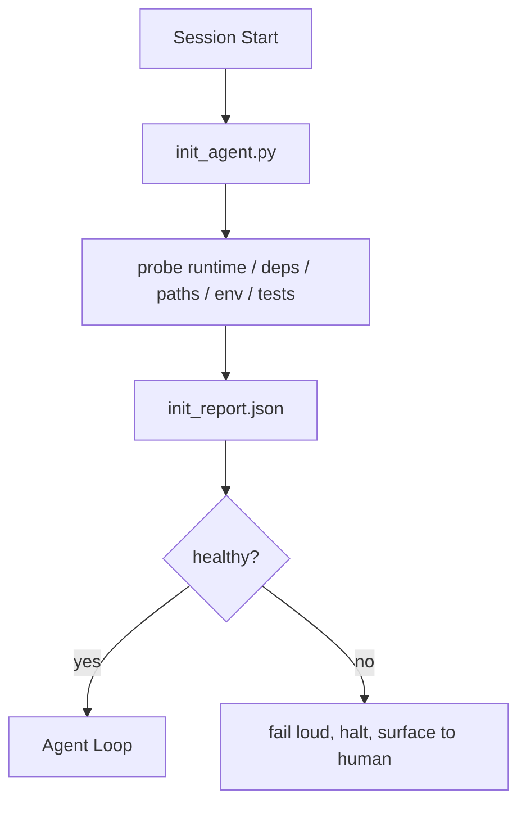

# Initialization Scripts for Agents | 初始化 脚本 Agent

> Every session that starts cold pays a tax. The agent reads the same files, retries the same probes, and rediscovers the same paths. An init script pays the tax once and writes the answers into state.

**Type:** Build | **类型:** 构建
**Languages:** Python (stdlib) | **语言:** Python (标准库)
**Prerequisites:** Phase 14 · 32 (Minimal Workbench), Phase 14 · 34 (Repo Memory) | **前置知识:** 见原文
**Time:** ~45 minutes | **时间:** 见原文

> 🔗 **【前置】** 学本节前请先掌握：Phase 14·32（Minimal Workbench）、Phase 14·34（Repo Memory）。本节讲"启动脚本"——让 Agent 不用每次冷启动重新探索 repo。
> 💡 **【类比】** Init script = 项目 README 的可执行版。新员工入职第一天不用自己摸索"测试怎么跑、依赖装哪些、环境变量是什么"——init script 自动做完写到 state 文件。Agent 每次启动先跑 init，省下 10-30% 的 token 预算。

## Learning Objectives | 学习目标

- Identify the work an agent should never have to redo per session.
- Build a deterministic init script that probes runtime, dependencies, and repo health.
- Persist the probe result so the agent reads it instead of re-running checks.
- Fail loud, fast, and with one place to look when initialization fails.

## The Problem | 问题引入

Open a session. The agent guesses the Python version. Guesses the test command. Lists the repo root five times to find the entry point. Tries to import a package that is not installed. Asks the user where the config file lives. By the time it makes a real edit, ten thousand tokens have gone to setup work that should have been a single script.

> 打开一个会话。Agent 猜测 Python 版本。猜测测试命令。列出仓库根目录五次来找到入口点。尝试导入一个未安装的包。问用户配置文件在哪里。当它真正做出编辑时，一万个 token 已经花在了本应是一个脚本的设置工作上。

The fix is one initialization script that runs before the agent does anything else and writes a `init_report.json` the agent reads at startup.

> 修复是一个初始化脚本，在 Agent 做任何事情之前运行，并写入一个 Agent 在启动时读取的 `init_report.json`。


> **【中文解读】** 初始化脚本在 Agent 会话开始时设置环境和上下文。包括：(1) 环境探测——检查依赖、语言版本、工具链；(2) 项目分析——扫描文件结构、识别框架和约定；(3) 记忆加载——从上次会话恢复上下文。好的初始化脚本是 Agent 成功的前提。

## The Concept | 核心概念




> **【中文解读】** 初始化脚本在 Agent 会话开始时设置环境和上下文。包括：(1) 环境探测——检查依赖、语言版本、工具链；(2) 项目分析——扫描文件结构、识别框架和约定；(3) 记忆加载——从上次会话恢复上下文。好的初始化脚本是 Agent 成功的前提。

### What the init script probes

| Probe | Why it matters |
|-------|----------------|
| Runtime versions | Wrong Python or Node version means silent wrong-version bugs |
| Dependency availability | A missing package later costs ten times the cost of catching it now |
| Test command | The agent must know how to verify; if the command is missing the workbench is broken |
| Repo paths | Hard-coded paths drift; resolve them once and pin |
| Environment variables | Missing `OPENAI_API_KEY` is a failure surface, not a runtime mystery |
| State + board freshness | Stale state from a crashed session is a footgun |
| Last-known-good commit | Anchor for the handoff diff at the end of the session |

### Fail loud, fail fast, fail in one place

A probe failure means halt and surface to the human. No "the agent will figure it out." The whole point of init is to refuse to start when the workbench is broken.

> 初始化脚本为 Agent 会话设置起始条件。包括环境配置、工具加载、上下文初始化和安全策略设置。

### Idempotent

Run it twice in a row. The second run should be a no-op except for a fresh timestamp. Idempotency is what lets you wire the script into CI, hooks, or a pre-task slash command.

> 初始化脚本为 Agent 会话设置起始条件。包括环境配置、工具加载、上下文初始化和安全策略设置。

### Init versus startup rules

Rules (Phase 14 · 33) describe what must be true to act. Init is the script that establishes that those rules can be checked. Rules without init become "be careful." Init without rules becomes a polished failure.

> 初始化脚本为 Agent 会话设置起始条件。包括环境配置、工具加载、上下文初始化和安全策略设置。

## Build It | 动手实现

`code/main.py` implements `init_agent.py`:

- Five probes: Python version, listed dependencies via `importlib.util.find_spec`, test command resolvability, required env vars, state file freshness.
- Each probe returns `(name, status, detail)`.
- The script writes `init_report.json` with the full probe set and exits non-zero if any block-severity probe fails.

Run it:

```
python3 code/main.py
```

The script prints the table of probes, writes `init_report.json`, and exits zero on the happy path or non-zero with a list of failed probes.

> 初始化脚本为 Agent 会话设置起始条件。包括环境配置、工具加载、上下文初始化和安全策略设置。

## Production patterns in the wild

Three patterns separate a useful init script from a ceremony.

> 初始化脚本为 Agent 会话设置起始条件。包括环境配置、工具加载、上下文初始化和安全策略设置。

**Last-known-good commit anchoring.** Probe the current commit against a `LKG` file written on the last successful merge. If the diff exceeds a budget (default 50 files), refuse to start and require a human to ratify the new baseline. This is what Cloudflare's AI Code Review uses to scope reviewer agents: every review session anchors against the same last-known-good and never compounds drift across sessions.

**Lock files with TTL.** Write a `prereqs.lock` after the first successful probe pass. Subsequent runs trust the lock for N hours (24h default) and skip the expensive probes. The init script reads the lock first; if it is fresh and the dependency manifest hash matches, it short-circuits. This is the same pattern Docker uses for layer caches: idempotent probe + content hash = skip.

**No network, no LLM, no surprises in the hot path.** Init probes are deterministic plumbing. A probe that calls an LLM to classify a failure or that hits an external service to check a license is not a probe; it is a workflow. If a probe takes longer than three seconds in a dry run, treat that as a workbench smell and either move it out of init or cache its result.

## Use It | 用框架实现

In production:

- **Claude Code hooks.** `pre-task` hook calls the init script and refuses to launch the agent if it fails.
- **GitHub Actions.** A `setup-agent` job runs the init script; the agent job depends on it.
- **Docker entrypoint.** The agent container runs the init script before exec-ing the agent runtime; logs surface on failure.

The init script is portable because it makes no calls to a specific framework. Bash, Make, or a tasks file can all wrap it.

> 初始化脚本为 Agent 会话设置起始条件。包括环境配置、工具加载、上下文初始化和安全策略设置。

## Ship It | 产出物

`outputs/skill-init-script.md` interviews the project, classifies its setup work into probes, and emits a project-specific `init_agent.py` plus a CI workflow that runs it before any agent step.

> 初始化脚本为 Agent 会话设置起始条件。包括环境配置、工具加载、上下文初始化和安全策略设置。

## Exercises | 练习题

1. Add a probe that diffs the current commit against the last-known-good commit and refuses to start if more than 50 files changed.
  中文翻译：思考并实践此练习。
2. Wire the script to write a `prereqs.lock` file and refuse to start if the lock is older than seven days.
  中文翻译：思考并实践此练习。
3. Add a `--fix` flag that auto-installs missing dev dependencies but never modifies runtime dependencies without approval.
  中文翻译：思考并实践此练习。
4. Move probes from hardcoded functions to a YAML registry. Defend the trade-off.
  中文翻译：思考并实践此练习。
5. Add a timing budget per probe. A probe that runs longer than three seconds is a workbench smell.
  中文翻译：思考并实践此练习。

## Key Terms | 术语速查表

| Term | What people say | What it actually means |
|------|----------------|------------------------|---|
| Probe | "A check" | A deterministic function returning `(name, status, detail)` |  |
| Init report | "Setup output" | JSON written next to state with the probe results |  |
| Idempotent | "Safe to re-run" | Two runs in a row produce identical reports modulo timestamp |  |
| Fail loud | "Don't swallow" | Halt and surface to the human; no silent fallback |  |
| Setup tax | "Bootstrap cost" | The tokens the agent spends per session rediscovering the obvious |  |

## Further Reading | 延伸阅读

- [Anthropic, Effective harnesses for long-running agents](https://www.anthropic.com/engineering/effective-harnesses-for-long-running-agents)
  中文翻译：见原文。
- [GitHub Actions, composite actions for setup](https://docs.github.com/en/actions/sharing-automations/creating-actions/creating-a-composite-action)
  中文翻译：见原文。
- [microservices.io, GenAI dev platform: guardrails](https://microservices.io/post/architecture/2026/03/09/genai-development-platform-part-1-development-guardrails.html) — pre-commit + CI checks as init
  中文翻译：见原文。
- [Augment Code, How to Build Your AGENTS.md (2026)](https://www.augmentcode.com/guides/how-to-build-agents-md) — init expectations
  中文翻译：见原文。
- [Codex Blog, Codex CLI Context Compaction](https://codex.danielvaughan.com/2026/03/31/codex-cli-context-compaction-architecture/) — session start as compaction-aware init
  中文翻译：见原文。
- Phase 14 · 33 — the rule set this script enables
- Phase 14 · 34 — the state file this script seeds
- Phase 14 · 38 — the verification gate the init script feeds
- Phase 14 · 40 — the handoff that consumes the init report's last-known-good
