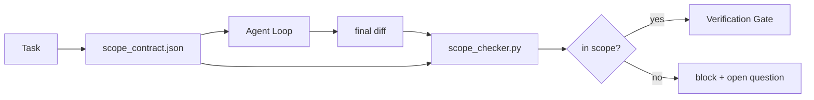

# 契约 范围

> The model does not know where the work ends. A scope contract is a per-task file that says where the work begins, where it ends, and how to roll back if it spills. The contract turns "stay in scope" from a wish into a check.


**类型：** 构建
**语言：** Python (stdlib)
**前置条件：** Phase 14 · 32 (Minimal Workbench), Phase 14 · 33 (Rules as Constraints)
**预计时间：** ~50 minutes

## 学习目标

- Write a scope contract that an agent reads at task start and a verifier reads at task end.
- Specify allowed files, forbidden files, acceptance criteria, rollback plan, and approval boundaries.
- Implement a scope checker that compares a diff against the contract and flags violations.
- Make scope creep visible, automatic, and reviewable.

## 问题引入

> **【中文解读】** 范围契约定义 Agent 可以做什么和不能做什么。显式的范围契约包括：(1) 文件范围——Agent 可以修改哪些文件和目录；(2) 操作范围——可以执行哪些命令；(3) 依赖范围——可以安装哪些包。范围越明确，Agent 的可预测性越高。

## 核心概念


> **【中文解读】** 范围契约定义 Agent 可以做什么和不能做什么。显式的范围契约包括：(1) 文件范围——Agent 可以修改哪些文件和目录；(2) 操作范围——可以执行哪些命令；(3) 依赖范围——可以安装哪些包。范围越明确，Agent 的可预测性越高。
### What goes in a scope contract
| Field | Purpose |
|-------|---------|
| `task_id` | Links to the task on the board |
| `goal` | One sentence the reviewer can verify |
| `allowed_files` | Globs the agent may write |
| `forbidden_files` | Globs the agent must not touch even by accident |
| `acceptance_criteria` | Test commands or assertion lines that prove done |
| `rollback_plan` | One paragraph the operator can execute if a halt is required |
| `approvals_required` | Actions outside scope that need explicit human sign-off |
A contract without `forbidden_files` is incomplete. The negative space is half the contract.
### Globs, not raw paths
Real repos move files. Pin contracts to globs (`app/**/*.py`, `tests/test_signup*.py`) so a refactor between sessions does not invalidate the contract.
### Rollback is part of scope
Listing how to roll back forces the contract author to think about what could go wrong. A contract you cannot roll back from is a contract that should not be approved.
### Scope check is a diff check
The agent writes a diff. The checker reads the diff, the allowed globs, the forbidden globs, and a list of any acceptance commands that ran. Each violation is a tagged finding the verification gate can refuse.

## 动手实现

`code/main.py` implements:
- `scope_contract.json` schema (subset of JSON Schema, glob arrays).
- A diff parser that turns a list of touched files plus a list of run commands into a `RunSummary`.
- A `scope_check` that returns `(violations, in_scope, off_scope)` against the contract.
- Two demo runs: one that stays in scope, one that creeps. The checker flags the creep with the exact file and reason.
Run it:
```
python3 code/main.py
```
Output: the contract, the two runs, the per-run verdicts, and a saved `scope_report.json`.
## Production patterns in the wild
A practitioner running "specsmaxxing" (scope contracts in YAML before invoking the agent) reports rabbit-hole rate dropped from 52% to 21% in three weeks without changing the agent. The contract did the work, not the model. Three patterns make the gain stick.
**Violation budgets, not binary failures.** `agent-guardrails` (the OSS merge gate used by Claude Code, Cursor, Windsurf, Codex via MCP) ships a `violationBudget` per task: minor scope slips within budget are surfaced as warnings; only when the budget is exceeded does the merge gate refuse. Pair with `violationSeverity: "error" | "warning"`. The budget is the difference between a gate that ships and a gate that gets disabled by the team that hated it.
**Severity asymmetry by path family.** Off-scope writes to `docs/**` are usually `warn`; off-scope writes to `scripts/**`, `migrations/**`, `config/prod/**` are always `block`. This asymmetry has to live in the contract, not in the runtime, because it is project-specific and changes per task.
**Time and network budgets next to file budgets.** A `time_budget_minutes` field bounds the wall clock; the runtime refuses to continue past it without re-approval. A `network_egress` allowlist on hostnames prevents the agent from quietly hitting an external API that was not part of the task. These are scope dimensions too; the file globs are necessary, not sufficient.
**Multi-contract merge semantics (least privilege).** When two scope contracts apply (e.g., a project-wide contract plus a task-specific one), the merge is: **intersect** `allowed_files` (both contracts must permit the path), **union** `forbidden_files` (either can prohibit), `time_budget_minutes` is the most restrictive (min), `approvals_required` accumulates. `network_egress` is `None` for no enforcement, `[]` for deny-all, `[...]` as an allowlist; under merge, `None` defers to the other side, two lists intersect, and deny-all stays deny-all. State this in the contract schema so the merge is mechanical and reviewable.

## 用框架实现

- **Claude Code slash commands.** A `/scope` command writes the contract and pins it as session context. Subagents read the contract before acting.
- **GitHub PRs.** Push the contract as a JSON file in the PR body or as a checked-in artifact. CI runs the scope checker against the merge diff.
- **LangGraph interrupts.** A scope violation triggers an interrupt; the handler asks the human whether the contract needs to grow or the agent needs to back off.

## 产出物

`outputs/skill-scope-contract.md` generates a scope contract for a task description and a glob-aware checker that runs in CI on every agent diff.

## 练习题

1. Add a `network_egress` field listing allowed external hosts. Refuse runs that touch other hosts.
   *思考并实践此练习*
2. Extend the checker to fail soft on `docs/**` and hard on `scripts/**`. Justify the asymmetry.
3. Make the contract derive `allowed_files` from a `goal` field using a static rule set (no LLM). What goes wrong on the first edge case?
   *思考并实践此练习*
4. Add a `time_budget_minutes` and refuse to continue once the wall clock exceeds it.
   *思考并实践此练习*
5. Run two contracts against the same diff. What is the right merge semantics when both apply?
   *思考并实践此练习*

## 术语速查表

| 术语 | 实际含义 |
|------|---------|
| Scope contract | "The task brief" |
| Scope creep | "It also touched..." |
| Rollback plan | "We can revert" |
| Approval boundary | "Needs sign-off" |
| Diff check | "Path audit" |

## 延伸阅读

