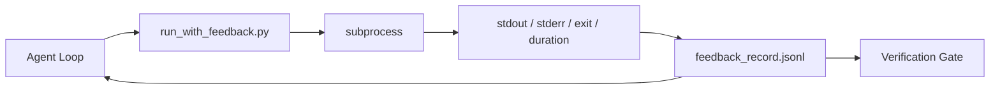

# 反馈 运行时 循环

> Agents that do not see real command output guess. A feedback runner captures stdout, stderr, exit code, and timing into a structured record the next turn can read. Then the agent reacts to facts instead of to its own prediction of facts.


**类型：** 构建
**语言：** Python (stdlib)
**前置条件：** Phase 14 · 32 (Minimal Workbench), Phase 14 · 35 (Init Script)
**预计时间：** ~50 minutes

## 学习目标

- Distinguish runtime feedback from observability telemetry.
- Build a feedback runner that wraps shell commands and persists structured records.
- Truncate large outputs deterministically so the loop stays within token budget.
- Refuse to advance the loop when feedback is missing.

## 问题引入

> **【中文解读】** 运行时反馈循环让 Agent 在执行过程中持续获取反馈。三种反馈类型：(1) 工具反馈——命令输出、编译结果、测试结果；(2) 用户反馈——中途中断和纠正；(3) 系统反馈——资源使用、错误率、超时。反馈循环是 Agent 自适应调整的基础。

## 核心概念


> **【中文解读】** 运行时反馈循环让 Agent 在执行过程中持续获取反馈。三种反馈类型：(1) 工具反馈——命令输出、编译结果、测试结果；(2) 用户反馈——中途中断和纠正；(3) 系统反馈——资源使用、错误率、超时。反馈循环是 Agent 自适应调整的基础。
### What goes in a feedback record
| Field | Why it matters |
|-------|----------------|
| `command` | Exact argv, no shell expansion surprises |
| `stdout_tail` | Last N lines, deterministic truncation |
| `stderr_tail` | Last N lines, separate from stdout |
| `exit_code` | The unambiguous success signal |
| `duration_ms` | Surfaces slow probes and runaway processes |
| `started_at` | Timestamp for replay |
| `agent_note` | One line the agent writes about what it expected |
### Truncation is deterministic
A 50 MB log destroys the loop. The runner truncates head and tail with a `...truncated N lines...` marker, deterministic so the same output always produces the same record. No sampling; the parts the agent needs to see (final error, final summary) live at the tail.
### Feedback versus telemetry
Telemetry (Phase 14 · 23, OTel GenAI conventions) is for human operators reviewing runs across time. Feedback is for the next turn of this run. They share fields but they live in different files with different retention.
### Refuse to advance without feedback
If the runner errors before capturing exit, the record carries `exit_code: null` and `error: <reason>`. The agent loop must refuse to claim success on a `null` exit. No exit, no progress.

## 动手实现

`code/main.py` implements:
- `run_with_feedback(command, agent_note)` that wraps `subprocess.run`, captures stdout/stderr/exit/duration, truncates deterministically, appends to `feedback_record.jsonl`.
- A small loader that streams the JSONL into a Python list.
- A demo that runs three commands (success, failure, slow) and prints the last record per command.
Run it:
```
python3 code/main.py
```
Output: three feedback records appended to `feedback_record.jsonl`, the last one of each printed inline. Tail the file across re-runs to see the loop accumulate.
## Production patterns in the wild
Three patterns harden the runner enough to ship.
**Redact at write, not at read.** Any record that touches stdout or stderr can leak secrets. The runner ships a redaction pass before the JSONL append: strip lines matching `^Bearer `, `password=`, `api[_-]?key=`, `AKIA[0-9A-Z]{16}` (AWS), `xox[baprs]-` (Slack). Redaction at read time is a foot-gun; the file on disk is what an attacker reaches. Audit the redaction patterns quarterly against the production runtime's observed secret formats.
**Rotation policy, not a single file.** Cap `feedback_record.jsonl` at 1 MB per file; on overflow rotate to `.1`, `.2`, drop `.5`. The agent's loop only reads the current file, so the runtime cost is bounded. CI artifact storage gets the full rotated set. Without rotation the file becomes the bottleneck on every loader call.
**Parent-command id for retry chains.** Every record gets `command_id`; retries carry `parent_command_id` pointing at the previous attempt. The reviewer's "failed attempts" list (Phase 14 · 40) and the verification gate's audit both follow the chain. Without this link, retries look like independent successes and the audit hides the failure history.

## 用框架实现

- **Claude Code Bash tool.** The tool already captures stdout, stderr, exit, and duration. The runner in this lesson is the framework-agnostic equivalent for any agent product.
- **LangGraph nodes.** Wrap any shell node in the runner so the record persists outside graph state.
- **CI logs.** Pipe the JSONL into your CI artifact store; reviewers can replay any command without rerunning the session.

## 产出物

`outputs/skill-feedback-runner.md` generates a project-specific `run_with_feedback.py` with the right truncation budget, a JSONL writer wired to the workbench, and a loader the agent reads at every turn.

## 练习题

1. Add a `cwd` field per record so the same command run from different directories is distinguishable.
   *思考并实践此练习*
2. Add a `redaction` step that strips lines matching `^Bearer ` or `password=`. Test on a fixture record.
   *思考并实践此练习*
3. Cap total `feedback_record.jsonl` size at 1 MB by rotating to `.1`, `.2` files. Defend the rotation policy.
   *思考并实践此练习*
4. Add a `parent_command_id` so retry chains are visible: which command produced the input that the next command consumed.
   *思考并实践此练习*
5. Pipe the JSONL into a tiny TUI that highlights the latest non-zero exit. Eight key features the TUI must show to be useful in a review.
   *思考并实践此练习*

## 术语速查表

| 术语 | 实际含义 |
|------|---------|
| Feedback record | "Run log" |
| Tail truncation | "Trim the log" |
| Refuse-on-null | "Block on missing data" |
| Agent note | "Expectation tag" |
| Telemetry split | "Two log files" |

## 延伸阅读

