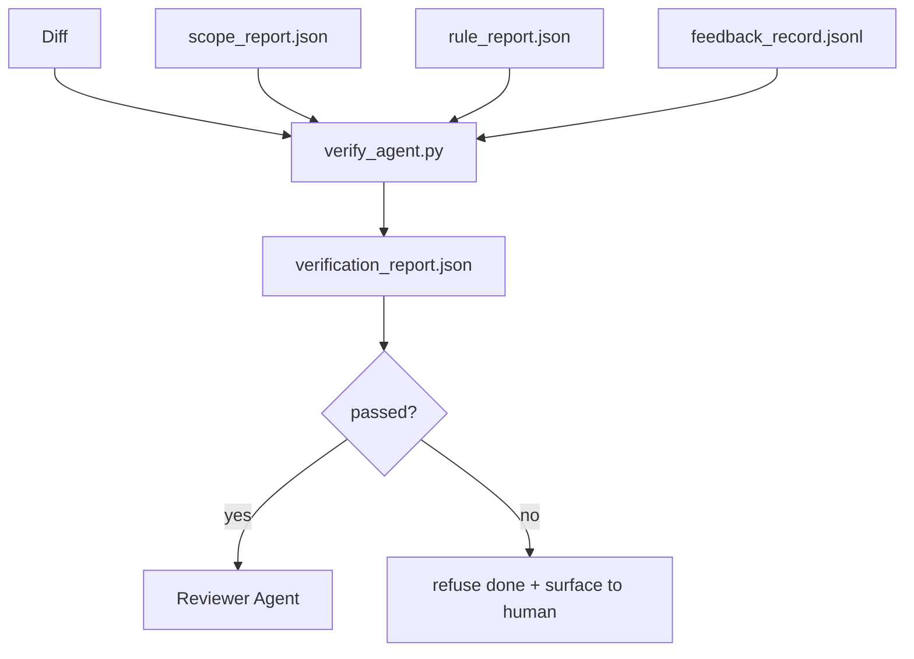

# 验证 门控

> The agent does not get to mark its own work as done. A verification gate reads the scope contract, the feedback log, the rule report, and the diff, and answers a single question: is this task actually complete? If the gate says no, the task is not done, no matter what the chat says.


**类型：** 构建
**语言：** Python (stdlib)
**前置条件：** Phase 14 · 33 (Rules), Phase 14 · 36 (Scope), Phase 14 · 37 (Feedback)
**预计时间：** ~55 minutes

## 学习目标

- Define a verification gate as a deterministic function over workbench artifacts.
- Combine rule report, scope report, feedback records, and diff into a single verdict.
- Emit a `verification_report.json` the reviewer agent and CI can both read.
- Refuse to advance a task on any block-severity failure, without exception.

## 问题引入

- "Looks good." The model read its own diff and decided it was correct.
- "Tests passed." Said with confidence. No record of the test actually running.
- "Acceptance met." Acceptance criteria interpreted loosely enough to mean "anything resembling done."
> **【中文解读】** 验证门在 Agent 执行的关键节点插入自动检查。常见验证门：(1) 编译检查——代码修改后必须通过编译；(2) 测试检查——提交前必须通过相关测试；(3) Lint 检查——代码必须符合风格规范；(4) 安全检查——不得引入已知漏洞。验证门防止错误累积。

## 核心概念


> **【中文解读】** 验证门在 Agent 执行的关键节点插入自动检查。常见验证门：(1) 编译检查——代码修改后必须通过编译；(2) 测试检查——提交前必须通过相关测试；(3) Lint 检查——代码必须符合风格规范；(4) 安全检查——不得引入已知漏洞。验证门防止错误累积。
### What the gate checks
| Check | Source artifact | Severity |
|-------|-----------------|----------|
| All acceptance commands ran | `feedback_record.jsonl` | block |
| All acceptance commands exited zero | `feedback_record.jsonl` | block |
| Scope check has no forbidden writes | `scope_report.json` | block |
| Scope check has no off-scope writes | `scope_report.json` | block or warn |
| All block-severity rules pass | `rule_report.json` | block |
| No `null` exit codes in feedback | `feedback_record.jsonl` | block |
| Touched files match `scope.allowed_files` | both | warn |
A `warn` finding annotates the verdict; a `block` finding prevents `passed: true`.
### Deterministic, not probabilistic
The gate must produce the same verdict for the same artifact set every time. No LLM judges. LLM judges belong on the reviewer side (Phase 14 · 39) where the goal is qualitative evaluation, not status.
### One report, one path
The gate emits one `verification_report.json` per task close-out, written under `outputs/verification/<task_id>.json`. CI consumes the same path. Multiple gates with different paths fork the source of truth.
### Refuse without exception
Block-severity findings cannot be overridden by the agent. They can only be overridden by a human, with a recorded `override_reason` and an `overridden_by` user id. The override is a signed change, not an agent decision.

## 动手实现

`code/main.py` implements:
- A loader for each input artifact, all stubbed locally so the lesson is self-contained.
- A `verify(task_id, artifacts) -> VerdictReport` pure function.
- A printer that shows the per-check results and the final pass/fail.
- A demo with three task scenarios: clean pass, scope creep, missing acceptance.
Run it:
```
python3 code/main.py
```
Output: three verdict reports, each saved next to the script.
## Production patterns in the wild
Four patterns elevate the gate from "another lint job" to "the deciding edge."
**Defense-in-depth, not single gate.** Pre-commit hook → CI status check → pre-tool authz hook → pre-merge gate. Each layer is deterministic so a failure in one layer is caught by the next. microservices.io's March 2026 playbook is explicit: the pre-commit hook is non-bypassable because, unlike a model-side skill, it does not depend on the agent following instructions. The verification gate sits at the CI / pre-merge layer.
**Defense by deterministic check, model-judge only for nuance.** Anthropic's 2026 Hybrid Norm pairing: verifiable rewards (unit tests, schema checks, exit codes) answer "did the code solve the problem?" — LLM rubrics answer "is the code readable, secure, on-style?" The gate runs the first class; the reviewer (Phase 14 · 39) runs the second. Mixing them collapses the signal.
**Signed override log, not Slack threads.** Every override emits a row in `outputs/verification/overrides.jsonl` with: timestamp, finding code, reason, signing user, current HEAD commit. The runtime refuses any override that lacks the signature; the audit trail is git-tracked. This is the line between an override policy and an override theater.
**Coverage floor as a first-class check.** A `coverage_report.json` feeds a `coverage_floor` (default 80%) check. The gate fails if measured coverage drops below the floor or below the previous merge's floor by more than 1 percentage point. Without this check, agents quietly delete tests that fail and the verification reports stay green.
**`--strict` mode promotes warns to blocks.** For release branches, ship-blocking PRs, or post-incident triage, `--strict` makes every warning a hard fail. The flag is opt-in by branch; not the global default, because strict-on-everything corrodes day-to-day flow.

## 用框架实现

- **CI step.** A `verify_agent` job runs the gate against the agent's final artifacts. Merge protection refuses without `passed: true`.
- **Pre-handoff hook.** The agent runtime calls the gate before generating the handoff doc. No green verdict, no handoff.
- **Manual triage.** Operators read the report when an agent claims success and a human suspects it.

## 产出物

`outputs/skill-verification-gate.md` wires the gate into a specific project: which acceptance commands feed it, which rules are block-severity, which off-scope writes are tolerated, how the override audit log is stored.

## 练习题

1. Add a `coverage_floor` check: the test command must produce a coverage report with at least 80%. Decide which artifact carries the floor.
   *思考并实践此练习*
2. Support a `--strict` mode that promotes every `warn` to `block`. Document the cases where strict mode is the right default.
   *思考并实践此练习*
3. Make the gate produce a Markdown summary in addition to JSON. Defend which fields belong in the summary.
   *思考并实践此练习*
4. Add a `time_since_last_human_touch` check: any file edited within 60 seconds of a human keystroke is exempt from off-scope flags.
   *思考并实践此练习*
5. Run the gate on a real agent diff from your product. How many findings are real and how many are noise? Where does the gate need to grow?
   *思考并实践此练习*

## 术语速查表

| 术语 | 实际含义 |
|------|---------|
| Verification gate | "The check that stops things" |
| Block severity | "Hard fail" |
| Override log | "Why we let it through" |
| Acceptance command | "The proof" |
| One report path | "Source of truth" |

## 延伸阅读

