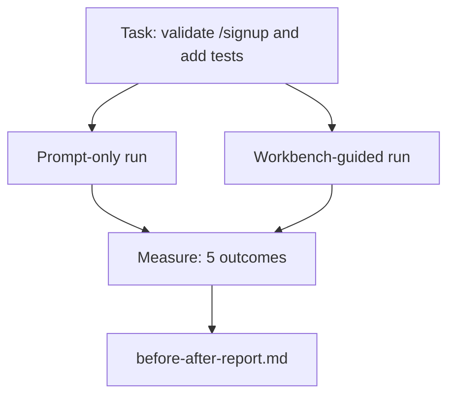

# 工作台 仓库

> Eleven lessons of surfaces are worth nothing if they do not survive contact with a real codebase. This lesson runs the same task twice on a small sample app: prompt-only versus workbench-guided. The numbers do the arguing.


**类型：** 构建
**语言：** Python (stdlib)
**前置条件：** Phases 14 · 32 to 14 · 40
**预计时间：** ~60 minutes

## 学习目标

- Bring the seven workbench surfaces together on a small application.
- Run the same task twice (prompt-only and workbench-guided) and measure five outcomes.
- Read the before/after report and decide which surfaces gave the most leverage.
- Defend the workbench against a "but my model is good enough" pushback.

## 问题引入

> **【中文解读】** 本节介绍了生产环境的部署策略和运维最佳实践。

## 核心概念


> **【中文解读】** 将 Agent 工作台应用于真实代码仓库。真实仓库带来的挑战：(1) 规模——数千文件的代码库超出上下文窗口；(2) 复杂性——多语言、多框架、多依赖；(3) 约定——项目特定的编码风格和架构模式；(4) 测试——不确定的测试套件和脆弱的 CI。
### The sample app
A minimal FastAPI-style handler in `sample_app/`:
- `app.py` with `/signup` (no validation yet).
- `test_app.py` with one happy-path test.
- `README.md` and `scripts/release.sh` as forbidden-zone bait.
### The task
### The two pipelines
Prompt-only:
1. Read the README.
2. Read `app.py`.
3. Edit files.
4. Claim done.
Workbench-guided:
1. Run init script (Lesson 35).
2. Read scope contract (Lesson 36).
3. Read state (Lesson 34).
4. Edit allowed files only.
5. Run acceptance command via feedback runner (Lesson 37).
6. Run verification gate (Lesson 38).
7. Run reviewer (Lesson 39).
8. Generate handoff (Lesson 40).
### The five outcomes measured
| Outcome | Why it matters |
|---------|----------------|
| `tests_actually_run` | Most "tests passed" claims are unverifiable |
| `acceptance_met` | The test that proves the goal must be the test that ran |
| `files_outside_scope` | Scope creep is the dominant silent failure |
| `handoff_quality` | The next session pays for or benefits from this |
| `reviewer_total` | Qualitative judgment on top of the gate |

## 动手实现

`code/main.py` orchestrates the two pipelines against the same sample app fixture. Both pipelines are scripted (no LLM in the loop) so the measurement is reproducible. The script writes the comparison into `before-after-report.md` and `comparison.json`.
Run it:
```
python3 code/main.py
```
Output: a console table of outcomes per pipeline, the markdown report saved next to the script, and the JSON for whoever wants to chart it.
## Production patterns in the wild
The skeptic's question is "how much does the workbench actually help?" The 2026 numbers say a lot more than the explanation.
**Terminal Bench Top-30 to Top-5 on the same model.** LangChain's *Anatomy of an Agent Harness* (April 2026): a coding agent jumped from outside the top 30 to rank five on Terminal Bench 2.0 by changing only the harness. Same model. Different surfaces. Twenty-five-rank delta.
**Vercel 80% to 100% by deleting tools.** Vercel reported deleting 80% of its agent's tools moved the success rate from 80% to 100%. Smaller tool surface, sharper scope, fewer ways to fail. Negative space wins.
**Harvey 2x accuracy via harness alone.** Legal agents more than doubled their accuracy through harness optimization, no model change.
**88% of enterprise AI agent projects fail to reach production.** The preprints.org *Harness Engineering for Language Agents* paper (March 2026) traces the failures to runtime, not reasoning: stale state, brittle retries, overgrown context, poor recovery from intermediate mistakes.
**Long-context collapse.** WebAgent baseline 40-50% success drops to under 10% in long-context conditions, mostly from infinite loops and goal loss. The Ralph Loop and the handoff packet exist to absorb that.
**False negatives still exist.** Single-step factual tasks, one-line lints, formatter runs, anything the model has memorized verbatim — these run faster prompt-only. The benchmark should enumerate them honestly so the workbench is not framed as overkill.
The takeaway is not "harness wins forever." Models do absorb harness tricks over time. The takeaway is that today, the engineering load sits in the seven surfaces, and the numbers prove it.

## 用框架实现

- Someone asks why every PR carries an `agent-rules.md` and a scope contract.
- A team wants to drop the verification gate "just for this sprint."
- A new agent product launches and you need a portable benchmark for whether it actually saves time.

## 产出物

`outputs/skill-workbench-benchmark.md` is a portable evaluation harness that runs any agent product through both pipelines against a project's own sample app and reports the five outcomes.

## 练习题

1. Add a sixth outcome: time-to-first-meaningful-edit. How do you measure it cleanly?
   *思考并实践此练习*
2. Run the comparison on a real second-day task in your codebase. Where do the workbench numbers slip?
   *思考并实践此练习*
3. Add a "false negative" pass: tasks where prompt-only would have been faster and the workbench overhead is real cost. Defend keeping the workbench anyway.
   *思考并实践此练习*
4. Replace the scripted "agent" with a real LLM call. Which outcomes get noisier?
   *思考并实践此练习*
5. Author a one-page summary aimed at a non-engineer. What survives the cut?
   *思考并实践此练习*

## 术语速查表

| 术语 | 实际含义 |
|------|---------|
| Sample app | "Toy repo" |
| Pipeline | "Workflow" |
| Before/after report | "The receipts" |
| False negative | "Workbench overkill" |
| Workbench benchmark | "Reliability score" |

## 延伸阅读

