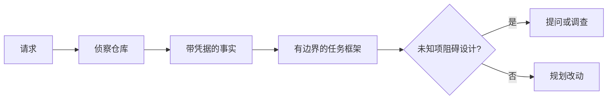

# 先定任务，再写代码

> 编码 Agent 实现清晰任务很快，实现模糊任务同样很快——速度一样，代价完全不同。

**类型：** 学习 + 动手实践
**语言：** Python（标准库）
**前置条件：** Phase 14 第 31、36 课
**预计用时：** 约 60 分钟

> **【中文解读】**
> 编码 Agent 实现清晰任务很快，实现模糊任务同样很快——速度一样，代价完全不同。本课讲 Agent 写代码之前的第一步：把一个模糊请求变成一个由仓库证据支撑、边界明确的"任务框架"（task frame）。Agent 不会因为任务模糊而停下来提问，它会自信地替你做决定；任务框架的作用就是把这些决定提前摊开。这是 Agent 工程方法论系列（Phase 14 · 43-54）的第一课。

> 🔗 **【前置】**
> 学本课前请先掌握：Phase 14 第 31 课（为什么模型会失败——先理解失败模式，才理解为什么需要框架）和第 36 课（scope contracts，范围契约——本课的任务框架是它在任务定义阶段的前置形态）。本课产出的 `outputs/task-frame.md` 会在第 44 课变成证据支撑的执行计划。

## 学习目标

- 在动手编辑之前，把一个请求转化为有边界的任务框架
- 把仓库事实与假设、待决问题区分开
- 定义允许路径、禁止路径和验收证据
- 判断什么时候侦察已足够、可以开始动手

## 昂贵的失败

「加上重复邮箱保护」听起来很具体，其实并不具体。唯一性应该放在 API、领域服务还是数据库？比较是否区分大小写？哪种错误结构已经是公开契约？允不允许做数据库迁移？哪个测试能证明这个行为？

一个有能力的 Agent 会用"看似合理"的选择填补这些空白。这才是危险的情形：实现可以干净、有测试覆盖，却仍然与整个系统不兼容。

因此，编码 Agent 工作的第一单元不是一次编辑，而是一个由仓库证据支撑的任务框架。

> **【中文解读】**
> "昂贵的失败"指的不是代码写坏了，而是代码写对了但任务理解错了。Agent 不会因为任务模糊而变慢——它会自信地替你做决定。这些替你做的决定（放哪一层、什么语义、什么错误码）一旦埋进代码，返工成本远高于事先问清楚。

## 任务框架

一个有用的框架有六个字段：

| 字段 | 要回答的问题 |
|---|---|
| 目标（Goal） | 什么可观察行为必须改变？ |
| 仓库事实（Repository facts） | 你在代码、测试、配置或历史里核实过什么？ |
| 允许路径（Allowed paths） | 改动允许落在哪？ |
| 禁止路径（Forbidden paths） | 什么绝不能碰？ |
| 验收证据（Acceptance evidence） | 哪些命令或观察能证明目标达成？ |
| 未知项（Unknowns） | 哪些决定还需要证据或人的判断？ |

> **【中文解读】**
> 六个字段里最容易被忽略的是"禁止路径"和"未知项"——前者划出负空间，后者把还没资格做的决定显式保留下来。

事实需要"凭据"。「API 对重复返回 409」在你指向现存的测试或处理器之前都不算事实。文件路径加行号就足够了；涉及行为时，一条命令的运行结果更有说服力。



> 💡 **【类比】**
> 任务框架像装修前的"砸墙审批单"：哪面墙能动（allowed paths）、哪面是承重墙绝不能动（forbidden paths）、验收入住的标准是什么（acceptance evidence）。没有这张单子，装修队（Agent）动作越快，砸错墙的概率越大。

## 侦察就是寻找约束

不要通读整个仓库。去找那些真正约束这次改动的"面"：

1. 当前行为以及调用它的代码。
2. 离得最近的现存测试。
3. 公开契约或序列化后的数据形状。
4. 管辖这些路径的项目规范（如 AGENTS.md）。
5. 构建与验证命令。
6. 类似的已完成改动，它们揭示本地惯例。

当每一个计划中的决定都"有证据支撑、被明确授权、或已列为未知项"三者居其一时，就停止侦察。过了这个点还在继续读代码，多半是拖延。

> **【中文解读】**
> 侦察的目的不是"了解整个代码库"，而是找约束：谁调用它、哪个测试管它、公开契约长什么样、本地惯例怎么写。这六个面找齐，任务框架的"事实"栏就填得出来。"停止条件"同样重要——没有停止条件的调研会变成逃避动手的借口。

## 未知不是失败

未知项是一个受控的空洞；假设则是对这个空洞的一次失控作答。

把每个未知项分类：

- **可发现（Discoverable）：** 仓库或运行中的系统能回答它。
- **可决定（Decidable）：** 任务契约已授权 Agent 自行选择。
- **需人来定（Human）：** 这个选择会改变产品行为、成本、风险或公开兼容性。
- **可延后（Deferred）：** 这个选择不属于本次切片，应放进非目标。

对"可发现"和"已授权"的未知项，Agent 应继续推进；对"需人来定"的未知项，Agent 应该暂停——在这个选择被埋进代码之前。

> **【中文解读】**
> 把未知项摊开分类，比假装没有未知更安全。四种类型对应四种处理：可发现的去查、可决定的自选、需人来定的先问、可延后的记入非目标。最怕的是"隐藏的第三类"——Agent 把一个本该由人拍板的产品决策，当作"可决定"悄悄做掉了。

## 验收先于实现

先写证明，再写补丁。证明可以是：

- 一条聚焦的单元或集成测试命令；
- 一次指明视口与期望状态的浏览器操作旅程；
- 一个线上请求和精确的响应契约；
- 一个带阈值的性能测量；
- 一个确认没有无关文件被改动的范围检查。

「测试通过了」不是一个证明计划。要点名那个权威测试，以及它支撑的断言。

> **【中文解读】**
> "验收先于实现"是 TDD 在 Agent 工程里的变体：在 Agent 动手之前就定好"什么命令的什么输出能宣告任务完成"。这把"做完了"的定义从 Agent 的自我报告，收回到一个可执行、可复现的命令上。

## 动手实现

实验部分会创建一个 `TaskFrame`，校验它的边界与证据，并写出 `outputs/task-frame.md`。

在本课目录下运行：

```bash
python3 code/main.py
python3 -m unittest discover code/tests -v
```

用四种方式破坏这个例子：删掉目标、删掉一条事实凭据、让允许路径和禁止路径重叠、删掉验收命令。校验器应该因不同的原因拒绝每一个被破坏的框架。

> **【中文解读】**
> `code/main.py` 里的校验器就是本课规则的机械化版本：目标为空、事实无凭据、允许与禁止路径重叠、验收证据缺失，各自产生不同的拒绝理由。"能被程序校验的约束"比"写在 prompt 里的叮嘱"可靠得多——这是贯穿 43-54 系列的主题。

## 在真实仓库中使用

在让 Agent 动手改代码之前：

1. 把目标写成一个行为，而不是一次文件改动。
2. 记录两三条带精确凭据的事实。
3. 点名最小集合的允许路径。
4. 显式点名"不做什么"的负空间。
5. 写下关闭这条任务的命令或观察。
6. 列出你还没有证据支撑、尚无资格做的决定。

任务框架应该一屏放得下。如果放不下，这个任务很可能包含多个可独立验证的改动（应该拆分）。

> **【中文解读】**
> 这六步是本课的实战清单，可以直接贴进你的工作流：目标写成行为、事实带凭据、允许路径最小化、负空间显式化、验收命令先行、未决事项列出来。"一屏放得下"是个很好的启发式——放不下的框架往往意味着任务该拆了。

## 练习题

1. 从你自己的仓库里挑一个真实 bug 做框架，不许提出解决方案。
2. 找出框架里一条实际是假设的"事实"，用证据替换它。
3. 加一个"需人来定"的未知项，它的答案会改变公开契约。
4. 把一条过宽的允许路径拆成最小安全集合。
5. 给验收证据加一条范围凭据。

## 延伸阅读

- [Nuseibeh and Easterbrook, Requirements Engineering: A Roadmap](https://www.cs.toronto.edu/~sme/papers/2000/ICSE2000.pdf)
  如何把实现锚定在真实世界目标和演化中的约束上——本系列"任务框架"的理论根基。
- [Yang et al., SWE-agent: Agent-Computer Interfaces Enable Automated Software Engineering](https://arxiv.org/abs/2405.15793)
  证明编码 Agent 周围的接口设计会改变它的实际效果——框架就是这种接口。

## 你保留的产出

保留 `outputs/task-frame.md`。它是下一课的输入——在下一课里，任务框架会变成一个由证据支撑的执行计划。
