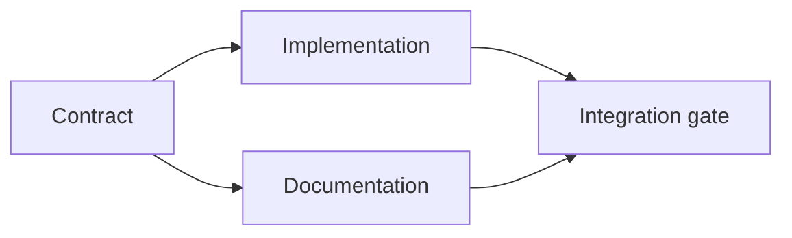

# Build an Evidence-Backed Execution Plan | 从证据出发做计划

> A plan is not a prettier to-do list. It is a dependency graph in which every change has a reason and every terminal node has proof.

> **【中文解读】** 计划不是"更好看的待办清单"，而是一张依赖图：每个改动都有理由（证据支撑），每个终端节点都有证明（验收检查）。本课把上一课的任务框架（task frame）变成可执行计划：工作项、依赖、执行波次，以及在动手编辑之前就能暴露缺失事实、未知依赖和循环依赖的校验规则。这是 Agent 工程方法论系列的第二课。

> 🔗 **【前置】** 学本课前请先掌握 Phase 14 第 43 课（先定任务，再写代码——本课的输入就是它产出的 `outputs/task-frame.md`）。本课产出 `outputs/evidence-plan.json`，会在第 45 课成为多 Agent 委托的契约。

**Type:** Learn + Build | **类型:** 学习 + 动手实践
**Languages:** Python (stdlib) | **语言:** Python（标准库）
**Prerequisites:** Phase 14 lesson 43 | **前置知识:** Phase 14 第 43 课
**Time:** ~65 minutes | **时间:** 约 65 分钟

## Learning Objectives | 学习目标

- Convert a task frame into work items with evidence and proof.
  中文翻译：把任务框架转化为带证据与证明的工作项。
- Model ordering as dependencies instead of prose sequence.
  中文翻译：用依赖关系建模先后顺序，而不是用散文式的叙述。
- Detect missing facts, unknown dependencies, and cycles before editing.
  中文翻译：在动手编辑之前，检测缺失的事实、未知的依赖和循环依赖。
- Separate steps that can run together from steps that must wait.
  中文翻译：区分可以同时运行的步骤和必须等待的步骤。

## Why Agent Plans Fail | 为什么 Agent 的计划会失败

Weak plans repeat the request in future tense:

> 弱计划只是把请求复述成将来时：

1. Update the API.
   中文翻译：更新 API。
2. Add tests.
   中文翻译：加测试。
3. Update documentation.
   中文翻译：更新文档。

Nothing in that list says what was found, why those files are correct, which contract changes first, or what can happen concurrently. An agent can follow every step and still create rework.

> 这个清单里没有任何一句说明：发现了什么、为什么是这些文件、哪个契约先变、哪些步骤可以并发。Agent 可以一步步照做，仍然制造返工。

> **【中文解读】** 弱计划的特征是"复述请求"——它看起来有序号、有动词，却没有一条仓库证据。强计划对每个工作项做五个承诺（见下表）：标识符、最小改动、证据、依赖、证明。缺任何一项，Agent 都会用自己的默认假设补位，返工在所难免。

A strong plan makes five commitments for each work item:

| Commitment | Purpose |
|---|---|
| Identifier | Stable reference for dependencies and handoff |
| Change | The smallest behavior or contract change |
| Evidence | Repository facts that justify the change |
| Dependencies | Work that must be true first |
| Proof | The exact check that closes the item |

> **【中文解读】** 五个承诺分别是：标识符（供依赖与交接引用的稳定句柄）、改动（最小的行为或契约变更）、证据（证明这次改动合理的仓库事实）、依赖（必须先为真的工作）、证明（关闭这个工作项的确切检查）。「改动要最小」和「证明要确切」是最常被省略的两栏——省略前者任务悄悄膨胀，省略后者"完成"失去定义。

## Plan the Contract Before Its Implementations | 先定契约，再做实现

When multiple surfaces depend on the same behavior, define the behavior first. Tests, implementation, documentation, and integration can then share one contract instead of inventing four versions.

> 当多个表面依赖同一行为时，先定义行为本身。测试、实现、文档、集成随后共享同一份契约，而不是各自发明四个版本。

> 💡 **【类比】** 契约先行像先定国标插头再生产电器。插座厂（实现）和电器厂（文档）可以同时开工，因为接口已经锁死；验收员（集成门）只需对照同一份标准检查两边。没有国标就并行开工，产出的插头大概率插不进插座。



The graph exposes safe concurrency. Implementation and documentation can proceed together after the contract is fixed. Integration waits for both.

> 这张图暴露了安全的并发点。契约固定之后，实现和文档可以同时推进；集成要等两者都完成。

## Evidence Changes the Plan | 证据会改变计划

Repository evidence is not decoration. It should be capable of changing the work:

> 仓库证据不是装饰品。它必须有能力改变工作内容：

- An existing helper removes a planned new abstraction.
  中文翻译：一个已存在的辅助函数，砍掉了计划中的新抽象。
- A compatibility test forces a migration step.
  中文翻译：一个兼容性测试，逼出了计划外的迁移步骤。
- A deployment constraint moves a schema change into another task.
  中文翻译：一个部署约束，把 schema 变更挪进了另一个任务。
- A public response type changes the order of implementation and documentation.
  中文翻译：一个公开的响应类型，改变了实现与文档的先后顺序。

If the evidence cannot change the plan, it is probably not evidence for that decision.

> 如果证据改变不了计划，它多半不是这个决定的证据。

> **【中文解读】** 这是一条很好用的证伪标准：把"证据"贴到决定旁边，问"如果它反过来，计划会变吗"。不会变，说明它只是装饰——真正支撑这个决定的是别的东西（习惯、猜测或 Agent 的默认值）。证据栏里每一条都应该过这一关。

## Design for Interruption | 为中断而设计

Coding-agent sessions end unexpectedly. A resumable plan has work items small enough that another session can determine:

> 编码 Agent 的会话会意外结束。可续跑的计划要求工作项足够小，小到另一个会话能够判断：

- which item is complete;
  中文翻译：哪个工作项已完成；
- which proof ran;
  中文翻译：哪个证明跑过了；
- which artifacts changed;
  中文翻译：哪些产物变了；
- which dependencies are now unblocked;
  中文翻译：哪些依赖已经解锁；
- what the next safe item is.
  中文翻译：下一个安全的工作项是什么。

Do not encode state only in checked boxes inside a chat. Store the plan next to the work.

> 不要把状态只编码在聊天记录的勾选框里。把计划存放在工作旁边（仓库里的文件）。

> **【中文解读】** Agent 会话天然短命：上下文窗口会满、网络会断、你会开新会话。所以计划的状态必须外置到文件系统——就像游戏要存盘。"哪些证明跑过"这一条尤其关键：新会话不该重复跑过昂贵的验证，更不该跳过它以为跑过了。

## Plan Validation | 计划校验

Reject the plan before execution when:

> 出现以下情况时，在执行之前拒绝这份计划：

- an identifier is duplicated;
  中文翻译：标识符重复；
- a work item has no evidence;
  中文翻译：某个工作项没有证据；
- a work item has no proof;
  中文翻译：某个工作项没有证明；
- a dependency names an unknown item;
  中文翻译：某个依赖指向不存在的工作项；
- the graph contains a cycle;
  中文翻译：依赖图里有环；
- the first irreversible action occurs before the relevant uncertainty is resolved.
  中文翻译：第一个不可逆动作，出现在它所依赖的不确定性被解决之前。

The first five checks are mechanical. The last requires judgment and should be called out explicitly.

> 前五条检查是机械的。最后一条需要判断力，应该被显式地单独指出。

> **【中文解读】** 六条拒绝规则里藏着本课最重要的排序原则：不可逆动作（迁移、删除、发布、公开契约变更）必须排在其不确定性之后。循环依赖通常不是笔误，而是两个工作项背后有一场没摊开的的产品分歧——先解决分歧，再改图。

## Build It | 动手实现

`code/main.py` models work items, validates their receipts, computes execution waves with a topological sort, and writes `outputs/evidence-plan.json`.

> `code/main.py` 建模工作项、校验它们的凭据、用拓扑排序计算执行波次，并写出 `outputs/evidence-plan.json`。

Run:

> 运行：

```bash
python3 code/main.py
python3 -m unittest discover code/tests -v
```

The example produces three waves. Contract definition runs first. Implementation and documentation run together. The integration gate runs last.

> 示例产出三个波次：契约定义最先运行，实现和文档同时运行，集成门最后运行。

> **【中文解读】** "波次"是拓扑排序的直接应用：每一波里的工作项互不依赖，可以分给不同 Agent 并行；跨波次必须等上一波完成。对照第 45 课你会发现，这里算出的波次就是下一课委托并行 worker 的依据。

## Use It with a Coding Agent | 与编码 Agent 协作使用

Ask the agent to produce the plan before it changes files. Review the plan for three things:

> 让 Agent 在改文件之前先产出计划。审查计划时盯住三件事：

1. Every path and behavior claim has a repository receipt.
   中文翻译：每一条路径和行为断言都有仓库凭据。
2. Every item has one clear completion proof.
   中文翻译：每个工作项都有一个明确的完成证明。
3. The graph delays expensive or irreversible work until the uncertainty it depends on is resolved.
   中文翻译：依赖图把昂贵或不可逆的工作，推迟到它依赖的不确定性被解决之后。

Approve the plan, not a vague promise to be careful.

> 批准的是这份计划，不是一句"我会小心"的模糊承诺。

## Exercises | 练习

1. Add a migration item that requires explicit human approval.
   中文翻译：加一个需要人工显式批准的迁移工作项。
2. Create a cycle and explain the hidden product disagreement behind it.
   中文翻译：制造一个循环依赖，并解释它背后隐藏的产品分歧。
3. Split one item that has two proof commands.
   中文翻译：把一个带两条证明命令的工作项拆开。
4. Add a work item that can run in the second wave without touching either existing branch.
   中文翻译：加一个可以在第二波运行、且不触碰两条现有分支的工作项。
5. Render the plan as Markdown while keeping JSON as the source of truth.
   中文翻译：把计划渲染成 Markdown，同时保持 JSON 作为唯一事实来源。

## Further Reading | 延伸阅读

- [Nuseibeh and Easterbrook, Requirements Engineering: A Roadmap](https://www.cs.toronto.edu/~sme/papers/2000/ICSE2000.pdf), for the iterative relationship between goals, specifications, agreement, and evolution.
  中文翻译：Nuseibeh 与 Easterbrook《需求工程：路线图》——目标、规格、共识与演化之间的迭代关系。
- [Barry Boehm, A Spiral Model of Software Development and Enhancement](https://dl.acm.org/doi/10.1145/12944.12948), for ordering development around risk resolution rather than a fixed linear sequence.
  中文翻译：Barry Boehm《软件开发的螺旋模型》——围绕风险消解而不是固定线性顺序来安排开发。

## What You Keep | 你保留的产出

Keep `outputs/evidence-plan.json`. It becomes the delegation contract in the next lesson.

> 保留 `outputs/evidence-plan.json`。它会在下一课变成委托契约。
