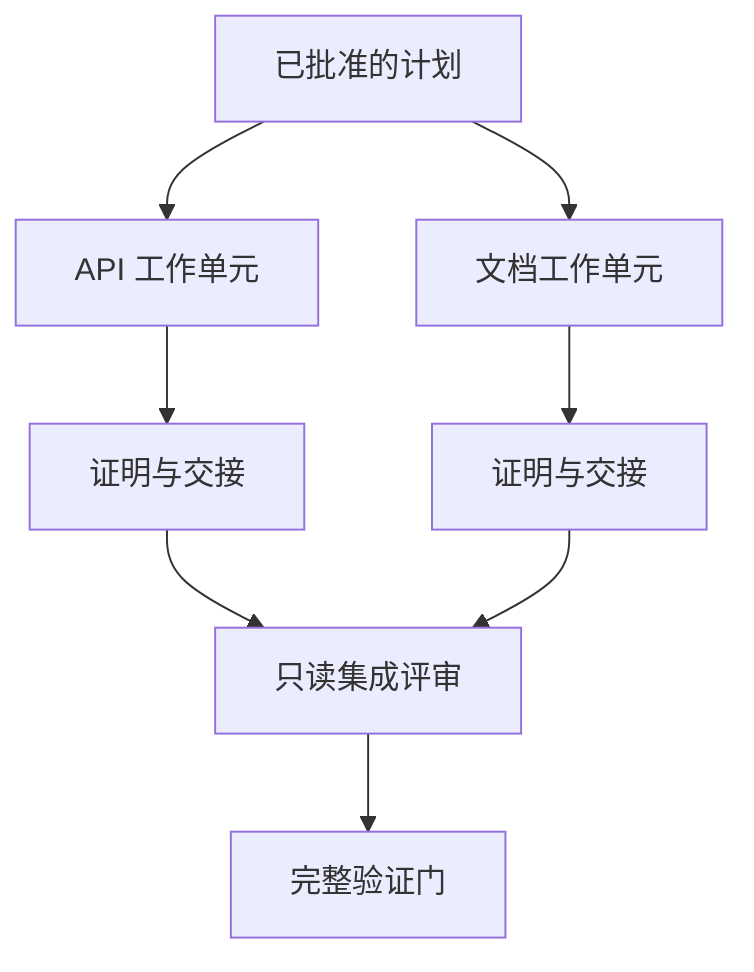

# 带隔离地委托

> 并行 Agent 只有在工作真正独立时才能省时间。否则它把一个清晰任务变成一个协调问题，而且失败得更快。

**类型：** 学习 + 动手实践
**语言：** Python（标准库）
**前置条件：** Phase 14 第 39、44 课
**预计用时：** 约 70 分钟

> **【中文解读】**
> 并行 Agent 只有在工作真正独立时才能省时间；否则它把一个清晰任务变成一个协调问题，而且失败得更快。本课讲多 Agent 委托的安全做法：先用"并行测试"判断该不该并行，再给每个 worker 独占的文件所有权与明确证明，最后由集成者按合并契约收拢结果。这是 Agent 工程方法论系列的第三课。

> 🔗 **【前置】**
> 学本课前请先掌握 Phase 14 第 39 课（审查者 Agent——本课的集成者就是"建造者与标记者分离"在合并阶段的应用）和第 44 课（从证据出发做计划——本课的输入是它产出的 `outputs/evidence-plan.json`，其中的执行波次直接决定哪些 worker 可以并行）。本课产出 `outputs/delegation-plan.json`，记录拆分为什么安全、路径归谁、集成要收什么证明。

## 学习目标

- 判断委托是否被真实的独立性所支撑
- 给每个 worker 独占的文件所有权和明确的证明
- 从依赖关系计算执行波次
- 设计一个安全合并 Agent 工作的合并契约

## 并行测试

不要因为"有更多 Agent 可用"就委托。当以下至少一条成立时才委托：

- 两项调查能独立回答不同的未知项；
- 两个实现拥有互不相交的文件与契约；
- 一个评审者可以检视已完成的产物而不修改它；
- 一个慢速外部检查可以在本地工作继续的同时运行。

当多个 Agent 需要同样的文件、同一个未决决定、或同一个可变环境时，保持串行。

> **【中文解读】**
> "并行测试"是本课的第一道闸门：可用性不是理由，独立性才是。四条判据的共同点是"不共享可变状态"——共享的是文件、决定还是环境，决定了并行是赚是赔。反向清单同样重要：同样的文件、同一个未决决定、同一个可变环境，任何一条命中都该串行。

## 工作单元就是契约

每个被委托的单元需要：

| 字段 | 含义 |
|---|---|
| 目标（Goal） | 一个可观察的结果 |
| 所有者（Owner） | 一个承担责任的 worker |
| 路径（Paths） | 独占的写所有权 |
| 依赖（Dependencies） | 开工前必须已完成的工作单元 |
| 证明（Proof） | 交回给集成者的确切证据 |
| 交接（Handoff） | 改动的文件、做出的决定、剩余的风险 |

「搞定后端」不是一个工作单元。「在 `app/accounts.py` 里实现重复检查，并用聚焦的账户测试证明它」才是。

> **【中文解读】**
> 六个字段里最关键的是 Paths（独占写所有权）和 Proof（交回给集成者的确切证据）。「搞定后端」之所以不合格，是因为它既没有可独占的路径，也没有可验收的证明——责任无法落到一个 worker 头上。Handoff 一栏同样重要：改动了什么、做了哪些决定、还剩什么风险，都要随产物一起交回。

## 隔离有三层

1. **文件系统隔离：** 独立 worktree 或沙箱防止意外的共享编辑。
2. **所有权隔离：** 契约防止两个 worker 有意编辑同一路径。
3. **状态隔离：** 独立的日志与输出防止一个 worker 覆盖另一个 worker 的证据。

文件系统隔离解决不了所有权问题。两个干净的 worktree 仍然可能产出相互冲突的设计。合并契约必须在开工之前就把共享接口定下来。



> **【中文解读】**
> 三层隔离常被误以为"开了 worktree 就完事"。但 worktree 只防意外碰撞，防不了两个 worker 各自朝冲突的设计走——那是所有权层（契约）的职责；日志互相覆盖则是状态层的职责。三层各管一类失败，缺一层就留一类坑。图中的流程也一样：两个单元先各自交回证明与交接说明，集成者只做只读评审，验证门最后统一把关。

## 集成者不重做工作

集成者应该：

1. 确认每份交接与它被分配的范围一致；
2. 读证明输出本身，而不只是 worker 的总结；
3. 按依赖顺序合并改动；
4. 运行完整的跨单元验证门；
5. 拒绝隐藏的范围扩张；
6. 把冲突记录为新的决定，而不是悄悄改掉。

如果集成需要重写 worker 结果的大部分，说明最初的分解就是错的。

> **【中文解读】**
> 集成者的角色是"验收员"，不是"补刀选手"。六条职责里第 2 条最容易被跳过——只读 worker 的自述就放行，等于把验收外包给了被验收者。最后一段是分解质量的试金石：集成阶段的大规模返工，问题永远出在上游的拆分，而不是集成者的手艺。

## 人与 Agent 的角色

委托并不取代人的判断。人继续拥有那些会改变公开行为、风险、授权或不可逆成本的选择。Agent 可以拥有有界的调查、实现、验证与评审。

这就是校准的自主权（calibrated autonomy）：系统在证据与回滚能力强的环节放权，在后果严重的环节设检查点。

> **【中文解读】**
> "校准的自主权"是本课的价值主张：自主程度不是越高越好，而应与"证据强度 × 可回滚性"成正比。低风险可回滚的（跑测试、查代码）尽管放权；高风险不可逆的（删数据、发布、改公开契约）必须留检查点。这也是"并行省时间"不变成"并行放大错误"的安全阀。

## 动手实现

实验部分会检查路径重叠、校验依赖、计算安全的执行波次，并写出 `outputs/delegation-plan.json`。

运行：

```bash
python3 code/main.py
python3 -m unittest discover code/tests -v
```

把文档单元改成拥有 `app/`。计划应该被拦截，因为这个父路径与 API 单元重叠。

> **【中文解读】**
> 破坏实验（把 docs 单元的所有权改成 `app/`）演示的是所有权隔离的机械化：路径重叠不靠自觉，靠校验器直接拒绝。这就是"契约"与"叮嘱"的区别——叮嘱会被忽略，契约会 block。

## 练习题

1. 把一个真实改动分解成两个独立工作单元和一个集成者。
2. 找一个只是看起来独立的并行拆分方案，说出它共享的那个决定。
3. 加一个只读的调研 worker，它的产出是一张事实表。
4. 加一个合并门：把最终的改动文件集合与所有单元契约逐一核对。
5. 为一个依赖失效的 worker 定义取消规则。

## 延伸阅读

- [Reid Smith, The Contract Net Protocol](https://doi.org/10.1109/TC.1980.1675516)
  分布式任务分配与结果汇报的早期形式化处理——本课"工作单元即契约"的思想源头。
- [Eric Horvitz, Principles of Mixed-Initiative User Interfaces](https://dl.acm.org/doi/10.1145/302979.303030)
  决定自动化何时该行动、何时该把控制权交还给人——"校准的自主权"的出处。

## 你保留的产出

保留 `outputs/delegation-plan.json`。它记录了这次拆分为什么安全、每条路径归谁所有、以及集成必须收到什么证明。
