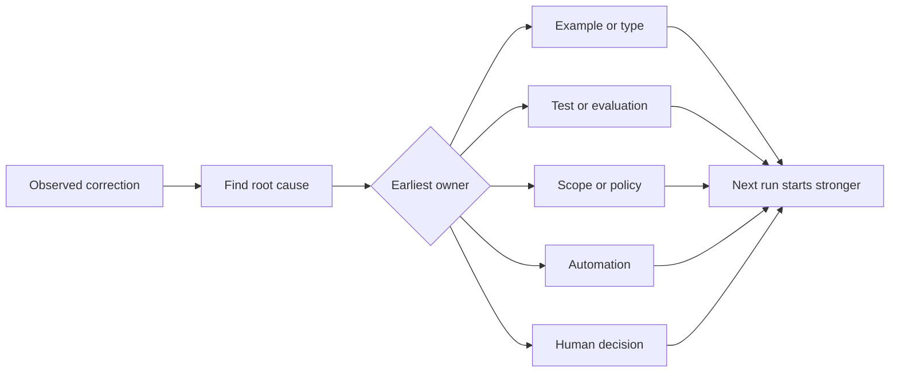

# Turn Every Agent Correction into a System Improvement | 把反馈变成系统

> A correction that lives only in chat fixes one run. A correction promoted into a test, boundary, example, or tool improves every later run.

> **【中文解读】** 只活在聊天记录里的纠正，只修复一次运行；被升级成测试、边界、示例或工具的纠正，改善之后的每一次运行。本课讲"反馈棘轮"：把对 Agent 的每一次人工纠正当作工作系统的观测数据，找到根因，升级到能预防复发的最早一层，并定期淘汰失效的控制。这是 Agent 工程方法论系列的第四课。

> 🔗 **【前置】** 学本课前请先掌握 Phase 14 第 37-41 课（运行时反馈循环、验证门、审查者 Agent、多会话交接、真实仓库工作台）——本课是把这一整段反馈机制收拢成一个"只进不退"的系统改进记录。本课产出 `outputs/feedback-ratchet.json`，它是未来工作台改动的输入。

**Type:** Learn + Build | **类型:** 学习 + 动手实践
**Languages:** Python (stdlib) | **语言:** Python（标准库）
**Prerequisites:** Phase 14 lessons 37 to 41 | **前置知识:** Phase 14 第 37-41 课
**Time:** ~65 minutes | **时间:** 约 65 分钟

## Learning Objectives | 学习目标

- Convert agent corrections into durable controls.
  中文翻译：把对 Agent 的纠正转化为持久的控制手段。
- Place each control at the earliest layer that can prevent recurrence.
  中文翻译：把每个控制放在能预防复发的最早一层。
- Deduplicate repeated lessons with stable fingerprints.
  中文翻译：用稳定的指纹为重复的教训去重。
- Retire controls that no longer protect a real risk.
  中文翻译：退役那些不再保护真实风险的控制。

## Corrections Are Evidence | 纠正就是证据

When you tell an agent “do not edit that file,” you have learned that the scope boundary was not executable. When you say “this output shape is wrong,” you have learned that an example or test was missing. When setup fails again, you have learned that environment knowledge belongs in automation.

> 当你对 Agent 说「别改那个文件」，你学到的是：范围边界不可执行。当你说「这个输出形状不对」，你学到的是：缺一个示例或测试。当环境搭建再次失败，你学到的是：环境知识应该进自动化。

Treat the correction as an observation about the work system, not as a prompt-writing failure.

> 把纠正当作对工作系统的观测，而不是一次 prompt 写作的失败。

> **【中文解读】** 这一节换了个视角：每次纠正都是系统在报告自己的漏洞——"边界不可执行""示例缺失""知识没有落盘"。把纠正当成证据而不是事故，你才会去问"哪一层该为它负责"，而不是反复在聊天里说同一句话。

## Promote to the Earliest Effective Layer | 升级到最早的有效层

Use this order:

> 按这个顺序升级：

| Recurring failure | Durable destination |
|---|---|
| Wrong result or regression | Test or evaluation |
| Off-scope or unsafe action | Scope or permission policy |
| Repeated setup or command mistake | Automation or tool |
| Repeated output-format mistake | Canonical example plus validator |
| Ambiguous local convention | Instruction with a scenario check |
| Product disagreement | Human decision record |

Earlier controls are cheaper. A type that prevents an invalid state is stronger than a review comment that catches it later. A focused test is stronger than a paragraph asking the agent to remember.

> 越早的控制越便宜。一个防止非法状态出现的类型，强过一条事后才抓住它的评审评论。一个聚焦的测试，强过一段恳求 Agent「记住」的文字。

> **【中文解读】** 这张表是本课的核心决策表：结果错升级为测试/评估；越界升级为范围/权限策略；反复踩环境坑升级为自动化；格式错升级为规范示例加校验器；约定含糊升级为带场景检查的指令；产品分歧升级为人工决定记录。原则是"越靠前的控制越便宜"——能在类型系统拦住的，别留到评审；能用测试钉死的，别写在 prompt 里。



> 图解：观察到纠正 → 找根因 → 判定最早的责任层（示例/类型、测试/评估、范围/策略、自动化、人工决定）→ 下一次运行从更强的起点开始。

## The Ratchet Record | 棘轮记录

Capture:

> 记录这些字段：

- symptom;
  中文翻译：症状；
- root cause;
  中文翻译：根因；
- consequence;
  中文翻译：后果；
- recurrence count;
  中文翻译：复发次数；
- chosen control;
  中文翻译：选定的控制；
- verification for the control;
  中文翻译：控制自身的验证方式；
- owner;
  中文翻译：负责人；
- date to review or retire it.
  中文翻译：复审或退役日期。

Do not promote every one-off preference. Promote a correction when recurrence or consequence justifies permanent complexity.

> 不要把每个一次性偏好都升级。只有当复发次数或后果严重到值得引入永久复杂度时，才升级这条纠正。

> **【中文解读】** 八个字段里，"控制自身的验证方式"和"退役日期"最容易被省略。前者保证这条控制真的拦得住（否则只是心理安慰）；后者承认控制有寿命。升级门槛用"复发 × 后果"衡量——低后果又罕见的纠正，留在聊天里就好。

> 💡 **【类比】** 棘轮扳手像一个只涨不跌的储蓄罐。之前：每次纠正都从零开始、说完就忘；之后：每次纠正都推动齿轮单向前进一格（一条可验证的控制），系统只会变强，不会退回。

## Separate Cause from Symptom | 区分原因与症状

“The agent edited README” is a symptom. Possible causes include:

> 「Agent 改了 README」是症状。可能的原因包括：

- the task allowed the repository root;
  中文翻译：任务允许了仓库根目录；
- docs were implicitly considered safe;
  中文翻译：文档被默认当作安全区；
- the plan bundled implementation and documentation;
  中文翻译：计划把实现和文档捆在了一起；
- two workers had overlapping ownership.
  中文翻译：两个 worker 的所有权有重叠。

Each cause belongs to a different control. A rule that merely repeats the symptom will fail in the next slightly different case.

> 每个原因对应不同的控制。只复述症状的规则，在下一次稍有不同的情况里就会失效。

> **【中文解读】** 这是最容易偷懒的一步：把「别改 README」写成规则很容易，找出「为什么它会被改」很难。但四个可能原因指向四种不同的修复——收窄允许路径、显式划出禁止路径、拆分计划、修所有权契约——全都和"README"这个字面无关。

## Controls Also Decay | 控制也会腐化

Old controls can conflict, bloat context, and encode a system that no longer exists. Every promoted rule needs a retirement check. Remove or rewrite it when:

> 旧控制会互相冲突、撑大上下文、并固化一个已经不存在的系统。每条升级过的规则都需要退役检查。当以下情况出现时，删除或重写它：

- the underlying architecture changed;
  中文翻译：底层架构已经变了；
- a stronger executable control replaced it;
  中文翻译：更强的可执行控制取代了它；
- the failure has not recurred across a meaningful window;
  中文翻译：在一个有意义的时间窗内故障再未复发；
- the control creates more friction than the risk it prevents.
  中文翻译：控制制造的摩擦已经超过它防住的风险。

The goal is not the longest instruction file. It is the smallest system that preserves hard-won judgment.

> 目标不是最长的指令文件，而是保存来之不易的判断力的最小系统。

> **【中文解读】** 棘轮只进不退，但控制会过期。"每条规则都要有退役检查"与项目指令文件（如 AGENTS.md）的维护直接相关：不加清理的规则堆积，最终会互相矛盾、淹没重点、描述一个不存在的系统。目标是"保存判断力的最小系统"，不是最长的说明书。

## Build It | 动手实现

The lab classifies corrections, promotes them into controls, fingerprints duplicates, and writes `outputs/feedback-ratchet.json`.

> 实验部分会对纠正分类、把它们升级为控制、用指纹去重，并写出 `outputs/feedback-ratchet.json`。

Run:

> 运行：

```bash
python3 code/main.py
python3 -m unittest discover code/tests -v
```

Add two differently worded corrections with the same cause. Improve the normalization until they collapse into one control without collapsing unrelated failures.

> 加入两条措辞不同但根因相同的纠正。改进归一化逻辑，直到它们合并成一个控制，同时不让无关的失败被误合并。

> **【中文解读】** 破坏实验演示指纹去重的关键张力：归一化太松，同一根因的两条纠正各立一条控制（重复膨胀）；太紧，无关失败被错误合并（误伤）。去重的锚点是根因，不是措辞——这也是"区分原因与症状"一节的代码化。

## Exercises | 练习

1. Take five corrections from a recent coding session and classify their real owners.
   中文翻译：从最近一次编码会话里取五条纠正，分类它们真正的责任层。
2. Replace one prose rule with an executable test.
   中文翻译：把一条文字规则替换成一个可执行的测试。
3. Add consequence weighting so a severe first occurrence can be promoted immediately.
   中文翻译：加后果权重，让严重的首次发生可以立即升级。
4. Add an owner and retirement date to the lab output.
   中文翻译：给实验输出加上负责人和退役日期。
5. Review one existing agent instruction and delete it only after proving a stronger control exists.
   中文翻译：审查一条现有的 Agent 指令，只有在证明存在更强的控制后才删除它。

## Further Reading | 延伸阅读

- [Basili, Caldiera, and Rombach, The Goal Question Metric Approach](https://www.cs.toronto.edu/~sme/CSC444F/handouts/GQM-paper.pdf), for turning goals into questions and operational measurements.
  中文翻译：Basili、Caldiera 与 Rombach《目标问题度量法》——把目标转化为问题和可操作的度量。
- [Shinn et al., Reflexion](https://arxiv.org/abs/2303.11366), for using feedback traces to improve later decisions without changing model weights.
  中文翻译：Shinn 等《Reflexion》——用反馈轨迹改进后续决策而不改动模型权重。
- [Madaan et al., Self-Refine](https://arxiv.org/abs/2303.17651), for iterative feedback and revision inside a task loop.
  中文翻译：Madaan 等《Self-Refine》——任务循环内部的迭代反馈与修订。

## What You Keep | 你保留的产出

Keep `outputs/feedback-ratchet.json`. It is the durable end of the Agent-Assisted Engineering path and the input to future workbench changes.

> 保留 `outputs/feedback-ratchet.json`。它是「Agent 辅助工程」路线的持久终点，也是未来工作台改动的输入。
