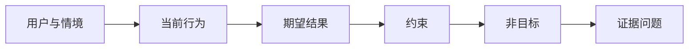

# 结果先于产出

> 实现越快，选错问题的代价越高。先塑造结果，让速度指向正确的方向。

**类型：** 学习 + 动手实践
**语言：** Python（标准库）
**前置条件：** 无
**预计用时：** 约 60 分钟

> **【中文解读】**
> 「产出」（output）是你决定建造的东西——一个助手、一个页面、一个模型；「结果」（outcome）是世界里可观察的改变——谁在什么情境下变好了什么。实现越快，选错问题的代价越高。本课教你先写「结果框架」（outcome frame）：用户、情境、当前行为、期望结果、约束、非目标——全程不提任何具体解法。这是「塑造构建」路径（47-54 课）的入口课。

> 🔗 **【前置】**
> 无硬性前置课程。本课是 47-54 课「塑造构建」路径（结果定义 → 工作流发现 → 假设与风险 → 最小切片 → 规格 → 指标 → 分阶段发布 → 反馈所有权）的起点。

## 学习目标

- 写出一个不点名任何解决方案的结果框架
- 识别用户、情境、当前行为和期望的改变
- 把约束和非目标写明确
- 在解决方案泄漏硬化成范围之前检测到它

## 产出不等于结果

「造一个事故助手」点名了一个产出。它没有说谁需要它、什么会变好、什么必须保持安全。

结果框架这样说：

> 当生产告警到达时，值班工程师能在两分钟内定位故障服务并找到一个安全的下一步动作，同时诊断全程保持只读且可审计。

这句话可以由一个软件、一本运维手册、一次数据修复、或一个更小的界面改动来满足。它让团队锚定在结果上，而不是锚定在某人最先想象出的那个产物上。

> **【中文解读】**
> 产出与结果的区分是本课的地基：产出只是解空间的一个入口，结果才是要抵达的终点。上面这个样板句值得细看——它没有提「助手」「AI」「界面」，只写了谁、何时、多快、什么不许变。正因为它不带解法，软件、手册、数据修复、小改动才有资格同台竞争。

## 六段式框架

| 部分 | 要回答的问题 |
|---|---|
| 用户（User） | 谁在直接经历这个问题？ |
| 情境（Situation） | 它在何时、何地发生？ |
| 当前行为（Current behavior） | 今天发生了什么，包括绕行办法？ |
| 期望结果（Desired outcome） | 什么可观察的状态应该改善？ |
| 约束（Constraints） | 哪些安全、政策、成本或兼容性限制是固定的？ |
| 非目标（Non-goals） | 哪些诱人的相邻工作被排除在外？ |



> **【中文解读】**
> 六段是有顺序的：先有人和情境，才谈得上行为；先看清现状（包括现在的绕行办法），才谈得上改变；约束收紧解空间，非目标挡住顺手的诱惑，最后落到「什么观察能证明结果达成」。表里最常被跳过的是「当前行为」——不写现状的「期望结果」多半是想象。

## 找出解决方案泄漏

当结果陈述里包含尚未被证据挣来的产品形态、界面、模型选择、框架或架构时，解决方案就泄漏了。

- 「用户每周收到一份 AI 摘要」泄漏了「摘要」这个形态和「每周」这个节奏。
- 「用户在批准前理解账户变更」陈述的是结果。
- 「部署一个向量数据库」泄漏了基础设施。
- 「评审时能拿到相关政策证据」陈述的是一种能力。

当兼容性确实锁死了技术选型时，约束里可以点名技术。记下它为什么被固定。

> **【中文解读】**
> 泄漏检测的判据：句子里出现「产品形态/界面/模型/框架/架构」级别的词（AI 摘要、向量库、App），而它还没被证据挣得，就是泄漏。四个例句两两对照——泄漏的句子锁死了「怎么做」，干净的句子只说「什么变好」。这直接防住「第一想象硬化成范围」。

## 约束保护结果

约束不是实现细节。它们是真实世界目标的一部分：

- 诊断期间不写生产库；
- 在事故时间预算内响应；
- 现存审计事件保持权威性；
- 不引入新的运行时依赖；
- 无障碍行为保持完好。

一个靠违反约束抵达的构建，并没有真正抵达结果。

> **【中文解读】**
> 约束写在结果框架里而不是 PR 描述里，原因就是最后一句：违反约束的「成功」不算成功。这些条目通常编码着安全、合规或兼容性——它们是目标的一部分，也会成为后续验收门的一部分。

## 非目标划出边界

非目标防止一个有用的切片膨胀成一个平台。好的非目标要具体到能拒绝工作：

- 不做自动修复；
- 不建新的告警路由系统；
- 不取代事故指挥官；
- 本切片不做历史分析。

> **【中文解读】**
> 非目标是范围的负空间，与第 43 课任务框架里的「禁止路径」同构。判断一条非目标写得好不好，就问它能不能用来拒绝一个具体的诱惑（「顺便做个自动修复吧？」）——拒绝不了的「非目标」只是装饰。

## 动手实现

实验部分会校验一个 `OutcomeFrame` 并写出 `outputs/outcome-frame.json`。

```bash
python3 code/main.py
python3 -m unittest discover code/tests -v
```

把期望结果换成「使用事故助手」。校验器应该标记出：拟议的产出泄漏进了结果。

> **【中文解读】**
> 破坏实验把「泄漏检测」变成一条机械规则：期望结果一栏一旦出现解法形态（use/build/deploy 加产品名），校验器就拒绝。人工评审时同样只需要问一句——「这句话删掉产品名还成立吗？」

## 练习题

1. 把你 backlog 里的一条功能请求重写成结果框架。
2. 加一条能改变「哪些解仍然可行」的约束。
3. 加两条非目标，让第一个切片保持小。
4. 指出最早的、能证伪期望结果的观察。
5. 写出三种不同的产出，它们都能满足同一个结果。

## 延伸阅读

- [Nuseibeh and Easterbrook, Requirements Engineering: A Roadmap](https://www.cs.toronto.edu/~sme/papers/2000/ICSE2000.pdf)
  把真实世界目标当作软件工作的锚点——「结果先于产出」的理论根基。
- [Dardenne, van Lamsweerde, and Fickas, Goal-Directed Requirements Acquisition](https://doi.org/10.1016/0167-6423(93)90021-G)
  把高层目标精化为约束与可操作的需求——六段式框架的方法论源头。

## 你保留的产出

保留 `outputs/outcome-frame.json`。下一课会拿它对照人们实际执行的工作流来检验。
