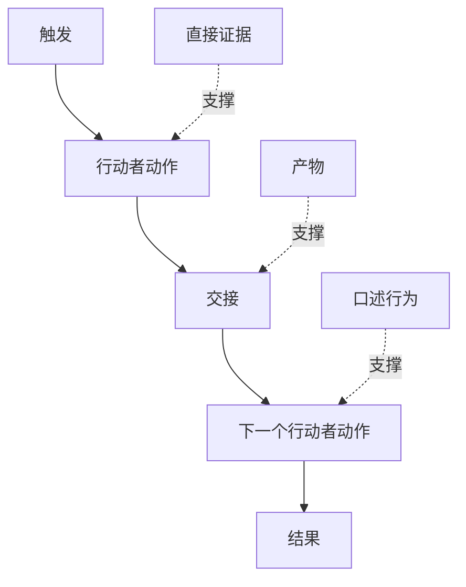

# 发现真实工作流

> 需求不是躺在会议里等人来收的。它们散落在动作、绕行办法、记录和分歧里。

**类型：** 学习 + 动手实践
**语言：** Python（标准库）
**前置条件：** Phase 14 第 47 课
**预计用时：** 约 70 分钟

> **【中文解读】**
> 需求不是躺在会议里等人来收的，而是散落在动作、绕行办法、记录和分歧里。本课教你从「现在真实发生什么」出发做工作流发现：给每个步骤建模（行动者、触发、动作、输入输出、摩擦、权限、证据），给证据分级（直接观察 > 产物 > 口述 > 推断），并保住分歧而不是把它平均掉。这是「塑造构建」路径的第二课。

> 🔗 **【前置】**
> 学本课前请先掌握 Phase 14 第 47 课（结果先于产出——本课检验的正是那个结果框架：期望的结果必须落在人们实际执行的工作流里，而不是想象的工作流里）。本课产出 `outputs/workflow-evidence.json`，下一课会把观察到的摩擦与不确定性变成一张假设地图。

## 学习目标

- 把当前工作流建模为带证据的有序动作
- 把直接观察与口述、推断的行为区分开
- 定位摩擦、交接、权限和隐藏状态
- 让不确定的断言保持可见，而不是把它们变成需求

## 从当前系统出发

不要一上来就问人们想要什么功能。先重建现在正在发生什么。

对每个步骤，记录：

| 字段 | 示例 |
|---|---|
| 行动者（Actor） | 值班工程师 |
| 触发（Trigger） | 生产告警到达 |
| 动作（Action） | 打开告警，然后检索各仪表盘 |
| 输入（Input） | 告警载荷和部署记录 |
| 输出（Output） | 候选服务与负责人 |
| 摩擦（Friction） | 在三个工具之间来回切换 |
| 权限（Authority） | 事故指挥官批准写操作 |
| 证据（Evidence） | 录屏、事故日志、运维手册 |

工作流比屏幕大。它包括等待、复制粘贴、小道消息、审批、错误恢复，以及那些人们已经不再注意到的步骤。

> **【中文解读】**
> 起点决定质量：从「想要什么」出发得到的是愿望清单，从「现在怎么做」出发得到的才是约束清单。八个字段里 Friction（摩擦）、Authority（权限）、Evidence（证据）最容易被漏记——摩擦是改进机会所在，权限是 AI 能不能动手的边界，证据决定这条记录可信到什么程度。最后一句点破常见盲区：屏幕外的等待、粘贴、群聊、救火才是工作流的血肉。

## 证据有强弱

用一个简单的证据阶梯：

1. **直接行为：** 观察、trace、录屏或系统事件。
2. **产物：** 工单、运维手册、日志、表单或已完成的作品。
3. **口述行为：** 某人描述自己怎么做。
4. **推断：** 团队推断大概发生了什么。

四级都可能有用，但只有前两级能直接证明当前行为。给其余的贴上标签，免得置信度悄悄膨胀。

> **【中文解读】**
> 证据阶梯是本课的度量衡：同一句「值班工程师先查仪表盘」，直接观察到的、工单里留痕的、本人说的、团队猜的，可信度差好几档。口述和推断并非不能用，但必须打上标签——否则它们会在转述两三次后被当成事实，工作流模型的地基就这样悄悄注水。

> 💡 **【类比】**
> 证据阶梯像新闻信源分级。之前：会议纪要里「大家都这么干」和录屏观察写得一样理直气壮；之后：每条记录带等级标签——直接观察是第一手信源，口述是当事人回忆，推断是编辑推测，置信度不再悄悄膨胀。



## 搜索四样东西

- **摩擦：** 重复劳动、延迟、重新录入或恢复补救。
- **隐藏状态：** 靠记忆、聊天记录或个人笔记携带的事实。
- **权限：** 被允许做出有后果变更的人或系统。
- **例外：** 正常工作流不再正常的那些情形。

AI 功能常常死在交接和例外上，因为当初只塑造了顺利路径（happy path）。

> **【中文解读】**
> 这四样是工作流里的高价值目标：摩擦指示改进点；隐藏状态是自动化的最大障碍（机器读不到脑子和私聊里的东西）；权限决定哪里必须留人工检查点；例外是「演示环境正常、生产环境翻车」的常见根源。只按 happy path 设计的 AI 功能，在第一次交接或第一个例外处就会暴露。

## 不要把分歧平均掉

两个用户可能在执行不同的工作流，而且各有正当理由。保留这些变体，直到你弄清它们代表的是：

- 不同的角色；
- 不同的风险等级；
- 旧流程与新流程并存；
- 熟练度差异；
- 一场真正的政策分歧。

一个被平均过的工作流可能谁也描述不了。

> **【中文解读】**
> 把两个变体合成一个「平均工作流」是最省事也最危险的做法：它描述的是一个不存在的用户。五种原因对应五种完全不同的后续动作——分角色建模、分风险建模、流程迁移、培训、上报决策——所以分歧必须原样保留到弄清原因之后。

## 动手实现

实验部分会给每个工作流步骤存证据、校验顺序与置信度、计算直接证据占比，并写出 `outputs/workflow-evidence.json`。

```bash
python3 code/main.py
python3 -m unittest discover code/tests -v
```

加一条「部署记录缺失」的例外路径。保持主顺序不变，记录分支从哪里开始。

> **【中文解读】**
> 破坏实验练的是例外建模：主流程保持线性，例外作为带自己证据的分支挂上去，而不是塞进某个主步骤的注释里。「直接证据占比」这个指标也值得留意——它量化了整个模型里到底有多少步骤真的被观察过。

## 练习题

1. 不访谈任何人，只从一条日志重建工作流。
2. 访谈一位用户，标记每一条仍然缺少直接证据的断言。
3. 加一个权限边界和一条失败恢复步骤。
4. 建模两条工作流变体，不合并它们。
5. 找一个「砍掉了看得见的步骤、却没碰隐藏工作」的提议功能。

## 延伸阅读

- [Nuseibeh and Easterbrook, Requirements Engineering: A Roadmap](https://www.cs.toronto.edu/~sme/papers/2000/ICSE2000.pdf)
  特别是它把需求获取看作解释、建模与验证而非简单采集——本课「证据分级 + 保留分歧」的理论根基。
- [Gotel and Finkelstein, An Analysis of the Requirements Traceability Problem](https://doi.org/10.1109/ICRE.1994.292398)
  保留需求与其来源之间关系的困难——每条工作流步骤都挂着证据，就是在做可追踪性。

## 你保留的产出

保留 `outputs/workflow-evidence.json`。下一课会把观察到的摩擦与不确定性变成一张假设地图。
