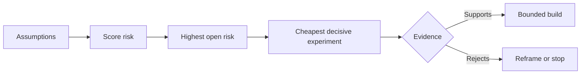

# Map Assumptions and Resolve the Riskiest One First | 映射假设，先拆最大风险

> A roadmap hides uncertainty inside features. An assumption map exposes what must be true before those features deserve to exist.

> **【中文解读】** 路线图把不确定性藏进一个个"功能"里；假设地图则把"这些功能值得存在的前提"摊到桌面上。本课是 Agent 工程方法论系列（Phase 14 · 43-54）里承上启下的一环：第 48 课发现了人们实际执行的工作流，本课把"这件事值得做"本身拆成一组可证伪的假设，按影响、不确定性、不可逆性三个维度排风险，然后先做最便宜、最能定生死的那个实验——而不是先做最令人兴奋的功能。

> 🔗 **【前置】** 学本课前请先掌握：Phase 14 第 48 课（发现真实工作流——假设地图必须覆盖真实发生的工作，而不是想象中的工作流）。本课产出的 `outputs/assumption-map.json` 会在第 50 课用来挑选"能产生决定性证据的最小切片"。

**Type:** Learn + Build | **类型:** 学习 + 动手实践
**Languages:** Python (stdlib) | **语言:** Python（标准库）
**Prerequisites:** Phase 14 lesson 48 | **前置知识:** Phase 14 第 48 课
**Time:** ~65 minutes | **时间:** 约 65 分钟

## Learning Objectives | 学习目标

- Convert proposed work into explicit assumptions.
  中文翻译：把提议的工作转化为显式的假设。
- Score impact, uncertainty, and irreversibility separately.
  中文翻译：分别给影响、不确定性和不可逆性打分。
- Choose the next experiment by risk, not enthusiasm.
  中文翻译：按风险而不是热情来选择下一个实验。
- Replace tested assumptions with evidence and decisions.
  中文翻译：用证据和决策替换已检验的假设。

## Every Build Contains Bets | 每次构建都藏着赌注

An incident tool may depend on all of these being true:

> 一个事故处理工具可能依赖以下每一条都成立：

- alert context contains enough information to identify a service;
  中文翻译：告警上下文里包含足以识别服务的信息；
- engineers trust a recommendation they did not derive themselves;
  中文翻译：工程师会信任一条不是自己推导出来的建议；
- the desired response time matters operationally;
  中文翻译：期望的响应时间在运维上真的重要；
- required data can be accessed without unsafe authority;
  中文翻译：所需数据无需危险权限即可访问；
- the workflow happens often enough to justify maintenance.
  中文翻译：这个工作流发生得足够频繁，值得长期维护。

These are not implementation tasks. They are conditions for the build to be valuable, usable, feasible, and safe.

> 这些不是实现任务，而是这个构建"有价值、可用、可行、安全"的前提条件。

> **【中文解读】** 功能列表的每一行背后都压着几颗隐性赌注：用户会这么用吗、数据拿得到吗、组织养得起吗。路线图从不显示这些赌注，它们只会在做完之后以返工或弃用的形式显形。把赌注写成显式假设，是让它们可以在写代码之前被检验的第一步。

## Assumption Classes | 假设的分类

| Class | Question |
|---|---|
| Value | Will the outcome matter enough? |
| Usability | Can the user understand and act on it? |
| Feasibility | Can the system produce it with available data and constraints? |
| Viability | Can the organization sustain cost, ownership, and operation? |
| Safety | Can it fail without unacceptable consequence? |

> **【中文解读】** 五类假设各问一个问题：价值（结果足够重要吗）、可用性（用户看得懂并能据此行动吗）、可行性（以现有数据和约束，系统做得到吗）、生存力（组织养得起成本、归属和运维吗）、安全性（它失败时后果可接受吗）。前四类对应经典的"值得做/做得出/养得起"框架，第五类安全性是 AI 系统的一票否决项——"它失败时不会写生产库"这种假设必须先于一切功能被检验。

Write assumptions as falsifiable statements. “The feature is useful” cannot be tested. “Eight of ten on-call engineers identify the correct service faster with the read-only result” can.

> 把假设写成可证伪的陈述。「这个功能有用」没法检验；「十名值班工程师中有八人借助只读结果更快定位到正确服务」就可以。

## Risk Is Not One Number | 风险不是一个数字

The lab uses three dimensions from one to five:

> 实验代码用三个 1 到 5 的维度：

- **Impact:** damage if the assumption is false.
  中文翻译：**影响：** 假设为假时的损失。
- **Uncertainty:** weakness of current evidence.
  中文翻译：**不确定性：** 现有证据有多薄弱。
- **Irreversibility:** cost of learning after commitment.
  中文翻译：**不可逆性：** 押上承诺之后再学习的代价。

The example score multiplies impact and uncertainty, then adds irreversibility. The formula is not universal. Its purpose is to force the team to state why one unknown should be resolved before another.

> 示例评分把影响乘以不确定性，再加上不可逆性。这个公式并不通用，它的目的是逼团队说清楚：为什么这个未知项要先于那个未知项被解决。

> 💡 **【类比】** 假设排雷像拆迁前的房屋检测：每面墙（假设）分别量三个数——砸了会塌多大面积（影响）、结构判断有多拿不准（不确定性）、砸错了还能不能砌回去（不可逆性）。先处理"塌了最疼 + 最拿不准 + 砌不回去"的那面墙，而不是最好砸的那面。



> **【中文解读】** 这张流程图是本课的发动机：假设 → 打风险分 → 找到风险最高且仍开放的假设 → 为它设计最便宜的决定性实验 → 证据要么支持（进入有边界的构建），要么反对（重构问题或直接停止）。注意两个出口都不叫"继续按原计划做"——实验的意义就是让失败发生在一个便宜的地方。

## Design an Experiment, Not a Confirmation Ritual | 设计实验，而不是确认仪式

A useful test has:

> 一个有用的测试具备：

- a claim that could be false;
  中文翻译：一个可能为假的断言；
- a population or realistic sample;
  中文翻译：一个真实总体或现实样本；
- an observable result;
  中文翻译：一个可观察的结果；
- a threshold decided before the result;
  中文翻译：一个在看到结果之前就定好的阈值；
- a next decision for pass, fail, and ambiguous evidence.
  中文翻译：为通过、失败和模糊证据分别准备好的下一步决策。

Avoid tests that only demonstrate that the team can build the idea.

> 避免那些只证明"团队能把这个东西做出来"的测试。

> **【中文解读】** "确认仪式"指那些无论结果如何都会继续做的演示——demo 成功了就上线，失败了就修修再上。真正的实验有三个硬标志：断言可能为假、阈值先于结果确定、每种证据都对应不同的下一步。少了任何一个，它就不是实验，是排练。

## Reversibility Changes Order | 可逆性改变顺序

High-consequence, irreversible choices need earlier evidence. A read-only replay can precede a production integration. A temporary adapter can precede a data migration. A human-approved recommendation can precede automatic action.

> 后果重大且不可逆的选择需要更早的证据。只读回放可以走在生产集成之前；临时适配器可以走在数据迁移之前；人工审批的建议可以走在自动执行之前。

The shape of the build should follow the shape of uncertainty.

> 构建的形状应该跟随不确定性的形状。

> **【中文解读】** 排序原则只有一句：越难回退的决定，越要先在便宜的替代形态上拿到证据。三组递进——只读回放→生产集成、临时适配→数据迁移、人工批准→自动执行——都是"先用可逆的形态提问，再换成不可逆的形态执行"。这个思想在第 53 课会升级成原型/试点/生产三档的完整方法。

## Build It | 动手实现

The lab ranks assumptions, distinguishes tested from open claims, selects the highest open risk, and writes `outputs/assumption-map.json`.

> 实验代码给假设排序、区分已检验与仍开放的断言、选出风险最高的开放项，并写出 `outputs/assumption-map.json`。

```bash
python3 code/main.py
python3 -m unittest discover code/tests -v
```

Change the evidence on the highest-risk assumption and observe how the next experiment changes.

> 修改风险最高那条假设的 evidence 字段，观察"下一个实验"如何随之改变。

> **【中文解读】** `risk_score = impact * uncertainty + irreversibility` 是故意简单的算术——它存在的意义不是精确，而是把"先做哪个实验"变成一个可争辩、可复算的显式问题。给某条假设补上证据后，它的状态从 open 变成 tested，下一个实验自动落到新的最高风险上：这就是"用证据推动优先级"，而不是用会议推动。

## Exercises | 练习

1. Write five assumptions for a feature you want to build.
   中文翻译：为你想做的某个功能写下五条假设。
2. Add one safety assumption that your feature list omitted.
   中文翻译：补一条你的功能清单遗漏的安全性假设。
3. Define a threshold that would cause you to stop the build.
   中文翻译：定义一个会让你停止这个构建的阈值。
4. Replace one large experiment with a cheaper decisive test.
   中文翻译：把一个大实验替换成一个更便宜但同样有决定性的测试。
5. Compare risk ranking with roadmap priority and explain the mismatch.
   中文翻译：对比风险排序与路线图优先级，并解释两者的错位。

## Further Reading | 延伸阅读

- [Barry Boehm, A Spiral Model of Software Development and Enhancement](https://dl.acm.org/doi/10.1145/12944.12948), for a risk-driven development cycle that resolves uncertainty before deeper commitment.
  中文翻译：Boehm《螺旋模型》——风险驱动的开发循环：在更深的承诺之前先解决不确定性。
- [Dardenne, van Lamsweerde, and Fickas, Goal-Directed Requirements Acquisition](https://doi.org/10.1016/0167-6423(93)90021-G), for refining goals while surfacing obstacles and constraints.
  中文翻译：Dardenne 等《目标导向的需求获取》——在精化目标的同时浮现障碍与约束。

## What You Keep | 你保留的产出

Keep `outputs/assumption-map.json`. The next lesson uses it to choose the smallest slice that can produce decisive evidence.

> 保留 `outputs/assumption-map.json`。下一课会用它来挑选能产生决定性证据的最小切片。
