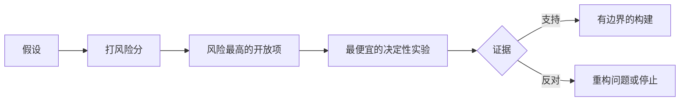

# 映射假设，先拆最大风险

> 路线图把不确定性藏进一个个"功能"里；假设地图则把"这些功能值得存在的前提"摊到桌面上。

**类型：** 学习 + 动手实践
**语言：** Python（标准库）
**前置条件：** Phase 14 第 48 课
**预计用时：** 约 65 分钟

> **【中文解读】**
> 本课是 Agent 工程方法论系列（Phase 14 · 43-54）里承上启下的一环：第 48 课发现了人们实际执行的工作流，本课把"这件事值得做"本身拆成一组可证伪的假设，按影响、不确定性、不可逆性三个维度排风险，然后先做最便宜、最能定生死的那个实验——而不是先做最令人兴奋的功能。

> 🔗 **【前置】**
> 学本课前请先掌握：Phase 14 第 48 课（发现真实工作流——假设地图必须覆盖真实发生的工作，而不是想象中的工作流）。本课产出的 `outputs/assumption-map.json` 会在第 50 课用来挑选"能产生决定性证据的最小切片"。

## 学习目标

- 把提议的工作转化为显式的假设
- 分别给影响、不确定性和不可逆性打分
- 按风险而不是热情来选择下一个实验
- 用证据和决策替换已检验的假设

## 每次构建都藏着赌注

一个事故处理工具可能依赖以下每一条都成立：

- 告警上下文里包含足以识别服务的信息；
- 工程师会信任一条不是自己推导出来的建议；
- 期望的响应时间在运维上真的重要；
- 所需数据无需危险权限即可访问；
- 这个工作流发生得足够频繁，值得长期维护。

这些不是实现任务，而是这个构建"有价值、可用、可行、安全"的前提条件。

> **【中文解读】**
> 功能列表的每一行背后都压着几颗隐性赌注：用户会这么用吗、数据拿得到吗、组织养得起吗。路线图从不显示这些赌注，它们只会在做完之后以返工或弃用的形式显形。把赌注写成显式假设，是让它们可以在写代码之前被检验的第一步。

## 假设的分类

| 类别 | 要回答的问题 |
|---|---|
| 价值（Value） | 结果足够重要吗？ |
| 可用性（Usability） | 用户看得懂并能据此行动吗？ |
| 可行性（Feasibility） | 以现有数据和约束，系统做得到吗？ |
| 生存力（Viability） | 组织养得起成本、归属和运维吗？ |
| 安全性（Safety） | 它失败时后果可接受吗？ |

> **【中文解读】**
> 前四类对应经典的"值得做 / 用得起来 / 做得出 / 养得起"框架，第五类安全性是 AI 系统的一票否决项——"它失败时不会写生产库"这种假设必须先于一切功能被检验。

把假设写成可证伪的陈述。「这个功能有用」没法检验；「十名值班工程师中有八人借助只读结果更快定位到正确服务」就可以。

## 风险不是一个数字

实验代码用三个 1 到 5 的维度：

- **影响（Impact）：** 假设为假时的损失。
- **不确定性（Uncertainty）：** 现有证据有多薄弱。
- **不可逆性（Irreversibility）：** 押上承诺之后再学习的代价。

示例评分把影响乘以不确定性，再加上不可逆性。这个公式并不通用，它的目的是逼团队说清楚：为什么这个未知项要先于那个未知项被解决。

> 💡 **【类比】**
> 假设排雷像拆迁前的房屋检测：每面墙（假设）分别量三个数——砸了会塌多大面积（影响）、结构判断有多拿不准（不确定性）、砸错了还能不能砌回去（不可逆性）。先处理"塌了最疼 + 最拿不准 + 砌不回去"的那面墙，而不是最好砸的那面。



> **【中文解读】**
> 这张流程图是本课的发动机：假设 → 打风险分 → 找到风险最高且仍开放的假设 → 为它设计最便宜的决定性实验 → 证据要么支持（进入有边界的构建），要么反对（重构问题或直接停止）。注意两个出口都不叫"继续按原计划做"——实验的意义就是让失败发生在一个便宜的地方。

## 设计实验，而不是确认仪式

一个有用的测试具备：

- 一个可能为假的断言；
- 一个真实总体或现实样本；
- 一个可观察的结果；
- 一个在看到结果之前就定好的阈值；
- 为通过、失败和模糊证据分别准备好的下一步决策。

避免那些只证明"团队能把这个东西做出来"的测试。

> **【中文解读】**
> "确认仪式"指那些无论结果如何都会继续做的演示——demo 成功了就上线，失败了就修修再上。真正的实验有三个硬标志：断言可能为假、阈值先于结果确定、每种证据都对应不同的下一步。少了任何一个，它就不是实验，是排练。

## 可逆性改变顺序

后果重大且不可逆的选择需要更早的证据。只读回放可以走在生产集成之前；临时适配器可以走在数据迁移之前；人工审批的建议可以走在自动执行之前。

构建的形状应该跟随不确定性的形状。

> **【中文解读】**
> 排序原则只有一句：越难回退的决定，越要先在便宜的替代形态上拿到证据。三组递进——只读回放→生产集成、临时适配→数据迁移、人工批准→自动执行——都是"先用可逆的形态提问，再换成不可逆的形态执行"。这个思想在第 53 课会升级成原型/试点/生产三档的完整方法。

## 动手实现

实验代码给假设排序、区分已检验与仍开放的断言、选出风险最高的开放项，并写出 `outputs/assumption-map.json`。

```bash
python3 code/main.py
python3 -m unittest discover code/tests -v
```

修改风险最高那条假设的 evidence 字段，观察"下一个实验"如何随之改变。

> **【中文解读】**
> `risk_score = impact * uncertainty + irreversibility` 是故意简单的算术——它存在的意义不是精确，而是把"先做哪个实验"变成一个可争辩、可复算的显式问题。给某条假设补上证据后，它的状态从 open 变成 tested，下一个实验自动落到新的最高风险上：这就是"用证据推动优先级"，而不是用会议推动。

## 练习题

1. 为你想做的某个功能写下五条假设。
2. 补一条你的功能清单遗漏的安全性假设。
3. 定义一个会让你停止这个构建的阈值。
4. 把一个大实验替换成一个更便宜但同样有决定性的测试。
5. 对比风险排序与路线图优先级，并解释两者的错位。

## 延伸阅读

- [Barry Boehm, A Spiral Model of Software Development and Enhancement](https://dl.acm.org/doi/10.1145/12944.12948)
  风险驱动的开发循环：在更深的承诺之前先解决不确定性——本课"先拆最大风险"的理论源头。
- [Dardenne, van Lamsweerde, and Fickas, Goal-Directed Requirements Acquisition](https://doi.org/10.1016/0167-6423(93)90021-G)
  在精化目标的同时浮现障碍与约束——"假设"作为需求工程一等公民的经典出处。

## 你保留的产出

保留 `outputs/assumption-map.json`。下一课会用它来挑选能产生决定性证据的最小切片。
