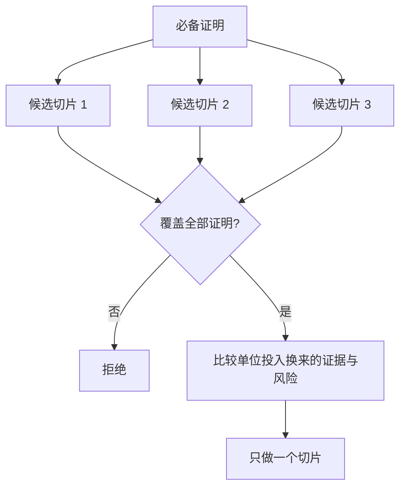

# 选能改变决策的最小切片

> "做小"只有在能证明要紧事情时才有价值——一个改变不了下一步决策的小构建，不是最小可行切片，只是没做完。

**类型：** 学习 + 动手实践
**语言：** Python（标准库）
**前置条件：** Phase 14 第 49 课
**预计用时：** 约 65 分钟

> **【中文解读】**
> 本课承接第 49 课的假设地图：先从风险最高的开放假设推出"必备证明集"，再拿它当过滤器筛候选切片，最后在通过过滤的切片里比"单位投入换来的证据"。关键翻转是：先定证明、再谈大小，而不是先做小的、再想它证明了什么。

> 🔗 **【前置】**
> 学本课前请先掌握：Phase 14 第 49 课（映射假设与风险——本课的"必备证明集"直接来自那里风险最高的开放假设）。本课产出的 `outputs/slice-decision.json` 会成为第 51 课规格文档的输入。

## 学习目标

- 用"切片能证明哪些假设"来定义切片
- 在结果价值、不确定性消减、投入和后果之间做权衡
- 优先选择可逆的证据，而不是过早的生产级承诺
- 拒绝那些恰好绕开工作流风险部分的切片

## 纵向切片意味着证据端到端

一个有用的切片要纵穿"能观察到一个结果"所需的最小真实工作流。它可以在用户、数据、时长、能力上收窄，但不能通过砍掉"你正要检验的那个不确定性"来收窄。

例子：

- 跨十次真实事故的只读回放，能检验服务识别和操作者信任。
- 基于合成数据的精美仪表盘或许能检验"看得懂"，却检验不了数据可行性。
- 生产环境的自动修复一次检验了所有东西，但后果不可接受。

> **【中文解读】**
> "纵向"的意思是端到端打通真实工作流：输入是真的、决策路径是真的、能观察到一个结果。收窄的方向只能是范围（多少人、多少数据、多长时间），不能是深度（把最难的那一步抽掉）。第二、三个例子是两个典型反面：合成数据砍掉了数据可行性，生产自动执行把后果拉满——都改变了切片"在证明什么"。

> 💡 **【类比】**
> 最小切片像楼盘开售前的样板间：可以只有一户、一种户型，但必须有真实的水电——如果样板间不通水电，它永远验证不了"住得下去"这个最要紧的问题，再精美也只是布景。

## 先定义必备证明

取出风险最高的开放假设，把它们变成一个"必备证明集"。候选切片只有覆盖这个集合，才有参评资格。

然后在有资格的切片之间比较：

| 维度 | 方向 |
|---|---|
| 结果价值（Outcome value） | 越大越好 |
| 消减的不确定性（Uncertainty reduced） | 越大越好 |
| 投入（Effort） | 越小越好 |
| 后果（Consequence） | 越小越好 |
| 可逆性（Reversibility） | 越大越好 |

实验代码的评分故意简单。资格门槛比算术更重要。



> **【中文解读】**
> 这里的顺序是本课的核心：资格门槛在前，评分算术在后。评分再高、只要缺一条必备证明就不参评——这防止了"便宜但啥也证明不了"的方案靠性价比钻空子。五个维度中，"后果更小"和"可逆性更大"最容易被忽略，而它们恰恰决定了实验失败时的止损成本。

## 常见的假最小切片

- **只有 UI 的最小：** 砍掉了数据和运维层面的不确定性。
- **只有基础设施的最小：** 证明了技术上做得到，却没证明用户价值。
- **只有正常路径的最小：** 漏掉了制造绝大部分风险的那个异常分支。
- **演示级最小：** 产出了有说服力的演示品，却没有可重复的测量。
- **平台级最小：** 在任何一条工作流证明价值之前就先造可复用的机器。

> **【中文解读】**
> 五种假最小各有各的诱惑：UI 最小出图快，基础设施最小对工程师胃口，演示最小最能打动领导。它们的共同点是系统性地绕开了真正的风险——而"最小"的意义恰恰是让风险早点暴露。自检方法只有一个：逐条对照必备证明集，看它到底证明了哪几条。

## 加一条停止规则

在动手实现之前，先写好"切片失败了会怎样"：

- 放弃这个结果（整个方向止损）；
- 更换目标用户或使用场景；
- 换一种机制再测；
- 先收集更好的证据；
- 把授权收得更窄。

如果每一种结果都通向"继续做下去"，那这个切片就不是实验。

> **【中文解读】**
> 停止规则是实验的"诚实检查"：一个所有结局都是"继续建"的切片，只是穿着实验外衣的既定计划。停止规则要在实现之前写下，因为等数据出来再定去留，团队几乎总会给已投入的工作找一条继续的理由（沉没成本谬误）。

## 动手实现

实验代码按必备证明过滤候选、给有资格的切片打分，并写出 `outputs/slice-decision.json`。

```bash
python3 code/main.py
python3 -m unittest discover code/tests -v
```

加一个只证明一条必备假设、但更便宜的候选。即使它的数值评分很高，也应该仍然没有参评资格。

> **【中文解读】**
> `score = (结果价值 + 不确定性消减) / (投入 + 后果 × 不可逆系数)` 只是排序工具；真正的守门员是集合包含检查 `required_proof <= set(item.proves)`。课后的破坏实验专门验证这一点：一个便宜但没有覆盖全部必备证明的候选，评分再高也进不了候选池——这正是"资格门槛高于算术"的代码化。

## 练习题

1. 为同一个结果设计三个不同后果等级的切片。
2. 在打分之前先写下必备证明集。
3. 砍掉一项能力，同时保住决定性的证据。
4. 为一次失败的试点补一条停止规则。
5. 指出一个应该等切片之后再做的可复用平台组件。

## 延伸阅读

- [Barry Boehm, A Spiral Model of Software Development and Enhancement](https://dl.acm.org/doi/10.1145/12944.12948)
  让每一轮开发循环对应它必须解决的风险——"切片大小跟随风险形状"的理论源头。
- [Lenarduzzi and Taibi, MVP Explained: A Systematic Mapping Study on the Definitions of Minimal Viable Product](https://arxiv.org/abs/1609.07592)
  梳理软件产品实践中"最小"与"可行"两个词的歧义——本课"假最小切片"清单的学术背景。

## 你保留的产出

保留 `outputs/slice-decision.json`。它记录了为什么这个切片是"能改变决策的最小切片"。
