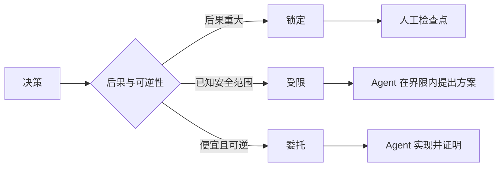

# 写保留判断力的规格

> 一份好的规格锁定"不变量与证据"，把可逆的实现选择留给执行者——它是决策边界，不是剧本。

**类型：** 学习 + 动手实践
**语言：** Python（标准库）
**前置条件：** Phase 14 第 50 课
**预计用时：** 约 75 分钟

> **【中文解读】**
> 本课回应 Agent 时代的一个真问题：任务写得太粗，Agent 只能瞎猜系统；写得太细，又把 Agent 退化为打字员，照抄一份可能本来就错的设计。出路是把规格写成六面的可执行契约，并用"锁定 / 受限 / 委托"三种模式显式声明每个决定归谁。

> 🔗 **【前置】**
> 学本课前请先掌握：Phase 14 第 50 课（选能改变决策的最小切片——本课规格服务的正是那个切片）和第 33 课（把指令写成可执行约束，instructions-as-constraints 的思想在这里扩展成完整规格）。本课产出的 `outputs/executable-specification.json` 是编码 Agent 与人类评审共享的契约。

## 学习目标

- 区分结果、不变量、示例、非目标和证明
- 把每个决定标注为锁定、受限或委托
- 在选择廉价且可逆的地方保留 Agent 的判断力
- 在后果重大或公开行为改变的地方强制人工检查点

## 两个糟糕的极端

规格不足的任务让 Agent 去猜系统；规格过度的任务让它照抄一份可能本来就错的设计。

有用的中间形态是一份可执行契约：

| 面 | 作用 |
|---|---|
| 结果（Outcome） | 可观察的结果 |
| 不变量（Invariants） | 任何时候都必须为真的条件 |
| 示例（Examples） | 揭示意图的具体用例 |
| 非目标（Non-goals） | 有意排除的相邻行为 |
| 决策政策（Decision policy） | 哪些选择是锁定、受限或委托的 |
| 证明（Proof） | 宣告完成前必需的证据 |

> **【中文解读】**
> 两个极端对应两种浪费：规格不足浪费在返工上（Agent 猜错了重做），规格过度浪费在翻译上（人把设计写成伪代码，Agent 再转抄成代码，中间没有增量智能）。六面契约是中间道路：结果说清"要什么"、不变量说清"任何时候不能破坏什么"、示例传递意图、非目标划定边界、决策政策声明授权、证明定义"做完"——每一面都给执行留了判断空间。

## 三种决策模式

- **锁定（Locked）：** Agent 不得自行选择。用于公开兼容性、权限、安全、不可逆成本或产品承诺。
- **受限（Bounded）：** Agent 可以在明确的界限内选择。用于搜索预算、重试次数、允许的依赖、已知的接口族。
- **委托（Delegated）：** Agent 拥有这个选择，但必须能解释它。用于局部结构、命名、可逆重构和实现细节。



> **【中文解读】**
> 三种模式的划分标准只有一个问题：后果与可逆性。后果大、不可逆 → 锁定并设人工检查点；后果可控但有安全范围 → 受限，Agent 在界内自由；便宜且可逆 → 委托，Agent 自己定但要解释。常见错误是两个方向同时犯：把命名风格这种小事锁死（浪费人的判断力），又把"能不能写生产库"这种大事默认委托（把产品风险交给运气）。

> 💡 **【类比】**
> 三种决策模式像装修合同的三类条款：承重墙和水电走向写死（locked——错了要出人命）；瓷砖预算限定区间、品牌任选（bounded——有安全范围）；房间内部怎么布置工人看着办（delegated——便宜可逆）。全锁死的合同没人接，全放开的合同是事故报告。

## 用示例定义行为

示例比形容词更能压缩意图。「有帮助」「健壮」「生产可用」都不可执行。一组覆盖正常、边界、失败和禁止场景的少量示例，给了构建者和验证者双方可以抓住的具体东西。

示例不能替代不变量。一个通过的用例证明不了一条普适的安全规则。

> **【中文解读】**
> 这节解决"形容词陷阱"：写「输出要干净」等于什么都没写，写「给一个带部署 ID 的告警应解析出服务负责人」才传递了意图。四类示例各有分工——正常的传意图、边界的传精度、失败的传韧性、禁止的传红线。但示例是实例不是规则：跑通一个用例不等于满足不变量，普适约束仍要靠不变量声明。

## 证明必须匹配断言

- 单元测试证明局部函数契约。
- 线上（wire）测试证明序列化与传输行为。
- 浏览器旅程证明一条界面路径。
- 回放集证明行为在代表性用例上的表现。
- 审计日志证明权限边界确实守住了。

不要接受用低层证据去支撑高层的断言。

> **【中文解读】**
> 每种证明各有其管辖范围：单元测试管函数，wire 测试管协议，浏览器旅程管界面，回放集管整体行为，审计日志管权限。证据错层是最常见的"假验收"——用一堆绿灯的单元测试去宣称"权限边界安全"，层级对不上，等于拿体温计证明血压正常。

## 有意保留未知

规格可以写「实现可以选择任何在时间预算内返回的只读数据源」。这不是含糊，而是一次有边、有证明的有意委托。

证据变化时规格也应演化。保留锁定与受限选择背后的理由，后来的团队才不用靠"考古"去修订它们。

> **【中文解读】**
> "有意保留未知"与"没想清楚"的区别在于边界和证明：前者写明了选择空间（任何只读源）、约束（时间预算）和验收（证明），后者什么都没写。另一条同样重要：每个 locked/bounded 决定都要留下理由——一年后约束过时了，团队能基于理由修订，而不是把旧决定当圣旨或贸然删除。

## 动手实现

实验代码校验契约的每个面、检查决策模式，并写出 `outputs/executable-specification.json`。

```bash
python3 code/main.py
python3 -m unittest discover code/tests -v
```

把"生产写入"这条决策从 locked 改成 delegated。解释为什么数据模式（schema）接受这个值，而产品风险不接受。

> **【中文解读】**
> 校验器的两条硬规则值得注意：六个面缺一不可，且非委托模式必须带理由——"没有理由的锁定"和"缺面的契约"都会被判 incomplete。课后的破坏实验是个好思考题：把生产写入改成 delegated 在语法上完全合法（这正是委托模式的用途），但产品风险决定了它属于该锁死的那一类——模式选择永远是风险判断，不是格式问题。

## 练习题

1. 把一张 backlog 工单转写成六个面的规格。
2. 把三条实现指令替换成一条不变量加两个示例。
3. 给每个决定标注模式，并为每个锁定或受限的选择给出理由。
4. 为每条不变量补一条对应的证明凭据。
5. 删掉一条既无证据也无风险理由支撑的约束。

## 延伸阅读

- [Nuseibeh and Easterbrook, Requirements Engineering: A Roadmap](https://www.cs.toronto.edu/~sme/papers/2000/ICSE2000.pdf)
  目标、精确规格、验证、共识与演化之间的关系——"规格要能演化"的理论背景。
- [Zave and Jackson, Four Dark Corners of Requirements Engineering](https://doi.org/10.1145/267895.267896)
  区分环境假设、需求与规格——本课"环境约束与系统承诺分开写"的出处。
- [Gotel and Finkelstein, An Analysis of the Requirements Traceability Problem](https://doi.org/10.1109/ICRE.1994.292398)
  需求可追溯性——"给每个锁定决定留理由"的经典依据。

## 你保留的产出

保留 `outputs/executable-specification.json`。它将成为编码 Agent 与人类评审共享的契约。
