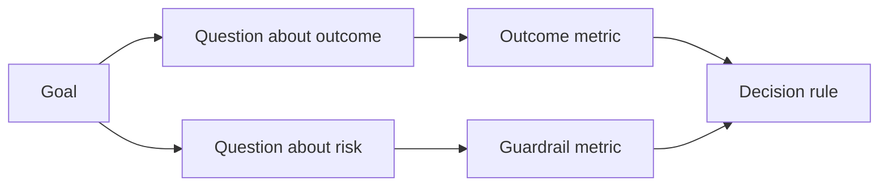

# Design Success Metrics Before the Result Exists | 结果出来前，先定成功指标

> Measurement should answer a decision, not decorate a dashboard. Start with the goal, derive questions, then choose the smallest metrics that answer them.

> **【中文解读】** 测量应当回答一个决策，而不是装点一块仪表盘。本课讲 GQM（目标—问题—指标）方法在 Agent 工程里的落地：从结果目标推出问题，从问题推出最小的一组指标，并在看到任何数据之前为每个指标签好"契约"——方向、阈值、窗口、来源、人群。顺序颠倒（先有数据再找解释）是所有"指标化妆术"的根源。

> 🔗 **【前置】** 学本课前请先掌握：Phase 14 第 47 课（成果先于产出——本课的"目标"从那里来）和第 51 课（写保留判断力的规格——规格里的"证明"面在这里展开成测量计划）。本课产出的 `outputs/measurement-report.json` 是第 53 课原型/试点/生产三档的证据闸门。

**Type:** Learn + Build | **类型:** 学习 + 动手实践
**Languages:** Python (stdlib) | **语言:** Python（标准库）
**Prerequisites:** Phase 14 lessons 47 and 51 | **前置知识:** Phase 14 第 47、51 课
**Time:** ~70 minutes | **时间:** 约 70 分钟

## Learning Objectives | 学习目标

- Derive questions and metrics from an outcome goal.
  中文翻译：从结果目标推导出问题和指标。
- Define thresholds, windows, sources, and directions before observing results.
  中文翻译：在观察结果之前定义阈值、窗口、来源和方向。
- Pair outcome metrics with guardrails and counter-metrics.
  中文翻译：给结果指标配上护栏指标和反指标。
- Match evaluation evidence to the decision the build must support.
  中文翻译：让评估证据与构建必须支撑的决策相匹配。

## Goal, Question, Metric | 目标、问题、指标

Start with a goal:

> 从一个目标开始：

> Reduce time to identify the affected service without increasing unsafe actions.
>
> 在不增加不安全操作的前提下，缩短定位受影响服务所需的时间。

Derive questions:

> 推导出问题：

- How quickly is the correct service identified?
  中文翻译：正确服务被定位得有多快？
- How often is the identified service correct?
  中文翻译：定位出的服务有多大概率是对的？
- Does diagnosis remain read-only?
  中文翻译：诊断过程是否保持只读？
- Does the workflow increase alert dismissal or operator workload?
  中文翻译：这个工作流是否增加了告警忽略率或操作者负担？

Then choose metrics that operationalize those questions.

> 然后选出能把这些问题变成可测数字的指标。



> **【中文解读】** GQM 的推导方向不可逆：目标 → 问题 → 指标。目标是决策语言（快而不险），问题是研究语言（多快？多准？只读吗？），指标才是数字语言（中位秒数、正确率、写次数）。跳过中间层直接从目标造指标，就会得到"平均响应时间"这种既不回答决策也不暴露风险的仪表盘装饰品。

## A Metric Needs a Contract | 指标需要一份契约

Every metric needs:

> 每个指标都需要：

| Field | Example |
|---|---|
| Name | `median_identification_seconds` |
| Direction | at most |
| Threshold | 120 |
| Window | ten incident replays |
| Source | replay event log |
| Population | on-call engineers in the pilot |
| Kind | outcome or guardrail |

Without source and window, a number cannot be reproduced. Without a threshold, it cannot drive a decision.

> 没有来源和窗口，一个数字无法复现；没有阈值，它无法驱动决策。

> **【中文解读】** 契约的七个字段回答四个问题：叫什么（Name）、朝哪边好（Direction）、多好算好（Threshold）、在哪测的（Window/Source/Population）、属于哪类（Kind）。缺"在哪测的"，同一数字换个环境就不可复现；缺"多好算好"，指标永远只会"看起来在变好"。这和第 51 课的规格契约同构——指标也是一份需要验收条款的规格。

> 💡 **【类比】** 指标契约像化验单上的参考区间：抽血前就已印好"尿酸 208-428 μmol/L"这种范围和条件。没有参考区间的化验单只是一串数字——你不知道 450 是该庆祝还是该挂号。阈值、窗口、来源就是指标的"参考区间 + 抽血条件"。

## Outcome, Guardrail, and Counter-Metric | 结果指标、护栏指标与反指标

- **Outcome metric:** did the desired state improve?
  中文翻译：**结果指标：** 期望的状态改善了吗？
- **Guardrail:** did a fixed constraint remain true?
  中文翻译：**护栏指标：** 固定约束是否仍然成立？
- **Counter-metric:** did the local improvement shift cost or harm elsewhere?
  中文翻译：**反指标：** 局部改善是否把成本或伤害转嫁到了别处？

For an incident workflow, speed is not enough. Correctness, production writes, operator workload, and missed alerts protect against a fast but unsafe result.

> 对事故工作流而言，只有速度是不够的。正确率、生产写入次数、操作者负担和漏报告警，防的是"快但不安全"的结果。

> **【中文解读】** 三种指标构成一个三角形：结果指标证明"变好了"，护栏指标守住"没变坏"（如生产写入恒为零），反指标盯住"坏处是不是被挪走了"（本团队快了，是不是把负担甩给了下游值班）。AI 系统最经典的反指标案例：客服机器人把"平均处理时长"优化到极低，同时"人工转接率"和"客户二次来电率"悄悄飙升。

## Offline and Online Evidence | 离线证据与在线证据

Offline replay is useful for repeatability and edge coverage. A bounded pilot is useful for real behavior, trust, and workflow effects. Neither substitutes for the other.

> 离线回放的价值在于可重复性和边界覆盖；有界试点的价值在于真实行为、信任和工作流效应。两者互不替代。

Use the cheapest evidence that can answer the current decision. Do not expose real users merely because the implementation is ready.

> 用能回答当前决策的最便宜证据。不要仅仅因为实现做完了，就把真实用户暴露进去。

> **【中文解读】** 离线/在线的取舍标准是"当前决策需要什么"，不是"实现进展到哪了"。回放集答"算法对不对"，试点答"人信不信、用不用"。最常见的错误是拿着离线指标去回答只有试点才能回答的问题（工程师"应该"会信任这个建议），或者反过来——功能一写完就急着上真实流量。

## Decide Before You Measure | 先定决策，再测数据

Write the pass, fail, and ambiguous paths before seeing results. Otherwise the team will move the threshold to protect the build.

> 在看到结果之前写好通过、失败和模糊三条路径。否则团队一定会为了保住这个构建而挪动阈值。

Example:

> 例子：

- pass: correct service rate at least 0.9 and median time at most 120 seconds;
  中文翻译：通过：正确服务率不低于 0.9 且中位耗时不超过 120 秒；
- fail: any production write or correct rate below 0.75;
  中文翻译：失败：出现任何生产写入，或正确率低于 0.75；
- ambiguous: small improvement with wide variance, requiring a larger replay set.
  中文翻译：模糊：改善幅度小且方差大，需要扩大回放集再测。

> **【中文解读】** "先定决策"是针对人性的防御工事：数据出来之后再定阈值，几乎每个人都会把阈值定在自家数据刚好通过的位置。预注册三条路径还有一个好处——"模糊"作为一等出口存在，团队就不必在"通过"和"失败"之间二选一，硬把噪声解读成胜利。

## Build It | 动手实现

The lab validates a measurement plan, evaluates inclusive thresholds, records missing values, and writes `outputs/measurement-report.json`.

> 实验代码校验一份测量计划、按含边界值的阈值求值、记录缺失值，并写出 `outputs/measurement-report.json`。

```bash
python3 code/main.py
python3 -m unittest discover code/tests -v
```

Remove the guardrail metric and observe why the plan becomes invalid even when the outcome metrics remain.

> 删掉护栏指标，观察为什么即使结果指标都在，整个计划也会被判为无效。

> **【中文解读】** 校验器的规则是本课的代码化：缺目标、缺问题、缺指标、缺结果类、缺护栏类、方向非法、缺来源或窗口——任何一条都会让 status 变成 invalid，后面的数值全部失去意义。尤其注意：护栏缺失不会让报告"少一项"，而是让整份计划作废——没有护栏的结果指标等于允许"快但不安全"地通过。

## Exercises | 练习

1. Derive three questions from one outcome goal.
   中文翻译：从一个结果目标推导出三个问题。
2. Add a counter-metric that catches cost shifted to another role.
   中文翻译：加一个能抓住"成本被转嫁给另一个角色"的反指标。
3. Define the source, population, and window for every metric.
   中文翻译：为每个指标定义来源、人群和窗口。
4. Write pass, fail, and ambiguous decisions before generating values.
   中文翻译：在生成数值之前写好通过、失败和模糊三条决策。
5. Identify one metric that is easy to collect but cannot change the decision. Remove it.
   中文翻译：找出一个容易采集但改变不了决策的指标，把它删掉。

## Further Reading | 延伸阅读

- [Basili, Software Modeling and Measurement: The Goal/Question/Metric Paradigm](https://drum.lib.umd.edu/items/8119803a-362b-42ec-b6ce-2311713e7236), for deriving operational measurements from explicit goals.
  中文翻译：Basili《软件建模与测量：GQM 范式》——从显式目标推导可操作测量。
- [Basili, Caldiera, and Rombach, The Goal Question Metric Approach](https://www.cs.toronto.edu/~sme/CSC444F/handouts/GQM-paper.pdf), for applying the method as a feedback and improvement system.
  中文翻译：Basili、Caldiera 与 Rombach《GQM 方法》——把该方法用作反馈与改进系统。

## What You Keep | 你保留的产出

Keep `outputs/measurement-report.json`. It defines the evidence gate for the prototype, pilot, or production stage.

> 保留 `outputs/measurement-report.json`。它定义了原型、试点或生产阶段的证据闸门。
