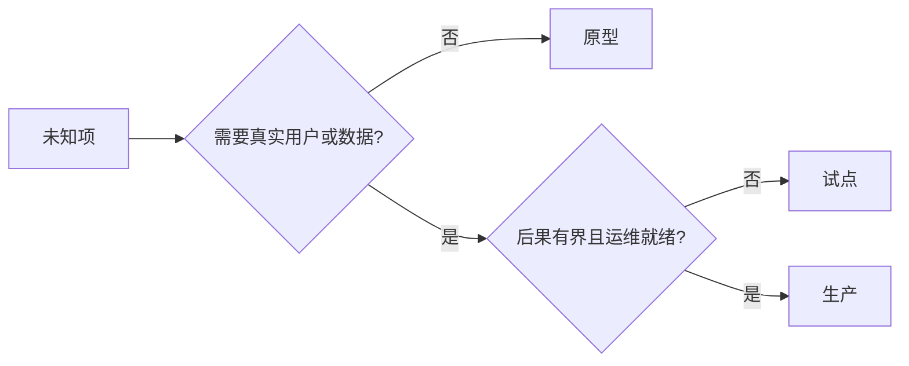

# 原型、试点还是生产：三档慎选

> 原型、试点、生产是三种不同的学习环境，不是打磨程度的三档。选出能以最小不必要后果回答当前未知的那一档。

**类型：** 学习 + 动手实践
**语言：** Python（标准库）
**前置条件：** Phase 14 第 50-52 课
**预计用时：** 约 70 分钟

> **【中文解读】**
> 本课把第 50-52 课的"切片、规格、指标"接上最后一环——环境控制：原型可以随时扔，试点必须有界且可回退，生产意味着组织接受了持续责任。最容易发生的事故不是选错了档，而是原型"悄悄地"变成了生产系统。

> 🔗 **【前置】**
> 学本课前请先掌握：Phase 14 第 50 课（最小切片——先确定要证明什么）、第 51 课（规格契约——控制与证明条款）和第 52 课（成功指标——每档的证据闸门）。本课产出的 `outputs/stage-decisions.json` 是第 54 课反馈棘轮的运营基线。

## 学习目标

- 根据未知项、受众、数据、后果和就绪度选择构建档位
- 定义档位专属的控制措施和退出标准
- 防止原型悄悄变成生产系统
- 把真实权限推迟到证据与运维能力都配得上它的时候

## 三个不同的问题

| 档位 | 首要问题 |
|---|---|
| 原型（Prototype） | 这个机制到底能不能产出证据？ |
| 试点（Pilot） | 在一群有界的真实受众和真实条件下，它安全吗？ |
| 生产（Production） | 我们能以承诺的可靠性和风险水平持续拥有它吗？ |

原型可以技术上百分百完成但仍然可弃。试点可以使用生产数据，同时在受众和权限上保持有界。生产始于组织接受持续责任的那一刻。

> **【中文解读】**
> 三档问的是三个不同的问题，对应三种不同的证据。技术完成度与档位无关——原型可以技术上百分百完成但仍然可弃；生产与部署无关——它始于组织接受持续责任的那一刻，而不是代码上线的那一刻。

## 原型

当未知项不需要真实用户或真实数据时，用原型。让它保持：

- 随时可扔；
- 隔离；
- 行为面窄；
- 把学习问题写明白；
- 不带任何虚假的运维保证。

在这个机制赢得下一个档位之前，不要优化架构。

> **【中文解读】**
> 原型的五条纪律里最硬的是"隔离"和"不带虚假运维保证"：隔离保证它失败时波及面为零；不承诺可用性则保证没人开始依赖它。最后一句是给工程师的清醒剂——机制本身还没证明价值时，花在架构打磨上的每一小时都是给一个可能要扔掉的东西镀金。

## 试点

当未知项需要真实行为、真实感的数据或真实工作流，但后果或就绪度还不兼容大范围发布时，用试点。

试点需要：

- 点名的人群；
- 一位人类负责人；
- 有界的时长与权限；
- 审计与回滚；
- 结果与护栏阈值（来自第 52 课）；
- 扩展、修订或停止的退出标准。

> **【中文解读】**
> 试点的定义性特征是"真实但有界"：用真实数据、真实人群，但受众点名、时长封顶、权限收窄。六项要求里"人类负责人"和"退出标准"最常被省略——没有负责人的试点出事时找不到人拍板回滚，没有退出标准的试点会默认无限续期，变成一个半永久的不明物体。

## 生产

生产需要的比部署多：

- 服务级别目标（SLO）；
- 值班与事故归属；
- 安全与隐私审查；
- 成本与容量控制；
- 回滚与恢复；
- 持续监控；
- 一条退役路径。



> **【中文解读】**
> 七项里最反直觉的是最后一项"退役路径"：进入生产之前就要写好它怎么退出。这不是悲观，而是承认每个系统都有生命周期——没有退役路径的系统最后都变成了"没人敢动也没人知道为什么在跑"的遗产。决策树的逻辑：不需要真实用户/数据 → 原型；需要但后果未收界或运维未就绪 → 试点；两者皆备 → 生产。

> 💡 **【类比】**
> 三档像学车的三个阶段：驾校模拟器（原型——撞了重开，零后果）、贴实习牌加老司机陪驾上路（试点——真实道路，但有界、有负责人、随时能接管）、独立跑高速（生产——独自承担全部责任，车还得年检、上保险）。最危险的不是新手，是开着模拟器以为自己在跑高速的人。

## 阶段漂移

当原型代码在没有获得归属的情况下获得了用户、数据或权限，它就变得危险。把原型与试点的边界写进配置、访问控制、遥测和文档。一个警告横幅是不够的。

档位应当能从系统本身被观察出来。

> **【中文解读】**
> 阶段漂移（stage drift）是最常见的静默事故："临时跑一下"的原型脚本接入了真实流量，三个月后它成了没人敢重启的关键路径。防御必须落在技术控制上——配置里的开关、访问控制里的权限、遥测里的标记——而不是 UI 横幅或口头约定。判断标准很简单：一个新来的工程师能不能不问任何人就看出"这是原型"。

## 动手实现

实验代码从决策上下文选出档位、返回必需的控制清单，并写出 `outputs/stage-decisions.json`。

```bash
python3 code/main.py
python3 -m unittest discover code/tests -v
```

把试点那个例子改成低后果且运维就绪。解释还需要哪些额外证据才能支撑上生产。

> **【中文解读】**
> `choose_stage` 的三条分支就是决策树的代码化：不需要真实用户/数据 → prototype；运维未就绪、后果 ≥4 或不可逆 → pilot；其余 → production。课后实验的答案不在代码里：就算判定落到 production，仍然缺证据——比如按 SLO 跑一段时间的实际表现、安全审查通过、值班机制建立。档位判定给的是"最低档约束"，不是"通行证"。

## 练习题

1. 按学习阶段（而非部署状态）给你手头的三个项目分类。
2. 为试点写包含"停止"决策的退出标准。
3. 加一条技术控制，阻止原型碰到生产数据。
4. 指出第一个"接下它，构建就成了生产"的运营责任。
5. 为有界试点设计一份回滚凭据。

## 延伸阅读

- [Barry Boehm, A Spiral Model of Software Development and Enhancement](https://dl.acm.org/doi/10.1145/12944.12948)
  让每一轮迭代的承诺与已解决的风险相匹配——"档位跟随不确定性"的理论根基。
- [Fagerholm et al., Building Blocks for Continuous Experimentation](https://doi.org/10.1145/2601248.2601276)
  持续开展实验所需的组织与技术条件——试点要能连续跑，靠的是基础设施而不只是意愿。

## 你保留的产出

保留 `outputs/stage-decisions.json`。它记录了每个档位为何成立，以及进入下一档之前必须存在哪些控制。
