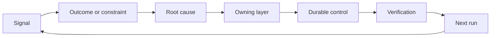

# Build a Feedback Ratchet with Ownership and Retirement | 反馈棘轮：改进有主，控制可退役

> Shipping closes one build loop and opens the learning loop. Evidence must change the system or it becomes telemetry nobody owns.

> **【中文解读】** 发布关上一个构建循环，同时打开学习循环。证据必须改变系统，否则它就变成没人认领的遥测数据。本课是 Agent 工程方法论系列（Phase 14 · 43-54）的收官：把事故、评估、用户行为和纠正变成"有主人、有验证、有退役条件"的棘轮动作，让系统只朝变好的方向一格一格锁死，且旧控制能被有序撤除。43-53 课解决"怎么把事做对"，本课解决"怎么让下一次做得更对"。

> 🔗 **【前置】** 学本课前请先掌握：Phase 14 第 46 课（把每次纠正变成系统改进——本课把那套机制扩展到产品与运营信号）和第 53 课（原型/试点/生产三档——试点的审计与监控正是本课信号的来源）。本课是"产品判断与交付"路径的收尾工件，也是下一个结果框架的输入。

**Type:** Learn + Build | **类型:** 学习 + 动手实践
**Languages:** Python (stdlib) | **语言:** Python（标准库）
**Prerequisites:** Phase 14 lessons 46 and 53 | **前置知识:** Phase 14 第 46、53 课
**Time:** ~75 minutes | **时间:** 约 75 分钟

## Learning Objectives | 学习目标

- Turn incidents, evaluations, user behavior, and corrections into owned actions.
  中文翻译：把事故、评估、用户行为和纠正转化为有主人的行动。
- Route each signal to context, evaluation, policy, runtime, or backlog.
  中文翻译：把每类信号路由到上下文、评估、策略、运行时或待办列表。
- Prioritize recurrence by severity and frequency.
  中文翻译：按严重程度与复发频率排优先级。
- Give every control a retirement condition.
  中文翻译：给每个控制措施配一条退役条件。

## Feedback Is Infrastructure | 反馈是基础设施

A team can collect traces, evaluations, support tickets, and incident logs without learning from any of them. The missing mechanism is promotion: a defined path from observation to a durable change with an owner and proof.

> 一个团队可以收齐 trace、评估、工单和事故日志，却从任何一条里都学不到东西。缺的机制是"晋升"（promotion）：一条从观察通往持久变更的明确路径，且变更带主人和证明。

The loop is:

> 这个循环是：

1. observe a concrete signal;
   中文翻译：观察到一个具体信号；
2. connect it to an outcome, constraint, or assumption;
   中文翻译：把它关联到某个结果、约束或假设；
3. identify the earliest system layer that owns the cause;
   中文翻译：找到"拥有这个根因"的最早系统层；
4. create a bounded change;
   中文翻译：创建一个有边界的变更；
5. verify that recurrence becomes less likely;
   中文翻译：验证复发概率确实降低了；
6. review whether the control should remain.
   中文翻译：复核这个控制是否还应保留。

> **【中文解读】** "反馈是基础设施"的意思是：学习不靠态度靠机制。可观测性、评估、工单系统只是原材料的管道，真正的设施是那条六步晋升路径——尤其是第 5、6 步，它们在大多数团队的工作流里根本不存在：改完不验证复发率，装完永不复核。没有这两步，"复盘"只是一次集体情绪活动。

## Route to the Owning Layer | 路由到负责的层

| Signal | Destination |
|---|---|
| False positive, regression, wrong result | Evaluation or test |
| Missing context, duplicate work, stale fact | Context source or retrieval route |
| Unsafe action or authority gap | Policy or permission boundary |
| Timeout, retry storm, unavailable dependency | Runtime control |
| New product need or unresolved tradeoff | Shaped backlog item |

Fix the cause at the earliest effective layer. Do not add another prompt paragraph when a test or permission can make the failure impossible.

> 在最早生效的那一层修根因。当一条测试或一个权限就能让某种失败变成不可能时，不要再往 prompt 里加一段话。



> **【中文解读】** 路由表把"什么信号去哪"变成了查表操作：错误结果去评估、缺上下文去检索、越权去策略、超时去运行时、新产品诉求去待办。核心纪律是"最早有效层"——prompt 是最贵的修复位置（每轮都占上下文、随模型变化），测试和权限是最便宜的位置（一次写入、永久生效）。大多数"我们再优化一下提示词"的讨论，其实应该发生在别的层。

## Ownership Is Part of the Control | 归属是控制的一部分

Every ratchet action needs:

> 每个棘轮动作都需要：

- one owner;
  中文翻译：恰好一个主人；
- a priority based on consequence and recurrence;
  中文翻译：基于后果与复发频率的优先级；
- the artifact to change;
  中文翻译：要改的那个工件；
- the verification that proves the change;
  中文翻译：证明该变更生效的验证；
- a review or expiry window;
  中文翻译：一个复核或到期窗口；
- a retirement condition.
  中文翻译：一条退役条件。

An unowned improvement is an observation with better formatting.

> 没有主人的改进，只是一条排版更好看的观察记录。

> **【中文解读】** 六个字段里"恰好一个主人"和"退役条件"构成棘轮的两个单向齿：主人保证变更真的落地（观察→行动），退役条件保证控制不会无限堆积（行动→清理）。最后那句话值得贴在工单系统门口——把"建议改成 X"写得更漂亮并不会让它发生，署上一个名字和一条验证命令才会。

## Retire Stale Controls | 退役过时的控制

Feedback systems accumulate policy. That policy can become contradictory and expensive. Review controls when:

> 反馈系统会积累策略，而这些策略可能变得相互矛盾、代价高昂。在以下时机复核控制：

- architecture or workflow changes;
  中文翻译：架构或工作流发生变化；
- a lower-level invariant replaces a higher-level instruction;
  中文翻译：某个更低层的不变量取代了更高层的指令；
- the protected failure has not appeared across the chosen window;
  中文翻译：被防护的失败在整个观察窗口内一次都没出现；
- the control blocks legitimate work more often than it prevents harm.
  中文翻译：这个控制妨碍正常工作的次数多过它挡住伤害的次数。

Retirement also needs evidence. Do not delete a control because it feels old.

> 退役同样需要证据。不要因为"感觉它过时了"就删掉一个控制。

> **【中文解读】** 这节是给"棘轮"装回松扣：只进不退的棘轮最终会把机器锁死。四个复核信号里第四个最实用——当一条控制拦下的合规请求远多于拦下的风险，它就从保险变成了税。但退役也要讲证据：窗口内零复发≠永远不会复发，删除前先确认防护已由更低层的不变量接管。棘轮的完整定义是"该锁时锁死，该放时松开"。

## Connect Build and Coding-Agent Feedback | 打通构建反馈与编码 Agent 反馈

The same ratchet serves both tracks:

> 同一个棘轮服务两条轨道：

- Product evidence changes the outcome frame, assumptions, slice, or measurement plan.
  中文翻译：产品证据改变结果框架、假设、切片或测量计划。
- Coding-agent corrections change tests, context, scope, automation, or handoff.
  中文翻译：编码 Agent 的纠正改变测试、上下文、范围、自动化或交接。
- Incidents can change both the product boundary and the agent workbench.
  中文翻译：事故既可以改变产品边界，也可以改变 Agent 工作台。

This is why shaping the build is not a phase that ends before coding. It continues through every accepted change.

> 这就是为什么"为构建塑形"不是一个在编码开始前就结束的阶段——它贯穿每一次被接受的变更。

> **【中文解读】** 这节把 43-54 系列闭成环：第 43 课的任务框架假设（"工程师会信任这个建议"）被试点的真实证据推翻时，改的不只是代码，还有下一个任务框架本身。产品轨道与 Agent 轨道共用一套棘轮，事故同时给两边上齿。方法论不是瀑布前置的文档工作，而是随每次变更持续运转的活机制。

## Build It | 动手实现

The lab classifies signals, creates owned ratchet actions, prioritizes them, and writes `outputs/feedback-backlog.json`.

> 实验代码给信号分类、创建有主人的棘轮动作、排好优先级，并写出 `outputs/feedback-backlog.json`。

```bash
python3 code/main.py
python3 -m unittest discover code/tests -v
```

Add a runtime timeout signal and confirm that it routes to the runtime rather than the general backlog.

> 加一条运行时超时信号，确认它被路由到 runtime 而不是进入通用待办。

> **【中文解读】** `destination()` 用关键词匹配演示路由表的思想（真实系统可以换成分类器或人工分诊），`promote()` 则把六字段动作具象化：优先级 = 严重度 × 频率，每个目的地绑定固定的持久工件（如 `evaluations/regression-suite.json`）、固定的验证证据和带天数的退役条件。注意 `expires_after_days` 的含义不是"到期自动删除"，而是"到期必须复核"——退役要证据，复核是证据的入口。

## Exercises | 练习

1. Turn one incident and one user complaint into ratchet actions.
   中文翻译：把一次事故和一条用户投诉转写成棘轮动作。
2. Name the earliest layer that can prevent each recurrence.
   中文翻译：指出能阻止每次复发的最早层。
3. Add verification commands or observations to the lab output.
   中文翻译：给实验输出补上验证命令或观察。
4. Define a retirement condition for a policy rule.
   中文翻译：为一条策略规则定义退役条件。
5. Trace one accepted correction back into the next task frame.
   中文翻译：把一条被接受的纠正追溯到下一个任务框架里去。

## Further Reading | 延伸阅读

- [Basili, Caldiera, and Rombach, The Goal Question Metric Approach](https://www.cs.toronto.edu/~sme/CSC444F/handouts/GQM-paper.pdf), for organizational learning through goal-oriented measurement.
  中文翻译：Basili、Caldiera 与 Rombach《GQM 方法》——通过目标导向的测量实现组织学习。
- [Fagerholm et al., Building Blocks for Continuous Experimentation](https://doi.org/10.1145/2601248.2601276), for the technical and organizational loop that connects evidence to continued product development.
  中文翻译：Fagerholm 等《持续实验的构建块》——把证据接回持续产品开发的技术与组织循环。
- [Nuseibeh and Easterbrook, Requirements Engineering: A Roadmap](https://www.cs.toronto.edu/~sme/papers/2000/ICSE2000.pdf), for treating requirements as evolving through the system lifecycle.
  中文翻译：Nuseibeh 与 Easterbrook《需求工程：路线图》——把需求视为在系统生命周期中持续演化。

## What You Keep | 你保留的产出

Keep `outputs/feedback-backlog.json`. It is the closing artifact of the Product Judgment and Delivery path and the input to the next outcome frame.

> 保留 `outputs/feedback-backlog.json`。它是"产品判断与交付"路径的收尾工件，也是下一个结果框架的输入。
