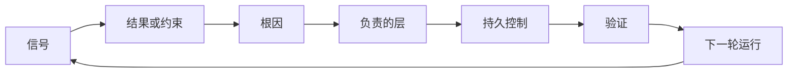

# 反馈棘轮：改进有主，控制可退役

> 发布关上一个构建循环，同时打开学习循环。证据必须改变系统，否则它就变成没人认领的遥测数据。

**类型：** 学习 + 动手实践
**语言：** Python（标准库）
**前置条件：** Phase 14 第 46、53 课
**预计用时：** 约 75 分钟

> **【中文解读】**
> 本课是 Agent 工程方法论系列（Phase 14 · 43-54）的收官：把事故、评估、用户行为和纠正变成"有主人、有验证、有退役条件"的棘轮动作，让系统只朝变好的方向一格一格锁死，且旧控制能被有序撤除。43-53 课解决"怎么把事做对"，本课解决"怎么让下一次做得更对"。

> 🔗 **【前置】**
> 学本课前请先掌握：Phase 14 第 46 课（把每次纠正变成系统改进——本课把那套机制扩展到产品与运营信号）和第 53 课（原型/试点/生产三档——试点的审计与监控正是本课信号的来源）。本课是"产品判断与交付"路径的收尾工件，也是下一个结果框架的输入。

## 学习目标

- 把事故、评估、用户行为和纠正转化为有主人的行动
- 把每类信号路由到上下文、评估、策略、运行时或待办列表
- 按严重程度与复发频率排优先级
- 给每个控制措施配一条退役条件

## 反馈是基础设施

一个团队可以收齐 trace、评估、工单和事故日志，却从任何一条里都学不到东西。缺的机制是"晋升"（promotion）：一条从观察通往持久变更的明确路径，且变更带主人和证明。

这个循环是：

1. 观察到一个具体信号；
2. 把它关联到某个结果、约束或假设；
3. 找到"拥有这个根因"的最早系统层；
4. 创建一个有边界的变更；
5. 验证复发概率确实降低了；
6. 复核这个控制是否还应保留。

> **【中文解读】**
> "反馈是基础设施"的意思是：学习不靠态度靠机制。可观测性、评估、工单系统只是原材料的管道，真正的设施是那条六步晋升路径——尤其是第 5、6 步，它们在大多数团队的工作流里根本不存在：改完不验证复发率，装完永不复核。没有这两步，"复盘"只是一次集体情绪活动。

## 路由到负责的层

| 信号 | 目的地 |
|---|---|
| 误报、回归、错误结果 | 评估或测试 |
| 缺上下文、重复劳动、过期事实 | 上下文源或检索路径 |
| 不安全操作或权限缺口 | 策略或权限边界 |
| 超时、重试风暴、依赖不可用 | 运行时控制 |
| 新产品诉求或未解的权衡 | 塑形后的待办项 |

在最早生效的那一层修根因。当一条测试或一个权限就能让某种失败变成不可能时，不要再往 prompt 里加一段话。



> **【中文解读】**
> 路由表把"什么信号去哪"变成了查表操作：错误结果去评估、缺上下文去检索、越权去策略、超时去运行时、新产品诉求去待办。核心纪律是"最早有效层"——prompt 是最贵的修复位置（每轮都占上下文、随模型变化），测试和权限是最便宜的位置（一次写入、永久生效）。大多数"我们再优化一下提示词"的讨论，其实应该发生在别的层。

## 归属是控制的一部分

每个棘轮动作都需要：

- 恰好一个主人；
- 基于后果与复发频率的优先级；
- 要改的那个工件；
- 证明该变更生效的验证；
- 一个复核或到期窗口；
- 一条退役条件。

没有主人的改进，只是一条排版更好看的观察记录。

> **【中文解读】**
> 六个字段里"恰好一个主人"和"退役条件"构成棘轮的两个单向齿：主人保证变更真的落地（观察→行动），退役条件保证控制不会无限堆积（行动→清理）。最后那句话值得贴在工单系统门口——把"建议改成 X"写得更漂亮并不会让它发生，署上一个名字和一条验证命令才会。

## 退役过时的控制

反馈系统会积累策略，而这些策略可能变得相互矛盾、代价高昂。在以下时机复核控制：

- 架构或工作流发生变化；
- 某个更低层的不变量取代了更高层的指令；
- 被防护的失败在整个观察窗口内一次都没出现；
- 这个控制妨碍正常工作的次数多过它挡住伤害的次数。

退役同样需要证据。不要因为"感觉它过时了"就删掉一个控制。

> **【中文解读】**
> 这节是给"棘轮"装回松扣：只进不退的棘轮最终会把机器锁死。四个复核信号里第四个最实用——当一条控制拦下的合规请求远多于拦下的风险，它就从保险变成了税。但退役也要讲证据：窗口内零复发不等于永远不会复发，删除前先确认防护已由更低层的不变量接管。棘轮的完整定义是"该锁时锁死，该放时松开"。

## 打通构建反馈与编码 Agent 反馈

同一个棘轮服务两条轨道：

- 产品证据改变结果框架、假设、切片或测量计划。
- 编码 Agent 的纠正改变测试、上下文、范围、自动化或交接。
- 事故既可以改变产品边界，也可以改变 Agent 工作台。

这就是为什么"为构建塑形"不是一个在编码开始前就结束的阶段——它贯穿每一次被接受的变更。

> **【中文解读】**
> 这节把 43-54 系列闭成环：第 43 课的任务框架假设（"工程师会信任这个建议"）被试点的真实证据推翻时，改的不只是代码，还有下一个任务框架本身。产品轨道与 Agent 轨道共用一套棘轮，事故同时给两边上齿。方法论不是瀑布前置的文档工作，而是随每次变更持续运转的活机制。

## 动手实现

实验代码给信号分类、创建有主人的棘轮动作、排好优先级，并写出 `outputs/feedback-backlog.json`。

```bash
python3 code/main.py
python3 -m unittest discover code/tests -v
```

加一条运行时超时信号，确认它被路由到 runtime 而不是进入通用待办。

> **【中文解读】**
> `destination()` 用关键词匹配演示路由表的思想（真实系统可以换成分类器或人工分诊），`promote()` 则把六字段动作具象化：优先级 = 严重度 × 频率，每个目的地绑定固定的持久工件（如 `evaluations/regression-suite.json`）、固定的验证证据和带天数的退役条件。注意 `expires_after_days` 的含义不是"到期自动删除"，而是"到期必须复核"——退役要证据，复核是证据的入口。

## 练习题

1. 把一次事故和一条用户投诉转写成棘轮动作。
2. 指出能阻止每次复发的最早层。
3. 给实验输出补上验证命令或观察。
4. 为一条策略规则定义退役条件。
5. 把一条被接受的纠正追溯到下一个任务框架里去。

## 延伸阅读

- [Basili, Caldiera, and Rombach, The Goal Question Metric Approach](https://www.cs.toronto.edu/~sme/CSC444F/handouts/GQM-paper.pdf)
  通过目标导向的测量实现组织学习——反馈棘轮的"验证"齿来自 GQM。
- [Fagerholm et al., Building Blocks for Continuous Experimentation](https://doi.org/10.1145/2601248.2601276)
  把证据接回持续产品开发的技术与组织循环——"反馈是基础设施"的实证版本。
- [Nuseibeh and Easterbrook, Requirements Engineering: A Roadmap](https://www.cs.toronto.edu/~sme/papers/2000/ICSE2000.pdf)
  把需求视为在系统生命周期中持续演化——结果框架随证据更新的理论依据。

## 你保留的产出

保留 `outputs/feedback-backlog.json`。它是"产品判断与交付"路径的收尾工件，也是下一个结果框架的输入。
