# Communication Protocols | 通信 协议

> Agents that can't speak the same language aren't a team. They're strangers shouting into the void.

> **【中文解读】** 本节介绍了多 Agent 通信协议——Agent 间交换信息的标准化方式。

> **【拓展：communication protocols→具体应用】** 现代多 Agent 通信协议的三个层次：(1) 传输层——A2A (HTTP+JSON)、MCP (JSON-RPC)、gRPC；(2) 语义层——Agent Card 描述能力，任务描述意图；(3) 协调层——发言者选择、投票、协商。2026 年的实践表明，通信协议的选择主要取决于延迟要求和是否需要跨组织协作。


**Type:** Build | **类型:** 构建
**Languages:** TypeScript | **语言:** TypeScript
**Prerequisites:** Phase 14 (Agent Engineering), Lesson 16.01 (Why Multi-Agent) | **前置知识:** Phase 14 (Agent 工程), Lesson 16.01 (为什么需要多 Agent)
**Time:** ~120 minutes | **时间:** ~120 分钟

## Learning Objectives | 学习目标

- Implement MCP tool discovery and invocation so agents can use tools exposed by external servers
  中文翻译：实现 MCP 工具发现和调用，使 Agent 能够使用外部服务器暴露的工具
- Build an A2A agent card and task endpoint that allows one agent to delegate work to another over HTTP
  中文翻译：构建 A2A Agent 卡片和任务端点，允许一个 Agent 通过 HTTP 向另一个 Agent 委派工作
- Compare MCP (tool access), A2A (agent-to-agent), ACP (enterprise audit), and ANP (decentralized trust) and explain which protocol solves which problem
  中文翻译：比较 MCP（工具访问）、A2A（Agent 对 Agent）、ACP（企业审计）和 ANP（去中心化信任），解释哪个协议解决哪个问题
- Wire multiple protocols together in a single system where agents discover tools via MCP and delegate tasks via A2A
  中文翻译：在单一系统中连接多个协议，Agent 通过 MCP 发现工具并通过 A2A 委派任务

## The Problem | 问题引入

You split your system into multiple agents. A researcher, a coder, a reviewer. They're great at their individual jobs. But now you need them to actually talk to each other.

> 你将系统拆分为多个 Agent：一个研究员、一个编码器、一个审阅者。它们在各自的任务上表现出色。但现在你需要它们真正地相互对话。

Your first attempt is obvious: pass strings around. The researcher returns a blob of text, the coder parses it however it can. It works until the coder misinterprets a research summary, or two agents deadlock waiting for each other, or you need agents built by different teams to collaborate. Suddenly "just pass strings" falls apart.

> 你的第一次尝试很明显：传递字符串。研究员返回一文本块，编码器尽其所能地解析它。这在编码器误解研究摘要、两个 Agent 互相等待死锁、或者你需要不同团队构建的 Agent 协作之前是可行的。突然之间"只传字符串"就不行了。

This is the communication protocol problem. Without a shared contract for how agents exchange information, multi-agent systems are fragile, unauditable, and impossible to scale beyond a handful of agents you personally wrote.

> 这就是通信协议问题。没有 Agent 交换信息的共享契约，多 Agent 系统是脆弱的、不可审计的，并且无法扩展到你亲自编写的少数 Agent 之外。

The AI ecosystem has responded with four protocols, each solving a different slice of the problem:

- **MCP** for tool access
  中文翻译：**MCP** 用于工具访问
- **A2A** for agent-to-agent collaboration
  中文翻译：**A2A** 用于 Agent 间协作
- **ACP** for enterprise auditability
  中文翻译：**ACP** 用于企业可审计性
- **ANP** for decentralized identity and trust
  中文翻译：**ANP** 用于去中心化身份和信任

This lesson goes deep. You will read real wire formats from each spec, build working implementations, and connect all four into a unified system.

> 本课深入讲解。你将阅读每个规范的真实线格式，构建可运行的实现，并将所有四个协议连接到一个统一的系统中。

## The Concept | 核心概念

### The Protocol Landscape

Think of these four protocols as layers, each addressing a different question:

> 将这四个协议视为不同层次，每个解决不同的问题：

```mermaid
block-beta
  columns 1
  block:ANP["ANP — How do agents trust strangers?\nDecentralized identity (DID), E2EE, meta-protocol"]
  end
  block:A2A["A2A — How do agents collaborate on goals?\nAgent Cards, task lifecycle, streaming, negotiation"]
  end
  block:ACP["ACP — How do agents talk in auditable systems?\nRuns, trajectory metadata, session continuity"]
  end
  block:MCP["MCP — How does an agent use a tool?\nTool discovery, execution, context sharing"]
  end

  style ANP fill:#f3e8ff,stroke:#7c3aed
  style A2A fill:#dbeafe,stroke:#2563eb
  style ACP fill:#fef3c7,stroke:#d97706
  style MCP fill:#d1fae5,stroke:#059669
```

They're not competitors. They solve different problems at different levels.

> 它们不是竞争关系。它们在不同层次上解决不同的问题。

A real production system uses multiple protocols together: MCP for tools inside your org, A2A for agent collaboration, ACP-style trajectory logging for compliance, ANP for cross-org identity. Picking one and forcing everything through it produces a worse system than mixing them by concern.

> 真正的生产系统组合使用多个协议：MCP 用于组织内工具、A2A 用于 Agent 协作、ACP 风格的轨迹日志用于合规、ANP 用于跨组织身份。选择一个并强制一切通过它会产生比按关注点混合更糟糕的系统。

### MCP (Recap)

MCP is covered in depth in Phase 13. Quick recap: MCP standardizes how an LLM connects to external tools and data sources. It's a **client-server** protocol where the agent (client) discovers and calls tools exposed by a server.

> MCP 在 Phase 13 中有深入讲解。快速回顾：MCP 标准化了 LLM 连接到外部工具和数据源的方式。它是一个**客户端-服务器**协议，Agent（客户端）发现并调用服务器暴露的工具。

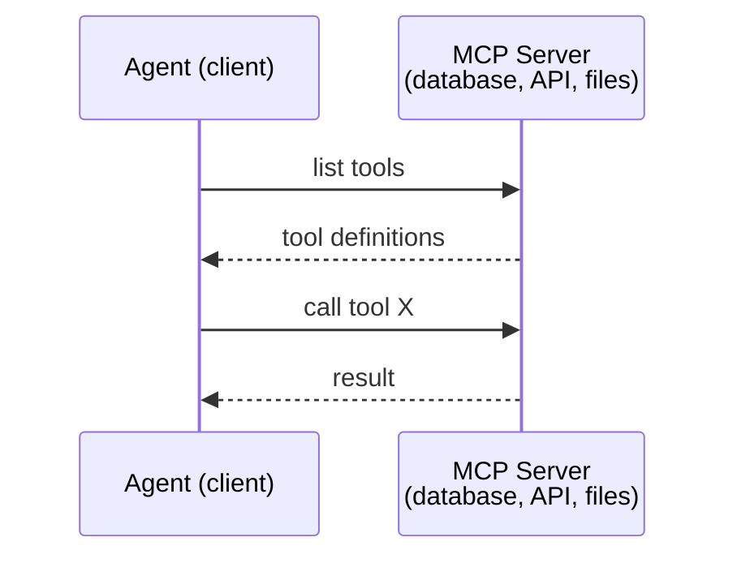

MCP is **agent-to-tool** communication. It doesn't help agents talk to each other.

> MCP 是**Agent 到工具**的通信。它不能帮助 Agent 之间互相通信。

The vertical/horizontal split is clean: MCP is the vertical wire (agent reaches down to tools/data); A2A is the horizontal wire (agent reaches across to peer agents). Production systems need both.

> 垂直/水平分离清晰：MCP 是垂直线（Agent 向下到达工具/数据）；A2A 是水平线（Agent 横向到达对等 Agent）。生产系统需要两者。

### A2A (Agent2Agent Protocol)

**Created by:** Google (now under Linux Foundation as `lf.a2a.v1`)
**Spec version:** 1.0.0
**Problem:** How do autonomous agents collaborate, negotiate, and delegate tasks to each other?

> **创建者：** Google（现由 Linux Foundation 管理为 `lf.a2a.v1`）
> **规范版本：** 1.0.0
> **问题：** 自主 Agent 如何协作、协商和相互委派任务？

A2A is the protocol for **peer-to-peer agent collaboration**. Where MCP connects an agent to tools, A2A connects an agent to other agents. Each agent publishes an **Agent Card** at a well-known URL, and other agents discover, negotiate with, and delegate tasks to it.

> A2A 是**点对点 Agent 协作**的协议。MCP 连接 Agent 到工具，A2A 连接 Agent 到其他 Agent。每个 Agent 在已知 URL 发布一个 **Agent 卡片**，其他 Agent 可以发现、协商和向其委派任务。

#### How A2A Works

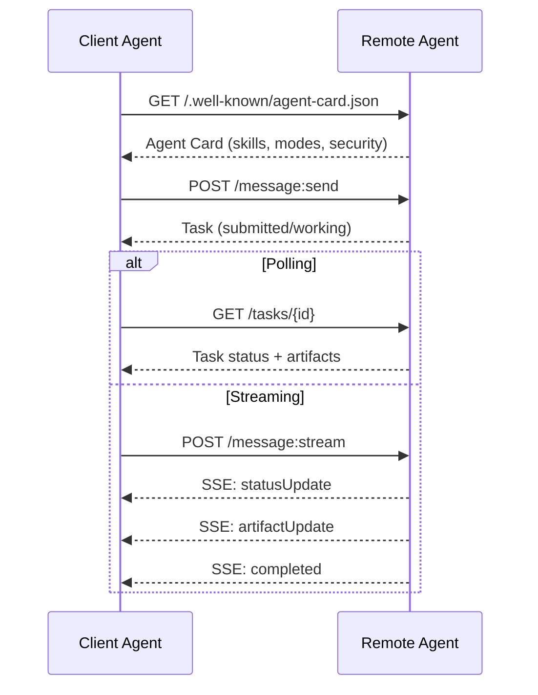

#### The Real Agent Card

This is what an A2A Agent Card actually looks like in the wild. Served at `GET /.well-known/agent-card.json`:

```json
{
  "name": "Research Agent",
  "description": "Searches documentation and summarizes findings",
  "version": "1.0.0",
  "supportedInterfaces": [
    {
      "url": "https://research-agent.example.com/a2a/v1",
      "protocolBinding": "JSONRPC",
      "protocolVersion": "1.0"
    },
    {
      "url": "https://research-agent.example.com/a2a/rest",
      "protocolBinding": "HTTP+JSON",
      "protocolVersion": "1.0"
    }
  ],
  "provider": {
    "organization": "Your Company",
    "url": "https://example.com"
  },
  "capabilities": {
    "streaming": true,
    "pushNotifications": false
  },
  "defaultInputModes": ["text/plain", "application/json"],
  "defaultOutputModes": ["text/plain", "application/json"],
  "skills": [
    {
      "id": "web-research",
      "name": "Web Research",
      "description": "Searches the web and synthesizes findings",
      "tags": ["research", "search", "summarization"],
      "examples": ["Research the latest changes in React 19"]
    },
    {
      "id": "doc-analysis",
      "name": "Documentation Analysis",
      "description": "Reads and analyzes technical documentation",
      "tags": ["docs", "analysis"],
      "inputModes": ["text/plain", "application/pdf"],
      "outputModes": ["application/json"]
    }
  ],
  "securitySchemes": {
    "bearer": {
      "httpAuthSecurityScheme": {
        "scheme": "Bearer",
        "bearerFormat": "JWT"
      }
    }
  },
  "security": [{ "bearer": [] }]
}
```

Key things to notice:
- **Skills** are what an agent can do. Each has an ID, tags, and supported input/output MIME types. This is how a client agent decides whether this remote agent can handle its request.
  中文翻译：**技能**是 Agent 能做的事情。每个都有 ID、标签和支持的输入/输出 MIME 类型。客户端 Agent 由此决定远程 Agent 是否能处理其请求。
- **supportedInterfaces** lists multiple protocol bindings. A single agent can speak JSON-RPC, REST, and gRPC simultaneously.
  中文翻译：**supportedInterfaces** 列出多个协议绑定。单个 Agent 可以同时使用 JSON-RPC、REST 和 gRPC。
- **Security** is built into the card. The client knows what auth it needs before making a single request.
  中文翻译：**安全性**内置于卡片中。客户端在发出单个请求之前就知道需要什么认证。

#### Task Lifecycle

Tasks are the core unit of work in A2A. They move through defined states:

> 任务是 A2A 中的核心工作单元。它们在定义的状态之间转换：

The state machine is what makes A2A different from a simple RPC. A task can pause (input-required), resume (client provides input), fail, or be canceled. The client does not need to block; it polls or subscribes for updates.

> 状态机是 A2A 与简单 RPC 的不同之处。任务可以暂停（input-required）、恢复（客户端提供输入）、失败或取消。客户端不需要阻塞；它轮询或订阅更新。

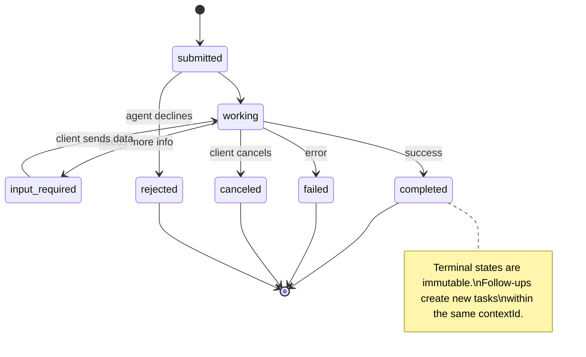

All 8 states (the spec also defines `UNSPECIFIED` as a sentinel, omitted here):

> 所有 8 个状态（规范还定义了 `UNSPECIFIED` 作为哨兵，此处省略）：

| State | Terminal? | Meaning / 含义 |
|---|---|---|
| `TASK_STATE_SUBMITTED` | No | Acknowledged, not yet processing / 已确认，尚未处理 |
| `TASK_STATE_WORKING` | No | Actively being processed / 正在处理 |
| `TASK_STATE_INPUT_REQUIRED` | No | Agent needs more info from client / Agent 需要客户端更多信息 |
| `TASK_STATE_AUTH_REQUIRED` | No | Authentication needed / 需要认证 |
| `TASK_STATE_COMPLETED` | Yes | Finished successfully / 成功完成 |
| `TASK_STATE_FAILED` | Yes | Finished with error / 出错完成 |
| `TASK_STATE_CANCELED` | Yes | Canceled before completion / 完成前取消 |
| `TASK_STATE_REJECTED` | Yes | Agent declined the task / Agent 拒绝任务 |

The terminal states (completed, failed, canceled, rejected) are immutable — once a task reaches one, no further updates are allowed. Follow-up work must create a new task in the same `contextId` to preserve session continuity.

> 终态（completed、failed、canceled、rejected）是不可变的——一旦任务到达终态，不允许进一步更新。后续工作必须在同一 `contextId` 中创建新任务以保持会话连续性。

Once a task reaches a terminal state, it's immutable. No further messages. Follow-ups create a new task within the same `contextId`.

> 一旦任务到达终态，它就是不可变的。不能再发消息。后续操作在同一 `contextId` 内创建新任务。

#### Wire Format

A2A uses JSON-RPC 2.0. Here's what a real message exchange looks like:

**Client sends a task:**
```json
{
  "jsonrpc": "2.0",
  "id": 1,
  "method": "SendMessage",
  "params": {
    "message": {
      "messageId": "msg-001",
      "role": "ROLE_USER",
      "parts": [{ "text": "Research React 19 compiler features" }]
    },
    "configuration": {
      "acceptedOutputModes": ["text/plain", "application/json"],
      "historyLength": 10
    }
  }
}
```

**Agent responds with a task:**
```json
{
  "jsonrpc": "2.0",
  "id": 1,
  "result": {
    "task": {
      "id": "task-abc-123",
      "contextId": "ctx-xyz-789",
      "status": {
        "state": "TASK_STATE_COMPLETED",
        "timestamp": "2026-03-27T10:30:00Z"
      },
      "artifacts": [
        {
          "artifactId": "art-001",
          "name": "research-results",
          "parts": [{
            "data": {
              "findings": [
                "React 19 compiler auto-memoizes components",
                "No more manual useMemo/useCallback needed",
                "Compiler runs at build time, not runtime"
              ]
            },
            "mediaType": "application/json"
          }]
        }
      ]
    }
  }
}
```

**Streaming via SSE:**
```text
POST /message:stream HTTP/1.1
Content-Type: application/json
A2A-Version: 1.0

data: {"task":{"id":"task-123","status":{"state":"TASK_STATE_WORKING"}}}

data: {"statusUpdate":{"taskId":"task-123","status":{"state":"TASK_STATE_WORKING","message":{"role":"ROLE_AGENT","parts":[{"text":"Searching documentation..."}]}}}}

data: {"artifactUpdate":{"taskId":"task-123","artifact":{"artifactId":"art-1","parts":[{"text":"partial findings..."}]},"append":true,"lastChunk":false}}

data: {"statusUpdate":{"taskId":"task-123","status":{"state":"TASK_STATE_COMPLETED"}}}
```

### ACP (Agent Communication Protocol)

**Created by:** IBM / BeeAI
**Spec version:** 0.2.0 (OpenAPI 3.1.1)
**Status:** Merging into A2A under the Linux Foundation
**Problem:** How do agents communicate with full auditability, session continuity, and trajectory tracking?

> **创建者：** IBM / BeeAI
> **规范版本：** 0.2.0 (OpenAPI 3.1.1)
> **状态：** 正在合并到 Linux Foundation 的 A2A 中
> **问题：** Agent 如何在完全可审计、会话连续性和轨迹跟踪的情况下通信？

ACP is the **enterprise protocol**. Unlike what many summaries claim, ACP does **not** use JSON-LD. It's a straightforward REST/JSON API defined via OpenAPI. What makes it special is **TrajectoryMetadata**: every agent response can carry a detailed log of the reasoning steps and tool calls that produced it.

> ACP 是**企业协议**。与许多摘要声称的不同，ACP **不**使用 JSON-LD。它是一个通过 OpenAPI 定义的简单 REST/JSON API。它的特殊之处在于 **TrajectoryMetadata**：每个 Agent 响应都可以携带产生它的推理步骤和工具调用的详细日志。

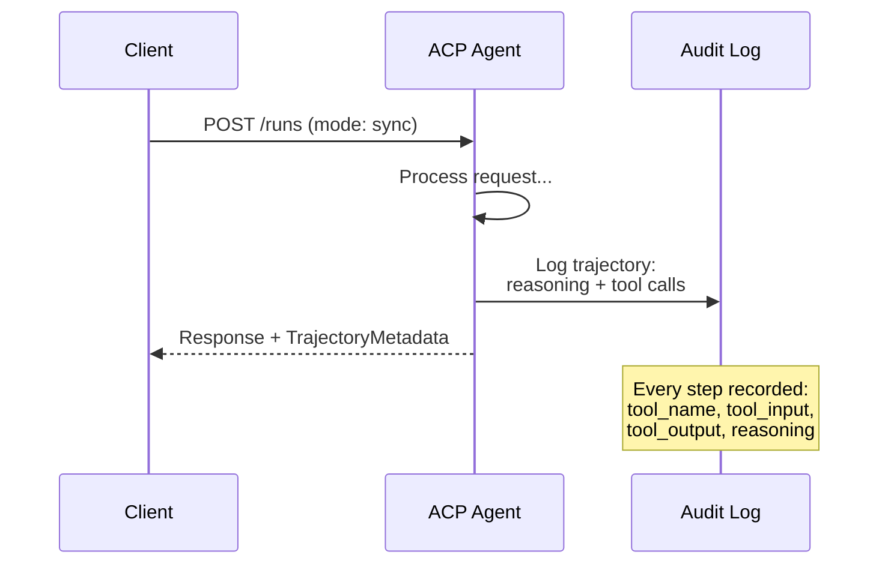

#### Agent Discovery in ACP

ACP defines four discovery methods:

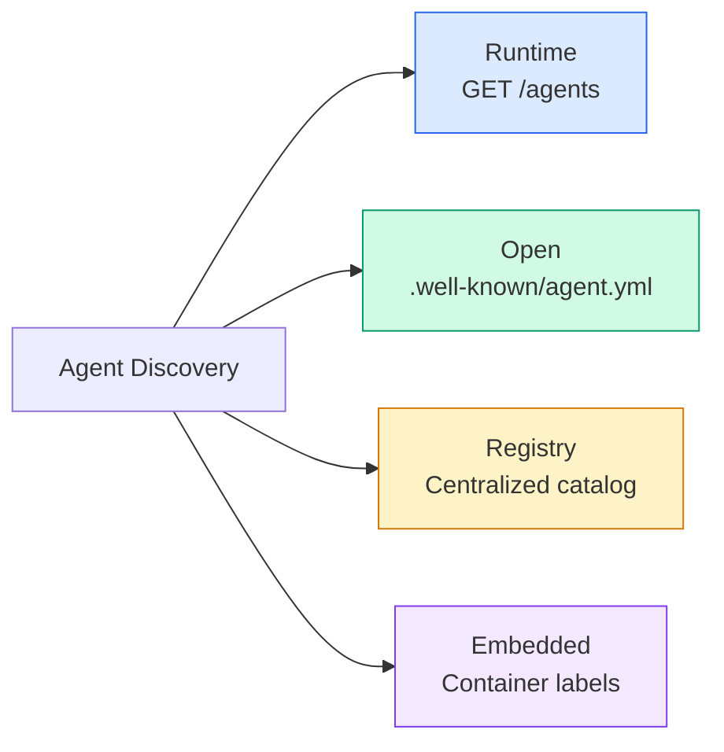

The **AgentManifest** is simpler than A2A's Agent Card:

> **AgentManifest** 比 A2A 的 Agent Card 更简单：

```json
{
  "name": "summarizer",
  "description": "Summarizes documents with source citations",
  "input_content_types": ["text/plain", "application/pdf"],
  "output_content_types": ["text/plain", "application/json"],
  "metadata": {
    "tags": ["summarization", "RAG"],
    "framework": "BeeAI",
    "capabilities": [
      {
        "name": "Document Summarization",
        "description": "Condenses long documents into key points"
      }
    ],
    "recommended_models": ["llama3.3:70b-instruct-fp16"],
    "license": "Apache-2.0",
    "programming_language": "Python"
  }
}
```

No protocol bindings (single REST API), no security schemes (delegated to the server level), no skill list (capabilities are flat metadata). Trade: simpler to deploy, less self-describing.

> 没有协议绑定（单一 REST API）、没有安全方案（委托给服务器级别）、没有技能列表（能力是扁平元数据）。权衡：部署更简单，自描述性较差。

#### Run Lifecycle

ACP uses "Runs" instead of "Tasks". A Run is an agent execution with three modes:

> ACP 使用"Runs"而不是"Tasks"。Run 是具有三种模式的 Agent 执行：

| Mode | Behavior |
|---|---|
| `sync` | Blocking. Response contains the complete result. |
| `async` | Returns 202 immediately. Poll `GET /runs/{id}` for status. |
| `stream` | SSE stream. Events fire as the agent works. |

> | 模式 | 行为 |
> |---|---|
> | `sync` | 阻塞。响应包含完整结果。 |
> | `async` | 立即返回 202。轮询 `GET /runs/{id}` 获取状态。 |
> | `stream` | SSE 流。事件随 Agent 工作触发。 |

The mode choice maps to user-experience requirements: sync for fast queries, async for background jobs, stream for long-running tasks where the user wants progress indicators.

> 模式选择映射到用户体验需求：sync 用于快速查询，async 用于后台作业，stream 用于用户想要进度指示的长时间运行任务。

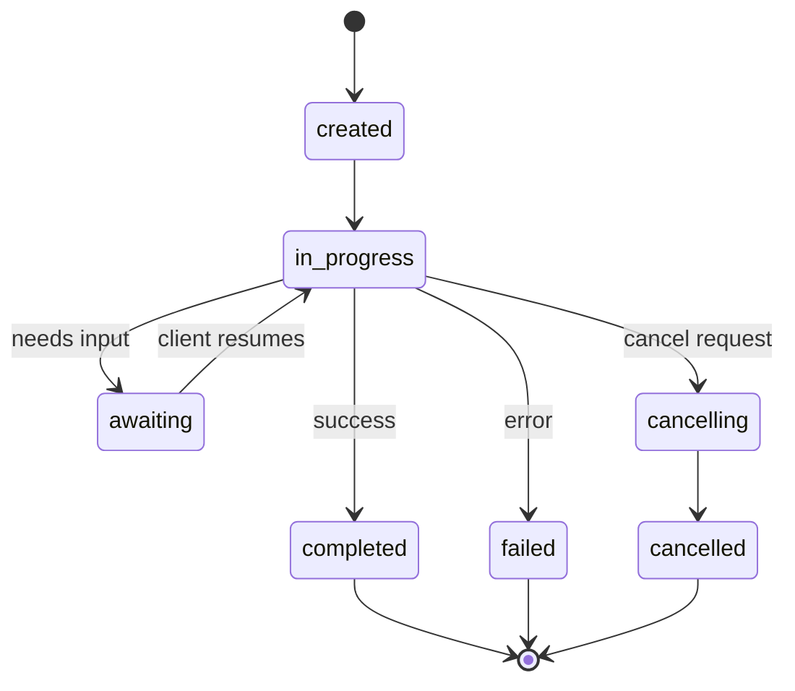

#### TrajectoryMetadata (The Audit Trail)

This is ACP's key differentiator. Every message part can include metadata showing exactly what the agent did:

```json
{
  "role": "agent/researcher",
  "parts": [
    {
      "content_type": "text/plain",
      "content": "The weather in San Francisco is 72F and sunny.",
      "metadata": {
        "kind": "trajectory",
        "message": "I need to check the weather for this location",
        "tool_name": "weather_api",
        "tool_input": { "location": "San Francisco, CA" },
        "tool_output": { "temperature": 72, "condition": "sunny" }
      }
    }
  ]
}
```

For regulated industries this is gold. Every answer comes with a provable chain of reasoning: which tools were called, what inputs were used, what outputs were received. No black box.

> 对于受监管的行业来说，这是无价之宝。每个答案都带有可证明的推理链：调用了哪些工具、使用了什么输入、收到了什么输出。没有黑箱。

Banks, healthcare, and government deployments require this kind of auditability. ACP's trajectory metadata is what makes LLM agents acceptable in those environments. Without it, regulators reject the deployment.

> 银行、医疗和政府部署需要这种可审计性。ACP 的轨迹元数据使 LLM Agent 在这些环境中可接受。没有它，监管机构拒绝部署。

ACP also supports **CitationMetadata** for source attribution:

> ACP 还支持 **CitationMetadata** 用于来源归属：

```json
{
  "kind": "citation",
  "start_index": 0,
  "end_index": 47,
  "url": "https://weather.gov/sf",
  "title": "NWS San Francisco Forecast"
}
```

### ANP (Agent Network Protocol)

**Created by:** Open-source community (founded by GaoWei Chang)
**Repo:** [github.com/agent-network-protocol/AgentNetworkProtocol](https://github.com/agent-network-protocol/AgentNetworkProtocol)
**Problem:** How do agents from different organizations trust each other without a central authority?

> **创建者：** 开源社区（由 GaoWei Chang 创立）
> **代码库：** [github.com/agent-network-protocol/AgentNetworkProtocol](https://github.com/agent-network-protocol/AgentNetworkProtocol)
> **问题：** 不同组织的 Agent 如何在没有中央权威的情况下相互信任？

ANP is the **decentralized identity protocol**. It builds trust using W3C Decentralized Identifiers (DIDs) and end-to-end encryption. Unlike A2A where you discover agents through known endpoints, ANP lets agents prove their identity cryptographically.

> ANP 是**去中心化身份协议**。它使用 W3C 去中心化标识符（DID）和端到端加密建立信任。与通过已知端点发现 Agent 的 A2A 不同，ANP 让 Agent 以加密方式证明其身份。

ANP has three layers:

> ANP 有三个层次：

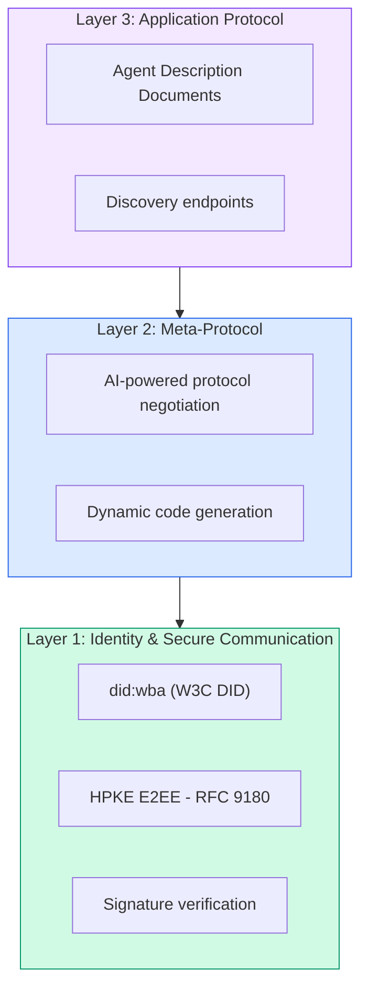

#### DID Documents (Real Structure)

ANP uses a custom DID method called `did:wba` (Web-Based Agent). The DID `did:wba:example.com:user:alice` resolves to `https://example.com/user/alice/did.json`:

```json
{
  "@context": [
    "https://www.w3.org/ns/did/v1",
    "https://w3id.org/security/suites/jws-2020/v1",
    "https://w3id.org/security/suites/secp256k1-2019/v1"
  ],
  "id": "did:wba:example.com:user:alice",
  "verificationMethod": [
    {
      "id": "did:wba:example.com:user:alice#key-1",
      "type": "EcdsaSecp256k1VerificationKey2019",
      "controller": "did:wba:example.com:user:alice",
      "publicKeyJwk": {
        "crv": "secp256k1",
        "x": "NtngWpJUr-rlNNbs0u-Aa8e16OwSJu6UiFf0Rdo1oJ4",
        "y": "qN1jKupJlFsPFc1UkWinqljv4YE0mq_Ickwnjgasvmo",
        "kty": "EC"
      }
    },
    {
      "id": "did:wba:example.com:user:alice#key-x25519-1",
      "type": "X25519KeyAgreementKey2019",
      "controller": "did:wba:example.com:user:alice",
      "publicKeyMultibase": "z9hFgmPVfmBZwRvFEyniQDBkz9LmV7gDEqytWyGZLmDXE"
    }
  ],
  "authentication": [
    "did:wba:example.com:user:alice#key-1"
  ],
  "keyAgreement": [
    "did:wba:example.com:user:alice#key-x25519-1"
  ],
  "humanAuthorization": [
    "did:wba:example.com:user:alice#key-1"
  ],
  "service": [
    {
      "id": "did:wba:example.com:user:alice#agent-description",
      "type": "AgentDescription",
      "serviceEndpoint": "https://example.com/agents/alice/ad.json"
    }
  ]
}
```

Key things to notice:
- **Key separation** is enforced. Signing keys (secp256k1) are separate from encryption keys (X25519).
  中文翻译：**密钥分离**是强制性的。签名密钥（secp256k1）与加密密钥（X25519）是分开的。
- **`humanAuthorization`** is unique to ANP. These keys require explicit human approval (biometric, password, HSM) before use. High-risk operations like fund transfers go through this path.
  中文翻译：**`humanAuthorization`** 是 ANP 独有的。这些密钥在使用前需要明确的人类批准（生物识别、密码、HSM）。高风险操作（如资金转账）通过此路径进行。
- **`keyAgreement`** keys are used for HPKE end-to-end encryption (RFC 9180).
  中文翻译：**`keyAgreement`** 密钥用于 HPKE 端到端加密（RFC 9180）。
- The **service** section links to the Agent Description document.
  中文翻译：**service** 部分链接到 Agent 描述文档。

The key separation pattern is what real-world crypto systems require but JSON protocols often skip. ANP enforces it because cross-organizational agents handle money, contracts, and PII — a single compromised key must not unlock every capability.

> 密钥分离模式是现实加密系统所要求的，但 JSON 协议经常跳过。ANP 强制执行它，因为跨组织 Agent 处理金钱、合同和 PII——单个被攻陷的密钥不能解锁每个能力。

#### How Trust Works in ANP

ANP does **not** use a web-of-trust or endorsement graph. Trust is bilateral and verified per-interaction:

> ANP **不**使用信任网络或背书图。信任是双边的，每次交互都会验证：

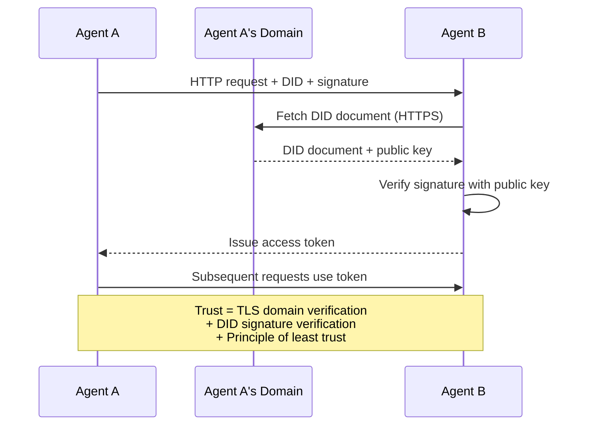

Trust comes from three sources:
1. **Domain-level TLS** verifies the DID document host
   中文翻译：**域级 TLS** 验证 DID 文档主机
2. **DID cryptographic signatures** verify the agent's identity
   中文翻译：**DID 加密签名** 验证 Agent 的身份
3. **Principle of least trust** grants only minimum permissions
   中文翻译：**最小信任原则** 仅授予最低权限

The three-source design avoids single points of failure. TLS alone is insufficient (anyone with a cert can host a DID). DID alone is insufficient (a stolen key fakes identity). Combined with least-trust authorization, you get defense in depth without a central authority.

> 三源设计避免了单点故障。仅 TLS 不够（任何有证书的人都可以托管 DID）。仅 DID 不够（被盗密钥伪造身份）。与最小信任授权结合，你获得纵深防御而无需中央权威。

There's no gossip-based trust propagation or PageRank scoring. You verify each agent directly through its DID.

> 没有基于八卦的信任传播或 PageRank 评分。你直接通过 DID 验证每个 Agent。

#### Meta-Protocol Negotiation

This is ANP's most novel feature. When two agents from different ecosystems meet, they don't need pre-agreed data formats. They negotiate in natural language:

> 这是 ANP 最新颖的功能。当来自不同生态系统的两个 Agent 相遇时，它们不需要预先约定的数据格式。它们用自然语言协商：

```json
{
  "action": "protocolNegotiation",
  "sequenceId": 0,
  "candidateProtocols": "I can communicate using:\n1. JSON-RPC with hotel booking schema\n2. REST with OpenAPI 3.1 spec\n3. Natural language over HTTP",
  "modificationSummary": "Initial proposal",
  "status": "negotiating"
}
```

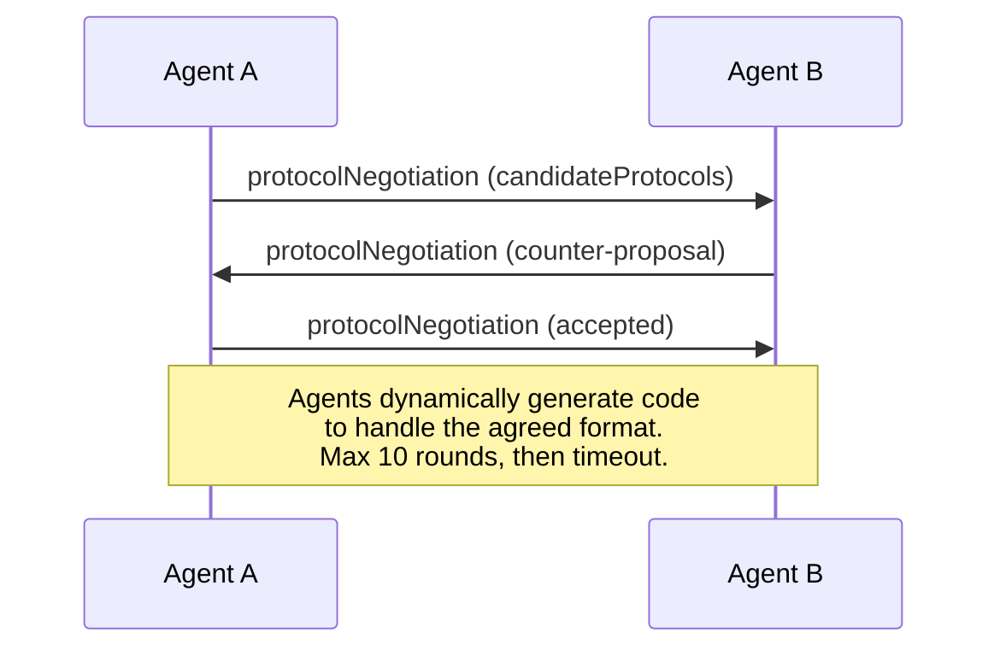

The agents go back and forth (max 10 rounds) until they agree on a format, then dynamically generate code to handle it. Status values: `negotiating`, `rejected`, `accepted`, `timeout`.

> Agent 来回协商（最多 10 轮）直到就格式达成一致，然后动态生成代码来处理它。状态值：`negotiating`（协商中）、`rejected`（拒绝）、`accepted`（接受）、`timeout`（超时）。

This means two agents that have never seen each other before can figure out how to communicate without anyone pre-defining a shared schema.

> 这意味着两个从未见过的 Agent 可以在没有人预定义共享模式的情况下找到如何通信的方式。

The vision: an open agent web where any agent can talk to any other agent, ad-hoc, without prior integration work. Whether this scales beyond toy demos is an open 2026 question. The fallback is always "use A2A and pre-agree on schemas."

> 愿景：开放 Agent 网络中任何 Agent 可以与任何其他 Agent 临时对话，无需前期集成工作。这是否能扩展到玩具演示之外是 2026 年的开放问题。后备总是"使用 A2A 并预先就模式达成一致。"

### Comparison (Corrected)

| | MCP | A2A | ACP | ANP |
|---|---|---|---|---|
| **Created by** | Anthropic | Google / Linux Foundation | IBM / BeeAI | Community |
| **Spec format** | JSON-RPC | JSON-RPC / REST / gRPC | OpenAPI 3.1 (REST) | JSON-RPC |
| **Primary use** | Agent to Tool | Agent to Agent | Agent to Agent | Agent to Agent |
| **Discovery** | Tool listing | `/.well-known/agent-card.json` | `GET /agents`, `/.well-known/agent.yml` | `/.well-known/agent-descriptions`, DID service endpoints |
| **Identity** | Implicit (local) | Security schemes (OAuth, mTLS) | Server-level | W3C DID (`did:wba`) with E2EE |
| **Audit trail** | N/A | Basic (task history) | TrajectoryMetadata (tool calls, reasoning) | Not formally specified |
| **State machine** | N/A | 9 task states | 7 run states | N/A |
| **Streaming** | N/A | SSE | SSE | Transport-agnostic |
| **Unique feature** | Tool schemas | Agent Cards + Skills | Trajectory audit trail | Meta-protocol negotiation |
| **Best for** | Tools & data | Dynamic collaboration | Regulated industries | Cross-org trust |
| **Status** | Stable | Stable (v1.0) | Merging into A2A | Active development |

### How They Work Together

These protocols are not mutually exclusive. A realistic enterprise system uses multiple:

> 这些协议不是互斥的。一个现实的企业系统使用多个协议：

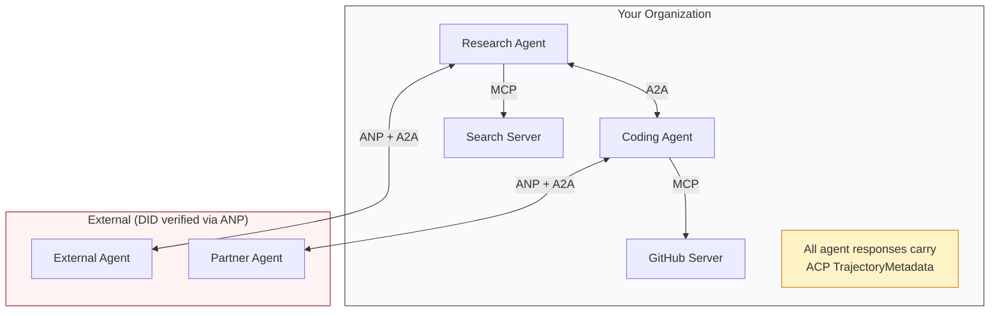

- **MCP** connects each agent to its tools
  中文翻译：**MCP** 将每个 Agent 连接到其工具
- **A2A** handles collaboration between agents (internal and external)
  中文翻译：**A2A** 处理 Agent 之间的协作（内部和外部）
- **ACP** wraps responses in trajectory metadata for auditability
  中文翻译：**ACP** 用轨迹元数据包装响应以实现可审计性
- **ANP** provides identity verification for agents you don't control
  中文翻译：**ANP** 为你不控制的 Agent 提供身份验证

## Build It | 动手实现

### Step 1: Core Message Types

Every multi-agent system starts with a message format. We define types that map to what the real protocols use:

> 每个多 Agent 系统都以消息格式开始。我们定义了映射到真实协议使用的类型：

```typescript
import crypto from "node:crypto";

type MessageRole = "user" | "agent";

type MessagePart =
  | { kind: "text"; text: string }
  | { kind: "data"; data: unknown; mediaType: string }
  | { kind: "file"; name: string; url: string; mediaType: string };

type TrajectoryEntry = {
  reasoning: string;
  toolName?: string;
  toolInput?: unknown;
  toolOutput?: unknown;
  timestamp: number;
};

type AgentMessage = {
  id: string;
  role: MessageRole;
  parts: MessagePart[];
  trajectory?: TrajectoryEntry[];
  replyTo?: string;
  timestamp: number;
};

function createMessage(
  role: MessageRole,
  parts: MessagePart[],
  replyTo?: string
): AgentMessage {
  return {
    id: crypto.randomUUID(),
    role,
    parts,
    replyTo,
    timestamp: Date.now(),
  };
}

function textMessage(role: MessageRole, text: string): AgentMessage {
  return createMessage(role, [{ kind: "text", text }]);
}
```

Notice: `MessagePart` is multimodal (text, structured data, files) just like the real A2A and ACP specs. `TrajectoryEntry` captures the reasoning chain, matching ACP's TrajectoryMetadata.

> 注意：`MessagePart` 是多模态的（文本、结构化数据、文件），就像真实的 A2A 和 ACP 规范一样。`TrajectoryEntry` 捕获推理链，匹配 ACP 的 TrajectoryMetadata。

### Step 2: A2A Agent Card and Registry

Build agent discovery that matches the real A2A spec:

> 构建匹配真实 A2A 规范的 Agent 发现：

```typescript
type Skill = {
  id: string;
  name: string;
  description: string;
  tags: string[];
  inputModes: string[];
  outputModes: string[];
};

type AgentCard = {
  name: string;
  description: string;
  version: string;
  url: string;
  capabilities: {
    streaming: boolean;
    pushNotifications: boolean;
  };
  defaultInputModes: string[];
  defaultOutputModes: string[];
  skills: Skill[];
};

class AgentRegistry {
  private cards: Map<string, AgentCard> = new Map();

  register(card: AgentCard) {
    this.cards.set(card.name, card);
  }

  discoverBySkillTag(tag: string): AgentCard[] {
    return [...this.cards.values()].filter((card) =>
      card.skills.some((skill) => skill.tags.includes(tag))
    );
  }

  discoverByInputMode(mimeType: string): AgentCard[] {
    return [...this.cards.values()].filter(
      (card) =>
        card.defaultInputModes.includes(mimeType) ||
        card.skills.some((skill) => skill.inputModes.includes(mimeType))
    );
  }

  resolve(name: string): AgentCard | undefined {
    return this.cards.get(name);
  }

  listAll(): AgentCard[] {
    return [...this.cards.values()];
  }
}
```

This is substantially richer than a simple name-to-capability map. You can discover agents by skill tags, by input MIME types, or by name, just like the real A2A spec supports.

> 这比简单的名称到能力映射要丰富得多。你可以通过技能标签、输入 MIME 类型或名称发现 Agent，就像真实的 A2A 规范支持的那样。

### Step 3: A2A Task Lifecycle

Build the full task state machine:

> 构建完整的任务状态机：

```typescript
type TaskState =
  | "submitted"
  | "working"
  | "input-required"
  | "auth-required"
  | "completed"
  | "failed"
  | "canceled"
  | "rejected";

const TERMINAL_STATES: TaskState[] = [
  "completed",
  "failed",
  "canceled",
  "rejected",
];

type TaskStatus = {
  state: TaskState;
  message?: AgentMessage;
  timestamp: number;
};

type Artifact = {
  id: string;
  name: string;
  parts: MessagePart[];
};

type Task = {
  id: string;
  contextId: string;
  status: TaskStatus;
  artifacts: Artifact[];
  history: AgentMessage[];
};

type TaskEvent =
  | { kind: "statusUpdate"; taskId: string; status: TaskStatus }
  | {
      kind: "artifactUpdate";
      taskId: string;
      artifact: Artifact;
      append: boolean;
      lastChunk: boolean;
    };

type TaskHandler = (
  task: Task,
  message: AgentMessage
) => AsyncGenerator<TaskEvent>;

class TaskManager {
  private tasks: Map<string, Task> = new Map();
  private handlers: Map<string, TaskHandler> = new Map();
  private listeners: Map<string, ((event: TaskEvent) => void)[]> = new Map();

  registerHandler(agentName: string, handler: TaskHandler) {
    this.handlers.set(agentName, handler);
  }

  subscribe(taskId: string, listener: (event: TaskEvent) => void) {
    const existing = this.listeners.get(taskId) ?? [];
    existing.push(listener);
    this.listeners.set(taskId, existing);
  }

  async sendMessage(
    agentName: string,
    message: AgentMessage,
    contextId?: string
  ): Promise<Task> {
    const handler = this.handlers.get(agentName);
    if (!handler) {
      const task = this.createTask(contextId);
      task.status = {
        state: "rejected",
        timestamp: Date.now(),
        message: textMessage("agent", `No handler for ${agentName}`),
      };
      return task;
    }

    const task = this.createTask(contextId);
    task.history.push(message);
    task.status = { state: "submitted", timestamp: Date.now() };

    this.processTask(task, handler, message).catch((err) => {
      task.status = {
        state: "failed",
        timestamp: Date.now(),
        message: textMessage("agent", String(err)),
      };
    });
    return task;
  }

  getTask(taskId: string): Task | undefined {
    return this.tasks.get(taskId);
  }

  cancelTask(taskId: string): boolean {
    const task = this.tasks.get(taskId);
    if (!task || TERMINAL_STATES.includes(task.status.state)) return false;
    task.status = { state: "canceled", timestamp: Date.now() };
    this.emit(taskId, {
      kind: "statusUpdate",
      taskId,
      status: task.status,
    });
    return true;
  }

  private createTask(contextId?: string): Task {
    const task: Task = {
      id: crypto.randomUUID(),
      contextId: contextId ?? crypto.randomUUID(),
      status: { state: "submitted", timestamp: Date.now() },
      artifacts: [],
      history: [],
    };
    this.tasks.set(task.id, task);
    return task;
  }

  private async processTask(
    task: Task,
    handler: TaskHandler,
    message: AgentMessage
  ) {
    task.status = { state: "working", timestamp: Date.now() };
    this.emit(task.id, {
      kind: "statusUpdate",
      taskId: task.id,
      status: task.status,
    });

    try {
      for await (const event of handler(task, message)) {
        if (TERMINAL_STATES.includes(task.status.state)) break;

        if (event.kind === "statusUpdate") {
          task.status = event.status;
        }
        if (event.kind === "artifactUpdate") {
          const existing = task.artifacts.find(
            (a) => a.id === event.artifact.id
          );
          if (existing && event.append) {
            existing.parts.push(...event.artifact.parts);
          } else {
            task.artifacts.push(event.artifact);
          }
        }
        this.emit(task.id, event);
      }
    } catch (err) {
      task.status = {
        state: "failed",
        timestamp: Date.now(),
        message: textMessage("agent", String(err)),
      };
      this.emit(task.id, {
        kind: "statusUpdate",
        taskId: task.id,
        status: task.status,
      });
    }
  }

  private emit(taskId: string, event: TaskEvent) {
    for (const listener of this.listeners.get(taskId) ?? []) {
      listener(event);
    }
  }
}
```

This implements the real A2A task lifecycle: submitted, working, input-required, terminal states. Handlers are async generators that yield events (status updates and artifact chunks) matching the SSE streaming model.

> 这实现了真实的 A2A 任务生命周期：submitted、working、input-required、终态。处理程序是异步生成器，产生匹配 SSE 流模型的事件（状态更新和工件块）。

### Step 4: ACP-Style Audit Trail

Wrap communication with trajectory tracking:

> 用轨迹跟踪包装通信：

```typescript
type AuditEntry = {
  runId: string;
  agentName: string;
  input: AgentMessage[];
  output: AgentMessage[];
  trajectory: TrajectoryEntry[];
  status: "created" | "in-progress" | "completed" | "failed" | "awaiting";
  startedAt: number;
  completedAt?: number;
  sessionId?: string;
};

class AuditableRunner {
  private log: AuditEntry[] = [];
  private handlers: Map<
    string,
    (input: AgentMessage[]) => Promise<{
      output: AgentMessage[];
      trajectory: TrajectoryEntry[];
    }>
  > = new Map();

  registerAgent(
    name: string,
    handler: (input: AgentMessage[]) => Promise<{
      output: AgentMessage[];
      trajectory: TrajectoryEntry[];
    }>
  ) {
    this.handlers.set(name, handler);
  }

  async run(
    agentName: string,
    input: AgentMessage[],
    sessionId?: string
  ): Promise<AuditEntry> {
    const entry: AuditEntry = {
      runId: crypto.randomUUID(),
      agentName,
      input: structuredClone(input),
      output: [],
      trajectory: [],
      status: "created",
      startedAt: Date.now(),
      sessionId,
    };
    this.log.push(entry);

    const handler = this.handlers.get(agentName);
    if (!handler) {
      entry.status = "failed";
      return entry;
    }

    entry.status = "in-progress";
    try {
      const result = await handler(input);
      entry.output = structuredClone(result.output);
      entry.trajectory = structuredClone(result.trajectory);
      entry.status = "completed";
      entry.completedAt = Date.now();
    } catch (err) {
      entry.status = "failed";
      entry.trajectory.push({
        reasoning: `Error: ${String(err)}`,
        timestamp: Date.now(),
      });
      entry.completedAt = Date.now();
    }
    return entry;
  }

  getFullAuditLog(): AuditEntry[] {
    return structuredClone(this.log);
  }

  getAuditLogForAgent(agentName: string): AuditEntry[] {
    return structuredClone(
      this.log.filter((e) => e.agentName === agentName)
    );
  }

  getAuditLogForSession(sessionId: string): AuditEntry[] {
    return structuredClone(
      this.log.filter((e) => e.sessionId === sessionId)
    );
  }

  getTrajectoryForRun(runId: string): TrajectoryEntry[] {
    const entry = this.log.find((e) => e.runId === runId);
    return entry ? structuredClone(entry.trajectory) : [];
  }
}
```

Every agent execution produces a full audit entry: what went in, what came out, and the complete trajectory of tool calls and reasoning steps in between. You can query by agent, by session, or by individual run.

> 每次 Agent 执行都会产生一个完整的审计条目：输入了什么、输出了什么，以及之间工具调用和推理步骤的完整轨迹。你可以按 Agent、按会话或按单次运行查询。

### Step 5: ANP-Style Identity Verification

Build DID-based identity and verification:

> 构建基于 DID 的身份和验证：

```typescript
type VerificationMethod = {
  id: string;
  type: string;
  controller: string;
  publicKeyDer: string;
};

type DIDDocument = {
  id: string;
  verificationMethod: VerificationMethod[];
  authentication: string[];
  keyAgreement: string[];
  humanAuthorization: string[];
  service: { id: string; type: string; serviceEndpoint: string }[];
};

type AgentIdentity = {
  did: string;
  document: DIDDocument;
  privateKey: crypto.KeyObject;
  publicKey: crypto.KeyObject;
};

class IdentityRegistry {
  private documents: Map<string, DIDDocument> = new Map();

  publish(doc: DIDDocument) {
    this.documents.set(doc.id, doc);
  }

  resolve(did: string): DIDDocument | undefined {
    return this.documents.get(did);
  }

  verify(did: string, signature: string, payload: string): boolean {
    const doc = this.documents.get(did);
    if (!doc) return false;

    const authKeyIds = doc.authentication;
    const authKeys = doc.verificationMethod.filter((vm) =>
      authKeyIds.includes(vm.id)
    );

    for (const key of authKeys) {
      const publicKey = crypto.createPublicKey({
        key: Buffer.from(key.publicKeyDer, "base64"),
        format: "der",
        type: "spki",
      });
      const isValid = crypto.verify(
        null,
        Buffer.from(payload),
        publicKey,
        Buffer.from(signature, "hex")
      );
      if (isValid) return true;
    }
    return false;
  }

  requiresHumanAuth(did: string, operationKeyId: string): boolean {
    const doc = this.documents.get(did);
    if (!doc) return false;
    return doc.humanAuthorization.includes(operationKeyId);
  }
}

function createIdentity(domain: string, agentName: string): AgentIdentity {
  const did = `did:wba:${domain}:agent:${agentName}`;
  const { publicKey, privateKey } = crypto.generateKeyPairSync("ed25519");

  const publicKeyDer = publicKey
    .export({ format: "der", type: "spki" })
    .toString("base64");

  const keyId = `${did}#key-1`;
  const encKeyId = `${did}#key-x25519-1`;

  const document: DIDDocument = {
    id: did,
    verificationMethod: [
      {
        id: keyId,
        type: "Ed25519VerificationKey2020",
        controller: did,
        publicKeyDer,
      },
      {
        id: encKeyId,
        type: "X25519KeyAgreementKey2019",
        controller: did,
        publicKeyDer,
      },
    ],
    authentication: [keyId],
    keyAgreement: [encKeyId],
    humanAuthorization: [],
    service: [
      {
        id: `${did}#agent-description`,
        type: "AgentDescription",
        serviceEndpoint: `https://${domain}/agents/${agentName}/ad.json`,
      },
    ],
  };

  return { did, document, privateKey, publicKey };
}

function signPayload(identity: AgentIdentity, payload: string): string {
  return crypto
    .sign(null, Buffer.from(payload), identity.privateKey)
    .toString("hex");
}
```

This mirrors the real ANP identity model: agents have DID documents with separate authentication, key agreement, and human authorization keys. The `IdentityRegistry` simulates DID resolution (in production this would be HTTP fetches to the agent's domain).

> 这反映了真实的 ANP 身份模型：Agent 拥有带有独立认证、密钥协议和人工授权密钥的 DID 文档。`IdentityRegistry` 模拟 DID 解析（在生产环境中，这将是向 Agent 域的 HTTP 获取）。

### Step 6: Protocol Gateway

Connect all four protocols into a unified system:

> 将所有四个协议连接到一个统一的系统：

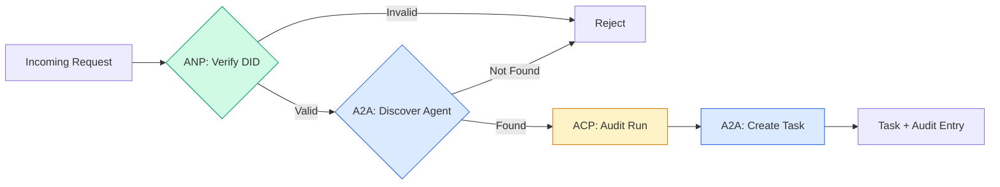

```typescript
class ProtocolGateway {
  private registry: AgentRegistry;
  private taskManager: TaskManager;
  private auditRunner: AuditableRunner;
  private identityRegistry: IdentityRegistry;

  constructor(
    registry: AgentRegistry,
    taskManager: TaskManager,
    auditRunner: AuditableRunner,
    identityRegistry: IdentityRegistry
  ) {
    this.registry = registry;
    this.taskManager = taskManager;
    this.auditRunner = auditRunner;
    this.identityRegistry = identityRegistry;
  }

  async delegateTask(
    fromDid: string,
    signature: string,
    targetAgent: string,
    message: AgentMessage,
    sessionId?: string
  ): Promise<{ task: Task; audit: AuditEntry } | { error: string }> {
    if (!this.identityRegistry.verify(fromDid, signature, message.id)) {
      return { error: "Identity verification failed" };
    }

    const card = this.registry.resolve(targetAgent);
    if (!card) {
      return { error: `Agent ${targetAgent} not found in registry` };
    }

    const audit = await this.auditRunner.run(
      targetAgent,
      [message],
      sessionId
    );
    const task = await this.taskManager.sendMessage(targetAgent, message);

    return { task, audit };
  }

  discoverAndDelegate(
    fromDid: string,
    signature: string,
    skillTag: string,
    message: AgentMessage
  ): Promise<{ task: Task; audit: AuditEntry } | { error: string }> {
    const candidates = this.registry.discoverBySkillTag(skillTag);
    if (candidates.length === 0) {
      return Promise.resolve({
        error: `No agents found with skill tag: ${skillTag}`,
      });
    }
    return this.delegateTask(
      fromDid,
      signature,
      candidates[0].name,
      message
    );
  }
}
```

The gateway does four things in one call:
1. **ANP**: Verifies the caller's identity via DID signature
   中文翻译：**ANP**：通过 DID 签名验证调用者身份
2. **A2A**: Discovers the target agent and checks capabilities
   中文翻译：**A2A**：发现目标 Agent 并检查能力
3. **ACP**: Wraps the execution in an audit trail with trajectory
   中文翻译：**ACP**：用轨迹审计跟踪包装执行
4. **A2A**: Creates a task with full lifecycle tracking
   中文翻译：**A2A**：创建具有完整生命周期跟踪的任务

### Step 7: Wire It All Together

```typescript
async function protocolDemo() {
  const registry = new AgentRegistry();
  registry.register({
    name: "researcher",
    description: "Searches and summarizes findings",
    version: "1.0.0",
    url: "https://researcher.local/a2a/v1",
    capabilities: { streaming: true, pushNotifications: false },
    defaultInputModes: ["text/plain"],
    defaultOutputModes: ["text/plain", "application/json"],
    skills: [
      {
        id: "web-research",
        name: "Web Research",
        description: "Searches the web",
        tags: ["research", "search", "summarization"],
        inputModes: ["text/plain"],
        outputModes: ["application/json"],
      },
    ],
  });
  registry.register({
    name: "coder",
    description: "Writes code from specs",
    version: "1.0.0",
    url: "https://coder.local/a2a/v1",
    capabilities: { streaming: false, pushNotifications: false },
    defaultInputModes: ["text/plain", "application/json"],
    defaultOutputModes: ["text/plain"],
    skills: [
      {
        id: "code-gen",
        name: "Code Generation",
        description: "Generates code",
        tags: ["coding", "generation"],
        inputModes: ["text/plain", "application/json"],
        outputModes: ["text/plain"],
      },
    ],
  });

  const taskManager = new TaskManager();
  const auditRunner = new AuditableRunner();

  const researchTrajectory: TrajectoryEntry[] = [];

  taskManager.registerHandler(
    "researcher",
    async function* (task, message) {
      yield {
        kind: "statusUpdate" as const,
        taskId: task.id,
        status: { state: "working" as const, timestamp: Date.now() },
      };

      researchTrajectory.push({
        reasoning: "Searching for React 19 documentation",
        toolName: "web_search",
        toolInput: { query: "React 19 compiler features" },
        toolOutput: {
          results: ["react.dev/blog/react-19", "github.com/react/react"],
        },
        timestamp: Date.now(),
      });

      researchTrajectory.push({
        reasoning: "Extracting key findings from search results",
        toolName: "doc_analysis",
        toolInput: { url: "react.dev/blog/react-19" },
        toolOutput: {
          summary:
            "React 19 compiler auto-memoizes, no manual useMemo needed",
        },
        timestamp: Date.now(),
      });

      yield {
        kind: "artifactUpdate" as const,
        taskId: task.id,
        artifact: {
          id: crypto.randomUUID(),
          name: "research-results",
          parts: [
            {
              kind: "data" as const,
              data: {
                findings: [
                  "React 19 compiler auto-memoizes components",
                  "No more manual useMemo/useCallback needed",
                  "Compiler runs at build time, not runtime",
                ],
                sources: ["react.dev/blog/react-19"],
              },
              mediaType: "application/json",
            },
          ],
        },
        append: false,
        lastChunk: true,
      };

      yield {
        kind: "statusUpdate" as const,
        taskId: task.id,
        status: { state: "completed" as const, timestamp: Date.now() },
      };
    }
  );

  auditRunner.registerAgent("researcher", async () => ({
    output: [
      textMessage("agent", "React 19 compiler auto-memoizes components"),
    ],
    trajectory: researchTrajectory,
  }));

  const identityRegistry = new IdentityRegistry();

  const coderIdentity = createIdentity("coder.local", "coder");
  const researcherIdentity = createIdentity("researcher.local", "researcher");

  identityRegistry.publish(coderIdentity.document);
  identityRegistry.publish(researcherIdentity.document);

  const gateway = new ProtocolGateway(
    registry,
    taskManager,
    auditRunner,
    identityRegistry
  );

  console.log("=== Protocol Demo ===\n");

  console.log("1. Agent Discovery (A2A)");
  const researchAgents = registry.discoverBySkillTag("research");
  console.log(
    `   Found ${researchAgents.length} agent(s):`,
    researchAgents.map((a) => a.name)
  );

  console.log("\n2. Identity Verification (ANP)");
  const message = textMessage("user", "Research React 19 compiler features");
  const signature = signPayload(coderIdentity, message.id);
  const verified = identityRegistry.verify(
    coderIdentity.did,
    signature,
    message.id
  );
  console.log(`   Coder DID: ${coderIdentity.did}`);
  console.log(`   Signature verified: ${verified}`);

  console.log("\n3. Task Delegation (A2A + ACP + ANP)");
  const result = await gateway.delegateTask(
    coderIdentity.did,
    signature,
    "researcher",
    message,
    "session-001"
  );

  if ("error" in result) {
    console.log(`   Error: ${result.error}`);
    return;
  }

  console.log(`   Task ID: ${result.task.id}`);
  console.log(`   Task state: ${result.task.status.state}`);
  console.log(`   Artifacts: ${result.task.artifacts.length}`);

  console.log("\n4. Audit Trail (ACP)");
  console.log(`   Run ID: ${result.audit.runId}`);
  console.log(`   Status: ${result.audit.status}`);
  console.log(`   Trajectory steps: ${result.audit.trajectory.length}`);
  for (const step of result.audit.trajectory) {
    console.log(`     - ${step.reasoning}`);
    if (step.toolName) {
      console.log(`       Tool: ${step.toolName}`);
    }
  }

  console.log("\n5. Full Audit Log");
  const fullLog = auditRunner.getFullAuditLog();
  console.log(`   Total runs: ${fullLog.length}`);
  for (const entry of fullLog) {
    const duration = entry.completedAt
      ? `${entry.completedAt - entry.startedAt}ms`
      : "in-progress";
    console.log(`   ${entry.agentName}: ${entry.status} (${duration})`);
  }
}

protocolDemo().catch((err) => {
  console.error("Protocol demo failed:", err);
  process.exitCode = 1;
});
```

## What Goes Wrong

Protocols solve the happy path. Here's what breaks in production:

> 协议解决了正常路径。以下是生产中会出现的问题：

**Schema drift.** Agent A publishes an Agent Card advertising `application/json` output. But the JSON schema changes between versions. Agent B parses the old format and gets garbage. Fix: version your skills and output schemas. The A2A spec supports `version` on Agent Cards for this reason.

> **模式漂移。** Agent A 发布一个宣传 `application/json` 输出的 Agent 卡片。但 JSON 模式在版本之间发生了变化。Agent B 解析旧格式并得到垃圾数据。修复：版本化你的技能和输出模式。A2A 规范为此支持 Agent 卡片上的 `version`。

**State machine violations.** An agent handler yields a `completed` event, then tries to yield more artifacts. The task is immutable. Your code silently drops the updates or throws. Fix: check terminal state before yielding. The `TaskManager` above enforces this with the `break` after terminal states.

> **状态机违规。** Agent 处理程序产生一个 `completed` 事件，然后试图产生更多工件。任务是不可变的。你的代码会静默丢弃更新或抛出异常。修复：在产生之前检查终态。上面的 `TaskManager` 通过终态后的 `break` 来强制执行。

**Trust resolution failures.** Agent A tries to verify Agent B's DID, but Agent B's domain is down. The DID document can't be fetched. Do you fail open (accept unverified agents) or fail closed (reject everything)? ANP recommends fail closed with the principle of least trust.

> **信任解析失败。** Agent A 试图验证 Agent B 的 DID，但 Agent B 的域名宕机了。DID 文档无法获取。你是开放失败（接受未验证的 Agent）还是关闭失败（拒绝一切）？ANP 建议以最小信任原则关闭失败。

**Trajectory bloat.** ACP trajectory logging is powerful but expensive. A complex agent that makes 200 tool calls per run produces massive audit entries. Fix: log trajectory at configurable verbosity levels. Record tool names and IO for compliance, skip reasoning steps for non-regulated workloads.

> **轨迹膨胀。** ACP 轨迹日志功能强大但代价高昂。一个复杂的 Agent 每次运行进行 200 次工具调用会产生大量审计条目。修复：以可配置的详细程度记录轨迹。为合规记录工具名称和 IO，为非受监管工作负载跳过推理步骤。

**Discovery thundering herd.** 50 agents all query `GET /agents` simultaneously on startup. Fix: cache Agent Cards with TTL, stagger discovery intervals, or use push-based registration instead of polling.

> **发现惊群。** 50 个 Agent 在启动时同时查询 `GET /agents`。修复：用 TTL 缓存 Agent 卡片，交错发现间隔，或使用基于推送的注册而非轮询。

## Use It | 用框架实现

### Real Implementations

**A2A** is the most mature. Google's [official spec](https://github.com/google/A2A) is open-source under the Linux Foundation. SDKs for Python and TypeScript. If your agents need dynamic discovery and collaboration, start here.

> **A2A** 是最成熟的。Google 的[官方规范](https://github.com/google/A2A)在 Linux Foundation 下开源。有 Python 和 TypeScript SDK。如果你的 Agent 需要动态发现和协作，从这里开始。

**ACP** is merging into A2A. IBM's [BeeAI project](https://github.com/i-am-bee/acp) created ACP as a REST-first alternative, but the trajectory metadata concept is being absorbed into the A2A ecosystem. Use ACP patterns (trajectory logging, run lifecycle) even if you use A2A as the transport.

> **ACP** 正在合并到 A2A。IBM 的 [BeeAI 项目](https://github.com/i-am-bee/acp)创建了 ACP 作为 REST 优先的替代方案，但轨迹元数据概念正在被吸收到 A2A 生态系统中。即使你使用 A2A 作为传输，也要使用 ACP 模式（轨迹日志、运行生命周期）。

**ANP** is the most experimental. The [community repo](https://github.com/agent-network-protocol/AgentNetworkProtocol) has a Python SDK (AgentConnect). The meta-protocol negotiation concept is genuinely novel. Worth watching for cross-organizational agent deployments.

> **ANP** 是最实验性的。[社区仓库](https://github.com/agent-network-protocol/AgentNetworkProtocol)有一个 Python SDK（AgentConnect）。元协议协商概念确实新颖。值得跨组织 Agent 部署关注。

**MCP** is already covered in Phase 13. If you want agents to use tools, MCP is the standard.

> **MCP** 已在 Phase 13 中涵盖。如果你想让 Agent 使用工具，MCP 是标准。

### Picking the Right Protocol

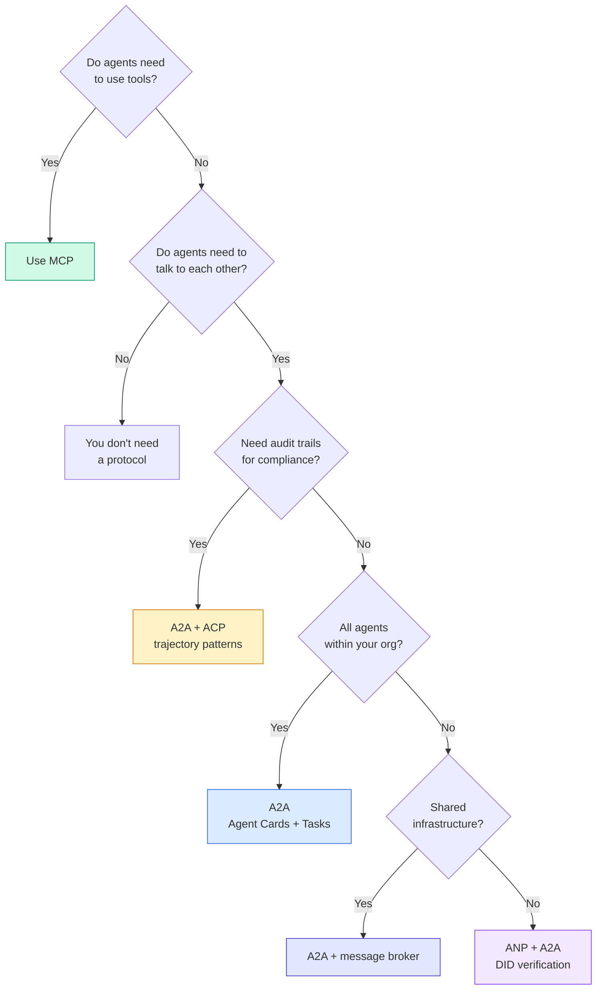

## Ship It | 产出物

This lesson produces:
- `code/main.ts` -- complete implementation of all four protocol patterns
  中文翻译：`code/main.ts` — 所有四种协议模式的完整实现
- `outputs/prompt-protocol-selector.md` -- a prompt that helps you choose protocols for your system
  中文翻译：`outputs/prompt-protocol-selector.md` — 帮助你为系统选择协议的提示

## Exercises | 练习题

1. **Multi-hop task delegation.** Extend the `TaskManager` so an agent handler can delegate subtasks to other agents. The researcher receives a task, delegates "search" and "summarize" subtasks to two specialist agents, waits for both to complete, then merges the results into its own artifacts.
   中文翻译：**多跳任务委派。** 扩展 `TaskManager`，使 Agent 处理程序可以向其他 Agent 委派子任务。研究员接收任务，将"搜索"和"总结"子任务委派给两个专家 Agent，等待两者完成，然后合并结果。

2. **Streaming audit trail.** Modify the `AuditableRunner` to support streaming mode. Instead of waiting for the full result, yield `AuditEntry` updates in real-time as trajectory entries are added. Use an async generator that produces audit snapshots.
   中文翻译：**流式审计跟踪。** 修改 `AuditableRunner` 以支持流式模式。不是等待完整结果，而是在添加轨迹条目时实时产生 `AuditEntry` 更新。使用产生审计快照的异步生成器。

3. **DID rotation.** Add key rotation to the `IdentityRegistry`. An agent should be able to publish a new DID document with updated keys while maintaining a `previousDid` reference. Verifiers should accept signatures from both the current and previous key during a grace period.
   中文翻译：**DID 轮换。** 向 `IdentityRegistry` 添加密钥轮换。Agent 应该能够发布带有更新密钥的新 DID 文档，同时维护 `previousDid` 引用。验证者在宽限期内应接受当前和先前密钥的签名。

4. **Protocol negotiation.** Implement ANP's meta-protocol concept. Two agents exchange `protocolNegotiation` messages with candidate formats (e.g., "I can speak JSON-RPC" vs "I prefer REST"). After max 3 rounds, they agree on a format or timeout. The agreed format determines which `TaskManager` or `AuditableRunner` they use.
   中文翻译：**协议协商。** 实现 ANP 的元协议概念。两个 Agent 交换带有候选格式的 `protocolNegotiation` 消息（如"我可以说 JSON-RPC"对比"我更喜欢 REST"）。最多 3 轮后，它们就格式达成一致或超时。

5. **Rate-limited discovery.** Add a `RateLimitedRegistry` wrapper that caches Agent Card lookups with a configurable TTL and limits discovery queries per agent per second. Simulate a thundering herd of 100 agents discovering each other on startup and measure the difference.
   中文翻译：**限速发现。** 添加一个 `RateLimitedRegistry` 包装器，用可配置的 TTL 缓存 Agent 卡片查找，并限制每秒每个 Agent 的发现查询。模拟 100 个 Agent 启动时互相发现的惊群效应并测量差异。

## Key Terms | 术语速查表

| Term | What people say | What it actually means |
|------|----------------|----------------------|
| MCP | "The protocol for AI tools" / "AI 工具协议" | A client-server protocol for agents to discover and use tools. Agent-to-tool, not agent-to-agent. / 用于 Agent 发现和使用工具的客户端-服务器协议。Agent 到工具，不是 Agent 到 Agent。 |
| A2A | "Google's agent protocol" / "Google 的 Agent 协议" | A peer-to-peer protocol for agent collaboration under the Linux Foundation. Discovery via Agent Cards, 9-state task lifecycle, streaming via SSE. Supports JSON-RPC, REST, and gRPC bindings. / Linux Foundation 下的 Agent 协作点对点协议。通过 Agent 卡片发现，9 状态任务生命周期，SSE 流。支持 JSON-RPC、REST 和 gRPC 绑定。 |
| ACP | "Enterprise agent messaging" / "企业 Agent 消息" | IBM/BeeAI's REST API for agent runs with TrajectoryMetadata: every response carries the full chain of reasoning and tool calls. Merging into A2A. / IBM/BeeAI 的 Agent 运行 REST API，带轨迹元数据：每个响应携带完整的推理链和工具调用。正在合并到 A2A。 |
| ANP | "Decentralized agent identity" / "去中心化 Agent 身份" | A community protocol using `did:wba` (DID) for cryptographic identity, HPKE for E2EE, and AI-powered meta-protocol negotiation for agents that have never seen each other. / 使用 `did:wba` (DID) 进行加密身份、HPKE 进行端到端加密、AI 驱动的元协议协商的社区协议。 |
| Agent Card / Agent 卡片 | "An agent's business card" / "Agent 的名片" | A JSON document at `/.well-known/agent-card.json` describing skills, supported MIME types, security schemes, and protocol bindings. / 描述技能、支持的 MIME 类型、安全方案和协议绑定的 JSON 文档。 |
| DID | "Decentralized ID" / "去中心化 ID" | W3C standard for cryptographically verifiable identities hosted on the agent's own domain. ANP uses `did:wba` method. / W3C 标准，用于托管在 Agent 自己域上的加密可验证身份。ANP 使用 `did:wba` 方法。 |
| TrajectoryMetadata / 轨迹元数据 | "The audit receipt" / "审计收据" | ACP's mechanism for attaching reasoning steps, tool calls, and their inputs/outputs to every agent response. / ACP 的机制，将推理步骤、工具调用及其输入/输出附加到每个 Agent 响应。 |
| Meta-protocol / 元协议 | "Agents negotiating how to talk" / "Agent 协商如何对话" | ANP's approach where agents use natural language to dynamically agree on data formats, then generate code to handle them. / ANP 的方法，Agent 使用自然语言动态就数据格式达成一致，然后生成代码处理。 |
| Task / 任务 | "A unit of work" / "工作单元" | A2A's stateful object tracking work from submission through completion. Immutable once terminal. / A2A 的有状态对象，跟踪从提交到完成的工作。一旦终态则不可变。 |

## Further Reading | 延伸阅读

- [Google A2A specification](https://github.com/google/A2A) -- official spec and SDKs (v1.0.0, Linux Foundation)
  中文翻译：Google A2A 规范 — 官方规范和 SDK（v1.0.0，Linux Foundation）
- [IBM/BeeAI ACP specification](https://github.com/i-am-bee/acp) -- OpenAPI 3.1 spec for agent runs and trajectory metadata
  中文翻译：IBM/BeeAI ACP 规范 — Agent 运行和轨迹元数据的 OpenAPI 3.1 规范
- [Agent Network Protocol](https://github.com/agent-network-protocol/AgentNetworkProtocol) -- DID-based identity, E2EE, meta-protocol negotiation
  中文翻译：Agent Network Protocol — 基于 DID 的身份、端到端加密、元协议协商
- [Model Context Protocol docs](https://modelcontextprotocol.io/) -- Anthropic's MCP specification (covered in Phase 13)
  中文翻译：Model Context Protocol 文档 — Anthropic 的 MCP 规范（在 Phase 13 中涵盖）
- [W3C Decentralized Identifiers](https://www.w3.org/TR/did-core/) -- the identity standard underpinning ANP
  中文翻译：W3C 去中心化标识符 — 支撑 ANP 的身份标准
- [RFC 9180 (HPKE)](https://www.rfc-editor.org/rfc/rfc9180) -- the encryption scheme ANP uses for E2EE
  中文翻译：RFC 9180 (HPKE) — ANP 用于端到端加密的加密方案
- [FIPA Agent Communication Language](http://www.fipa.org/specs/fipa00061/SC00061G.html) -- the academic precursor to modern agent protocols
  中文翻译：FIPA Agent 通信语言 — 现代 Agent 协议的学术前身
