# 通信协议 | 通信 协议

> 不能说同一种语言的 Agent 不是一个团队。它们是向虚空呐喊的陌生人。

> **【中文解读】** 本节介绍了多 Agent 通信协议——Agent 间交换信息的标准化方式。

> **【拓展：communication protocols→具体应用】** 现代多 Agent 通信协议的三个层次：(1) 传输层——A2A (HTTP+JSON)、MCP (JSON-RPC)、gRPC；(2) 语义层——Agent Card 描述能力，任务描述意图；(3) 协调层——发言者选择、投票、协商。2026 年的实践表明，通信协议的选择主要取决于延迟要求和是否需要跨组织协作。


**类型：** 构建
**语言：** TypeScript
**前置条件：** 第 14 阶段（Agent 工程），第 16.01 课（为什么需要多 Agent）
**时间：** ~120 分钟

## 学习目标

- 实现 MCP 工具发现和调用，使 Agent 能够使用外部服务器暴露的工具
- 构建 A2A Agent Card 和任务端点，允许一个 Agent 通过 HTTP 将工作委派给另一个 Agent
- 比较 MCP（工具访问）、A2A（Agent 对 Agent）、ACP（企业审计）和 ANP（去中心化信任），并解释哪个协议解决哪个问题
- 在一个系统中连接多个协议，Agent 通过 MCP 发现工具并通过 A2A 委派任务

## 问题引入

你将系统拆分为多个 Agent。一个研究员、一个编码者、一个审查员。它们各自的工作做得很好。但现在你需要它们真正地互相通信。

你的第一次尝试很明显：传递字符串。研究员返回一团文本，编码者尽其所能解析。这在编码者误解研究摘要、两个 Agent 互相等待而死锁，或者需要不同团队构建的 Agent 协作之前是有效的。突然"只传字符串"就崩塌了。

这就是通信协议问题。没有 Agent 交换信息的共享契约，多 Agent 系统是脆弱的、不可审计的，并且不可能扩展到你亲自编写的少数 Agent 之外。

AI 生态系统以四个协议做出了回应，每个解决不同的问题片段：

- **MCP** 用于工具访问
- **A2A** 用于 Agent 对 Agent 协作
- **ACP** 用于企业可审计性
- **ANP** 用于去中心化身份和信任

本课程深入讲解。你将阅读每个规范的真实线路格式，构建可工作的实现，并将所有四个连接成一个统一系统。

## 核心概念

### 协议全景

将这四个协议视为层次，每个解决不同的问题：

```mermaid
block-beta
  columns 1
  block:ANP["ANP — Agent 如何信任陌生人？\n去中心化身份 (DID)、端到端加密、元协议"]
  end
  block:A2A["A2A — Agent 如何协作完成目标？\nAgent Card、任务生命周期、流式传输、协商"]
  end
  block:ACP["ACP — Agent 如何在可审计系统中通信？\n运行、轨迹元数据、会话连续性"]
  end
  block:MCP["MCP — Agent 如何使用工具？\n工具发现、执行、上下文共享"]
  end

  style ANP fill:#f3e8ff,stroke:#7c3aed
  style A2A fill:#dbeafe,stroke:#2563eb
  style ACP fill:#fef3c7,stroke:#d97706
  style MCP fill:#d1fae5,stroke:#059669
```

它们不是竞争对手。它们在不同层面解决不同问题。

### MCP（回顾）

MCP 在第 13 阶段深入讲解。快速回顾：MCP 标准化了 LLM 如何连接到外部工具和数据源。它是一个**客户端-服务器**协议，Agent（客户端）发现并调用服务器暴露的工具。

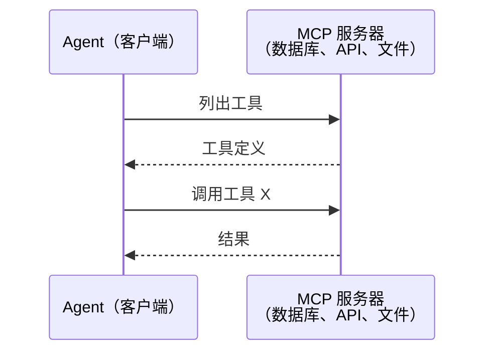

MCP 是**Agent 对工具**通信。它不帮助 Agent 互相通信。

### A2A（Agent 对 Agent 协议）

**创建者：** Google（现属 Linux 基金会，`lf.a2a.v1`）
**规范版本：** 1.0.0
**问题：** 自主 Agent 如何协作、协商并将任务委派给彼此？

A2A 是用于**点对点 Agent 协作**的协议。MCP 连接 Agent 到工具，A2A 连接 Agent 到其他 Agent。每个 Agent 在知名 URL 发布**Agent Card**，其他 Agent 发现、协商并委派任务给它。

#### A2A 如何工作

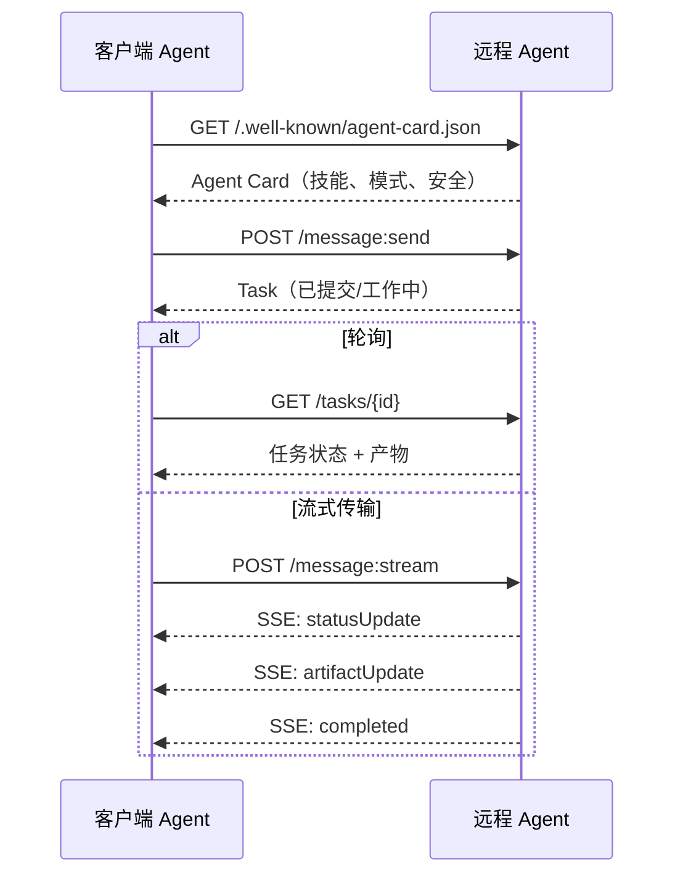

#### 真实的 Agent Card

这是 A2A Agent Card 在实际中的样子。在 `GET /.well-known/agent-card.json` 上提供：

```json
{
  "name": "研究 Agent",
  "description": "搜索文档并总结发现",
  "version": "1.0.0",
  "supportedInterfaces": [
    {
      "url": "https://research-agent.example.com/a2a/v1",
      "protocolBinding": "JSONRPC",
      "protocolVersion": "1.0"
    },
    {
      "url": "https://research-agent.example.com/a2a/rest",
      "protocolBinding": "HTTP+JSON",
      "protocolVersion": "1.0"
    }
  ],
  "provider": {
    "organization": "你的公司",
    "url": "https://example.com"
  },
  "capabilities": {
    "streaming": true,
    "pushNotifications": false
  },
  "defaultInputModes": ["text/plain", "application/json"],
  "defaultOutputModes": ["text/plain", "application/json"],
  "skills": [
    {
      "id": "web-research",
      "name": "网络研究",
      "description": "搜索网络并综合发现",
      "tags": ["research", "search", "summarization"],
      "examples": ["研究 React 19 的最新变化"]
    },
    {
      "id": "doc-analysis",
      "name": "文档分析",
      "description": "阅读并分析技术文档",
      "tags": ["docs", "analysis"],
      "inputModes": ["text/plain", "application/pdf"],
      "outputModes": ["application/json"]
    }
  ],
  "securitySchemes": {
    "bearer": {
      "httpAuthSecurityScheme": {
        "scheme": "Bearer",
        "bearerFormat": "JWT"
      }
    }
  },
  "security": [{ "bearer": [] }]
}
```

关键注意点：
- **技能 (Skills)** 是 Agent 能做什么。每个都有 ID、标签和支持的输入/输出 MIME 类型。这是客户端 Agent 决定此远程 Agent 是否能处理其请求的方式。
- **supportedInterfaces** 列出了多个协议绑定。单个 Agent 可以同时使用 JSON-RPC、REST 和 gRPC。
- **安全 (Security)** 内置在 Card 中。客户端在进行任何请求之前就知道需要什么认证。

#### 任务生命周期

任务是 A2A 中的核心工作单元。它们在定义的状态间移动：

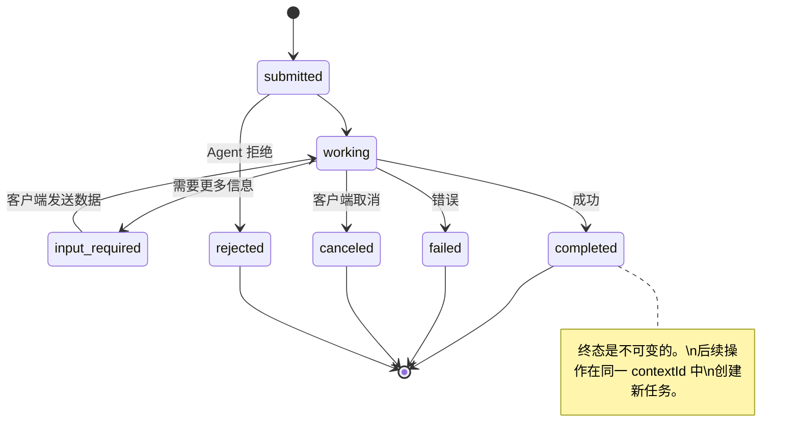

所有 8 个状态（规范还定义了 `UNSPECIFIED` 作为哨兵值，此处省略）：

| 状态 | 终态？ | 含义 |
|---|---|---|
| `TASK_STATE_SUBMITTED` | 否 | 已确认，尚未处理 |
| `TASK_STATE_WORKING` | 否 | 正在处理 |
| `TASK_STATE_INPUT_REQUIRED` | 否 | Agent 需要客户端更多信息 |
| `TASK_STATE_AUTH_REQUIRED` | 否 | 需要认证 |
| `TASK_STATE_COMPLETED` | 是 | 成功完成 |
| `TASK_STATE_FAILED` | 是 | 出错完成 |
| `TASK_STATE_CANCELED` | 是 | 完成前取消 |
| `TASK_STATE_REJECTED` | 是 | Agent 拒绝了任务 |

一旦任务达到终态，它就不可变了。没有更多消息。后续操作在同一 `contextId` 中创建新任务。

#### 线路格式

A2A 使用 JSON-RPC 2.0。以下是真实消息交换的样子：

**客户端发送任务：**
```json
{
  "jsonrpc": "2.0",
  "id": 1,
  "method": "SendMessage",
  "params": {
    "message": {
      "messageId": "msg-001",
      "role": "ROLE_USER",
      "parts": [{ "text": "研究 React 19 编译器特性" }]
    },
    "configuration": {
      "acceptedOutputModes": ["text/plain", "application/json"],
      "historyLength": 10
    }
  }
}
```

**Agent 以任务响应：**
```json
{
  "jsonrpc": "2.0",
  "id": 1,
  "result": {
    "task": {
      "id": "task-abc-123",
      "contextId": "ctx-xyz-789",
      "status": {
        "state": "TASK_STATE_COMPLETED",
        "timestamp": "2026-03-27T10:30:00Z"
      },
      "artifacts": [
        {
          "artifactId": "art-001",
          "name": "research-results",
          "parts": [{
            "data": {
              "findings": [
                "React 19 编译器自动记忆化组件",
                "不再需要手动 useMemo/useCallback",
                "编译器在构建时运行，而非运行时"
              ]
            },
            "mediaType": "application/json"
          }]
        }
      ]
    }
  }
}
```

**通过 SSE 流式传输：**
```text
POST /message:stream HTTP/1.1
Content-Type: application/json
A2A-Version: 1.0

data: {"task":{"id":"task-123","status":{"state":"TASK_STATE_WORKING"}}}

data: {"statusUpdate":{"taskId":"task-123","status":{"state":"TASK_STATE_WORKING","message":{"role":"ROLE_AGENT","parts":[{"text":"搜索文档中..."}]}}}}

data: {"artifactUpdate":{"taskId":"task-123","artifact":{"artifactId":"art-1","parts":[{"text":"部分发现..."}]},"append":true,"lastChunk":false}}

data: {"statusUpdate":{"taskId":"task-123","status":{"state":"TASK_STATE_COMPLETED"}}}
```

### ACP（Agent 通信协议）

**创建者：** IBM / BeeAI
**规范版本：** 0.2.0（OpenAPI 3.1.1）
**状态：** 正在合并到 Linux 基金会下的 A2A
**问题：** Agent 如何在完全可审计、会话连续和轨迹跟踪的情况下通信？

ACP 是**企业协议**。与许多摘要声称的不同，ACP **不**使用 JSON-LD。它是一个通过 OpenAPI 定义的简单 REST/JSON API。它特别之处在于 **TrajectoryMetadata**：每个 Agent 响应可以携带产生它的推理步骤和工具调用的详细日志。

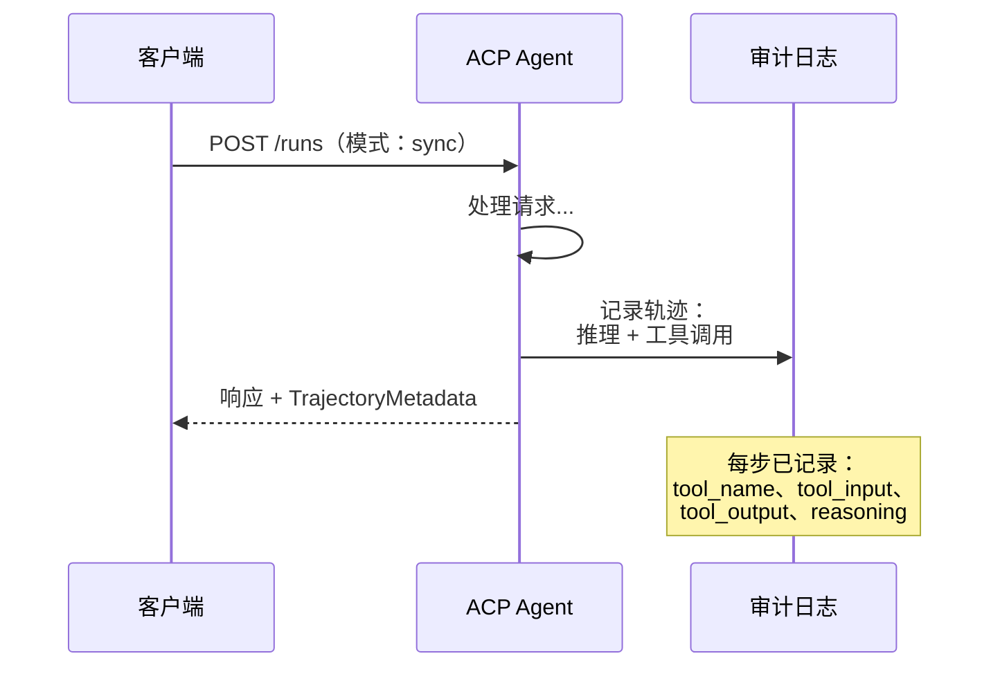

#### ACP 中的 Agent 发现

ACP 定义了四种发现方法：

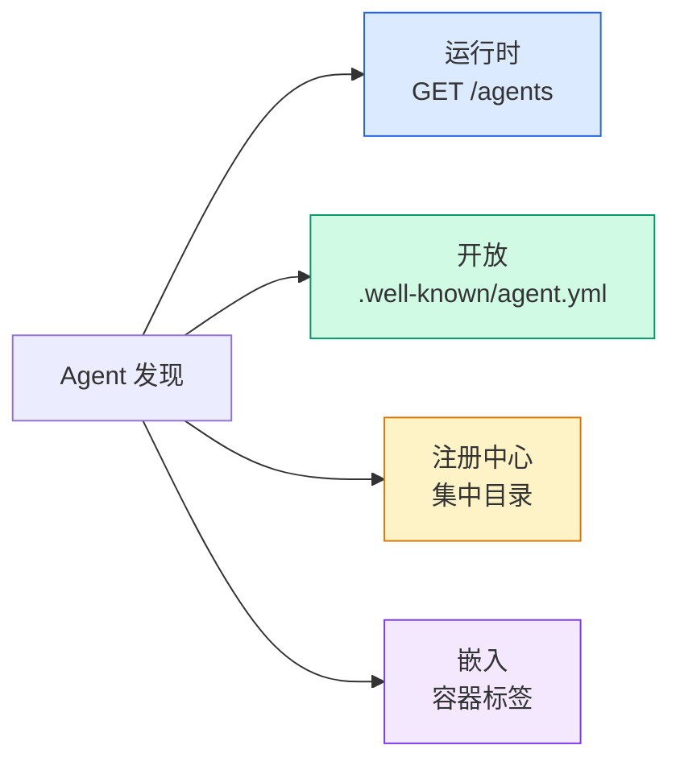

**AgentManifest** 比 A2A 的 Agent Card 更简单：

```json
{
  "name": "summarizer",
  "description": "带来源引用的文档摘要",
  "input_content_types": ["text/plain", "application/pdf"],
  "output_content_types": ["text/plain", "application/json"],
  "metadata": {
    "tags": ["summarization", "RAG"],
    "framework": "BeeAI",
    "capabilities": [
      {
        "name": "文档摘要",
        "description": "将长文档浓缩为要点"
      }
    ],
    "recommended_models": ["llama3.3:70b-instruct-fp16"],
    "license": "Apache-2.0",
    "programming_language": "Python"
  }
}
```

#### 运行生命周期

ACP 使用"运行 (Runs)"而非"任务 (Tasks)"。运行是具有三种模式的 Agent 执行：

| 模式 | 行为 |
|---|---|
| `sync` | 阻塞。响应包含完整结果。 |
| `async` | 立即返回 202。轮询 `GET /runs/{id}` 获取状态。 |
| `stream` | SSE 流。Agent 工作时触发事件。 |

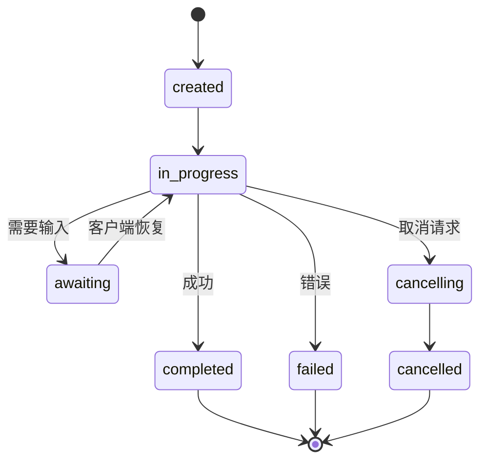

#### TrajectoryMetadata（审计追踪）

这是 ACP 的关键差异化特性。每个消息部分都可以包含显示 Agent 具体做了什么的元数据：

```json
{
  "role": "agent/researcher",
  "parts": [
    {
      "content_type": "text/plain",
      "content": "旧金山的天气是 72 华氏度，晴朗。",
      "metadata": {
        "kind": "trajectory",
        "message": "我需要检查这个位置的天气",
        "tool_name": "weather_api",
        "tool_input": { "location": "San Francisco, CA" },
        "tool_output": { "temperature": 72, "condition": "sunny" }
      }
    }
  ]
}
```

对于受监管行业来说，这是金矿。每个答案都带有可证明的推理链：调用了哪些工具，使用了什么输入，收到了什么输出。不再是黑箱。

ACP 还支持用于来源归属的 **CitationMetadata**：

```json
{
  "kind": "citation",
  "start_index": 0,
  "end_index": 47,
  "url": "https://weather.gov/sf",
  "title": "NWS 旧金山天气预报"
}
```

### ANP（Agent 网络协议）

**创建者：** 开源社区（由 GaoWei Chang 创立）
**仓库：** [github.com/agent-network-protocol/AgentNetworkProtocol](https://github.com/agent-network-protocol/AgentNetworkProtocol)
**问题：** 来自不同组织的 Agent 如何在没有中央权威的情况下互相信任？

ANP 是**去中心化身份协议**。它使用 W3C 去中心化标识符 (DID) 和端到端加密构建信任。与 A2A 通过已知端点发现 Agent 不同，ANP 让 Agent 通过密码学证明其身份。

ANP 有三层：

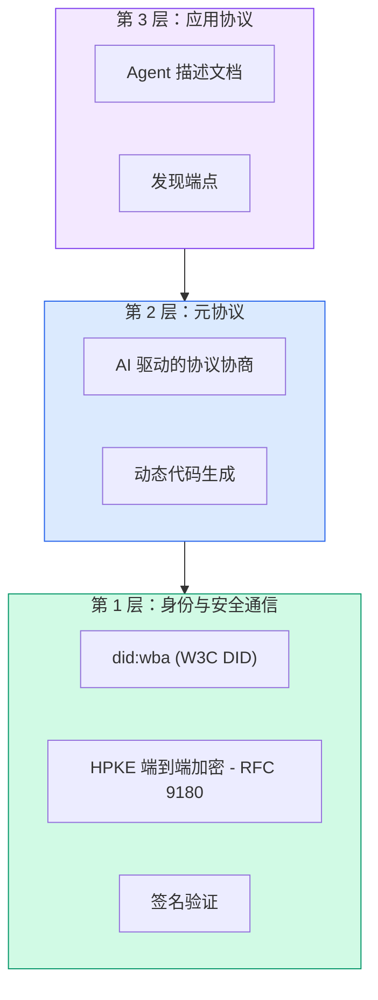

#### DID 文档（真实结构）

ANP 使用名为 `did:wba`（基于 Web 的 Agent）的自定义 DID 方法。DID `did:wba:example.com:user:alice` 解析到 `https://example.com/user/alice/did.json`：

```json
{
  "@context": [
    "https://www.w3.org/ns/did/v1",
    "https://w3id.org/security/suites/jws-2020/v1",
    "https://w3id.org/security/suites/secp256k1-2019/v1"
  ],
  "id": "did:wba:example.com:user:alice",
  "verificationMethod": [
    {
      "id": "did:wba:example.com:user:alice#key-1",
      "type": "EcdsaSecp256k1VerificationKey2019",
      "controller": "did:wba:example.com:user:alice",
      "publicKeyJwk": {
        "crv": "secp256k1",
        "x": "NtngWpJUr-rlNNbs0u-Aa8e16OwSJu6UiFf0Rdo1oJ4",
        "y": "qN1jKupJlFsPFc1UkWinqljv4YE0mq_Ickwnjgasvmo",
        "kty": "EC"
      }
    },
    {
      "id": "did:wba:example.com:user:alice#key-x25519-1",
      "type": "X25519KeyAgreementKey2019",
      "controller": "did:wba:example.com:user:alice",
      "publicKeyMultibase": "z9hFgmPVfmBZwRvFEyniQDBkz9LmV7gDEqytWyGZLmDXE"
    }
  ],
  "authentication": [
    "did:wba:example.com:user:alice#key-1"
  ],
  "keyAgreement": [
    "did:wba:example.com:user:alice#key-x25519-1"
  ],
  "humanAuthorization": [
    "did:wba:example.com:user:alice#key-1"
  ],
  "service": [
    {
      "id": "did:wba:example.com:user:alice#agent-description",
      "type": "AgentDescription",
      "serviceEndpoint": "https://example.com/agents/alice/ad.json"
    }
  ]
}
```

关键注意点：
- **密钥分离**被强制执行。签名密钥 (secp256k1) 与加密密钥 (X25519) 是分开的。
- **`humanAuthorization`** 是 ANP 独有的。这些密钥在使用前需要明确的人工批准（生物识别、密码、HSM）。资金转账等高风险操作通过此路径。
- **`keyAgreement`** 密钥用于 HPKE 端到端加密 (RFC 9180)。
- **service** 部分链接到 Agent 描述文档。

#### ANP 中信任如何工作

ANP **不**使用信任网络或背书图。信任是双边的，并在每次交互中验证：

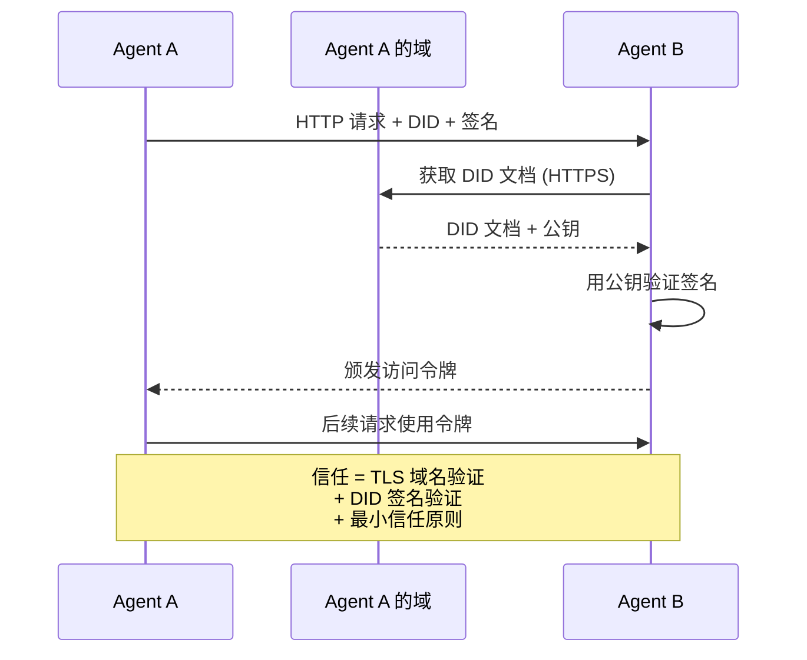

信任来自三个来源：
1. **域级 TLS** 验证 DID 文档主机
2. **DID 密码学签名** 验证 Agent 的身份
3. **最小信任原则** 只授予最低权限

没有基于流言的信任传播或 PageRank 评分。你通过每个 Agent 的 DID 直接验证。

#### 元协议协商

这是 ANP 最新颖的功能。当来自不同生态系统的两个 Agent 遇到时，它们不需要预先约定的数据格式。它们用自然语言协商：

```json
{
  "action": "protocolNegotiation",
  "sequenceId": 0,
  "candidateProtocols": "我可以使用以下方式通信：\n1. 带酒店预订模式的 JSON-RPC\n2. 带 OpenAPI 3.1 规范的 REST\n3. 通过 HTTP 的自然语言",
  "modificationSummary": "初始提案",
  "status": "negotiating"
}
```

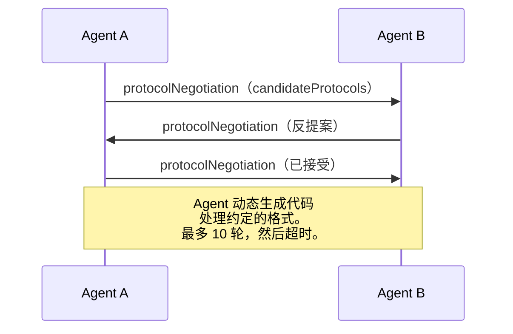

Agent 来回交互（最多 10 轮）直到就格式达成一致，然后动态生成代码来处理它。状态值：`negotiating`、`rejected`、`accepted`、`timeout`。

这意味着两个从未见过彼此的 Agent 可以弄清楚如何通信，而无需任何人预定义共享模式。

### 比较（已纠正）

| | MCP | A2A | ACP | ANP |
|---|---|---|---|---|
| **创建者** | Anthropic | Google / Linux 基金会 | IBM / BeeAI | 社区 |
| **规范格式** | JSON-RPC | JSON-RPC / REST / gRPC | OpenAPI 3.1 (REST) | JSON-RPC |
| **主要用途** | Agent 到工具 | Agent 到 Agent | Agent 到 Agent | Agent 到 Agent |
| **发现** | 工具列表 | `/.well-known/agent-card.json` | `GET /agents`、`/.well-known/agent.yml` | `/.well-known/agent-descriptions`、DID 服务端点 |
| **身份** | 隐式（本地） | 安全方案（OAuth、mTLS） | 服务器级 | W3C DID（`did:wba`）加端到端加密 |
| **审计追踪** | 不适用 | 基础（任务历史） | TrajectoryMetadata（工具调用、推理） | 未正式规定 |
| **状态机** | 不适用 | 9 个任务状态 | 7 个运行状态 | 不适用 |
| **流式传输** | 不适用 | SSE | SSE | 传输无关 |
| **独特特性** | 工具模式 | Agent Card + 技能 | 轨迹审计追踪 | 元协议协商 |
| **最适合** | 工具和数据 | 动态协作 | 受监管行业 | 跨组织信任 |
| **状态** | 稳定 | 稳定 (v1.0) | 正在合并到 A2A | 活跃开发 |

### 它们如何协同工作

这些协议不是互斥的。现实的企业系统使用多个：

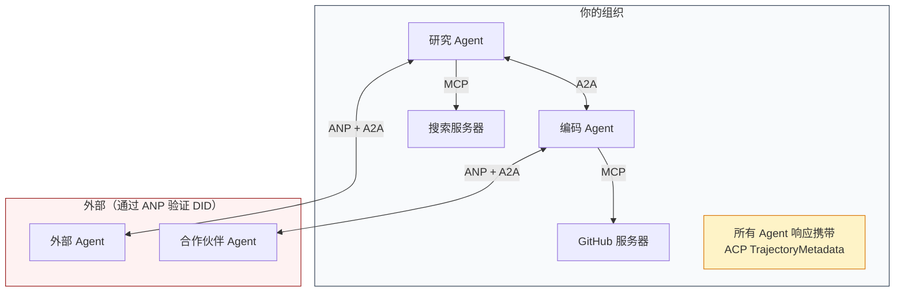

- **MCP** 连接每个 Agent 到其工具
- **A2A** 处理 Agent 之间的协作（内部和外部）
- **ACP** 将响应包装在轨迹元数据中以实现可审计性
- **ANP** 为你无法控制的 Agent 提供身份验证

## 动手实现

（代码部分保留原样，不翻译代码块）

## 出错时怎么办

协议解决了正常路径。以下是生产环境中出问题的地方：

**模式漂移。** Agent A 发布一个宣传 `application/json` 输出的 Agent Card。但 JSON 模式在版本之间发生了变化。Agent B 解析旧格式得到垃圾数据。修复：版本化你的技能和输出模式。A2A 规范因此在 Agent Card 上支持 `version`。

**状态机违规。** Agent 处理器产生了 `completed` 事件，然后尝试产生更多产物。任务是不可变的。你的代码静默丢弃更新或抛出异常。修复：在产生之前检查终态。上面的 `TaskManager` 通过终态后的 `break` 来强制执行此操作。

**信任解析失败。** Agent A 尝试验证 Agent B 的 DID，但 Agent B 的域名宕机了。无法获取 DID 文档。你是失败开放（接受未验证的 Agent）还是失败关闭（拒绝一切）？ANP 建议以最小信任原则失败关闭。

**轨迹膨胀。** ACP 轨迹日志功能强大但昂贵。一个复杂 Agent 每次运行进行 200 次工具调用会产生大量审计条目。修复：以可配置的详细级别记录轨迹。为合规性记录工具名称和输入输出，跳过非受监管工作负载的推理步骤。

**发现惊群效应。** 50 个 Agent 在启动时同时查询 `GET /agents`。修复：使用 TTL 缓存 Agent Card，错开发现间隔，或使用基于推送的注册替代轮询。

## 用框架实现

### 真实实现

**A2A** 最成熟。Google 的[官方规范](https://github.com/google/A2A)在 Linux 基金会下开源。Python 和 TypeScript 的 SDK。如果你的 Agent 需要动态发现和协作，从这里开始。

**ACP** 正在合并到 A2A。IBM 的 [BeeAI 项目](https://github.com/i-am-bee/acp)创建了 ACP 作为 REST 优先的替代方案，但轨迹元数据概念正在被吸收到 A2A 生态系统中。即使你使用 A2A 作为传输，也使用 ACP 模式（轨迹日志、运行生命周期）。

**ANP** 最具实验性。[社区仓库](https://github.com/agent-network-protocol/AgentNetworkProtocol)有一个 Python SDK（AgentConnect）。元协议协商概念确实新颖。值得在跨组织 Agent 部署中关注。

**MCP** 已在第 13 阶段讲解。如果你想让 Agent 使用工具，MCP 就是标准。

### 选择正确的协议

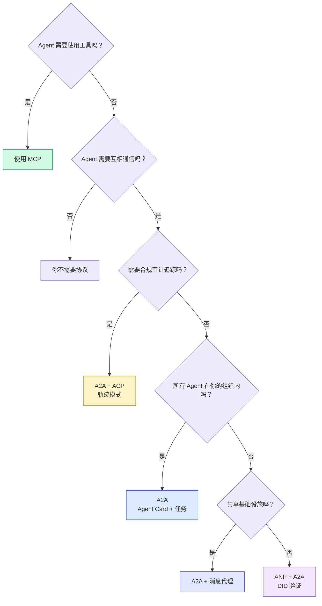

## 产出物

本课产出：
- `code/main.ts` -- 所有四种协议模式的完整实现
- `outputs/prompt-protocol-selector.md` -- 帮助你为系统选择协议的提示词

## 练习题

1. **多跳任务委派。** 扩展 `TaskManager`，使 Agent 处理器可以将子任务委派给其他 Agent。研究员接收任务，将"搜索"和"摘要"子任务委派给两个专业 Agent，等待两者完成，然后将结果合并到自己的产物中。

2. **流式审计追踪。** 修改 `AuditableRunner` 以支持流式模式。不是等待完整结果，而是随着轨迹条目的添加实时产生 `AuditEntry` 更新。使用产生审计快照的异步生成器。

3. **DID 轮换。** 在 `IdentityRegistry` 中添加密钥轮换。Agent 应该能够发布带有更新密钥的新 DID 文档，同时维护 `previousDid` 引用。验证器在宽限期内应接受来自当前和先前密钥的签名。

4. **协议协商。** 实现 ANP 的元协议概念。两个 Agent 交换带有候选格式的 `protocolNegotiation` 消息（例如，"我可以说 JSON-RPC"对比"我更喜欢 REST"）。最多 3 轮后，它们就格式达成一致或超时。约定的格式决定它们使用哪个 `TaskManager` 或 `AuditableRunner`。

5. **限速发现。** 添加一个 `RateLimitedRegistry` 包装器，使用可配置的 TTL 缓存 Agent Card 查找，并限制每个 Agent 每秒的发现查询。模拟启动时 100 个 Agent 互相发现的惊群效应并测量差异。

## 术语速查表

| 术语 | 人们常说的 | 实际含义 |
|------|-----------|---------|
| MCP | "AI 工具的协议" | Agent 发现和使用工具的客户端-服务器协议。Agent 对工具，非 Agent 对 Agent。 |
| A2A | "Google 的 Agent 协议" | Linux 基金会下的 Agent 协作点对点协议。通过 Agent Card 发现，9 状态任务生命周期，通过 SSE 流式传输。支持 JSON-RPC、REST 和 gRPC 绑定。 |
| ACP | "企业 Agent 消息传递" | IBM/BeeAI 的 Agent 运行 REST API，带有 TrajectoryMetadata：每个响应携带完整的推理链和工具调用。正在合并到 A2A。 |
| ANP | "去中心化 Agent 身份" | 使用 `did:wba`（DID）进行密码学身份、HPKE 端到端加密和 AI 驱动元协议协商的社区协议，用于从未见过的 Agent 之间。 |
| Agent Card | "Agent 的名片" | 在 `/.well-known/agent-card.json` 的 JSON 文档，描述技能、支持的 MIME 类型、安全方案和协议绑定。 |
| DID | "去中心化 ID" | W3C 标准，用于在 Agent 自己的域上托管的密码学可验证身份。ANP 使用 `did:wba` 方法。 |
| TrajectoryMetadata | "审计收据" | ACP 将推理步骤、工具调用及其输入/输出附加到每个 Agent 响应的机制。 |
| 元协议 | "Agent 协商如何通信" | ANP 的方法，Agent 使用自然语言动态商定数据格式，然后生成代码来处理。 |
| 任务 | "工作单元" | A2A 的有状态对象，跟踪从提交到完成的工作。终态后不可变。 |

## 延伸阅读

- [Google A2A 规范](https://github.com/google/A2A) -- 官方规范和 SDK（v1.0.0，Linux 基金会）
- [IBM/BeeAI ACP 规范](https://github.com/i-am-bee/acp) -- Agent 运行和轨迹元数据的 OpenAPI 3.1 规范
- [Agent 网络协议](https://github.com/agent-network-protocol/AgentNetworkProtocol) -- 基于 DID 的身份、端到端加密、元协议协商
- [模型上下文协议文档](https://modelcontextprotocol.io/) -- Anthropic 的 MCP 规范（第 13 阶段涵盖）
- [W3C 去中心化标识符](https://www.w3.org/TR/did-core/) -- ANP 的身份标准基础
- [RFC 9180 (HPKE)](https://www.rfc-editor.org/rfc/rfc9180) -- ANP 用于端到端加密的加密方案
- [FIPA Agent 通信语言](http://www.fipa.org/specs/fipa00061/SC00061G.html) -- 现代 Agent 协议的学术前身
