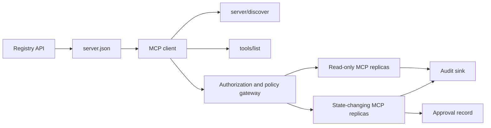

# Capstone 13: Stateless MCP Server with Registry and Governance | 无状态 MCP 服务器：注册中心与治理

> Production MCP is not one server process. It is a chain of contracts: publishable metadata, live discovery, a stateless request envelope, authorization, policy, audit, and deployment evidence.

> **【中文解读】** 本课是毕业项目：构建一台可上生产的 MCP 服务器。难点不是把函数注册进框架，而是守住一条"契约链"——可发布的注册中心元数据、实时发现、无状态请求信封、授权、策略、审计与部署证据，环环相扣。MCP `2026-07-28` 删除了 initialize 握手与协议会话，任何副本都必须能独立处理任何请求，这让"治理"从部署配置上升为协议本身的约束。

> **【拓展：MCP 生产生态】** 2026 年 MCP 已是 AI 工具调用的事实标准：Anthropic、OpenAI、Google 与主流 IDE 均内置 MCP 客户端，官方 Registry 用版本化的 server.json 组织服务器发布与发现。本课把 Phase 13 的四个深潜课（工具契约、可靠性、注册中心供应链、一致性运维）收束成一个端到端交付物，是整个课程治理维度的顶点。

> 🔗 **【前置】** 学本课前先完成 Phase 11（LLM 工程）、Phase 13（工具与 MCP，尤其第 28-31 课）、Phase 14（agents）、Phase 17（基础设施）、Phase 18（安全）。本课不引入新知识，只检验你能否把已学的契约组装成一个经得起安全审查的系统。

**Type:** Capstone | **类型:** 结业项目
**Languages:** Python and TypeScript reference models; any production language | **语言:** Python 与 TypeScript 参考模型；任意生产语言
**Prerequisites:** Phase 11, Phase 13, Phase 14, Phase 17, and Phase 18 | **前置知识:** Phase 11、Phase 13、Phase 14、Phase 17、Phase 18
**Required MCP deep dives:** [Lesson 28: Tool Contracts](../../../13-tools-and-protocols/28-mcp-tool-contracts-and-content/docs/en.md), [Lesson 29: Reliability](../../../13-tools-and-protocols/29-mcp-reliability-cancellation-and-flow-control/docs/en.md), [Lesson 30: Registry Supply Chain](../../../13-tools-and-protocols/30-mcp-registry-supply-chain-and-drift/docs/en.md), and [Lesson 31: Conformance Operations](../../../13-tools-and-protocols/31-mcp-conformance-versioning-and-operations/docs/en.md) | **必读 MCP 深潜课:** 第 28 课（工具契约）、第 29 课（可靠性）、第 30 课（注册中心供应链）、第 31 课（一致性运维）
**Protocol target:** MCP `2026-07-28` | **协议目标:** MCP `2026-07-28`
**Time:** ~25 hours | **时间:** 约 25 小时

## Learning Objectives | 学习目标

- Implement the stateless MCP request and result envelope.
  中文翻译：实现无状态的 MCP 请求与结果信封。
- Keep Registry metadata separate from live protocol discovery.
  中文翻译：把注册中心元数据与实时协议发现分开维护。
- Build deterministic, cache-aware tool discovery.
  中文翻译：构建确定性的、可缓存的工具发现。
- Enforce issuer, audience, scope, and approval policy for every tool call.
  中文翻译：对每次工具调用强制校验签发者、受众、权限范围与审批策略。
- Deploy Streamable HTTP without session affinity.
  中文翻译：部署不带会话粘性的 Streamable HTTP。
- Prove behavior at the wire, authorization, policy, registry, and audit boundaries.
  中文翻译：在线格式、授权、策略、注册中心与审计五个边界上验证行为。

## Required MCP Prerequisite Path | 必修 MCP 前置路径

> **【中文解读】** 本节把四节 Phase 13 深潜课定义为毕业项目的"输入契约"：第 28 课给出工具/内容/分页/错误契约，第 29 课给出取消竞态、deadline、幂等与重连语义，第 30 课给出命名空间、准入、漂移与回滚证据，第 31 课给出金样本/负样本与发布门控。毕业项目做的是集成这些产物，而不是用一条 happy-path 的 SDK 测试替代它们。

Complete the four linked Phase 13 lessons in order before treating this capstone as production-ready:

1. [Lesson 28](../../../13-tools-and-protocols/28-mcp-tool-contracts-and-content/docs/en.md) defines the tool, schema, content, pagination, completion, routing, and error contracts this server must expose.
2. [Lesson 29](../../../13-tools-and-protocols/29-mcp-reliability-cancellation-and-flow-control/docs/en.md) defines cancellation races, deadlines, idempotency, backpressure, retry, and reconnect behavior.
3. [Lesson 30](../../../13-tools-and-protocols/30-mcp-registry-supply-chain-and-drift/docs/en.md) defines namespace, provenance, admission pin, Registry status, drift, ledger, and rollback evidence.
4. [Lesson 31](../../../13-tools-and-protocols/31-mcp-conformance-versioning-and-operations/docs/en.md) defines golden and negative transcripts, strict version eras, SDK differential checks, proxy proof, redaction, health, and release gating.

The capstone integrates those artifacts. It does not replace them with one happy-path SDK test.

## The Problem | 问题引入

> **【中文解读】** 难点不在注册一个函数，而在让"六个真相"保持对齐：server.json 说服务器在哪、server/discover 说进程此刻支持什么、每个请求自带协议版本与客户端能力、授权把调用者绑到正确的签发者/资源/权限范围、策略决定这一次具体动作能否执行、审计在不泄密的前提下记录穿越边界的内容。任何一条漂移，轻则目录里挂着一台连不上的服务器，重则放行一个未经审批的破坏性操作。

An internal platform needs read-only data tools and a small set of state-changing tools. Developers must be able to discover the server, understand how to connect, inspect its live capabilities, and call only the operations they are authorized to use.

> 一个内部平台需要只读数据工具和一小批改状态的工具。开发者必须能发现这台服务器、弄清如何连接、检查其实时能力，并且只能调用自己被授权的操作。

The difficult part is not registering a function. The difficult part is keeping six different truths aligned:

1. `server.json` says where the server can be installed or reached.
2. `server/discover` says what the live process supports now.
3. Every request says which protocol revision and client capabilities it uses.
4. Authorization binds a caller to the correct issuer, resource, and scopes.
5. Policy decides whether this specific action may run.
6. Audit evidence records what crossed the boundary without leaking secrets or sensitive payloads.

> 六个真相依次是：`server.json` 说服务器在哪安装或接入；`server/discover` 说进程现在支持什么；每个请求声明自己用的协议修订号与客户端能力；授权把调用者绑定到正确的签发者、资源与权限范围；策略决定这个具体动作可否执行；审计在不泄露秘密或敏感负载的前提下记录穿越边界的内容。

If any one of these drifts, the platform may list a server that cannot be reached, route an incompatible client, accept a token minted for another resource, or expose a destructive action without the expected review.

> 任何一条漂移，平台就可能列出一台根本连不上的服务器、把不兼容的客户端路由进来、接受一张为别的资源签发的令牌，或在无人审查的情况下暴露一个破坏性操作。

## The Two Discovery Layers | 两层发现机制

> **【中文解读】** 注册中心与实时服务器回答两个不同的问题：`server.json` + Registry API 回答"这台服务器是什么、包或远程端点在哪、如何配置"；`server/discover` 回答"这个进程当前支持哪些协议版本、能力、扩展与身份"。两层各有各的 schema：Registry schema 版本与 MCP 协议修订号彼此独立，别把两个日期改成一样。schema 合法也不等于命名空间所有权——只有通过 `example.com` 域名验证的发布者才能用 `com.example/*` 命名空间。

The Registry and the live MCP server answer different questions.

| Layer | Contract | Question it answers |
|---|---|---|
| Publication | `server.json` and Registry API | What is this server, where is its package or remote endpoint, and how is it configured? |
| Runtime | `server/discover` | Which protocol versions, capabilities, extensions, and server identity does this process support? |

The official Registry uses a versioned `server.json` schema. A remote entry can name a Streamable HTTP URL:

```json
{
  "$schema": "https://static.modelcontextprotocol.io/schemas/2025-12-11/server.schema.json",
  "name": "com.example/internal-readonly",
  "title": "Internal Read-Only Tools",
  "description": "Read-only incident and data lookup tools.",
  "version": "1.0.0",
  "remotes": [
    {
      "type": "streamable-http",
      "url": "https://mcp.internal.example.com/readonly"
    }
  ]
}
```

The Registry schema version and the MCP protocol revision are independent. Do not rewrite one date to match the other. Validate each document against its own contract.

> Registry schema 版本与 MCP 协议修订号相互独立。不要把一个日期改写成另一个；每份文档都要用它自己的契约来校验。

Schema validity does not prove namespace ownership. A publisher verified for `example.com` uses the reverse-DNS namespace `com.example/*` or one of its child namespaces. The Registry authentication flow proves that ownership. Keeping the domain labels in their ordinary order names a different namespace.

> schema 合法并不证明命名空间所有权。通过 `example.com` 验证的发布者使用反向 DNS 命名空间 `com.example/*` 或其子命名空间；Registry 认证流程负责证明这层所有权。把域名标签按原顺序排列，指名的是另一个命名空间。

The stdlib model's `validate_registry_document` function is intentionally a partial remote-profile validator. It checks the official required `name`, `description`, and `version` fields; the optional `title`; the published name and length constraints; concrete-version shape; and each `streamable-http` or `sse` remote's HTTP(S) URL shape. It additionally requires a non-empty `remotes` list because this capstone always live-probes a remote. `validate_publisher_namespace` separately checks the name against the verified publisher domain, while `validate_runtime_alignment` compares the publication name and version with live `serverInfo`. The official schema also supports package-only records and more remote fields. Before publication, validate the entire document with the pinned official JSON Schema or `mcp-publisher`; do not present this dependency-free subset as full schema validation.

> 标准库参考模型里的 `validate_registry_document` 刻意只做"远程 profile"的部分校验：官方必填的 `name`/`description`/`version`、可选 `title`、命名与长度约束、具体版本号形状、每个 `streamable-http` 或 `sse` 远程的 HTTP(S) URL 形状，并因本课总是实测远程端点而额外要求非空 `remotes`。`validate_publisher_namespace` 另行把名字对照已验证的发布者域名，`validate_runtime_alignment` 则把发布名字与版本和实时 `serverInfo` 比对。正式发布前，请用钉住的官方 JSON Schema 或 `mcp-publisher` 校验整份文档，不要把这个零依赖子集当成完整 schema 校验。

The server must implement `server/discover`; a client may call it before other methods. This capstone client does so after resolving the endpoint, and receives the current protocol revision and live capabilities:

```json
{
  "resultType": "complete",
  "supportedVersions": ["2026-07-28"],
  "capabilities": {
    "tools": {
      "listChanged": false
    }
  },
  "_meta": {
    "io.modelcontextprotocol/serverInfo": {
      "name": "com.example/internal-readonly",
      "version": "1.0.0"
    }
  },
  "ttlMs": 3600000,
  "cacheScope": "public"
}
```

A private catalog may index extra ownership, review, or lifecycle data, but it must not invent that data as MCP wire fields or root `server.json` fields. Store organizational policy beside the published record. When public custom metadata is necessary, use the Registry's `_meta.io.modelcontextprotocol.registry/publisher-provided` extension and stay within its 4 KB limit.

> 私有目录可以索引额外的所有权、评审或生命周期数据，但不得把这些数据伪造成 MCP 线格式字段或 server.json 根字段。组织策略应存放在发布记录旁边。确需公开自定义元数据时，使用 Registry 的 `_meta.io.modelcontextprotocol.registry/publisher-provided` 扩展并遵守 4 KB 上限。

## Stateless MCP Core | 无状态 MCP 核心

> **【中文解读】** MCP `2026-07-28` 移除了协议会话与 `initialize` / `notifications/initialized` 握手，也移除了 `Mcp-Session-Id`。协议上下文改由每个请求的 `params._meta` 携带——版本与能力是"请求事实"而非"连接事实"，负载均衡器可以把相邻请求发给不同副本。普通结果带 `resultType: "complete"` 并在 `_meta` 里放服务器身份；版本缺失或非字符串是 `-32602`，只有"给了字符串但不支持"才用 `-32022`，且 data 必须恰好是 `{"supported": [...], "requested": "..."}`。

MCP revision `2026-07-28` removes protocol sessions and the `initialize` / `notifications/initialized` handshake. It also removes `Mcp-Session-Id`.

> MCP 修订版 `2026-07-28` 移除了协议会话与 `initialize` / `notifications/initialized` 握手，也移除了 `Mcp-Session-Id`。

Every request carries protocol context in `params._meta`:

```json
{
  "io.modelcontextprotocol/protocolVersion": "2026-07-28",
  "io.modelcontextprotocol/clientCapabilities": {},
  "io.modelcontextprotocol/clientInfo": {
    "name": "internal-platform-client",
    "version": "1.0.0"
  }
}
```

The version and capabilities are request facts, not connection facts. A load balancer may send consecutive requests to different healthy replicas because either replica can validate the request from the message itself.

> 版本与能力是请求事实，不是连接事实。负载均衡器可以把相邻请求发给不同的健康副本，因为任一副本都能从消息本身完成校验。

Ordinary results include `resultType: "complete"`. Servers should place their identity in `_meta.io.modelcontextprotocol/serverInfo` on each result. A missing or non-string protocol version is invalid params `-32602`. Error `-32022` is only for a supplied string that is unsupported, with exactly `{"supported": ["2026-07-28"], "requested": "..."}` as its data.

### Cacheable discovery

> **【中文解读】** `tools/list` 必须对同一有效工具集返回确定性结果：稳定的工具顺序让相同列表能复用提示缓存；`ttlMs` 是给客户端的新鲜度提示；`cacheScope` 决定缓存结果可公共共享还是私有。按用户授权的工具可见性通常应产出 `private`——绝不要把用户专属的工具可见性放进共享公共缓存。

`tools/list` must be deterministic for the same effective tool set. The result includes:

- `ttlMs`, a freshness hint for the client;
- `cacheScope`, either `public` or `private`;
- a stable tool order so identical lists can reuse prompt caches;
- `resultType: "complete"` and server identity metadata.

Per-user authorization should normally produce `cacheScope: "private"`. Do not put user-specific tool visibility behind a shared public cache.

## Streamable HTTP | Streamable HTTP 传输

> **【中文解读】** Streamable HTTP 只暴露一个接受 POST 的 MCP 端点，每个 JSON-RPC 请求或通知各占一个 POST。请求的响应要么是单个 JSON 对象，要么是限定于该请求的 SSE 流；长活的 `subscriptions/listen` 承载选入的变更通知。当前传输没有独立 GET 流、会话 DELETE、会话头或 `Last-Event-ID` 回放。每个请求还要带镜像头部（`MCP-Protocol-Version`、`Mcp-Method`、`Mcp-Name`），不匹配就按 `-32020` 拒绝——这挡住"头说 A、body 说 B"的走私。

A network server exposes one MCP endpoint that accepts POST. Each JSON-RPC request or notification gets its own POST.

For a request, the server returns either one JSON object or an SSE stream scoped to that request. A long-lived `subscriptions/listen` request carries opted-in change notifications. There is no standalone GET stream, session DELETE, session header, or `Last-Event-ID` replay in the current transport.

> 对一个请求，服务器要么返回单个 JSON 对象，要么返回限定于该请求的 SSE 流。长活的 `subscriptions/listen` 请求承载选入的变更通知。当前传输中没有独立的 GET 流、会话 DELETE、会话头，也没有 `Last-Event-ID` 回放。

Each request includes:

- `MCP-Protocol-Version`, matching the body metadata;
- `Mcp-Method`, matching the JSON-RPC method;
- `Mcp-Name` for `tools/call`, `resources/read`, and `prompts/get`;
- `Accept: application/json, text/event-stream`.

Reject mismatched mirrored headers with the specified `-32020` error. Validate `Origin`, bind local development servers to loopback, authenticate remote clients, and treat a closed request-scoped SSE response as cancellation.

> 对不匹配的镜像头部，按规范的 `-32020` 错误拒绝。校验 `Origin`；本地开发服务器绑定回环地址；远程客户端要做认证；请求级 SSE 响应关闭即视为取消。



```figure
cf-mcp-gate
```

## Authorization and Policy | 授权与策略

> **【中文解读】** 传输层元数据不是授权——每次调用都要重新校验。远程服务器的授权链路有八步：发现受保护资源元数据 → 选择该资源的授权服务器 → 优先用 Client ID Metadata Document 注册客户端（动态注册只做兼容）→ 授权时发送 resource indicator → 校验返回的 `iss` → 客户端凭据按签发者隔离、绝不跨签发者复用 → 在 MCP 服务器上校验令牌的签发者/受众/过期/权限范围 → 对具体工具与参数再叠加一次策略决策。`readOnlyHint`、`destructiveHint` 等工具注解只帮客户端呈现风险，不是可信的授权控制。

Transport metadata is not authorization. Validate authorization on every call.

For remote servers:

1. Discover protected-resource metadata.
2. Select the authorization server for that resource.
3. Prefer Client ID Metadata Documents for client registration. Treat Dynamic Client Registration as compatibility support.
4. Send the resource indicator during authorization.
5. Validate a returned `iss` value against the authorization server recorded for the flow.
6. Key client credentials by issuer. Never reuse registration data across issuers.
7. Validate token issuer, audience or resource, expiry, and scopes at the MCP server.
8. Apply a second policy decision to the concrete tool and arguments.

Tool annotations such as `readOnlyHint` and `destructiveHint` help clients present risk. They are not trusted authorization controls.

> `readOnlyHint`、`destructiveHint` 这类工具注解帮助客户端呈现风险，但它们不是可信的授权控制。

### Approval is a record, not a magic scope

> **【中文解读】** 破坏性调用需要的是一条审批记录，不是塞进访问令牌的魔法 scope。记录绑定行动者、工具、规范化参数（或其摘要）、目标环境、过期时间与一次性/可复用策略。参考实现把按 key 排序的规范化 JSON 做哈希，再与令牌 subject、工具名、服务器 URL、过期时间绑定——改动哪怕一个参数，重放都会在进入 handler 之前失败。把高风险工具放到独立可审查的界面上，只有在凭据、策略、部署身份与审计也各自独立时，才真正缩小爆炸半径。

A state-changing call needs an approval record bound to the actor, tool, normalized arguments or digest, target environment, expiry, and one-time or repeat-use policy. A chat message alone is not proof of approval.

> 一次改状态的调用需要一条审批记录，绑定到行动者、工具、规范化参数或其摘要、目标环境、过期时间，以及一次性或可复用策略。仅凭一条聊天消息不构成审批证明。

The Python model hashes canonical JSON with sorted keys, then binds that digest with the token subject, tool name, server URL, and expiry. Replaying the record after changing even one argument fails before the handler runs. Approval is separate evidence, not a scope added to the access token.

> Python 参考模型对按 key 排序的规范化 JSON 做哈希，再把摘要与令牌 subject、工具名、服务器 URL、过期时间绑定。改动哪怕一个参数后重放记录，会在 handler 运行前失败。审批是独立证据，不是加进访问令牌的 scope。

Keep high-risk tools on a separately reviewable surface when that materially reduces blast radius. Separation is useful only if credentials, policy, deployment identity, and audit controls are also separate.

> 只有当分离确实能实质缩小爆炸半径时，才把高风险工具放到单独可审查的界面上；而分离只有在凭据、策略、部署身份与审计控制也各自独立时才有用。

## Build It | 动手构建

> **【中文解读】** 十个步骤对应十个契约面：发布元数据（schema 合法的 server.json）→ 实时发现（server/discover 先于任何功能 RPC）→ 无状态信封（每请求带版本与能力，结果带 resultType 与身份）→ 工具面（两个只读 + 一个改状态，边界清晰的 JSON Schema、确定性结果形状、诚实的注解）→ 可缓存列表（稳定顺序 + ttlMs + cacheScope）→ 授权与策略（issuer/audience/过期/权限范围 + 每次调用的策略决策 + 绑定具体动作的审批）→ 注册与运行时校验分离（静态记录 + 实时探测 + 漂移报告）→ 审计证据（脱敏或摘要后落盘）→ 水平扩展（双副本无粘性，跨调用状态用显式不透明句柄）→ 真实线格式（对真实服务器二进制做一致性检查，抓请求头与 JSON body 而非 SDK 对象）。

### 1. Model publication metadata

Create and schema-validate `server.json`. Include a stable name inside the namespace authenticated for the publisher, plus version, description, official `repository` or `packages` metadata when applicable, and a remote or stdio transport. Keep secrets as declared environment-variable inputs, never literal values.

### 2. Implement live discovery

Implement `server/discover` before any feature RPC. Advertise supported protocol versions, capabilities, extensions, and server identity. Add a version rejection case using `-32022`.

### 3. Implement the stateless envelope

Require protocol version and client capabilities in every request. Return `resultType` and server identity in every result. Remove initialization state, connection-scoped capability caches, and session identifiers.

### 4. Build the tool surface

Start with two read-only tools and one state-changing tool. Give each a bounded JSON Schema, precise description, deterministic result shape, and honest annotations. Add output schemas when clients rely on structured results.

### 5. Add cache-aware listing

Return tools in stable order with `ttlMs` and `cacheScope`. Exercise cache expiry and list-change notification behavior separately.

### 6. Add authorization and policy

Validate issuer, audience, expiry, and scope. Run a policy decision for every tool call. Bind approvals to exact high-risk actions. Deny missing or stale approvals before executing a handler.

### 7. Separate registry and runtime validation

Validate the static `server.json` record, then probe the remote endpoint with `server/discover`. Report drift when the published remote, identity, version, or required capabilities disagree with the live process.

### 8. Add audit evidence

Record actor, issuer, resource, tool, policy decision, request identifier, trace context, latency, and outcome. Redact or digest sensitive arguments and results before persistence. Keep the audit sink outside model-visible context.

### 9. Exercise horizontal scaling

Place two stateless replicas behind a load balancer. Send at least 100 concurrent requests. Demonstrate that correctness does not depend on affinity. If a tool needs cross-call state, mint an explicit opaque handle and store it in a shared durable system.

### 10. Cross the real wire

Run conformance checks against the actual server binary. Capture request headers and JSON bodies, not only SDK objects. Exercise wrong version, header mismatch, missing scope, wrong audience, malformed arguments, handler failure, cancellation, and cache expiry.

## Required Evidence Pack | 必备证据包

A submission is incomplete until it contains all five evidence classes:

| Evidence | Minimum proof | Source lesson |
|---|---|---|
| Wire | Redacted raw headers and JSON-RPC bodies for golden and negative cases, including metadata type failure, header mismatch, unsupported version, missing or unknown `resultType`, notification no-response, and response ID matching | [Lesson 31](../../../13-tools-and-protocols/31-mcp-conformance-versioning-and-operations/docs/en.md) |
| Proxy | The same stable case run directly and through the deployed intermediary, with ingress, origin, and egress status and body digests; prove protocol errors are not collapsed into generic 500 responses and streaming is not buffered | [Lessons 29](../../../13-tools-and-protocols/29-mcp-reliability-cancellation-and-flow-control/docs/en.md) and [31](../../../13-tools-and-protocols/31-mcp-conformance-versioning-and-operations/docs/en.md) |
| Admission | Verified publisher namespace, immutable Registry record digest, artifact or remote provenance, live `server/discover` identity and capability observation, descriptor pin, current Registry status, and admission-ledger event | [Lesson 30](../../../13-tools-and-protocols/30-mcp-registry-supply-chain-and-drift/docs/en.md) |
| Retry | A cancellation-versus-completion race, explicit timeout, safe read retry, mutation idempotency key, reconnect refetch, and proof that request cancellation cannot silently become durable task cancellation | [Lesson 29](../../../13-tools-and-protocols/29-mcp-reliability-cancellation-and-flow-control/docs/en.md) |
| Rollback | Exact previous version, admission and artifact digests, descriptor pin, active Registry status, current health window, route restoration result, and redacted decision evidence | [Lessons 30](../../../13-tools-and-protocols/30-mcp-registry-supply-chain-and-drift/docs/en.md) and [31](../../../13-tools-and-protocols/31-mcp-conformance-versioning-and-operations/docs/en.md) |

Store a digest of the redacted pack with the release. If any class is missing, hold the release. Do not infer proxy behavior from an in-process dispatcher, admission from Registry presence, retry safety from a new JSON-RPC id, or rollback readiness from “the previous deployment.”

> 把脱敏证据包的摘要随发布一起存档；任何一类缺失就扣住发布。不要用进程内调度器推断代理行为、用"出现在 Registry 里"推断准入、用新的 JSON-RPC id 推断重试安全、或用"上一次部署还在"推断回滚就绪。

## Local Reference Models | 本地参考模型

The Python model demonstrates registry metadata, reverse-DNS publisher namespace validation, publication-to-runtime identity checks, live discovery, deterministic tool listing, per-request metadata, trusted-issuer, audience, expiry, and scope checks, action-bound approvals, a documented partial Registry validator, policy, and audit without opening a network socket:

> Python 参考模型在不打开网络套接字的前提下演示：注册中心元数据、反向 DNS 发布者命名空间校验、发布到运行时的身份核对、实时发现、确定性工具列表、每请求元数据、可信签发者/受众/过期/权限范围校验、绑定动作的审批、文档化的部分 Registry 校验器、策略与审计：

```bash
cd phases/19-capstone-projects/13-mcp-server-with-registry
python3 code/main.py
python3 -m unittest discover -s code/tests -v
```

The TypeScript project exposes the stateless JSON-RPC shape over stdio without an MCP SDK. Its `tools/call` path enforces the same bounded input schemas advertised by `tools/list`; invalid arguments for a known tool return a complete result with `isError: true` without invoking the executor:

> TypeScript 项目不依赖 MCP SDK，在 stdio 上暴露无状态 JSON-RPC 形状。它的 `tools/call` 路径强制执行 `tools/list` 广告的同一套有界输入 schema；对已知工具的非法参数会返回带 `isError: true` 的完整结果，而不会调用执行器：

```bash
cd phases/19-capstone-projects/13-mcp-server-with-registry/code/ts
npm install
npm run typecheck
npm test
npm run demo
```

These models prove local contract logic. They do not prove HTTP headers, OAuth exchange, Registry publication, OPA integration, load balancing, or collector receipt.

> 这些模型证明的是本地契约逻辑，不证明 HTTP 头、OAuth 交换、Registry 发布、OPA 集成、负载均衡或收集器接收。

## Wire Example | 线格式示例

```http
POST /mcp HTTP/1.1
Host: mcp.internal.example.com
Content-Type: application/json
Accept: application/json, text/event-stream
MCP-Protocol-Version: 2026-07-28
Mcp-Method: tools/call
Mcp-Name: postgres.readonly
Authorization: Bearer REDACTED

{
  "jsonrpc": "2.0",
  "id": 42,
  "method": "tools/call",
  "params": {
    "name": "postgres.readonly",
    "arguments": {"sql": "SELECT 1"},
    "_meta": {
      "io.modelcontextprotocol/protocolVersion": "2026-07-28",
      "io.modelcontextprotocol/clientCapabilities": {},
      "io.modelcontextprotocol/clientInfo": {
        "name": "internal-platform-client",
        "version": "1.0.0"
      }
    }
  }
}
```

> 注意镜像头部与 body `params._meta` 的一致性：`MCP-Protocol-Version` 必须匹配元数据里的版本，`Mcp-Name` 必须匹配 `params.name`，否则按 `-32020` 拒绝且不进入策略与工具执行。

## Ship It | 部署上线

Ship a repository containing:

- a schema-valid `server.json`;
- read-only and state-changing server surfaces;
- `server/discover`, deterministic `tools/list`, and policy-gated `tools/call`;
- a Streamable HTTP deployment with two interchangeable replicas;
- authorization and approval integration;
- a Registry publisher or private Registry API adapter;
- policy definitions and action-bound approval records;
- redacted audit output and trace propagation;
- wire and proxy failure evidence;
- admission, retry, health, and rollback evidence with a digest of the redacted pack.

| Weight | Criterion | Evidence |
|---:|---|---|
| 25 | Protocol correctness | Stateless request metadata, discovery, results, headers, and negative cases |
| 20 | Authorization | Issuer, audience, expiry, scope, and action-bound approval cases |
| 15 | Registry integrity | Valid `server.json`, publication record, live discovery probe, and drift report |
| 15 | Policy and safety | Allow, deny, malformed, stale approval, and sensitive-data cases |
| 15 | Scale and reliability | Two replicas, no affinity dependency, cancellation, timeout, and recovery |
| 10 | Auditability | Redacted receiver-side audit and trace evidence |

## Exercises | 练习题

1. Change the published remote URL while leaving the live server unchanged. Make the registry validation report the exact drift.
2. Send `tools/list` twice with identical inputs and prove byte-stable tool order. Then expire `ttlMs` and refresh.
3. Send a valid body with a different `MCP-Protocol-Version` header. Return `-32020` and do not invoke policy or the tool.
4. Mint a token for the read-only server and present it to the state-changing server. Prove audience validation fails before the handler runs.
5. Bind an approval to one normalized argument digest. Change one field and prove the approval cannot be replayed.
6. Route consecutive calls to alternating replicas. Replace hidden process memory with an explicit shared handle wherever the workflow needs persistence.
7. Break a request-scoped SSE connection and retry with a new JSON-RPC request ID. Verify that no `Last-Event-ID` recovery path is used.

## Key Terms | 关键术语

| Term | What people say | What it actually means |
|---|---|---|
| Stateless MCP | "No state anywhere" | No protocol session; cross-call state is explicit and server-managed |
| `server.json` | "The tool manifest" | Registry metadata for naming, packaging, configuration, and transports |
| `server/discover` | "The handshake" | A normal mandatory RPC for live versions and capabilities, not a session initializer |
| Cache scope | "Can I cache it?" | Whether a cacheable result is safe for shared or private reuse |
| Policy decision | "The token allows it" | A separate decision over actor, tool, target, arguments, and context |
| Approval record | "A human clicked yes" | Evidence bound to one actor and consequential action under an expiry policy |
| Explicit handle | "A session ID" | Ordinary application data for named server-managed state, not protocol connection state |

## Further Reading | 延伸阅读

- [MCP 2026-07-28 key changes](https://modelcontextprotocol.io/specification/2026-07-28/changelog)
- [Streamable HTTP](https://modelcontextprotocol.io/specification/2026-07-28/basic/transports/streamable-http)
- [Server discovery](https://modelcontextprotocol.io/specification/2026-07-28/server/discover)
- [MCP authorization](https://modelcontextprotocol.io/specification/2026-07-28/basic/authorization)
- [Official Registry server.json requirements](https://github.com/modelcontextprotocol/registry/blob/main/docs/reference/server-json/official-registry-requirements.md)
- [Official Registry OpenAPI contract](https://registry.modelcontextprotocol.io/openapi.yaml)
