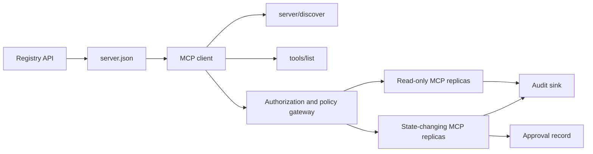

# 无状态 MCP 服务器：注册中心与治理（毕业项目 13）

> 生产级 MCP 不是一个服务器进程，而是一条契约链：可发布的元数据、实时发现、无状态请求信封、授权、策略、审计与部署证据。

> **【中文解读】** 本课是毕业项目：构建一台可上生产的 MCP 服务器。难点不是把函数注册进框架，而是守住一条"契约链"——可发布的注册中心元数据、实时发现、无状态请求信封、授权、策略、审计与部署证据，环环相扣。MCP `2026-07-28` 删除了 initialize 握手与协议会话，任何副本都必须能独立处理任何请求，这让"治理"从部署配置上升为协议本身的约束。

> **【拓展：MCP 生产生态】** 2026 年 MCP 已是 AI 工具调用的事实标准：Anthropic、OpenAI、Google 与主流 IDE 均内置 MCP 客户端，官方 Registry 用版本化的 server.json 组织服务器发布与发现。本课把 Phase 13 的四个深潜课（工具契约、可靠性、注册中心供应链、一致性运维）收束成一个端到端交付物，是整个课程治理维度的顶点。

> 🔗 **【前置】** 学本课前先完成 Phase 11（LLM 工程）、Phase 13（工具与 MCP，尤其第 28-31 课）、Phase 14（agents）、Phase 17（基础设施）、Phase 18（安全）。本课不引入新知识，只检验你能否把已学的契约组装成一个经得起安全审查的系统。

**类型：** 结业项目
**语言：** Python 与 TypeScript 参考模型；任意生产语言
**前置知识：** Phase 11、Phase 13、Phase 14、Phase 17、Phase 18
**必读 MCP 深潜课：** [第 28 课：工具契约](../../../13-tools-and-protocols/28-mcp-tool-contracts-and-content/docs/en.md)、[第 29 课：可靠性](../../../13-tools-and-protocols/29-mcp-reliability-cancellation-and-flow-control/docs/en.md)、[第 30 课：注册中心供应链](../../../13-tools-and-protocols/30-mcp-registry-supply-chain-and-drift/docs/en.md)、[第 31 课：一致性运维](../../../13-tools-and-protocols/31-mcp-conformance-versioning-and-operations/docs/en.md)
**协议目标：** MCP `2026-07-28`
**预计用时：** 约 25 小时

## 学习目标

- 实现无状态的 MCP 请求与结果信封。
- 把注册中心元数据与实时协议发现分开维护。
- 构建确定性的、可缓存的工具发现。
- 对每次工具调用强制校验签发者、受众、权限范围与审批策略。
- 部署不带会话粘性的 Streamable HTTP。
- 线格式、授权、策略、注册中心与审计五个边界上验证行为。

## 必修 MCP 前置路径

> **【中文解读】** 本节把四节 Phase 13 深潜课定义为毕业项目的"输入契约"：第 28 课给出工具/内容/分页/错误契约，第 29 课给出取消竞态、deadline、幂等与重连语义，第 30 课给出命名空间、准入、漂移与回滚证据，第 31 课给出金样本/负样本与发布门控。毕业项目做的是集成这些产物，而不是用一条 happy-path 的 SDK 测试替代它们。

把这台毕业项目服务器当作生产可用之前，请按顺序完成以下四节互链的 Phase 13 课程：

1. [第 28 课](../../../13-tools-and-protocols/28-mcp-tool-contracts-and-content/docs/en.md)定义本服务器必须暴露的工具、schema、内容、分页、补全、路由与错误契约。
2. [第 29 课](../../../13-tools-and-protocols/29-mcp-reliability-cancellation-and-flow-control/docs/en.md)定义取消竞态、deadline、幂等、背压、重试与重连行为。
3. [第 30 课](../../../13-tools-and-protocols/30-mcp-registry-supply-chain-and-drift/docs/en.md)定义命名空间、来源、准入钉、Registry 状态、漂移、账本与回滚证据。
4. [第 31 课](../../../13-tools-and-protocols/31-mcp-conformance-versioning-and-operations/docs/en.md)定义金样本与负样本、严格版本纪元、SDK 差分检查、代理证明、脱敏、健康与发布门控。

毕业项目集成的是这些产物。它不会用一条 happy-path 的 SDK 测试取代它们。

## 问题引入

> **【中文解读】** 难点不在注册一个函数，而在让"六个真相"保持对齐：server.json 说服务器在哪、server/discover 说进程此刻支持什么、每个请求自带协议版本与客户端能力、授权把调用者绑到正确的签发者/资源/权限范围、策略决定这一次具体动作能否执行、审计在不泄密的前提下记录穿越边界的内容。任何一条漂移，轻则目录里挂着一台连不上的服务器，重则放行一个未经审批的破坏性操作。

一个内部平台需要只读数据工具和一小批改状态的工具。开发者必须能发现这台服务器、弄清如何连接、检查其实时能力，并且只能调用自己被授权的操作。

难点不在注册一个函数，而在让六个不同的"真相"保持对齐：

1. `server.json` 说这台服务器可以在哪安装或接入。
2. `server/discover` 说这个进程现在支持什么。
3. 每个请求声明自己使用哪个协议修订号与哪些客户端能力。
4. 授权把调用者绑定到正确的签发者、资源与权限范围。
5. 策略决定这个具体动作可否执行。
6. 审计证据在不泄露秘密或敏感负载的前提下记录穿越边界的内容。

任何一条漂移，平台就可能列出一台根本连不上的服务器、把不兼容的客户端路由进来、接受一张为别的资源签发的令牌，或在无人审查的情况下暴露一个破坏性操作。

## 两层发现机制

> **【中文解读】** 注册中心与实时服务器回答两个不同的问题：`server.json` + Registry API 回答"这台服务器是什么、包或远程端点在哪、如何配置"；`server/discover` 回答"这个进程当前支持哪些协议版本、能力、扩展与身份"。两层各有各的 schema：Registry schema 版本与 MCP 协议修订号彼此独立，别把两个日期改成一样。schema 合法也不等于命名空间所有权——只有通过 `example.com` 域名验证的发布者才能用 `com.example/*` 命名空间。

注册中心与实时 MCP 服务器回答的是不同的问题。

| 层 | 契约 | 回答的问题 |
|---|---|---|
| 发布层 | `server.json` 与 Registry API | 这台服务器是什么、它的包或远程端点在哪、如何配置？ |
| 运行时层 | `server/discover` | 这个进程支持哪些协议版本、能力、扩展与服务器身份？ |

官方 Registry 使用版本化的 `server.json` schema。一个远程条目可以给出 Streamable HTTP URL：

```json
{
  "$schema": "https://static.modelcontextprotocol.io/schemas/2025-12-11/server.schema.json",
  "name": "com.example/internal-readonly",
  "title": "Internal Read-Only Tools",
  "description": "Read-only incident and data lookup tools.",
  "version": "1.0.0",
  "remotes": [
    {
      "type": "streamable-http",
      "url": "https://mcp.internal.example.com/readonly"
    }
  ]
}
```

Registry schema 版本与 MCP 协议修订号相互独立。不要把一个日期改写成另一个；每份文档都要用它自己的契约来校验。

schema 合法并不证明命名空间所有权。通过 `example.com` 验证的发布者使用反向 DNS 命名空间 `com.example/*` 或其子命名空间；Registry 认证流程负责证明这层所有权。把域名标签按原顺序排列，指名的是另一个命名空间。

标准库参考模型里的 `validate_registry_document` 刻意只做"远程 profile"的部分校验：官方必填的 `name`/`description`/`version`、可选 `title`、命名与长度约束、具体版本号形状、每个 `streamable-http` 或 `sse` 远程的 HTTP(S) URL 形状，并因本课总是实测远程端点而额外要求非空 `remotes`。`validate_publisher_namespace` 另行把名字对照已验证的发布者域名，`validate_runtime_alignment` 则把发布名字与版本和实时 `serverInfo` 比对。官方 schema 还支持纯包记录与更多远程字段。正式发布前，请用钉住的官方 JSON Schema 或 `mcp-publisher` 校验整份文档，不要把这个零依赖子集当成完整 schema 校验。

服务器必须实现 `server/discover`；客户端可以在调用其他方法之前先调它。本课客户端在解析出端点后就这样做，并拿到当前协议修订号与实时能力：

```json
{
  "resultType": "complete",
  "supportedVersions": ["2026-07-28"],
  "capabilities": {
    "tools": {
      "listChanged": false
    }
  },
  "_meta": {
    "io.modelcontextprotocol/serverInfo": {
      "name": "com.example/internal-readonly",
      "version": "1.0.0"
    }
  },
  "ttlMs": 3600000,
  "cacheScope": "public"
}
```

私有目录可以索引额外的所有权、评审或生命周期数据，但不得把这些数据伪造成 MCP 线格式字段或 server.json 根字段。组织策略应存放在发布记录旁边。确需公开自定义元数据时，使用 Registry 的 `_meta.io.modelcontextprotocol.registry/publisher-provided` 扩展并遵守 4 KB 上限。

## 无状态 MCP 核心

> **【中文解读】** MCP `2026-07-28` 移除了协议会话与 `initialize` / `notifications/initialized` 握手，也移除了 `Mcp-Session-Id`。协议上下文改由每个请求的 `params._meta` 携带——版本与能力是"请求事实"而非"连接事实"，负载均衡器可以把相邻请求发给不同副本。普通结果带 `resultType: "complete"` 并在 `_meta` 里放服务器身份；版本缺失或非字符串是 `-32602`，只有"给了字符串但不支持"才用 `-32022`，且 data 必须恰好是 `{"supported": [...], "requested": "..."}`。

MCP 修订版 `2026-07-28` 移除了协议会话与 `initialize` / `notifications/initialized` 握手，也移除了 `Mcp-Session-Id`。

每个请求通过 `params._meta` 携带协议上下文：

```json
{
  "io.modelcontextprotocol/protocolVersion": "2026-07-28",
  "io.modelcontextprotocol/clientCapabilities": {},
  "io.modelcontextprotocol/clientInfo": {
    "name": "internal-platform-client",
    "version": "1.0.0"
  }
}
```

版本与能力是请求事实，不是连接事实。负载均衡器可以把相邻请求发给不同的健康副本，因为任一副本都能从消息本身完成校验。

普通结果包含 `resultType: "complete"`。服务器应在每个结果的 `_meta.io.modelcontextprotocol/serverInfo` 里放置自己的身份。协议版本缺失或不是字符串属于非法参数 `-32602`。错误 `-32022` 只用于"提供了字符串但不受支持"的情形，且 data 必须恰好是 `{"supported": ["2026-07-28"], "requested": "..."}`。

### 可缓存发现

`tools/list` 必须对同一有效工具集返回确定性结果。结果包含：

- `ttlMs`，给客户端的新鲜度提示；
- `cacheScope`，取 `public` 或 `private`；
- 稳定的工具顺序，让相同的列表可以复用提示缓存；
- `resultType: "complete"` 与服务器身份元数据。

按用户授权通常应产出 `cacheScope: "private"`。不要把用户专属的工具可见性放进共享公共缓存。

## Streamable HTTP

> **【中文解读】** Streamable HTTP 只暴露一个接受 POST 的 MCP 端点，每个 JSON-RPC 请求或通知各占一个 POST。请求的响应要么是单个 JSON 对象，要么是限定于该请求的 SSE 流；长活的 `subscriptions/listen` 承载选入的变更通知。当前传输没有独立 GET 流、会话 DELETE、会话头或 `Last-Event-ID` 回放。每个请求还要带镜像头部（`MCP-Protocol-Version`、`Mcp-Method`、`Mcp-Name`），不匹配就按 `-32020` 拒绝——这挡住"头说 A、body 说 B"的走私。

网络服务器暴露一个接受 POST 的 MCP 端点。每个 JSON-RPC 请求或通知各占一个 POST。

对一个请求，服务器要么返回单个 JSON 对象，要么返回限定于该请求的 SSE 流。长活的 `subscriptions/listen` 请求承载选入的变更通知。当前传输中没有独立的 GET 流、会话 DELETE、会话头，也没有 `Last-Event-ID` 回放。

每个请求包含：

- `MCP-Protocol-Version`，与 body 元数据一致；
- `Mcp-Method`，与 JSON-RPC 方法一致；
- `Mcp-Name`，用于 `tools/call`、`resources/read` 与 `prompts/get`；
- `Accept: application/json, text/event-stream`。

对不匹配的镜像头部，按规范的 `-32020` 错误拒绝。校验 `Origin`；本地开发服务器绑定回环地址；远程客户端要做认证；请求级 SSE 响应关闭即视为取消。



```figure
cf-mcp-gate
```

## 授权与策略

> **【中文解读】** 传输层元数据不是授权——每次调用都要重新校验。远程服务器的授权链路有八步：发现受保护资源元数据 → 选择该资源的授权服务器 → 优先用 Client ID Metadata Document 注册客户端（动态注册只做兼容）→ 授权时发送 resource indicator → 校验返回的 `iss` → 客户端凭据按签发者隔离、绝不跨签发者复用 → 在 MCP 服务器上校验令牌的签发者/受众/过期/权限范围 → 对具体工具与参数再叠加一次策略决策。`readOnlyHint`、`destructiveHint` 等工具注解只帮客户端呈现风险，不是可信的授权控制。

传输层元数据不是授权。每次调用都要校验授权。

对远程服务器：

1. 发现受保护资源元数据。
2. 为该资源选择授权服务器。
3. 客户端注册优先使用 Client ID Metadata Document；把动态客户端注册当作兼容手段。
4. 授权过程中发送 resource indicator。
5. 把返回的 `iss` 值对照该流程记录的授权服务器校验。
6. 客户端凭据按签发者隔离保存，绝不跨签发者复用注册数据。
7. 在 MCP 服务器上校验令牌的签发者、受众或资源、过期时间与权限范围。
8. 对具体的工具与参数再做一次策略决策。

`readOnlyHint`、`destructiveHint` 这类工具注解帮助客户端呈现风险，但它们不是可信的授权控制。

### 审批是记录，不是魔法 scope

> **【中文解读】** 破坏性调用需要的是一条审批记录，不是塞进访问令牌的魔法 scope。记录绑定行动者、工具、规范化参数（或其摘要）、目标环境、过期时间与一次性/可复用策略。参考实现把按 key 排序的规范化 JSON 做哈希，再与令牌 subject、工具名、服务器 URL、过期时间绑定——改动哪怕一个参数，重放都会在进入 handler 之前失败。把高风险工具放到独立可审查的界面上，只有在凭据、策略、部署身份与审计也各自独立时，才真正缩小爆炸半径。

一次改状态的调用需要一条审批记录，绑定到行动者、工具、规范化参数或其摘要、目标环境、过期时间，以及一次性或可复用策略。仅凭一条聊天消息不构成审批证明。

Python 参考模型对按 key 排序的规范化 JSON 做哈希，再把摘要与令牌 subject、工具名、服务器 URL、过期时间绑定。改动哪怕一个参数后重放记录，会在 handler 运行前失败。审批是独立证据，不是加进访问令牌的 scope。

只有当分离确实能实质缩小爆炸半径时，才把高风险工具放到单独可审查的界面上；而分离只有在凭据、策略、部署身份与审计控制也各自独立时才有用。

## 动手构建

> **【中文解读】** 十个步骤对应十个契约面：发布元数据（schema 合法的 server.json）→ 实时发现（server/discover 先于任何功能 RPC）→ 无状态信封（每请求带版本与能力，结果带 resultType 与身份）→ 工具面（两个只读 + 一个改状态，边界清晰的 JSON Schema、确定性结果形状、诚实的注解）→ 可缓存列表（稳定顺序 + ttlMs + cacheScope）→ 授权与策略（issuer/audience/过期/权限范围 + 每次调用的策略决策 + 绑定具体动作的审批）→ 注册与运行时校验分离（静态记录 + 实时探测 + 漂移报告）→ 审计证据（脱敏或摘要后落盘）→ 水平扩展（双副本无粘性，跨调用状态用显式不透明句柄）→ 真实线格式（对真实服务器二进制做一致性检查，抓请求头与 JSON body 而非 SDK 对象）。

### 1. 建模发布元数据

创建并通过 schema 校验 `server.json`。名字必须落在发布者已认证的命名空间内，并包含版本、描述、适用时的官方 `repository` 或 `packages` 元数据，以及一个远程或 stdio 传输。秘密只能声明为环境变量输入，绝不写成字面值。

### 2. 实现实时发现

在任何功能 RPC 之前实现 `server/discover`。公布支持的协议版本、能力、扩展与服务器身份。加一个用 `-32022` 拒绝不支持版本的用例。

### 3. 实现无状态信封

要求每个请求都带协议版本与客户端能力。每个结果都返回 `resultType` 与服务器身份。移除初始化状态、连接级能力缓存与会话标识符。

### 4. 构建工具面

从两个只读工具和一个改状态工具起步。给每个工具有界的 JSON Schema、精确的描述、确定性的结果形状与诚实的注解。当客户端依赖结构化结果时，补充输出 schema。

### 5. 加入可缓存列表

以稳定顺序返回工具，并带 `ttlMs` 与 `cacheScope`。缓存过期与列表变更通知行为要分开演练。

### 6. 加入授权与策略

校验签发者、受众、过期与权限范围。对每次工具调用执行策略决策。把审批绑定到精确的高风险动作。在执行 handler 之前拒绝缺失或过期的审批。

### 7. 分离注册校验与运行时校验

先校验静态 `server.json` 记录，再用 `server/discover` 探测远程端点。当发布出的远程地址、身份、版本或必需能力与实时进程不一致时，报告漂移。

### 8. 加入审计证据

记录行动者、签发者、资源、工具、策略决策、请求标识符、trace 上下文、延迟与结果。敏感参数与结果在持久化前脱敏或做摘要。审计接收端保持在模型可见上下文之外。

### 9. 演练水平扩展

在负载均衡器后放两个无状态副本。发送至少 100 个并发请求。证明正确性不依赖粘性。若某工具需要跨调用状态，铸造显式的不透明句柄并存进共享的持久系统。

### 10. 跨越真实线格式

对真实的服务器二进制运行一致性检查。抓取请求头与 JSON body，而不只是 SDK 对象。演练错误版本、头部不匹配、缺失权限范围、错误受众、畸形参数、handler 失败、取消与缓存过期。

## 必备证据包

> **【中文解读】** 提交物要凑齐五类证据：线格式（金样本与负样本的脱敏原始头部与 body）、代理（同一用例直连与过中间件的对照，证明协议错误不会被压扁成通用 500、流不被缓冲）、准入（已验证命名空间、不可变记录摘要、来源、实时发现观测、描述符钉、状态与账本事件）、重试（取消/完成竞态、超时、安全重读、幂等键、重连重取）、回滚（确切上一版本、各摘要与钉、健康窗口、路由恢复结果）。任何一类缺失就扣住发布。

一份提交在集齐全部五类证据之前是不完整的：

| 证据 | 最低证明 | 来源课程 |
|---|---|---|
| 线格式 | 金样本与负样本的脱敏原始头部与 JSON-RPC body，包括元数据类型失败、头部不匹配、不支持的版本、缺失或未知的 `resultType`、通知无响应、响应 ID 匹配 | [第 31 课](../../../13-tools-and-protocols/31-mcp-conformance-versioning-and-operations/docs/en.md) |
| 代理 | 同一稳定用例直连与穿过已部署中间件各跑一遍，带入口、源站与出口状态和 body 摘要；证明协议错误没有被折叠成通用 500 响应、流没有被缓冲 | [第 29 课](../../../13-tools-and-protocols/29-mcp-reliability-cancellation-and-flow-control/docs/en.md)与[第 31 课](../../../13-tools-and-protocols/31-mcp-conformance-versioning-and-operations/docs/en.md) |
| 准入 | 已验证的发布者命名空间、不可变的 Registry 记录摘要、工件或远程来源、实时 `server/discover` 身份与能力观测、描述符钉、当前 Registry 状态、准入账本事件 | [第 30 课](../../../13-tools-and-protocols/30-mcp-registry-supply-chain-and-drift/docs/en.md) |
| 重试 | 取消与完成的竞态、显式超时、安全的读重试、变更幂等键、重连重取，并证明请求取消不会悄悄变成持久任务取消 | [第 29 课](../../../13-tools-and-protocols/29-mcp-reliability-cancellation-and-flow-control/docs/en.md) |
| 回滚 | 确切的上一版本、准入与工件摘要、描述符钉、生效的 Registry 状态、当前健康窗口、路由恢复结果、脱敏后的决策证据 | [第 30 课](../../../13-tools-and-protocols/30-mcp-registry-supply-chain-and-drift/docs/en.md)与[第 31 课](../../../13-tools-and-protocols/31-mcp-conformance-versioning-and-operations/docs/en.md) |

把脱敏证据包的摘要随发布一起存档；任何一类缺失就扣住发布。不要用进程内调度器推断代理行为、用"出现在 Registry 里"推断准入、用新的 JSON-RPC id 推断重试安全、或用"上一次部署还在"推断回滚就绪。

## 本地参考模型

Python 参考模型在不打开网络套接字的前提下演示：注册中心元数据、反向 DNS 发布者命名空间校验、发布到运行时的身份核对、实时发现、确定性工具列表、每请求元数据、可信签发者/受众/过期/权限范围校验、绑定动作的审批、文档化的部分 Registry 校验器、策略与审计：

```bash
cd phases/19-capstone-projects/13-mcp-server-with-registry
python3 code/main.py
python3 -m unittest discover -s code/tests -v
```

TypeScript 项目不依赖 MCP SDK，在 stdio 上暴露无状态 JSON-RPC 形状。它的 `tools/call` 路径强制执行 `tools/list` 广告的同一套有界输入 schema；对已知工具的非法参数会返回带 `isError: true` 的完整结果，而不会调用执行器：

```bash
cd phases/19-capstone-projects/13-mcp-server-with-registry/code/ts
npm install
npm run typecheck
npm test
npm run demo
```

这些模型证明的是本地契约逻辑，不证明 HTTP 头、OAuth 交换、Registry 发布、OPA 集成、负载均衡或收集器接收。

## 线格式示例

```http
POST /mcp HTTP/1.1
Host: mcp.internal.example.com
Content-Type: application/json
Accept: application/json, text/event-stream
MCP-Protocol-Version: 2026-07-28
Mcp-Method: tools/call
Mcp-Name: postgres.readonly
Authorization: Bearer REDACTED

{
  "jsonrpc": "2.0",
  "id": 42,
  "method": "tools/call",
  "params": {
    "name": "postgres.readonly",
    "arguments": {"sql": "SELECT 1"},
    "_meta": {
      "io.modelcontextprotocol/protocolVersion": "2026-07-28",
      "io.modelcontextprotocol/clientCapabilities": {},
      "io.modelcontextprotocol/clientInfo": {
        "name": "internal-platform-client",
        "version": "1.0.0"
      }
    }
  }
}
```

注意镜像头部与 body `params._meta` 的一致性：`MCP-Protocol-Version` 必须匹配元数据里的版本，`Mcp-Name` 必须匹配 `params.name`，否则按 `-32020` 拒绝且不进入策略与工具执行。

## 部署上线

交付一个仓库，内含：

- 一份 schema 合法的 `server.json`；
- 只读与改状态的服务器界面；
- `server/discover`、确定性的 `tools/list` 与策略门控的 `tools/call`；
- 两个可互换副本的 Streamable HTTP 部署；
- 授权与审批集成；
- Registry 发布器或私有 Registry API 适配器；
- 策略定义与绑定动作的审批记录；
- 脱敏审计输出与 trace 传播；
- 线格式与代理失败证据；
- 准入、重试、健康与回滚证据，附脱敏证据包的摘要。

| 权重 | 评分项 | 证据 |
|---:|---|---|
| 25 | 协议正确性 | 无状态请求元数据、发现、结果、头部与负样本用例 |
| 20 | 授权 | 签发者、受众、过期、权限范围与绑定动作的审批用例 |
| 15 | 注册中心完整性 | 合法的 `server.json`、发布记录、实时发现探测与漂移报告 |
| 15 | 策略与安全 | 允许、拒绝、畸形、过期审批与敏感数据用例 |
| 15 | 规模与可靠性 | 双副本、无粘性依赖、取消、超时与恢复 |
| 10 | 可审计性 | 接收端脱敏审计与 trace 证据 |

## 练习题

1. 只改发布出的远程 URL，让真实服务器保持不变。让注册校验报告出确切的漂移。
2. 用完全相同的输入发两次 `tools/list`，证明工具顺序字节级稳定。然后让 `ttlMs` 过期并刷新。
3. 发一个合法 body 但换一个不同的 `MCP-Protocol-Version` 头。返回 `-32020`，且不触发策略或工具。
4. 为只读服务器铸造一枚令牌，拿去调用改状态服务器。证明受众校验在 handler 运行前失败。
5. 把一条审批绑定到一个规范化参数摘要。改掉一个字段，证明审批无法重放。
6. 让相邻调用交替路由到两个副本。凡工作流需要持久化的地方，把隐藏的进程内存换成显式的共享句柄。
7. 掐断一个请求级 SSE 连接，用新的 JSON-RPC 请求 ID 重试。验证没有走 `Last-Event-ID` 恢复路径。

## 关键术语

| 术语 | 口头说法 | 实际含义 |
|---|---|---|
| Stateless MCP | "哪儿都没状态" | 没有协议会话；跨调用状态是显式的、由服务器管理 |
| `server.json` | "工具清单" | 注册中心元数据：命名、打包、配置与传输 |
| `server/discover` | "握手" | 一个普通的必选 RPC，返回实时版本与能力，不是会话初始化器 |
| Cache scope | "能缓存吗？" | 可缓存结果能否安全地共享或私有复用 |
| Policy decision | "令牌允许了" | 对行动者、工具、目标、参数与上下文的独立决策 |
| Approval record | "有人点了同意" | 绑定到一个行动者与一个后果性动作、受过期策略约束的证据 |
| Explicit handle | "会话 ID" | 命名服务器管理状态的普通应用数据，不是协议连接状态 |

## 延伸阅读

- [MCP 2026-07-28 关键变更](https://modelcontextprotocol.io/specification/2026-07-28/changelog) — 本课所依据修订版的官方变更清单。
- [Streamable HTTP](https://modelcontextprotocol.io/specification/2026-07-28/basic/transports/streamable-http) — 单端点、无会话传输的规范正文。
- [Server discovery](https://modelcontextprotocol.io/specification/2026-07-28/server/discover) — `server/discover` 必选 RPC 的规范正文。
- [MCP authorization](https://modelcontextprotocol.io/specification/2026-07-28/basic/authorization) — 授权流程与权限范围校验的规范正文。
- [官方 Registry server.json 要求](https://github.com/modelcontextprotocol/registry/blob/main/docs/reference/server-json/official-registry-requirements.md) — 官方 Registry 对 server.json 的字段要求。
- [官方 Registry OpenAPI 契约](https://registry.modelcontextprotocol.io/openapi.yaml) — Registry API 的机器可读契约。
