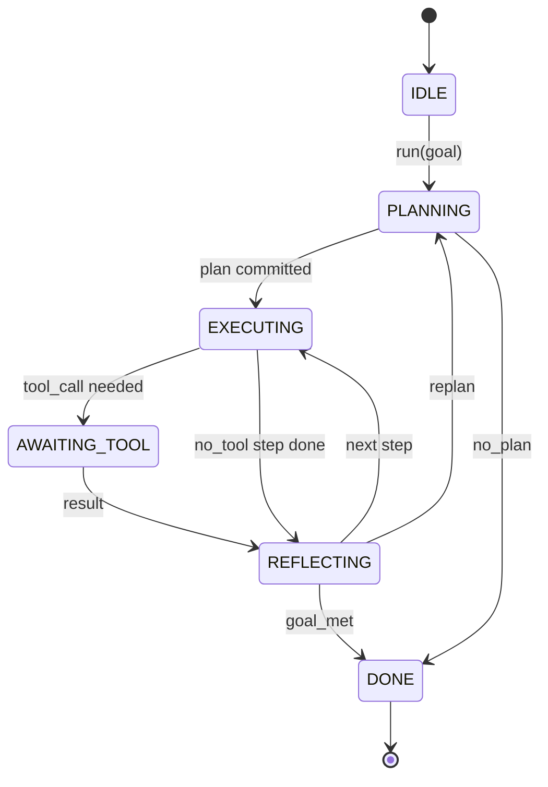

# Agent Harness Loop Contract | 线束 行动

> The harness is the agent. The model is a coprocessor. This lesson freezes the loop contract you can wire any model into.

> **【中文解读】** 本节是综合项目——构建 Agent 线束循环和契约验证系统。


**Type:** Build | **类型:** Build
**Languages:** Python | **语言:** Python
**Prerequisites:** Phase 13 lessons 01-07, Phase 14 lesson 01 | **前置知识:** Phase 13 lessons 01-07, Phase 14 lesson 01
**Time:** ~90 minutes | **时间:** ~90 minutes

> 🔗 **【前置】** Agent Harness 系列 1/10（lesson 20-29）。综合 Phase 13·01-07 + Phase 14·01。
> 💡 **【类比】** Harness = "AI 的躯壳"，模型是"大脑"。loop 契约 = 大脑和躯壳的接口标准。Phase 14·30+ 工作台系列的延续，从单 Agent 进阶到完整 harness。本系列 10 节将搭建完整编码 Agent harness：循环契约→工具注册→JSON-RPC 传输→函数调用→plan-execute→验证门→沙箱→评估→可观测→端到端。

## Learning Objectives | 学习目标
- Specify an agent harness loop as a deterministic state machine with explicit transitions.
  中文翻译：Specify an agent harness loop as a deterministic state machine with explicit transitions.
- Implement ten lifecycle hook topics that operators wire policy, telemetry, and guardrails into.
  中文翻译：Implement ten lifecycle hook topics that operators wire policy, telemetry, and guardrails into.
- Define two pull points where the loop yields control back to the caller and resumes on a fresh input.
  中文翻译：Define two pull points where the loop yields control back to the caller and resumes on a fresh input.
- Enforce per-session budgets (turns, tool calls, wall-clock) without leaking partial state on exceeding.
  中文翻译：Enforce per-session budgets (turns, tool calls, wall-clock) without leaking partial state on exceeding.
- Emit a typed stream of eleven event types so downstream UIs and tracers can subscribe without inspecting the loop directly.
  中文翻译：Emit a typed stream of eleven event types so downstream UIs and tracers can subscribe without inspecting the loop directly.

## The frame

> **【中文解读】** 核心观点：运行 40 轮的编码 Agent 不是聊天循环，而是状态机——操作者可拦截节点、审计边。一旦写定契约，替换模型/工具/策略不再是重构，而是注册调用。本课定义 6 个状态、10 个 Hook 主题、2 个拉取点、11 个事件类型和一个预算信封。这是 Agent Harness 的骨架，其余所有组件（工具注册、传输、调度器）都插入这个形状。

> **【拓展：Agent Harness 状态机设计】** 主流编码 Agent（Claude Code、Cursor、Devin）都采用类似的状态机架构。6 个状态通常包括：IDLE（等待输入）、PLANNING（规划）、EXECUTING（执行工具）、AWAITING_TOOL（等待工具返回）、OBSERVING（观察结果）、TERMINAL（终止）。10 个 Hook 主题覆盖完整生命周期：SessionStart/End、Pre/PostToolUse、UserPromptSubmit、Notification、Stop、PreCompact 等。预算信封限制每会话的轮次/工具调用/运行时间。

A coding agent that runs unattended for forty turns is not a chat loop. It is a state machine whose nodes the operator can intercept and whose edges the operator can audit. Once you write the contract down, swapping models, tools, or policies stops being a refactor. It becomes a registration call.

> 一个coding agent that runs unattended for forty turns is not a chat loop. It is a state machine whose nodes the operator can intercept and whose edges the operator can audit. Once you write the contract down, swapping models, tools, or policies stops being a refactor. It becomes a registration call.


This lesson builds that contract. We name six states, ten hook topics, two pull points, eleven event types, and a budget envelope. Everything else in the harness (tool registry, JSON-RPC transport, dispatcher, planner) plugs into this shape.

> 本课构建该契约。


## The states

The loop has six states. Five are active. One is terminal.



`IDLE` is the only legal entry point. `DONE` is the only legal exit. `AWAITING_TOOL` is the only state that yields a pull point. Every other transition is internal.

> `IDLE` is the only legal entry point.


The state machine is deterministic. Given the same event log, the harness re-enters the same state. That property is what lets you replay sessions for debugging without re-calling the model.

> 状态机是确定性的。给定相同的事件日志，框架重新进入相同的状态。


## The hook topics

Hooks are the operator's seam into the loop. The harness fires ten topics. Each topic accepts any number of subscribers. Subscribers fire in registration order. A subscriber may mutate the payload, raise to abort the turn, or return a sentinel to skip the next step.

> Hook 是操作者接入循环的接口。


```text
before_plan         after_plan
before_tool_call    after_tool_call
before_step         after_step
on_error
on_pause
on_budget_exceeded
on_complete
```

The shape mirrors what Claude Code, Cursor, and OpenCode all converged on by mid-2025. The names are functional, not branded. A hook that blocks `rm -rf` lives in `before_tool_call`. A hook that ships an OpenTelemetry span lives in `after_step`. A hook that resumes on a paused session lives in `on_pause`.

> 这个形态反映了 Claude Code、Cursor 和 OpenCode 在 2025 年中期的共识。


## The pull points

The loop yields control twice. First on `AWAITING_TOOL` when it cannot make progress without a tool result. Second on `on_pause` when the budget is exhausted or a hook explicitly requests human review.

> 循环两次让出控制权。


A pull point is not an exception. It is a return. The caller inspects the harness state, fetches whatever the harness asked for, and calls `resume(payload)`. The harness picks up where it stopped. This is the same shape as a Python generator. The transport over the pull point is your choice. In a TUI it is keypress. Over MCP it is `tools/call`. Over a queue it is a job poll.

> 拉取点不是异常，而是返回。


## The event stream

The loop appends events to a typed stream at specific points in the contract. The stream is append-only and subscribers can replay from any offset. The eleven implemented event types are:

> 循环在契约的特定点将事件追加到类型化流中。


- `session.start` — emitted once when `run(goal)` is called
  中文翻译：`session.start` — emitted once when `run(goal)` is called
- `plan.draft` — emitted when the planner returns a draft plan
  中文翻译：`plan.draft` — emitted when the planner returns a draft plan
- `plan.commit` — emitted after the draft is committed as the active plan
  中文翻译：`plan.commit` — emitted after the draft is committed as the active plan
- `step.start` — emitted at the start of each executing step
  中文翻译：`step.start` — emitted at the start of each executing step
- `step.end` — emitted at the end of each executing step
  中文翻译：`step.end` — emitted at the end of each executing step
- `tool.call` — emitted when a tool-requiring step yields control to the caller
  中文翻译：`tool.call` — emitted when a tool-requiring step yields control to the caller
- `tool.result` — emitted on resume with a tool result
  中文翻译：`tool.result` — emitted on resume with a tool result
- `tool.error` — emitted on resume with an error or when a hook aborts the call
  中文翻译：`tool.error` — emitted on resume with an error or when a hook aborts the call
- `budget.warn` — emitted when a budget limit is reached
  中文翻译：`budget.warn` — emitted when a budget limit is reached
- `session.pause` — emitted when the loop yields on a pause (budget or hook)
  中文翻译：`session.pause` — emitted when the loop yields on a pause (budget or hook)
- `session.complete` — emitted once when the loop reaches `DONE`
  中文翻译：`session.complete` — emitted once when the loop reaches `DONE`

The events do not duplicate hook payloads. Hooks are imperative (mutate, abort). Events are observational (record, ship). Treat them as orthogonal.

> 事件不重复 hook 负载。Hook 是命令式的（修改、中止），事件是观察性的（记录、发送）。


## The budget envelope

A session carries three limits. Turn count, tool call count, wall-clock seconds. Each turn increments turns by one. Each tool call increments tool calls by one. Wall-clock is checked on every state transition. When any limit is reached, the loop fires `on_budget_exceeded`, emits `budget.warn`, then transitions to `IDLE` with a budget-exceeded reason on the next pull point.

> 会话携带三个限制：轮次计数、工具调用计数、挂钟秒数。


The budget is not a kill switch. It is a yield. The caller decides whether to extend the budget and resume, or to close the session.

> 预算不是终止开关，而是让出。调用者决定是否扩展预算并恢复，或关闭会话。


## What this lesson does not do

It does not call a model. It does not register real tools. It does not implement a transport. Those are the next four lessons. This lesson nails the contract so the next four can plug into it without rewriting.

> 它不调用模型，不注册真实工具，不实现传输。这些是接下来四课的内容。


The deterministic planner in `main.py` is a stand-in. It returns a hardcoded plan of three steps, two of which require a tool result. The point is the loop, not the plan.

> 确定性规划器是一个替代品。它返回一个硬编码的三步计划，其中两步需要工具结果。重点是循环，不是计划。


## How to read the code

`HarnessLoop` is the main class. It holds state, fires hooks, emits events. `Budget` tracks limits. `Event` is the typed envelope on the stream. `HookRegistry` is the dispatch table. `_transition` is the only function that changes state, so the state machine invariants live in one place.

> `HarnessLoop` is the main class.


Read `main.py` top to bottom. Then read `code/tests/test_loop.py`. The tests pin every transition and every hook firing order.

> Read `main.


## Going further

The hardest part of building a harness in production is not the state machine. It is making the contract enforceable. The contract has to survive a hot reload of the planner. It has to survive a tool that returns malformed JSON. It has to survive a hook that raises in `before_tool_call` two-thirds of the way through a forty-turn session. The tests in this lesson exercise those failure modes. Run them. Break them. Add cases.

> 构建框架最难的部分不是状态机，而是使契约可强制执行。


The next lesson adds the tool registry. After that, the JSON-RPC transport. After that, the dispatcher. By lesson twenty-four, the loop in this file will be running a real plan against real tools with real budgets enforced.

> 下一课将添加工具注册表。

