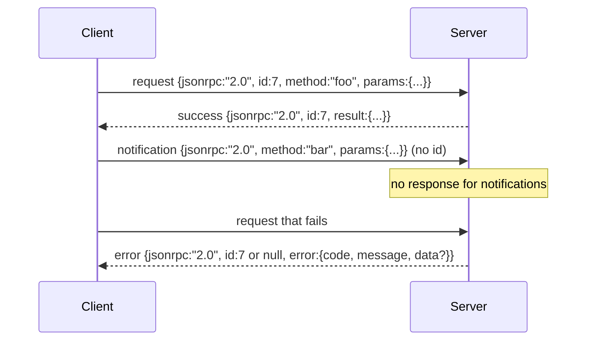

# JSON-RPC 2.0 Over Newline-Delimited Stdio | JSON-RPC 2.0 Over Newline-Deli (中文翻译待补)

> The transport between a model client and a tool server is JSON-RPC over stdio. Hand-rolling it once teaches you what every framing layer is paying for.

> **【中文解读】** 本节是综合项目——构建 JSONRPC/STDIO 传输层。


**Type:** Build
**Languages:** Python
**Prerequisites:** Phase 13 lessons 01-07, Phase 14 lesson 01
**Time:** ~90 minutes

## Learning Objectives | 学习目标
- Speak JSON-RPC 2.0 framed as newline-delimited JSON over stdin and stdout.
- Map the five standard error codes (-32700, -32600, -32601, -32602, -32603) and surface them with the right semantics.
- Distinguish requests, responses, notifications, and batches without inventing new envelope keys.
- Handle one parse error per line without poisoning the rest of the stream.
- Build a self-terminating demo using io.BytesIO so the lesson runs without spawning a child process.

## Why JSON-RPC stays the lingua franca

> **【中文解读】** JSON-RPC 2.0 自 2013 年以来一直是 Agent 与工具服务器通信的标准协议。它只有两页规范，却对称地支持 stdio、socket、websocket 和 HTTP 传输。与 gRPC、自定义二进制协议不同，JSON-RPC 不在流式/批处理/传输耦合之间做取舍——这正是它能存活至今的原因。

> **【拓展：JSON-RPC 在 AI Agent 中的应用】** Model Context Protocol (MCP) 的传输层直接基于 JSON-RPC 2.0 over stdio。Claude Code 的工具调用、Cursor 的插件通信、VS Code 的语言服务器协议 (LSP) 都采用相同的 JSON-RPC 框架。理解这一层是理解 AI Agent 工具链基础设施的关键。

A coding agent in 2026 talks to maybe twelve tool servers in a single session. Each server is a separate process or a remote endpoint. The wire format has been the same since 2013. JSON-RPC 2.0 is two-page spec. It survives because the alternatives (gRPC, HTTP per call, custom binary) all impose a tradeoff JSON-RPC does not: they pick either streaming or batching or transport-coupling. JSON-RPC is symmetric across stdio, sockets, websockets, and HTTP, and a client can drive a server it has never seen if both honor the spec.

This lesson builds the stdio variant. Newline-delimited JSON. Each request is one line. Each response is one line. The transport boundary is `\n`.

## The wire shape

> **【中文解读】** JSON-RPC 2.0 定义了四种信封形状：请求（request）、成功响应（response）、通知（notification）和错误响应（error）。关键规则是通知没有 `id` 字段，服务器不得响应通知——这保持了帧计算的简洁性。批处理（batch）是请求数组，服务器返回响应数组。

> **【拓展：MCP 协议中的消息类型】** Claude 的 MCP 协议严格遵循这一信封结构。`tools/call` 是请求-响应模式，`notifications/progress` 是单向通知，`cancelled` 通知用于取消进行中的调用。这种设计使得 Agent 可以在等待工具返回的同时接收进度更新。

Four envelope shapes exist. Two are spoken by the client. Two are spoken by the server.



A notification has no `id`. The server must not respond to it. If a server returns a response to a notification, the client has no way to attach it to a call site. That single rule keeps the framing math simple.

A batch is a JSON array of requests or notifications. The server replies with an array of responses, in any order, one per non-notification entry. If every entry in the batch is a notification, the server sends nothing back.

## The five error codes

> **【中文解读】** JSON-RPC 2.0 定义了五个标准错误码：-32700（解析错误）、-32600（无效请求）、-32601（方法未找到）、-32602（无效参数）、-32603（内部错误）。解析错误的响应中 `id` 必须为 `null`，因为请求未能解析到足以提取 id 的程度。错误码 -32000 到 -32099 保留给服务器自定义错误。

> **【拓展：错误码在 LLM 工具调用中的映射】** 当 GPT-4 或 Claude 调用工具失败时，错误码直接映射到这些语义：参数类型不匹配返回 -32602，工具不存在返回 -32601，工具内部异常返回 -32603。模型根据错误信息自动修正参数并重试，这是 Agent 自修复能力的基础。

```text
-32700  Parse error      JSON could not be parsed
-32600  Invalid Request  Envelope shape is wrong
-32601  Method not found
-32602  Invalid params
-32603  Internal error
```

The codes between -32000 and -32099 are reserved for server-defined errors. Everything else is application-defined. The lesson sticks to the five. If your handler raises, the transport wraps it as -32603 with the exception class name in `data.exception`.

A parse error has a special rule. The `id` in the response is `null`, because the request never parsed enough to extract an id.

## Newline framing and the BytesIO demo

The transport reads one line at a time. A line is bytes up to and including `\n`. If a line cannot be parsed, the transport writes a -32700 response with `id: null` and continues. The stream is not poisoned. The next line gets parsed fresh.

For the lesson we wrap an `io.BytesIO` pair as stdin and stdout. The server reads requests until EOF, writes responses for each, and returns. The client reads the responses back. No process spawn. No timeouts. The transport behavior is identical to a real subprocess pipe because Python's `io` interface presents the same `.readline()` and `.write()` contract.

## Method dispatch

> **【中文解读】** 传输层不关心方法是否存在——它只负责解析和序列化。方法分派委托给 `handler(method, params)` 可调用对象。三种异常类映射到特定错误码：`MethodNotFound` -> -32601、`InvalidParams` -> -32602、其他异常 -> -32603。这种分层设计使传输层、注册中心和分派器各自独立。

The transport does not know which methods exist. It hands off to a callable `handler(method, params)` that the harness supplies. The handler returns a result or raises. Three exception classes surface specific codes.

```text
MethodNotFound -> -32601
InvalidParams  -> -32602
Anything else  -> -32603 with exception name in data
```

The transport never sees a tool registry. The registry sits behind the handler. This is the layering we want. The transport speaks JSON-RPC. The registry speaks tool shapes. The dispatcher (lesson twenty-three) stitches them together.

## Stream behavior on errors

```text
client writes              server reads             server writes
---------------            -----------              -------------
{...valid request...}      parses ok                {...response, id matches...}
{...broken json...         parse fails              {id:null, error: -32700}
{...valid request...}      parses ok                {...response, id matches...}
{...missing method...}     invalid envelope         {id:X, error: -32600}
```

A broken JSON line does not stop the loop. A missing `method` field does not stop the loop. A handler exception does not stop the loop. The transport keeps reading until EOF.

## Notifications and asymmetric flows

> **【中文解读】** 通知是"发射后不管"（fire-and-forget）模式。Agent 利用通知进行进度推送、取消信号和日志输出。长运行工具可以在请求处理过程中发出进度通知，无需等待往返确认。这种非对称流使 Agent 能在等待工具返回的同时接收实时状态更新。

> **【拓展：流式响应与通知模式】** Claude 的流式响应（streaming）本质上就是通知模式的应用。`content_block_delta` 通知持续推送生成中的 token，而最终的 `message_stop` 是正式响应。OpenAI 的 function_calling 也采用了类似的双重模式：工具调用结果可以流式返回。

A notification is fire-and-forget. The harness uses notifications for progress events, cancellation signals, and log lines. Notifications are how a long-running tool can stream status updates without round-tripping for each one.

The lesson implements one outbound notification helper, `write_notification`. The server uses it to emit progress while a request is in flight. The demo shows the pattern: a request comes in, the handler emits two progress notifications, then writes the final response.

## How to read the code

`code/main.py` defines `StdioTransport`, the parse helper (`parse_request`), the three write helpers (`write_response`, `write_error`, `write_notification`), and the dispatch loop `serve`. The error code constants live at module scope.

`code/tests/test_transport.py` covers the five error codes, notifications (no response written), batches (array in, array out, notifications skipped), broken JSON (parse error then continue), and the asymmetric flow where a handler writes a notification mid-call.

## Going further

This transport is enough for the lessons that follow. Production transports add three things. A correlation id field that survives forwarding (your `id` is already this, but in a mesh you need an outer trace id too). A cancellation channel (a notification like `$/cancelRequest` with the id of the in-flight call). And a content-type negotiation handshake so the same socket can speak JSON-RPC and Streamable HTTP. None of those change the wire. They add metadata.
