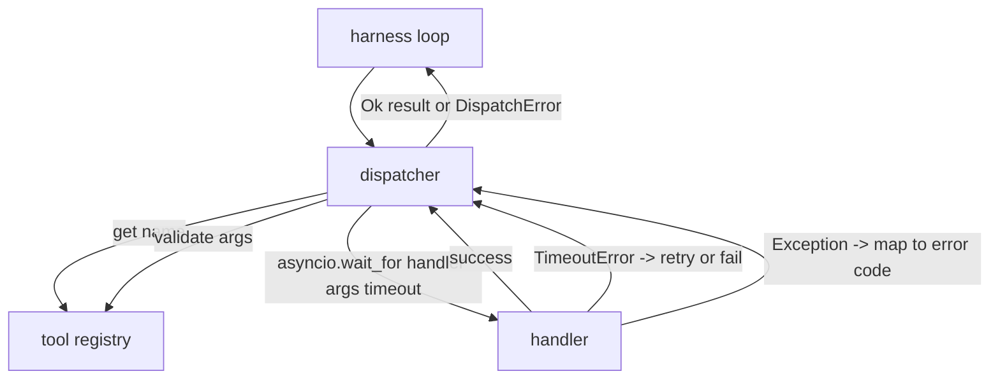
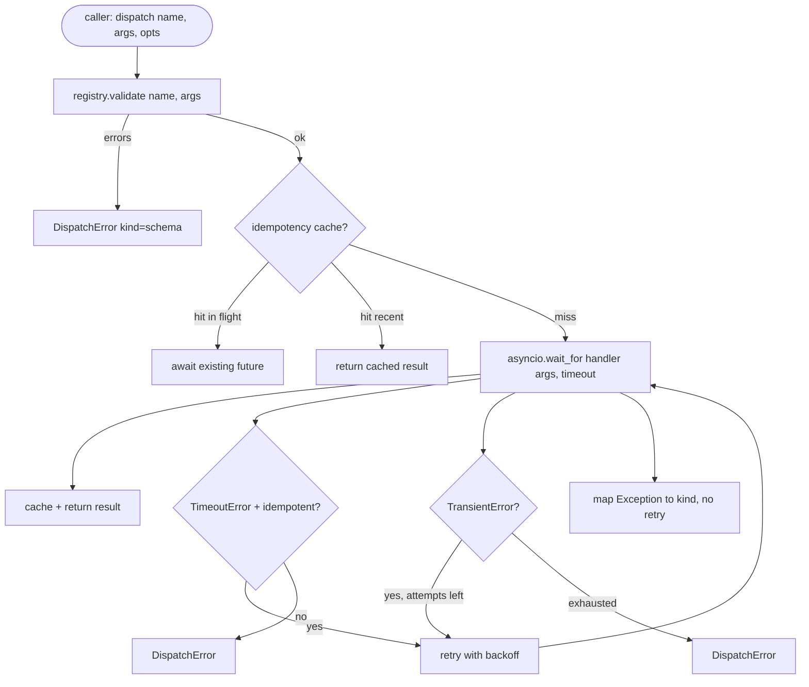

# Function Call Dispatcher | Function Call Dispatcher (中文翻译待补)

> The dispatcher is where the harness pays for every promise the schema made. Timeouts, retries, dedupe, error mapping. All on one seam.

> **【中文解读】** 本节是综合项目——构建函数调用分派器。


**Type:** Build | **类型:** Build
**Languages:** Python | **语言:** Python
**Prerequisites:** Phase 13 lessons 01-07, Phase 14 lesson 01 | **前置知识:** Phase 13 lessons 01-07, Phase 14 lesson 01
**Time:** ~90 minutes | **时间:** ~90 minutes

> 🔗 【前置】Agent Harness 4/10。Phase 14·07 工具调用的工程化版本。
> 💡 分派器 = schema 兑现承诺的地方。超时、重试、去重、错误映射——所有麻烦都在这一层。这是 LLM 调用工具到真实工具执行的桥。

## Learning Objectives | 学习目标
- Wrap a tool handler in a per-call timeout that returns a typed error instead of hanging the loop.
  中文翻译：Wrap a tool handler in a per-call timeout that returns a typed error instead of hanging the loop.
- Apply exponential backoff retry with jitter and a maximum attempt count.
  中文翻译：Apply exponential backoff retry with jitter and a maximum attempt count.
- Deduplicate retries on an idempotency key so a retry that races with a slow original does not run twice.
  中文翻译：Deduplicate retries on an idempotency key so a retry that races with a slow original does not run twice.
- Map handler exceptions and transport faults onto a single error envelope the harness loop already understands.
  中文翻译：Map handler exceptions and transport faults onto a single error envelope the harness loop already understands.
- Bound parallel dispatch with a concurrency limit so a fan-out of forty tool calls does not exhaust the event loop.
  中文翻译：Bound parallel dispatch with a concurrency limit so a fan-out of forty tool calls does not exhaust the event loop.

## Where the dispatcher sits

> **【中文解读】** 分派器是 Agent Harness 的核心中间层，位于循环（Lesson 20）、工具注册中心（Lesson 21）和传输层（Lesson 22）之间。它负责超时控制、指数退避重试、幂等性去重和错误映射——这些都是模型调用工具时不可回避的工程问题。分派器是唯一了解计时器、重试和幂等性的层。

> **【拓展：分派器在 Claude Code 和 Devin 中的实现】** Claude Code 的工具分派器实现了类似的分层：Tool Registry 定义 Schema，Dispatcher 管理超时和重试，Transport 负责 JSON-RPC 序列化。Devin 的 agent harness 增加了 circuit breaker（断路器）模式——当某个工具连续失败 N 次后自动进入冷却期，避免雪崩效应。

Between the harness loop (lesson twenty) and the tool registry (lesson twenty-one). The transport (lesson twenty-two) feeds the loop. The loop hands a tool call to the dispatcher. The dispatcher calls the registry, runs the handler, and returns either a result or a JSON-RPC-shaped error envelope.

> Between the harness loop (lesson twenty) and the tool registry (lesson twenty-one).




The dispatcher is the only layer that knows about timers, retries, and idempotency. The loop does not. The registry does not. The handler does not. That isolation is the point.

> dispatcher is the only layer that knows about timers, retries, and idempotency. The loop does not. The registry does not. The handler does not. That isolation is the point.


## Timeouts

> **【中文解读】** 每个工具有默认超时时间（`timeout_ms`），分派器可按调用覆盖。使用 `asyncio.wait_for` 实现超时控制。关键设计：非幂等工具（如 `db.write`）超时后不自动重试，因为操作可能已提交，重试会导致重复写入。分派器通过注册中心记录的 `idempotent` 标志来决定是否重试。

Each tool has a default timeout. The registry record carries `timeout_ms`. The dispatcher overrides it from a per-call override when the harness passes one. We use `asyncio.wait_for`. On timeout, the handler task is cancelled and the dispatcher returns `DispatchError(kind="timeout")`.

> 每个tool has a default timeout. The registry record carries `timeout_ms`. The dispatcher overrides it from a per-call override when the harness passes one. We use `asyncio.wait_for`. On timeout, the handler task is cancelled and the dispatcher returns `DispatchError(kind="timeout")`.


A timeout is not a retryable error by default for non-idempotent tools. A `db.write` that timed out may or may not have committed. Retrying duplicates the write. The dispatcher honors the `idempotent` flag from the registry record. Idempotent tools retry. Non-idempotent tools do not.

> 一个timeout is not a retryable error by default for non-idempotent tools. A `db.write` that timed out may or may not have committed. Retrying duplicates the write. The dispatcher honors the `idempotent` flag from the registry record. Idempotent tools retry. Non-idempotent tools do not.


## Retries with exponential backoff

> **【中文解读】** 重试策略：最多 3 次尝试，指数退避加抖动（jitter）。只有 `timeout` 和 `transient`（瞬时）错误会重试。`schema` 错误、`not_found` 和 `internal` 错误不重试——因为模式错误是确定性的，重试不会改变结果，只会浪费 token 预算。

> **【拓展：抖动（Jitter）在分布式系统中的重要性】** AWS 架构博客的经典文章"Exponential Backoff And Jitter"证明，在并发重试场景中，不加抖动的指数退避会导致"雷群效应"（thundering herd）。添加随机抖动使重试间隔分散，显著降低系统负载。Claude API 和 OpenAI API 的 SDK 都采用了带抖动的退避策略。

The retry policy is three attempts maximum. Backoff is exponential with jitter.

> REtry policy is three attempts maximum. Backoff is exponential with jitter.（翻译）


```text
attempt 1  -> delay 0
attempt 2  -> delay 0.1s * (1 + random[0..0.5])
attempt 3  -> delay 0.4s * (1 + random[0..0.5])
```

Only `timeout` and `transient` errors retry. A `schema` error, a `not_found`, or an `internal` error does not retry. Schema errors are deterministic. Retrying does not change the outcome and burns the budget.

> Only `timeout` and `transient` errors retry.


The retry loop respects the budget from the harness. If the caller's budget has zero remaining tool calls, the dispatcher fails fast on the first attempt and returns `kind="budget_exceeded"`.

> retry loop respects the budget from the harness. If the caller's budget has zero remaining tool calls, the dispatcher fails fast on the first attempt and returns `kind="budget_exceeded"`.


## Idempotency key dedupe

A retry that fires while the original is still in flight is a real production bug. The first call hangs at four point nine seconds (just under the timeout). The retry fires at five seconds. Now two requests race against the same backend. If the tool is `payments.charge`, you charged twice.

> 一个retry that fires while the original is still in flight is a real production bug. The first call hangs at four point nine seconds (just under the timeout). The retry fires at five seconds. Now two requests race against the same backend. If the tool is `payments.charge`, you charged twice.


The dispatcher accepts an optional `idempotency_key`. If the same key is in flight when a call arrives, the dispatcher waits on the in-flight future and returns its result. The cache holds keys for sixty seconds after completion to absorb late retries.

> dispatcher accepts an optional `idempotency_key`. If the same key is in flight when a call arrives, the dispatcher waits on the in-flight future and returns its result. The cache holds keys for sixty seconds after completion to absorb late retries.


The key is the caller's responsibility. The harness derives it from the planner: `f"{step_id}:{tool_name}:{hash(args)}"`. The dispatcher does not invent keys, because deriving a key from arguments alone makes two semantically-different calls look the same.

> key is the caller's responsibility. The harness derives it from the planner: `f"{step_id}:{tool_name}:{hash(args)}"`. The dispatcher does not invent keys, because deriving a key from arguments alone makes two semantically-different calls look the same.


## Error envelope

> **【中文解读】** 失败的分派返回统一的 `DispatchError` 结构，包含错误类型（kind）、消息、尝试次数和 JSON-RPC 错误码。Harness 循环根据 `kind` 决定下一步动作：`schema`/`not_found` 触发重新规划，`timeout`/`transient` 根据尝试次数决定，`budget_exceeded` 触发预算超限处理。这种统一错误信封是 Agent 系统可靠性的基石。

A failed dispatch returns a single shape.

```text
DispatchError
  kind        : "timeout" | "transient" | "schema" | "not_found" | "internal" | "budget_exceeded"
  message     : str
  attempts    : int
  jsonrpc_code: int   (one of -32601, -32602, -32603)
```

The harness loop maps `kind` to the next state. `schema` and `not_found` go to `on_error` and trigger a replan. `timeout` and `transient` go to `on_error` and may or may not replan depending on attempts. `budget_exceeded` triggers `on_budget_exceeded`.

> harness loop maps `kind` to the next state. `schema` and `not_found` go to `on_error` and trigger a replan. `timeout` and `transient` go to `on_error` and may or may not replan depending on attempts. `budget_exceeded` triggers `on_budget_exceeded`.


## Concurrency limit on fan-out

> **【中文解读】** 当 Agent 需要并行调用 40 个工具时，`gather(*calls)` 会同时打开 40 个连接。分派器用信号量（semaphore）包装 `gather`，默认并发限制为 8。每个调用在分派前获取信号量，完成后释放。调用方看到的是 `gather` 形状的输出，但实际调度受到并发约束。

> **【拓展：并发控制在 LLM Agent 中的实践】** Devin 的并行工具调用限制为 5 个并发，Claude Code 的最大并发工具调用数为 10。这种限制不仅是后端保护，也是成本控制——40 个并行 API 调用意味着 40 倍的 token 消耗速率。合理的并发限制是 Agent 生产部署的关键参数。

`gather(*calls)` runs all coroutines simultaneously. With forty tool calls, that is forty open sockets or forty subprocess pipes. Most backends do not like forty parallel connections from one client.

> `gather(*calls)` runs all coroutines simultaneously.


The dispatcher wraps `gather` in a semaphore. Default concurrency limit is eight. Each call acquires the semaphore before dispatching and releases on completion. The caller sees `gather`-shaped output but the actual scheduling is bounded.

> dispatcher wraps `gather` in a semaphore. Default concurrency limit is eight. Each call acquires the semaphore before dispatching and releases on completion. The caller sees `gather`-shaped output but the actual scheduling is bounded.


## Flow for one call



## How to read the code

`code/main.py` defines `Dispatcher`, `DispatchError`, and `TransientError`. The dispatcher takes a registry on construction. The async `dispatch(name, args, ...)` is the only entry point. Per-attempt timeouts are applied inline inside `_run_with_retries` using `asyncio.wait_for`. `gather_bounded(calls)` runs many dispatches with the concurrency limit.

> `code/main.


`code/tests/test_dispatcher.py` covers timeout firing, retry on transient, no-retry on schema error, idempotency dedupe (two concurrent calls with the same key collapse to one handler invocation), and concurrency limiting (the semaphore in action).

> `code/tests/test_dispatcher.


The tests use `asyncio.sleep(0)` and deterministic `Counter`-based handlers, so they finish in milliseconds and do not depend on wall-clock timing.

> tests use `asyncio.sleep(0)` and deterministic `Counter`-based handlers, so they finish in milliseconds and do not depend on wall-clock timing.


## Going further

Two extensions production dispatchers add. First, structured logging at every transition (which the loop's event stream already gives you, but the dispatcher should also emit `dispatch.attempt` and `dispatch.retry` events). Second, circuit breakers: after N failures in a window, a tool gets a cool-down period where dispatches return immediately with `kind="circuit_open"` instead of attempting the handler. Both fit on top of this dispatcher without changing the contract.

> Two extensions production dispatchers add.


Lesson twenty-four glues the dispatcher to a plan-and-execute agent so you see all four pieces in motion.

> Lesson twenty-four glues the dispatcher to a plan-and-execute agent so you see all four pieces in motion.（翻译）

