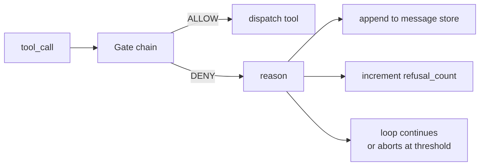
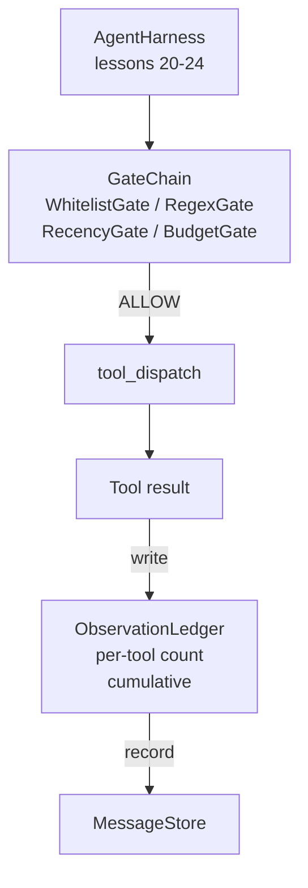

# Capstone Lesson 25: Verification Gates and the Observation Budget | 验证 结业 门控

> An agent harness without a verification layer is a wish in a trenchcoat. This lesson builds the deterministic gate chain that decides whether a tool call is allowed to fire, how much of its output the agent is allowed to see, and when the loop has to stop because the agent has read too much. The chain is a function of small, named gates plus an observation ledger that tracks every token the model has been shown.

> **【中文解读】** 本节是 AI 工程的综合实战项目，整合前面学到的技术和方法。


**Type:** Build | **类型:** Build
**Languages:** Python (stdlib) | **语言:** Python (stdlib)
**Prerequisites:** Phase 19 · 20-24 (Track A1: agent loop, tool registry, message store, prompt builder, model router), Phase 14 · 33 (instructions as constraints), Phase 14 · 36 (scope contracts), Phase 14 · 38 (verification gates) | **前置知识:** Phase 19 · 20-24 (Track A1: agent loop, tool registry, message store, prompt builder, model router), Phase 14 · 33 (instructions as constraints), Phase 14 · 36 (scope contracts), Phase 14 · 38 (verification gates)
**Time:** ~90 minutes | **时间:** ~90 minutes

## Learning Objectives | 学习目标

- Build a `VerificationGate` protocol with a deterministic `evaluate(call)` method.
  中文翻译：Build a `VerificationGate` protocol with a deterministic `evaluate(call)` method.
- Compose budget, recency, whitelist, and regex gates into a chain with short-circuit semantics.
  中文翻译：Compose budget, recency, whitelist, and regex gates into a chain with short-circuit semantics.
- Track every observation through an `ObservationLedger` keyed by tool and turn.
  中文翻译：Track every observation through an `ObservationLedger` keyed by tool and turn.
- Refuse a tool call when the cumulative observation budget would be exceeded.
  中文翻译：Refuse a tool call when the cumulative observation budget would be exceeded.
- Surface a structured `GateDecision` record that downstream observability can ingest.
  中文翻译：Surface a structured `GateDecision` record that downstream observability can ingest.

## The Problem | 问题

> **【中文解读】** 当 Agent Harness 让模型自由调用工具时，三类 bug 在实际使用的第一小时内就会出现。1）无界观察：一个 grep 在 200K 行代码库上搜索将 50 万 token 倾倒到下一轮，浪费上下文。2）过时信息：长任务积累 50 次工具调用，模型把第三轮的旧数据当作当前状态。3）权限蔓延：研究任务从 web_search 开始，不知怎么就运行了 shell。验证门是确定性函数 `(call, history, ledger) -> ALLOW | DENY`——不是模型、不是判断，是确定性的拒绝。

> **【拓展：验证门在 Claude Code 和 Devin 中的实现】** Claude Code 的工具调用系统在每个工具执行前运行权限检查：文件操作限制在项目目录内，shell 命令需要用户确认，网络访问受限。Devin 的安全层更进一步：所有文件操作通过沙盒代理执行，网络请求通过白名单过滤。本课的四门设计（白名单门、正则门、时效门、预算门）是这些工业系统的核心模式。

When an agent harness lets the model call tools freely, three classes of bug appear within the first hour of real use.

> When an agent harness lets the model call tools freely, three classes of bug appear within the first hour of real use.（翻译）


The first is unbounded observation. A grep across a 200K-line repo dumps half a million tokens of output into the next turn. The model sees one match per kilobyte and the rest of the context is wasted. The token bill is large and the agent is now worse, not better, at the task.

> first is unbounded observation. A grep across a 200K-line repo dumps half a million tokens of output into the next turn. The model sees one match per kilobyte and the rest of the context is wasted. The token bill is large and the agent is now worse, not better, at the task.


The second is stale recency. A long-running task accumulates fifty tool calls. The model rereads the first read_file from turn three as if it were live state. Edits made on turn forty-seven never show up because the prompt builder serialized the earliest observations first.

> second is stale recency. A long-running task accumulates fifty tool calls. The model rereads the first read_file from turn three as if it were live state. Edits made on turn forty-seven never show up because the prompt builder serialized the earliest observations first.


The third is privilege creep. A research task starts by calling `web_search`, then somehow ends up running `shell` because the model invented a tool name and the harness defaulted to permissive. By the time anyone reads the trace, a junk file is sitting in /tmp and a curl ran against a private API.

> third is privilege creep. A research task starts by calling `web_search`, then somehow ends up running `shell` because the model invented a tool name and the harness defaulted to permissive. By the time anyone reads the trace, a junk file is sitting in /tmp and a curl ran against a private API.


A verification gate is the harness component that says no. It is not a model. It is not a judge. It is a deterministic function of `(call, history, ledger)` that returns either ALLOW or DENY with a reason. The reason is logged. The model is told. The loop continues or aborts.

> 一个verification gate is the harness component that says no. It is not a model. It is not a judge. It is a deterministic function of `(call, history, ledger)` that returns either ALLOW or DENY with a reason. The reason is logged. The model is told. The loop continues or aborts.


## The Concept | 概念

> **【中文解读】** 门（Gate）是任何具有 `evaluate(call, ctx) -> GateDecision` 方法的对象。链（Chain）是有序列表，评估在第一个 DENY 时短路。顺序重要：廉价的结构门在昂贵的 token 计数门前运行。本课提供四个门：WhitelistGate（O(1) 哈希查找）、RegexGate（拒绝 rm -rf 或内网 IP）、RecencyGate（只显示最近 N 轮的观察）、BudgetGate（累积 token 上限）。



A gate is anything with an `evaluate(call, ctx) -> GateDecision` method. The chain is an ordered list. Evaluation short-circuits on the first deny. Order matters: cheap structural gates run before expensive token-counting gates.

> 一个gate is anything with an `evaluate(call, ctx) -> GateDecision` method. The chain is an ordered list. Evaluation short-circuits on the first deny. Order matters: cheap structural gates run before expensive token-counting gates.


This lesson ships four gates:

- `WhitelistGate`. Allowed tool names are an explicit set. Anything outside is denied. This is the cheapest gate and runs first.
  中文翻译：`WhitelistGate`. Allowed tool names are an explicit set. Anything outside is denied. This is the cheapest gate and runs first.
- `RegexGate`. Tool arguments are matched against a regex. Useful for refusing shell calls with `rm -rf` in them, or HTTP calls to internal IPs. Pure on the call payload.
  中文翻译：`RegexGate`. Tool arguments are matched against a regex. Useful for refusing shell calls with `rm -rf` in them, or HTTP calls to internal IPs. Pure on the call payload.
- `RecencyGate`. The model only sees observations from the last N turns. Older observations are masked. The gate refuses a tool call whose result would extend an observation window that has already aged out.
  中文翻译：`RecencyGate`. The model only sees observations from the last N turns. Older observations are masked. The gate refuses a tool call whose result would extend an observation window that has already aged out.
- `BudgetGate`. The cumulative tokens the model has read across the session has a ceiling. When the ledger says the ceiling is reached, every further tool call is denied.
  中文翻译：`BudgetGate`. The cumulative tokens the model has read across the session has a ceiling. When the ledger says the ceiling is reached, every further tool call is denied.

The observation ledger is the bookkeeping. Every successful tool call writes one row: tool name, turn, tokens emitted, cumulative. The ledger answers two questions: how much has the model seen total, and how much has it seen of tool X. The budget gate reads the first. A per-tool budget gate, which you will write as an exercise, reads the second.

> observation ledger is the bookkeeping. Every successful tool call writes one row: tool name, turn, tokens emitted, cumulative. The ledger answers two questions: how much has the model seen total, and how much has it seen of tool X. The budget gate reads the first. A per-tool budget gate, which you will write as an exercise, reads the second.


## Architecture | 架构



The harness asks the chain. The chain either nods or refuses. If it nods, the tool runs, the ledger ticks, and the result is appended to the message store. If it refuses, the model is handed the refusal as a system message and the loop decides whether to retry or abort.

> harness asks the chain. The chain either nods or refuses. If it nods, the tool runs, the ledger ticks, and the result is appended to the message store. If it refuses, the model is handed the refusal as a system message and the loop decides whether to retry or abort.


## What you will build

> **【拓展：观察预算在 RAG 系统中的对应物】** RAG 系统中的上下文窗口管理是观察预算的直接对应物。当检索系统返回的文档填充了 LLM 的上下文窗口时，模型的质量实际上下降了——噪声淹没了信号。LangChain 的 ContextualCompressionRetriever 和 LlamaIndex 的 SentenceWindowRetriever 都实现了类似 BudgetGate 的机制。本课的 ObservationLedger 可以直接映射为 RAG 系统中的 token 使用追踪器。

The implementation is a single `main.py` plus tests.

1. `Observation` and `ToolCall` dataclasses define the wire shapes.
2. `ObservationLedger` records `(turn, tool, tokens)` rows and answers `cumulative()` and `per_tool(name)`.
3. `GateDecision` carries `(allow, reason, gate_name)`.
4. `VerificationGate` is the protocol. Each gate implements `evaluate(call, ctx)`.
5. `GateChain` wraps an ordered list. It calls each gate, returns the first deny, or returns allow if every gate passes.
6. The demo runs a tiny synthetic agent loop. Three turns. The third turn trips the budget gate and the loop reports a clean refusal with a non-zero refusal count.

The token counter is intentionally a stupid `len(text) // 4` heuristic. The point of this lesson is the gate plumbing, not the tokenizer. Drop in a real tokenizer in production.

> token counter is intentionally a stupid `len(text) // 4` heuristic. The point of this lesson is the gate plumbing, not the tokenizer. Drop in a real tokenizer in production.


## Why the chain order matters

> **【中文解读】** 拒绝比允许便宜，且门按成本升序排列：WhitelistGate O(1) < RegexGate O(pattern) < RecencyGate O(slice) < BudgetGate O(ledger)。也按爆炸半径排序：白名单是最强声明（工具不在契约中），正则门检查参数合法性，时效门仍关心但调用结构合法，预算门在所有其他门通过后才触发。

> **【拓展：短路评估在安全系统中的标准实践】** Web 应用防火墙（WAF）的规则链使用相同的短路模式：先检查 IP 黑名单（O(1)），再检查请求体正则（O(n)），最后检查速率限制（O(redis call)）。Kubernetes 的 Admission Controller 链也按类似顺序执行。本课的门链设计是安全工程中"快速失败"（fail fast）原则的直接应用。

A deny is cheaper than an allow. `WhitelistGate` runs in O(1) hash lookup. `RegexGate` runs in O(pattern * argv). `RecencyGate` reads a small slice of the message store. `BudgetGate` reads the entire ledger. You order them by ascending cost so a denied call short-circuits before doing the expensive work.

> 一个deny is cheaper than an allow. `WhitelistGate` runs in O(1) hash lookup. `RegexGate` runs in O(pattern * argv). `RecencyGate` reads a small slice of the message store. `BudgetGate` reads the entire ledger. You order them by ascending cost so a denied call short-circuits before doing the expensive work.


You also order them by blast radius. Whitelist is the strongest claim: this tool is not in the contract. The regex gate is next: this argument is not in the contract. Recency comes after: the harness still cares but the call is structurally legal. Budget is last because, by definition, it only fires when everything else passed.

> 你also order them by blast radius. Whitelist is the strongest claim: this tool is not in the contract. The regex gate is next: this argument is not in the contract. Recency comes after: the harness still cares but the call is structurally legal. Budget is last because, by definition, it only fires when everything else passed.


## How this composes with the rest of Track A

The previous lessons gave you the loop, the tool registry, the message store, the prompt builder, and the model router. This lesson adds the layer between the model and the tools. Lesson 26 ships the sandbox that the dispatcher hands the tool call to once the gate chain says ALLOW. Lesson 27 ships the eval harness that records refusal counts as a quality signal. Lesson 28 wires the gate decisions into OpenTelemetry spans. Lesson 29 stitches the lot into a working coding agent.

> previous lessons gave you the loop, the tool registry, the message store, the prompt builder, and the model router. This lesson adds the layer between the model and the tools. Lesson 26 ships the sandbox that the dispatcher hands the tool call to once the gate chain says ALLOW. Lesson 27 ships the eval harness that records refusal counts as a quality signal. Lesson 28 wires the gate decisions into OpenTelemetry spans. Lesson 29 stitches the lot into a working coding agent.


## Running it | 运行

```bash
cd phases/19-capstone-projects/25-verification-gates-observation-budget
python3 code/main.py
python3 -m pytest code/tests/ -v
```

The demo prints a turn-by-turn trace including every gate decision and exits zero. The tests cover the ledger, each gate in isolation, the chain short-circuit, and the synthetic loop end-to-end.

> demo prints a turn-by-turn trace including every gate decision and exits zero. The tests cover the ledger, each gate in isolation, the chain short-circuit, and the synthetic loop end-to-end.

