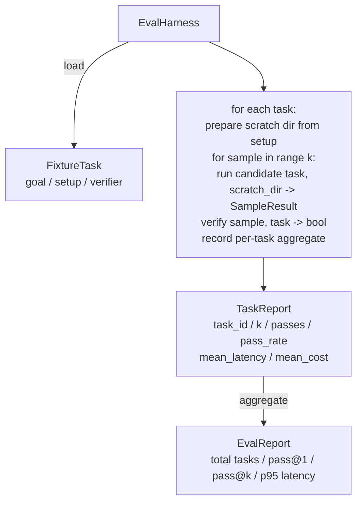

# Capstone Lesson 27: Eval Harness with Fixture Tasks | 结业 线束 评估

> A coding agent is only as good as the suite of tasks you measure it against. This lesson builds an evaluation harness that takes a folder of fixture tasks, runs each through a candidate agent, scores pass or fail through a deterministic verifier, and aggregates the results into pass@1, pass@k, mean latency, and mean cost. The harness is the source of truth that lets you tell a regression from a refactor.

> **【中文解读】** 本节是综合项目——构建 Agent 线束循环和契约验证系统。


**Type:** Build | **类型:** Build
**Languages:** Python (stdlib) | **语言:** Python (stdlib)
**Prerequisites:** Phase 19 · 25 (verification gates), Phase 19 · 26 (sandbox runner), Phase 14 · 30 (eval-driven agent development), Phase 14 · 19 (SWE-bench and GAIA benchmarks) | **前置知识:** Phase 19 · 25 (verification gates), Phase 19 · 26 (sandbox runner), Phase 14 · 30 (eval-driven agent development), Phase 14 · 19 (SWE-bench and GAIA benchmarks)

> 🔗 【前置】Agent Harness 8/10。参考 Phase 14·19+30（SWE-bench/GAIA + eval 驱动开发）。
> 💡 Eval harness = "编码 Agent 的体检中心"。fixture 任务文件夹→候选 Agent 跑→确定性验证器打分→聚合 pass@1/pass@k/延迟/成本。这是辨别"回归 vs 重构"的唯一真相源。
**Time:** ~90 minutes | **时间:** ~90 minutes

## Learning Objectives | 学习目标

- Define a fixture task as a triple of goal, setup, and verifier.
  中文翻译：Define a fixture task as a triple of goal, setup, and verifier.
- Score multiple sample runs per task and compute pass@1 and pass@k.
  中文翻译：Score multiple sample runs per task and compute pass@1 and pass@k.
- Aggregate latency and cost into mean and 95th-percentile metrics.
  中文翻译：Aggregate latency and cost into mean and 95th-percentile metrics.
- Wire deterministic verifiers (file diff, exit code, regex match) into reusable functions.
  中文翻译：Wire deterministic verifiers (file diff, exit code, regex match) into reusable functions.
- Emit a structured JSON report a regression-tracking script can ingest.
  中文翻译：Emit a structured JSON report a regression-tracking script can ingest.

## The Problem | 问题

> **【中文解读】** 没有评估线束的 Agent 基准测试困扰于三种故障模式：1）未验证的通过——Agent 声称修复了 bug，人类扫了一眼 diff，三周后回归测试发现同样的 bug；2）未检测的回归——提示模板变更让 Agent 在嘈杂任务上好 4% 但在安静任务上差 14%；3）每任务漂移——周一评估 100 个任务，周五只有 95 个，通过率看似提高了 5%但其实不是。线束是将这些失败转化为事实的程序。

> **【拓展：pass@k 指标在代码生成评估中的核心地位】** pass@k 由 Chen et al. (2021, HumanEval 论文) 引入，已成为代码生成模型的标准评估指标。公式 `pass@k = 1 - (1-p)^k`，其中 p 是经验通过率。DeepSeek-Coder、CodeLlama、StarCoder2 都报告 pass@1 和 pass@5。pass@5 = 0.95 但 pass@1 = 0.6 的模型需要采样和排名策略才能实际使用——仅看 pass@5 会掩盖这个问题。

Three failure modes plague agent benchmarks built without an eval harness.

> Three failure modes plague agent benchmarks built without an eval harness.（翻译）


The first is unverified pass. The agent says it fixed the bug, the human glances at the diff, the suite is marked green, and three weeks later the regression test surfaces the same bug. The agent had reasoned plausibly without actually fixing anything.

> first is unverified pass. The agent says it fixed the bug, the human glances at the diff, the suite is marked green, and three weeks later the regression test surfaces the same bug. The agent had reasoned plausibly without actually fixing anything.


The second is undetected regression. A change to the prompt template makes the agent 4% better on the loud task and 14% worse on the quiet one. Without a goldset and a per-task score, the regression rides into main and surfaces only when a customer complains.

> second is undetected regression. A change to the prompt template makes the agent 4% better on the loud task and 14% worse on the quiet one. Without a goldset and a per-task score, the regression rides into main and surfaces only when a customer complains.


The third is per-task drift. The eval was run on Monday with 100 tasks and on Friday with 95 of them, because somebody renamed five fixtures. The pass rate looks like a 5% improvement. It isn't.

> third is per-task drift. The eval was run on Monday with 100 tasks and on Friday with 95 of them, because somebody renamed five fixtures. The pass rate looks like a 5% improvement. It isn't.


The harness is the program that turns these failures into facts. It runs every fixture, every time, in a reproducible order, against a verifier that returns true or false on a deterministic check.

> harness is the program that turns these failures into facts. It runs every fixture, every time, in a reproducible order, against a verifier that returns true or false on a deterministic check.


## The Concept | 概念

> **【中文解读】** FixtureTask 是 JSON 文件 + 可选的 expected/ 目录。JSON 声明 id、goal（给 Agent 的提示）、setup（放入临时目录的文件）和 verifier（验证器名称和参数）。三种验证器形状覆盖大部分有用任务：file_equals（精确匹配）、regex_match（正则匹配）、shell_exit_zero（shell 命令退出码为零）。线束对每个任务运行 k 次，报告 pass@1 和 pass@k。

```mermaid
flowchart LR
  F1[fixtures/task_001/<br/>task.json + expected/] --> Harness
  F2[fixtures/task_002/<br/>...] --> Harness
  Harness[Harness<br/>for each task:<br/>setup / run agent k samples /<br/>verify each sample /<br/>record latency, cost]
  Harness --> Report[EvalReport<br/>pass@1 / pass@k<br/>mean ms / p95 ms<br/>mean cost]
```

A `FixtureTask` is a small JSON file plus an optional `expected/` directory. The JSON declares an `id`, a `goal` (the prompt fed to the agent), a `setup` block (files to drop into the scratch dir), and a `verifier` block. The verifier block names a function in the harness's verifier registry and supplies its arguments.

> 一个`FixtureTask` is a small JSON file plus an optional `expected/` directory. The JSON declares an `id`, a `goal` (the prompt fed to the agent), a `setup` block (files to drop into the scratch dir), and a `verifier` block. The verifier block names a function in the harness's verifier registry and supplies its arguments.


Three verifier shapes cover the majority of useful tasks.

The first is `file_equals`. After the agent runs, compare a named file against an expected content. This catches "fix this bug in this exact way" tasks.

> first is `file_equals`. After the agent runs, compare a named file against an expected content. This catches "fix this bug in this exact way" tasks.


The second is `regex_match`. The named file's contents are matched against a regex. This catches "the function must exist and return X" tasks where there are many acceptable solutions.

> second is `regex_match`. The named file's contents are matched against a regex. This catches "the function must exist and return X" tasks where there are many acceptable solutions.


The third is `shell_exit_zero`. The harness runs a shell command (through the sandbox from lesson 26) and passes the task only if the command exits zero. This catches "the tests must pass" tasks.

> third is `shell_exit_zero`. The harness runs a shell command (through the sandbox from lesson 26) and passes the task only if the command exits zero. This catches "the tests must pass" tasks.


The harness runs each task `k` times. Pass@k is `1 - (1 - p)^k` where p is the empirical pass rate; the harness also reports raw counts so you can spot variance. Latency is wall-clock per sample. Cost is whatever the agent self-reports (token count, USD, or both); the harness sums it across samples and presents the per-task and aggregate numbers.

> harness runs each task `k` times. Pass@k is `1 - (1 - p)^k` where p is the empirical pass rate; the harness also reports raw counts so you can spot variance. Latency is wall-clock per sample. Cost is whatever the agent self-reports (token count, USD, or both); the harness sums it across samples and presents the per-task and aggregate numbers.


## Architecture | 架构

> **【拓展：SWE-bench 和 HumanEval 的评估线束设计】** SWE-bench（Princeton）使用真实的 GitHub issue 作为 fixture task，验证器是单元测试套件的通过率。HumanEval (OpenAI) 使用 164 个 Python 函数补全任务，验证器是输入输出对测试。本课的五 fixture task 设计是这些基准测试的教育性简化——相同的架构（JSONL 任务定义、可交换的验证器、pass@k 指标），但规模更小、可在 90 分钟内完成。



The candidate is a callable: `Callable[[FixtureTask, str], SampleResult]`. The harness creates the scratch directory via `tempfile.mkdtemp()` and passes its path as a plain string. The harness does not care how the candidate works. The candidate could be a deterministic patch applier (useful for harness self-tests), a real LLM agent, a fuzzer. The contract is the SampleResult.

> candidate is a callable: `Callable[[FixtureTask, str], SampleResult]`. The harness creates the scratch directory via `tempfile.mkdtemp()` and passes its path as a plain string. The harness does not care how the candidate works. The candidate could be a deterministic patch applier (useful for harness self-tests), a real LLM agent, a fuzzer. The contract is the SampleResult.


## What you will build

`main.py` ships:

1. `FixtureTask` dataclass.
2. `SampleResult` dataclass: success_self_reported, latency_ms, cost_units, edits.
3. `TaskReport`, `EvalReport` dataclasses with `to_dict()`.
4. `VerifierRegistry` mapping verifier name to function. Built-in verifiers: file_equals, regex_match, shell_exit_zero.
5. `EvalHarness` class. Runs a directory of tasks against a candidate. Returns EvalReport.
6. Five fixture tasks bundled in `tasks/`:
   - off-by-one in `fizzbuzz`
     中文翻译：off-by-one in `fizzbuzz`
   - missing return in `factorial`
     中文翻译：missing return in `factorial`
   - typo in error message
     中文翻译：typo in error message
   - empty function body
     中文翻译：empty function body
   - off-by-one in linked-list traversal
     中文翻译：off-by-one in linked-list traversal
7. A deterministic reference candidate (`apply_known_fixes`) the harness uses to demonstrate a clean pass@1 of 1.0.
8. Demo prints the EvalReport JSON and exits zero.

The fixture tasks are bundled as JSON files in `tasks/` plus paired source files in `tasks/<id>/buggy/` and `tasks/<id>/expected/`. The harness copies buggy into a scratch dir, hands it to the candidate, and verifies against expected.

> fixture tasks are bundled as JSON files in `tasks/` plus paired source files in `tasks/<id>/buggy/` and `tasks/<id>/expected/`. The harness copies buggy into a scratch dir, hands it to the candidate, and verifies against expected.


## Why pass@k and not just pass@1

> **【中文解读】** 真实 LLM Agent 是随机的。pass@1 = 0.6 看起来是失败，但 pass@5 = 0.95 说明 Agent 大部分时候能找到正确答案，只是在早期样本上选错了。修复是采样和排名，而非更多训练。pass@k 与 pass@1 一起报告，因为 pass@k 掩盖了真实故障——如果模型 20 次尝试中只对了 1 次，你没有有用的 Agent。

Real LLM agents are stochastic. A pass@1 of 0.6 looks like a failure. A pass@5 of 0.95 says the agent gets the right answer most of the time but is choosing wrong on early samples. The fix is sampling and ranking, not always more training. Pass@k makes that visible.

> Real LLM agents are stochastic.


Pass@k is reported alongside pass@1 because pass@k papers over a real failure: if the model gets the right answer once in twenty tries you do not have a useful agent. The harness shows both.

> Pass@k is reported alongside pass@1 because pass@k papers over a real failure: if the model gets the right answer once in twenty tries you do not have a useful agent.


## How this composes with the rest of Track A

Lesson 25 produced the gate chain. Lesson 26 produced the sandbox. The harness uses the sandbox for any `shell_exit_zero` verifier. Lesson 28 wraps each harness run in an OTel trace. Lesson 29 runs the end-to-end demo against one of the bundled fixtures and asserts pass@1 = 1.0 for the reference candidate.

> Lesson 25 produced the gate chain.


## Running it | 运行

```bash
cd phases/19-capstone-projects/27-eval-harness-fixture-tasks
python3 code/main.py
python3 -m pytest code/tests/ -v
```

The demo prints the EvalReport in JSON, including pass@1, pass@5, mean latency, and per-task breakdown. The exit code is zero. The tests cover the verifier functions, the pass@k math, fixture loading, and the harness end-to-end against the bundled reference candidate.

> demo prints the EvalReport in JSON, including pass@1, pass@5, mean latency, and per-task breakdown. The exit code is zero. The tests cover the verifier functions, the pass@k math, fixture loading, and the harness end-to-end against the bundled reference candidate.

