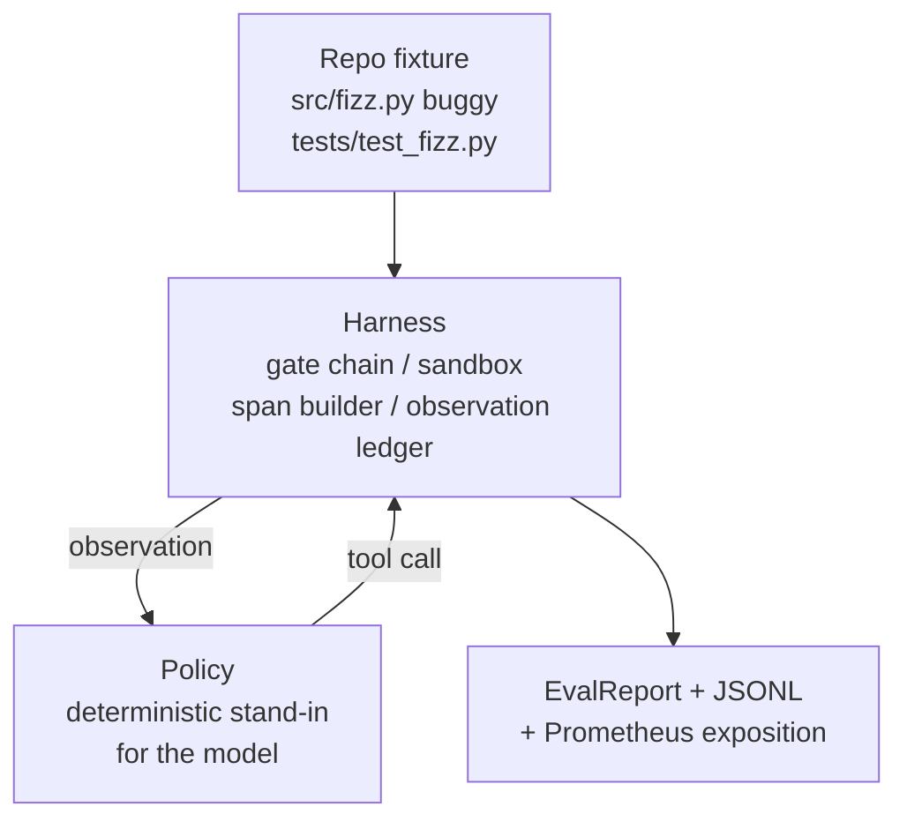
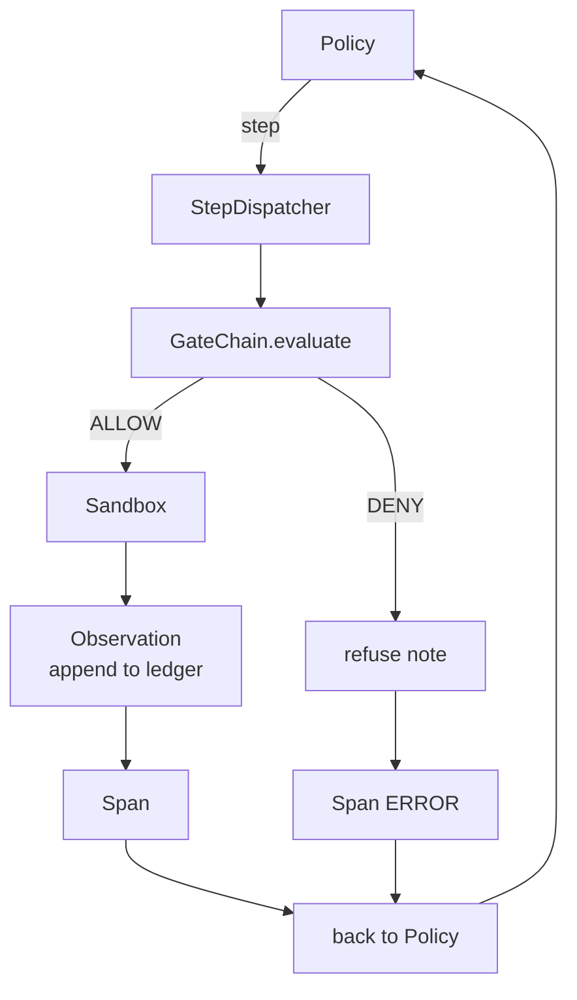

# Capstone Lesson 29: End-to-End Coding Agent on the Harness | 编码 Agent 结业 线束

> Track A's payoff. This lesson stitches the gate chain, the sandbox, the eval harness, and the OTel spans into one working coding agent that fixes a real (small, fixture-scale) bug in a multi-file Python project. The agent is a deterministic policy, not an LLM; the substitution makes the lesson reproducible and shows that the harness was the interesting part all along. The contract is identical: a real model plugs in at the policy seam.

> **【中文解读】** 本节是综合项目——端到端研究演示的完整集成。


**Type:** Build | **类型:** Build
**Languages:** Python (stdlib) | **语言:** Python (stdlib)
**Prerequisites:** Phase 19 · 25 (verification gates), Phase 19 · 26 (sandbox), Phase 19 · 27 (eval harness), Phase 19 · 28 (observability), Phase 14 · 38 (verification gates), Phase 14 · 41 (workbench for real repos), Phase 14 · 42 (agent workbench capstone) | **前置知识:** Phase 19 · 25 (verification gates), Phase 19 · 26 (sandbox), Phase 19 · 27 (eval harness), Phase 19 · 28 (observability), Phase 14 · 38 (verification gates), Phase 14 · 41 (workbench for real repos), Phase 14 · 42 (agent workbench capstone)

> 🔗 【前置】Agent Harness 10/10（Track A 收官）。整合 20-28 全部 + Phase 14·38/41/42。
> 💡 端到端编码 Agent = "组装完成的车"。把门链、沙箱、eval harness、OTel 缝成一个能修真实多文件 Python bug 的 Agent。关键设计：用确定性策略替代 LLM（让课程可复现），证明 harness 才是有趣的部分——真模型在策略接口处接入即可。
**Time:** ~90 minutes | **时间:** ~90 minutes

## Learning Objectives | 学习目标

- Compose the gate chain, sandbox, eval harness, and span builder into a single agent loop.
  中文翻译：Compose the gate chain, sandbox, eval harness, and span builder into a single agent loop.
- Implement a deterministic policy that uses read_file, run_tests, and write_file to fix a fixture bug.
  中文翻译：Implement a deterministic policy that uses read_file, run_tests, and write_file to fix a fixture bug.
- Enforce a global step budget plus an observation token budget across an end-to-end run.
  中文翻译：Enforce a global step budget plus an observation token budget across an end-to-end run.
- Emit complete OTel GenAI traces and Prometheus metrics for the full run.
  中文翻译：Emit complete OTel GenAI traces and Prometheus metrics for the full run.
- Verify the agent solves the fixture in fewer than 12 steps with zero gate trips on legal tools.
  中文翻译：Verify the agent solves the fixture in fewer than 12 steps with zero gate trips on legal tools.

## The Problem | 问题

> **【中文解读】** 大多数 Agent 演示都是孤立运行的：沙箱单独演示、评估线束单独演示、Span 发射器单独演示。看起来都没问题，但一旦组合起来，接口缝隙就暴露了。本节将这些组件集成到一个完整的编码 Agent 中，验证系统级集成是否正确。

Most agent demos work in isolation: a sandbox by itself, an eval harness by itself, a span emitter by itself. They look fine. Compose them and the seams show.

> Most agent demos work in isolation: a sandbox by itself, an eval harness by itself, a span emitter by itself.


The gate chain says ALLOW but the sandbox refuses for a reason the chain did not anticipate. The eval harness records a pass but the OTel spans say the gate refused a tool the agent claims it used. The Prometheus counter is incremented twice when it should be incremented once. The observation budget is exceeded but the agent kept going because the budget was tracked in the chain and the sandbox didn't know.

> gate chain says ALLOW but the sandbox refuses for a reason the chain did not anticipate. The eval harness records a pass but the OTel spans say the gate refused a tool the agent claims it used. The Prometheus counter is incremented twice when it should be incremented once. The observation budget is exceeded but the agent kept going because the budget was tracked in the chain and the sandbox didn't know.


This lesson is the integration test for the whole track. The agent has to do four things in order: read the project, run the tests, identify the bug from the test failure, write the fix, rerun the tests, and stop. Every operation goes through the gate chain. Every tool execution goes through the sandbox. Every step is wrapped in a span. The eval harness scores the whole thing at the end.

> 这个lesson is the integration test for the whole track. The agent has to do four things in order: read the project, run the tests, identify the bug from the test failure, write the fix, rerun the tests, and stop. Every operation goes through the gate chain. Every tool execution goes through the sandbox. Every step is wrapped in a span. The eval harness scores the whole thing at the end.


## The Concept | 概念

> **【中文解读】** Agent 的策略被建模为五状态有限状态机：SURVEY（浏览项目）、RUN_TESTS（运行测试）、INSPECT（检查失败文件）、FIX（写入修复）、VERIFY（验证修复）。每个状态对应一次工具调用，每次调用都经过 Gate Chain 审查。这种确定性设计使得结果可复现，便于测试验证。

> **【拓展：端到端 Agent 系统】** 现代编码 Agent 如 SWE-Agent (Princeton, 2024) 和 OpenDevin 采用类似架构：工具调用链 + 门控 + 沙箱执行。SWE-Agent 在 SWE-Bench 上解决了约 12% 的真实 GitHub issue，其核心循环与本节相同：读取 -> 定位 -> 编辑 -> 验证。区别在于用 LLM 替换了确定性策略。



The agent's policy is a state machine. Five states.

`SURVEY`: the agent reads the project listing. The next state is RUN_TESTS.

> `SURVEY`: the agent reads the project listing. The next state is RUN_TESTS.（翻译）


`RUN_TESTS`: the agent runs the test command. If the tests pass, the state machine halts with success. Otherwise the next state is INSPECT.

> `RUN_TESTS`: the agent runs the test command.


`INSPECT`: the agent reads the failing source file. The next state is FIX.

> `INSPECT`: the agent reads the failing source file. The next state is FIX.（翻译）


`FIX`: the agent writes the corrected file. The next state is VERIFY.

> `FIX`: the agent writes the corrected file. The next state is VERIFY.（翻译）


`VERIFY`: the agent runs the test command again. If the tests pass, halt success. Otherwise halt with failure.

> `VERIFY`: the agent runs the test command again. If the tests pass, halt success. Otherwise halt with failure.（翻译）


Each state corresponds to a tool call. Each tool call passes through the gate chain. If a tool call is denied, the agent reports the refusal in the trace and halts.

> 每个state corresponds to a tool call. Each tool call passes through the gate chain. If a tool call is denied, the agent reports the refusal in the trace and halts.


The fixture bug is an off-by-one in `fizz.py`. The deterministic policy detects the bug from the test failure message via a regex and emits the corrected file. Replacing the policy with an LLM does not change the harness contract.

> fixture bug is an off-by-one in `fizz.py`. The deterministic policy detects the bug from the test failure message via a regex and emits the corrected file. Replacing the policy with an LLM does not change the harness contract.


## Architecture | 架构



The lesson is self-contained. Each prior-lesson primitive is reimplemented at minimal scale in `main.py` (gate, sandbox, ledger, span) so the lesson runs without importing siblings. The names match lessons 25-28 exactly so the conceptual mapping is unambiguous.

> lesson is self-contained. Each prior-lesson primitive is reimplemented at minimal scale in `main.py` (gate, sandbox, ledger, span) so the lesson runs without importing siblings. The names match lessons 25-28 exactly so the conceptual mapping is unambiguous.


## What you will build

`main.py` ships:

1. The minimal harness primitives, copied with the same names as lessons 25-28: `GateChain`, `Sandbox`, `ObservationLedger`, `SpanBuilder`, `MetricsRegistry`.
2. `CodingAgentPolicy` class: state machine with five states.
3. `Repo` helper: prepares a scratch dir with the bundled buggy fixture.
4. `AgentRun` class: drives the policy, dispatches through the harness, returns an `AgentRunReport`.
5. A bundled fixture (`fixture_repo/`) with src/fizz.py, tests/test_fizz.py, and an expected/ tree for the eval harness.
6. Demo: runs the policy end-to-end, prints the step-by-step trace, asserts pass, prints metrics.

The bundled fixture is the same shape as lesson 27's task structure: a buggy file and a tests file. The test failure message contains enough information for the deterministic policy to identify the fix. A real LLM would do the same job, slower and with broader recall, but it would not change the harness's expectations.

> bundled fixture is the same shape as lesson 27's task structure: a buggy file and a tests file. The test failure message contains enough information for the deterministic policy to identify the fix. A real LLM would do the same job, slower and with broader recall, but it would not change the harness's expectations.


## Why the policy is not an LLM

> **【中文解读】** 使用确定性策略替代 LLM 的原因有三：(1) 无需 API 密钥和网络调用；(2) 消除随机性，测试可以断言精确的步骤数；(3) 本课关注的是线束（harness）本身而非策略。LLM 通过相同的接口（policy seam）插入，不改变任何线束契约。

A real LLM requires an API key, a network call, and unverifiable stochasticity. The harness is the part the lesson cares about. Subbing in a deterministic policy lets the lesson run on any developer laptop with zero external dependencies and lets the test suite assert exact-step counts.

> 一个real LLM requires an API key, a network call, and unverifiable stochasticity. The harness is the part the lesson cares about. Subbing in a deterministic policy lets the lesson run on any developer laptop with zero external dependencies and lets the test suite assert exact-step counts.


The lesson's policy is a strict subset of what an LLM agent does. The policy reads the repo, sees the failing test, identifies the line, and emits a fix. An LLM goes through the same loop with the same harness contract; the bookkeeping is identical.

> lesson's policy is a strict subset of what an LLM agent does. The policy reads the repo, sees the failing test, identifies the line, and emits a fix. An LLM goes through the same loop with the same harness contract; the bookkeeping is identical.


## What the demo asserts

> **【拓展：Agent 评估方法论】** 端到端 Agent 评估的核心挑战在于定义"成功"。OpenAI 的 SWE-Bench 使用真实 GitHub PR 作为基准，要求 Agent 在多文件项目中生成能通过现有测试的补丁。本节的五个断言（步骤预算、观察预算、零门控拒绝、每步都有 Span、Prometheus 指标完整）是 Agent 可观测性的最小验证集，对应生产环境中的 SLO（Service Level Objective）。

The end-to-end demo asserts five things at exit time, and the test suite reasserts them programmatically.

> ENd-to-end demo asserts five things at exit time, and the test suite reasserts them programmatically.（翻译）


The policy solved the fixture in fewer than 12 steps.

The observation budget was never exceeded.

Zero gate denials fired on legal tools. (The agent never invented a denied tool name.)

> Zero gate denials fired on legal tools. (The agent never invented a denied tool name.)（翻译）


Every step has a corresponding span in the traces.jsonl.

The Prometheus exposition contains a `tools_called_total{tool="read_file"}` entry and a `tool_latency_ms` histogram.

> PRometheus exposition contains a `tools_called_total{tool="read_file"}` entry and a `tool_latency_ms` histogram.（翻译）


## How this composes with the rest of Track A

> **【中文解读】** 本课是 Track A 的集成测试。Lesson 25 编写了 Gate Chain，Lesson 26 编写了沙箱，Lesson 27 编写了评估线束，Lesson 28 编写了可观测性，Lesson 29 证明它们作为系统协同工作。替换确定性策略为真实模型、替换夹具为真实仓库、替换 JSONL 为 OTLP，即构成生产级 Agent 线束。

This lesson is the integration. Lesson 25 wrote the gate chain. Lesson 26 wrote the sandbox. Lesson 27 wrote the eval harness. Lesson 28 wrote the observability. Lesson 29 proves they work as a system. A real agent harness extends from here: swap the deterministic policy for a model, swap the bundled fixture for a real-repo task, swap the JSONL exporter for OTLP.

> 这个lesson is the integration. Lesson 25 wrote the gate chain. Lesson 26 wrote the sandbox. Lesson 27 wrote the eval harness. Lesson 28 wrote the observability. Lesson 29 proves they work as a system. A real agent harness extends from here: swap the deterministic policy for a model, swap the bundled fixture for a real-repo task, swap the JSONL exporter for OTLP.


## Running it | 运行

```bash
cd phases/19-capstone-projects/29-end-to-end-coding-task-demo
python3 code/main.py
python3 -m pytest code/tests/ -v
```

The demo prints a per-step trace, the final eval report, and the Prometheus exposition. Exit code is zero. The tests cover the policy state transitions, the gate refusals on synthetic tool calls, the end-to-end run on the bundled fixture, and the step-budget invariants.

> demo prints a per-step trace, the final eval report, and the Prometheus exposition. Exit code is zero. The tests cover the policy state transitions, the gate refusals on synthetic tool calls, the end-to-end run on the bundled fixture, and the step-budget invariants.

