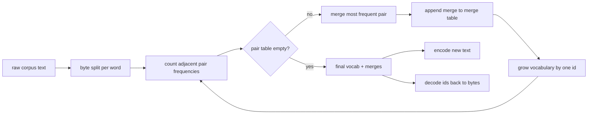
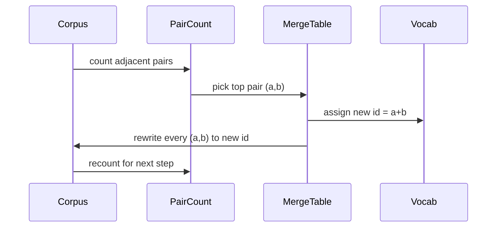

# BPE Tokenizer From Scratch | 分词器 BPE

> Bytes in, ids out, ids back to the same bytes. Build the tokenizer that every modern text model still starts from.

> **【中文解读】** 本节是综合项目——从零构建 BPE 分词器。

**Type:** Build | **类型:** Build
**Languages:** Python | **语言:** Python
**Prerequisites:** Phase 04 lessons, Phase 07 transformer lessons | **前置知识:** Phase 04 lessons, Phase 07 transformer lessons
**Time:** ~90 minutes | **时间:** ~90 minutes

## Learning Objectives | 学习目标
- Train a Byte-Pair Encoding vocabulary from a raw text corpus by repeatedly merging the most frequent adjacent symbol pair.
  中文翻译：Train a Byte-Pair Encoding vocabulary from a raw text corpus by repeatedly merging the most frequent adjacent symbol pair.
- Implement a deterministic merge table and apply it to fresh text to produce a stream of subword ids.
  中文翻译：Implement a deterministic merge table and apply it to fresh text to produce a stream of subword ids.
- Round-trip arbitrary UTF-8 input to ids and back without information loss.
  中文翻译：Round-trip arbitrary UTF-8 input to ids and back without information loss.
- Reserve and protect special tokens (`<|endoftext|>`, `<|pad|>`) so they survive training and decoding.
  中文翻译：Reserve and protect special tokens (`<|endoftext|>`, `<|pad|>`) so they survive training and decoding.
- Reason about why a byte-level alphabet is the right floor for a general-purpose tokenizer.
  中文翻译：Reason about why a byte-level alphabet is the right floor for a general-purpose tokenizer.

## The frame

> **【中文解读】** 语言模型从不直接处理文本，它只处理整数。从字符串到整数列表（及反向）的映射就是分词器。如果这一层出错，整个训练的损失曲线都在测量错误的东西。BPE 的核心思想是：从已知字母表出发，反复合并最高频的相邻符号对，直到词汇表达到目标大小。

> **【拓展：GPT 系列分词器】** GPT-2 使用的是 byte-level BPE（本节实现的变体），词汇表 50257 个 token。GPT-4 使用 tiktoken，一种基于 BPE 的高性能 Rust 实现，cl100k_base 词汇表约 100k。LLaMA 系列使用 SentencePiece 的 BPE 变体，词汇表 32k-128k。分词器的选择直接影响模型处理多语言、代码和特殊字符的能力。GPT-4 的 cl100k_base 在代码任务上比 GPT-2 的分词器压缩率高约 30%。 The map from a string to a list of integers and back is the tokenizer. Get this layer wrong and every loss curve in the training run is measuring the wrong thing.

The dominant family of subword tokenizers for general text models is Byte-Pair Encoding. The idea is small. Start from a known alphabet. Find the adjacent symbol pair that appears most often in the training corpus. Merge it into a new symbol. Repeat until the vocabulary reaches the target size. Encoding new text reuses the same merge list in the same order.

> dominant family of subword tokenizers for general text models is Byte-Pair Encoding. The idea is small. Start from a known alphabet. Find the adjacent symbol pair that appears most often in the training corpus. Merge it into a new symbol. Repeat until the vocabulary reaches the target size. Encoding new text reuses the same merge list in the same order.

We will build the byte-level variant. The alphabet is the 256 raw bytes, not Unicode code points. That choice is what lets the tokenizer handle any UTF-8 input without falling back to an unknown token.

> 我们将构建字节级变体。字母表是 256 个原始字节，不是 Unicode 码点。

## The pipeline

The training side and the inference side share the merge table. That sharing is the contract. If you change the merge order at inference, you decode a different stream of ids.

> 训练侧和推理侧共享合并表。这种共享就是契约。

## The byte alphabet

The first 256 ids are reserved for the raw bytes 0x00 through 0xFF. That guarantees every input string can be expressed in the vocabulary before any merge happens. After the byte block we reserve a small range for special tokens. The training loop never proposes those ids as merge targets because we keep them out of the pretokenized stream entirely.

> 前 256 个 ID 预留给原始字节 0x00 到 0xFF。

The pretokenizer splits the corpus on whitespace and punctuation boundaries before training sees it. Without that split the BPE merge step would happily learn merges that cross word boundaries and the vocabulary fills up with whole common phrases. With the split, merges stay inside a word and the result generalizes.

> 预分词器在空白和标点边界上分割语料库。

## The training loop

> **【中文解读】** 训练循环每步做三件事：(1) 遍历语料库中每个词，统计当前相邻符号对的出现频率（按词频加权）；(2) 选取频率最高的符号对；(3) 将该符号对重写为一个新的单一符号（ID 为词汇表中下一个空闲槽）。成本随语料大小线性增长，但因为符号序列随合并不断缩短，实际速度很快。

For each training step the loop does three things. It walks every word in the corpus and counts how often each adjacent pair of current symbols appears, weighted by how often the word itself appears. It picks the pair with the highest count. It rewrites every occurrence of that pair into a single new symbol whose id is the next free slot in the vocabulary. Then it records the merge.

> 对于each training step the loop does three things. It walks every word in the corpus and counts how often each adjacent pair of current symbols appears, weighted by how often the word itself appears. It picks the pair with the highest count. It rewrites every occurrence of that pair into a single new symbol whose id is the next free slot in the vocabulary. Then it records the merge.

The cost of each step is linear in the size of the corpus expressed as a list of symbol sequences. For a million words and a target vocabulary of ten thousand ids the loop runs to completion in seconds because the symbol sequences shrink as merges land.

> 每步的成本与以符号序列列表表示的语料库大小成线性关系。

## Encoding fresh text

> **【中文解读】** 推理时不运行合并计数器，而是按训练时的学习顺序应用合并表。对新词，编码器从字节切分开始，扫描当前序列中排名最低（最早学习）的合并，执行该合并，再扫描，直到没有合并可应用。按排名排序保证了编码的确定性和与训练行为的一致性。

Inference does not call the merge counter. It applies the merge table in the same order it was learned. For a fresh word the encoder starts from the byte split. It scans the current sequence for the lowest-ranked merge (the earliest one that applies). It performs that merge. It scans again. The loop ends when no merge in the table applies to the current sequence.

> 推理不调用合并计数器，而是按学习顺序应用合并表。

The ordering by rank is the property that makes encoding deterministic and matches the training behavior on the same input. A merge that was learned first sits at the top of the table and gets applied first. If two merges could apply at the same position, the lower-rank one wins.

> 按排名排序使编码确定性并与训练行为匹配。

## Special tokens

> **【拓展：生产分词器的特殊 token】** 真实 LLM 使用更多特殊 token。GPT-2 使用 `<|endoftext|>`，ChatML 格式增加了 `<|im_start|>` 和 `<|im_end|>`。LLaMA-2 使用 `[INST]`、`[/INST]`、`<<SYS>>`、`<</SYS>>`。LLaMA-3 使用 `<|begin_of_text|>`、`<|end_of_text|>`、`<|start_header_id|>` 等超过 10 种特殊 token。这些 token 在 BPE 合并过程中被排除，仅在模板拼接时插入。 Two are enough for this lesson.

- `<|endoftext|>` separates documents during pretraining. It tells the model "a new document starts here, do not let the previous one's context leak in."
  中文翻译：`<|endoftext|>` separates documents during pretraining. It tells the model "a new document starts here, do not let the previous one's context leak in."
- `<|pad|>` fills out short sequences so a batch can be a rectangular tensor. The loss mask hides it during training.
  中文翻译：`<|pad|>` fills out short sequences so a batch can be a rectangular tensor. The loss mask hides it during training.

The encoder accepts a flag to allow special tokens in the input. With the flag off, the strings `<|endoftext|>` and `<|pad|>` get tokenized as the bytes that spell them out. With the flag on, the literal strings get mapped to their reserved ids and are not subject to any merge.

> encoder accepts a flag to allow special tokens in the input. With the flag off, the strings `<|endoftext|>` and `<|pad|>` get tokenized as the bytes that spell them out. With the flag on, the literal strings get mapped to their reserved ids and are not subject to any merge.

## Round-trip guarantee

> **【中文解读】** 编码后解码必须精确返回输入字节。解码器按顺序拼接每个 ID 的字节展开。因为每个 ID 要么是原始字节，要么是两个已知 ID 的拼接，递归展开总是终止于原始字节。这一往返保证是分词器正确性的基础性质，测试套件在未见句子、含 Unicode emoji 的句子、含字面量 `<|endoftext|>` 的句子上验证此性质。

Encoding then decoding must return the input bytes exactly. The decoder concatenates the byte expansion of every id in order. Since every id is either a raw byte or the concatenation of two previously known ids, the recursive expansion always terminates in raw bytes. Decoding then returns the UTF-8 string that those bytes spell.

> 编码后解码必须精确返回输入字节。

The test suite in this lesson checks that property on an unseen sentence, on a sentence with a Unicode emoji, and on a sentence that contains a literal `<|endoftext|>` token.

> 本课的测试套件在未见句子、含 Unicode emoji 的句子和含字面量 token 的句子上检查该属性。

## What this lesson does not do

It does not build a regex-driven pretokenizer in the style of the largest production tokenizers. The pretokenizer here is a small whitespace and punctuation split. It is enough to produce sensible merges on a small training corpus and the contract with the rest of the lesson chain stays the same. The next lesson treats the tokenizer as a black box and builds the sliding-window dataset on top of it.

> 它不构建正则驱动的预分词器。

It does not parallelize the pair counter. A loop in Python over a corpus of a few thousand words finishes in well under a second. For larger corpora the obvious move is to count pairs per word in parallel and reduce.

> 它不并行化配对计数器。

## How to read the code

`main.py` defines four objects. `BPETokenizer` holds the vocabulary, the merge table, and the special-token table. `train` is the training loop. `encode` is the inference path. `decode` is the byte concatenation. The demo at the bottom trains a small tokenizer on a built-in corpus, encodes a held-out sentence, decodes the ids back, and prints both. The tests in `code/tests/test_bpe.py` pin the round-trip property, the special-token reservation, and the merge ordering.

> `main.

Run the demo. Then change the target vocabulary size in the demo from 300 to 600 and watch how the encoded length of the held-out sentence drops. That curve is the BPE compression curve.

> Run the demo.

