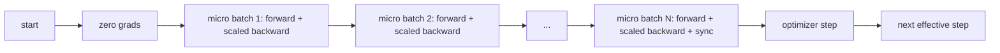
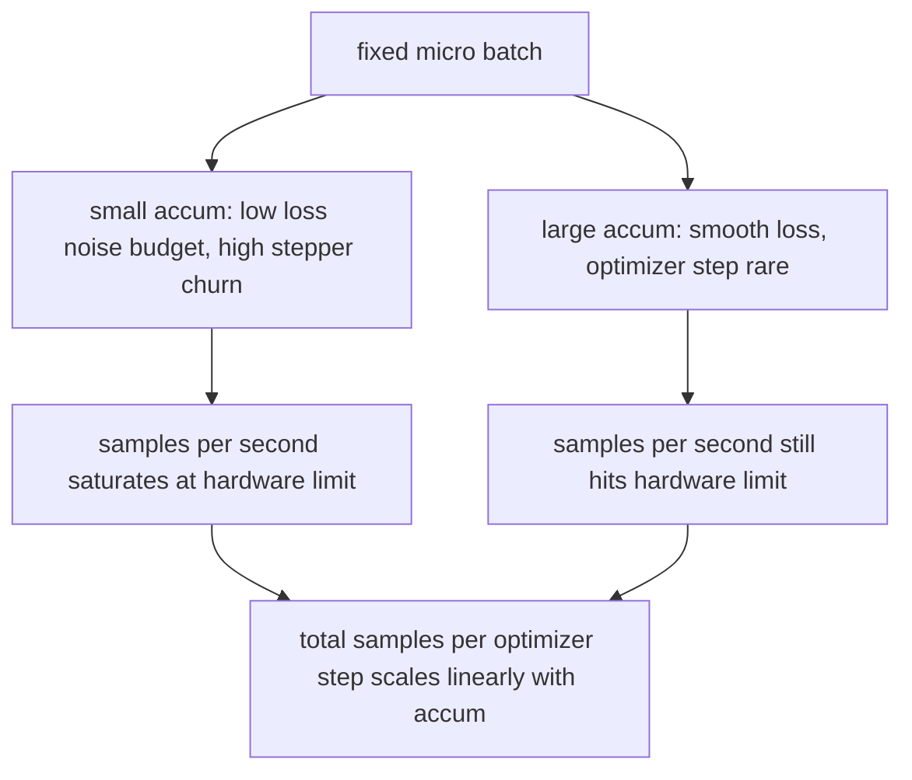

# Gradient Accumulation | 累积 梯度

> Train at an effective batch you cannot afford, one micro-batch at a time. Scale the loss, hold the optimizer step, and let the gradients pile up.

> **【中文解读】** 本节是综合项目——实现梯度裁剪和混合精度训练。


**Type:** Build | **类型:** Build
**Languages:** Python | **语言:** Python
**Prerequisites:** Phase 19 lessons 42 to 45 | **前置知识:** Phase 19 lessons 42 to 45
**Time:** ~90 minutes | **时间:** ~90 minutes

## Learning Objectives | 学习目标

- Derive the effective batch identity: `effective_batch = micro_batch * accum_steps`.
  中文翻译：Derive the effective batch identity: `effective_batch = micro_batch * accum_steps`.
- Implement loss-per-micro-batch scaling so the accumulated gradient matches a single full-batch backward.
  中文翻译：Implement loss-per-micro-batch scaling so the accumulated gradient matches a single full-batch backward.
- Skip optimizer synchronization until the last micro-batch (sync-on-last-step).
  中文翻译：Skip optimizer synchronization until the last micro-batch (sync-on-last-step).
- Read a throughput against effective batch curve and explain the diminishing return.
  中文翻译：Read a throughput against effective batch curve and explain the diminishing return.

## The Problem | 问题

> **【中文解读】** 你想在有效批次 512 下训练（损失曲线更平滑），但加速器只能容纳 32 个样本。梯度累积是 2017 年以来的标准技巧：连续运行 16 次反向传播，让梯度在参数缓冲区中累积，仅在达到目标时才执行优化器步骤。关键风险是损失缩放——16 个小批次的交叉熵简单求和是完整批次的 16 倍，方向正确但幅度错误，优化器步长 16 倍过大。修复只需一次除法，但也最容易被遗忘。

> **【拓展：梯度累积在 LLaMA 和 GPT 训练中的关键作用】** LLaMA 2 65B 的训练中，每个 GPU 的微批次大小为 4，通过梯度累积 16 步达到有效批次 64（每 GPU），再乘以数据并行度达到全局有效批次。GPT-3 175B 的训练使用了类似策略：微批次 0.5M tokens，累积 8 步，全局有效批次 3.2M tokens。梯度累积是连接硬件内存限制和训练质量需求的桥梁。

You want to train at an effective batch of 512 because the loss curve is smoother and the optimizer step makes more sense at that scale. The accelerator on the desk holds 32 examples before it runs out of memory. Doubling the batch is not an option. Halving the model is not an option. The trick the field reached for in 2017 and never stopped using is to run 16 backward passes, let the gradients accumulate inside the parameter buffers, and only step the optimizer when the count reaches the target.

> 你want to train at an effective batch of 512 because the loss curve is smoother and the optimizer step makes more sense at that scale. The accelerator on the desk holds 32 examples before it runs out of memory. Doubling the batch is not an option. Halving the model is not an option. The trick the field reached for in 2017 and never stopped using is to run 16 backward passes, let the gradients accumulate inside the parameter buffers, and only step the optimizer when the count reaches the target.


The risk is that the loss is no longer the same number it was at the bigger batch. The cross entropy of 16 mini-batches summed naively is 16 times the loss of one full batch. Without scaling, the gradient direction is correct but the magnitude is wrong, and the optimizer step is 16 times too big. The fix is one division. The fix is also easy to forget.

> risk is that the loss is no longer the same number it was at the bigger batch. The cross entropy of 16 mini-batches summed naively is 16 times the loss of one full batch. Without scaling, the gradient direction is correct but the magnitude is wrong, and the optimizer step is 16 times too big. The fix is one division. The fix is also easy to forget.


## The Concept | 概念



The contract is short:

- Loss for each micro-batch is divided by `accum_steps` before `backward()`. PyTorch sums gradients into `param.grad` by default; the division pushes the running sum back into the right scale.
  中文翻译：Loss for each micro-batch is divided by `accum_steps` before `backward()`. PyTorch sums gradients into `param.grad` by default; the division pushes the running sum back into the right scale.
- The optimizer step fires once per effective batch, after the last micro-batch's backward. Stepping mid-accumulation skews every parameter the rest of the run depends on.
  中文翻译：The optimizer step fires once per effective batch, after the last micro-batch's backward. Stepping mid-accumulation skews every parameter the rest of the run depends on.
- The optimizer's state (momentum buffers, Adam moments) advances once per effective step, not once per micro-batch. The exponential moving averages would otherwise see the wrong frequency and burn through the schedule.
  中文翻译：The optimizer's state (momentum buffers, Adam moments) advances once per effective step, not once per micro-batch. The exponential moving averages would otherwise see the wrong frequency and burn through the schedule.
- On a single device this is bookkeeping. On a multi-rank cluster the same pattern wraps the non-final micro-batches in a `no_sync` context that skips the gradient all-reduce; the last micro-batch reduces the full accumulated gradient in one pass instead of paying the network cost N times.
  中文翻译：On a single device this is bookkeeping. On a multi-rank cluster the same pattern wraps the non-final micro-batches in a `no_sync` context that skips the gradient all-reduce; the last micro-batch reduces the full accumulated gradient in one pass instead of paying the network cost N times.

### The equivalence proof in code

> **【中文解读】** 等价性证明：完整批次的前向/反向传播等价于将批次分成 N 份、每份损失除以 N 后累积梯度。关键点：PyTorch 默认将梯度累加到 `param.grad` 中，除法 N 使累积和回到正确尺度。优化器状态（动量缓冲、Adam 矩）每有效步只更新一次——否则指数移动平均看到错误的频率。

> **【拓展：分布式训练中的 no_sync 模式】** 在 DDP（分布式数据并行）中，每个非最终微批次需要跳过梯度 all-reduce 通信。PyTorch 的 `model.no_sync()` 上下文管理器实现了这一点。LLaMA 训练中，梯度累积步数为 16 时，通信次数从 16 次减少到 1 次，显著降低了网络带宽消耗。

```python
loss = criterion(model(x_full), y_full)
loss.backward()
opt.step()
```

is equivalent to

```python
for x, y in chunks(x_full, y_full, n):
    scaled = criterion(model(x), y) / n
    scaled.backward()
opt.step()
```

up to floating point summation order. The accumulated gradient buffer at the end of the loop is the same tensor that a single full-batch backward would produce. The lesson code asserts this with a max-abs difference under 1e-4 in `equivalence_check`.

> up to floating point summation order.


### Where the cost goes

> **【中文解读】** 每个微批次消耗一次前向和一次反向传播。累积是用时间换内存——每步优化器的墙钟时间翻倍，但梯度估计的方差降低了。文献将大批次和小批次视为不同的优化问题；本课的重点是力学而非统计。关键权衡：加倍累积步数使优化器步进频率减半，但每步更稳定。

Each micro-batch costs one forward and one backward. With accumulation you trade memory for time. The throughput curve in `outputs/accum-curve.json` shows what happens as the effective batch grows at fixed micro-batch:

> 每个micro-batch costs one forward and one backward. With accumulation you trade memory for time. The throughput curve in `outputs/accum-curve.json` shows what happens as the effective batch grows at fixed micro-batch:




There is no free lunch. Doubling `accum_steps` doubles the wall time per optimizer step. What changes is the variance of the gradient estimate: at the same wall budget you have made fewer optimizer steps but each one was averaged over more samples. The literature treats large batch and small batch as different optimization problems; the lesson here is mechanical, not statistical.

> There is no free lunch.


## Build It | 动手构建

`code/main.py` is the runnable artifact. It does three things.

> `code/main.py` is the runnable artifact. It does three things.（翻译）


### Step 1: equivalence check

`equivalence_check()` builds two copies of the same network with the same seed. One sees a 16-sample batch in one forward pass. The other sees four 4-sample chunks with the loss divided by four. The function compares the gradient buffers before the optimizer step and the parameters after. The assertion is `max_abs_diff < 1e-4`.

> `equivalence_check()` builds two copies of the same network with the same seed.


### Step 2: sync-on-last-step pattern

`train_one_optimizer_step` walks micro-batches. For every micro-batch except the last it enters `no_sync_context(model)`. On a single process the context is a no-op; on DDP this is where the gradient all-reduce is skipped. The bookkeeping is the same regardless. A `sync_counter` records how many times we left the no_sync scope; for N micro-batches the count is one per effective step, not N.

> `train_one_optimizer_step` walks micro-batches.


### Step 3: the throughput curve

`sweep_effective_batches` runs the same model with a fixed micro-batch and a list of accumulation steps. For each setting it logs:

> `sweep_effective_batches` runs the same model with a fixed micro-batch and a list of accumulation steps.


- `samples_per_sec`: total samples seen divided by wall time
  中文翻译：`samples_per_sec`: total samples seen divided by wall time
- `median_step_ms`: 50th percentile per effective step
  中文翻译：`median_step_ms`: 50th percentile per effective step
- `sync_calls`: collective points exercised
  中文翻译：`sync_calls`: collective points exercised
- `avg_loss`: average across the sweep's optimizer steps
  中文翻译：`avg_loss`: average across the sweep's optimizer steps

The output lands in `outputs/accum-curve.json` and is reusable from a notebook.

> OUtput lands in `outputs/accum-curve.json` and is reusable from a notebook.（翻译）


Run it:

```bash
python3 code/main.py
```

The script prints the equivalence diff, then the sweep table, then the JSON path. Exit code zero.

> SCript prints the equivalence diff, then the sweep table, then the JSON path. Exit code zero.（翻译）


## Use It | 使用方法

> **【中文解读】** 生产训练中，梯度累积的公式是 `accumulation_steps = effective_batch // (micro_batch * world_size)`。三个实践模式：1）微批次大小选择为饱和设备内存的值；2）有效批次由学习率调度决定（大批次需要缩放学习率和 warmup）；3）累积次数是连接两者的桥梁，也是唯一可以在运行时调整的旋钮。

> **【拓展：线性缩放规则与大批次训练】** Goyal et al. (2017) 提出的线性缩放规则：当批次大小增加 k 倍时，学习率也应增加 k 倍。这在 LLaMA 和 GPT 训练中被广泛使用，但需要配合更长的 warmup。违反此规则是训练发散的常见原因。

In production training, gradient accumulation lives behind one knob. PyTorch's pattern is `accumulation_steps = effective_batch // (micro_batch * world_size)`. Frameworks that you are not allowed to use here wrap the same loop, but the steps are the same: scale the loss, skip sync on non-final micros, accumulate, step once.

> 在production training, gradient accumulation lives behind one knob. PyTorch's pattern is `accumulation_steps = effective_batch // (micro_batch * world_size)`. Frameworks that you are not allowed to use here wrap the same loop, but the steps are the same: scale the loss, skip sync on non-final micros, accumulate, step once.


Three patterns in the wild:

- The micro-batch size is chosen to saturate device memory. Anything smaller wastes accelerator cycles. Anything larger crashes.
  中文翻译：The micro-batch size is chosen to saturate device memory. Anything smaller wastes accelerator cycles. Anything larger crashes.
- The effective batch is chosen from a learning rate schedule. Large effective batches need scaled learning rates and warmup; this is the linear scaling rule talked about since 2017.
  中文翻译：The effective batch is chosen from a learning rate schedule. Large effective batches need scaled learning rates and warmup; this is the linear scaling rule talked about since 2017.
- The accumulation count is the bridge between the two and the only knob you are free to tune at runtime without rewriting the data loader.
  中文翻译：The accumulation count is the bridge between the two and the only knob you are free to tune at runtime without rewriting the data loader.

## Ship It | 部署上线

`outputs/skill-gradient-accumulation.md` captures the recipe so a peer can drop it into a new repo: scale loss by `accum_steps`, skip optimizer sync on non-final micros, step the optimizer once per effective batch, log throughput against effective batch as JSON so the trade is visible.

> `outputs/skill-gradient-accumulation.


## Exercises | 练习题

1. Re-run the sweep with `--num-steps 100` and plot samples per second against effective batch. Where does the curve flatten?
2. Add a wrong scaling variant (no division) and show the parameter diff at step 1 against the reference.
3. Swap SGD for AdamW and confirm the optimizer state advances once per effective step, not once per micro-batch.
4. Introduce a real `DistributedDataParallel` wrapper and route the `no_sync_context` to its method. Confirm sync_calls drops by N-1 per effective batch.
5. Modify the equivalence check to compare two different micro splits (2 by 8 vs 4 by 4) and explain any tolerance you need to relax.

## Key Terms | 关键术语

| Term | What people say | What it actually means |
|------|-----------------|------------------------|
| Micro batch | The batch you forward | The slice that fits in memory in a single forward pass |
| Accum steps | Backward passes per step | Number of backwards summed before one optimizer step |
| Effective batch | The batch | Micro batch times accum steps times data parallel world size |
| Loss scaling | Divide by N | Per-micro-batch division so summed gradients match full batch |
| Sync on last | Skip the rest | Only run the gradient collective on the last backward in the window |

## Further Reading | 延伸阅读

- PyTorch docs on `DistributedDataParallel.no_sync` for the production version of the sync-on-last-step trick.
  中文翻译：PyTorch docs on `DistributedDataParallel.no_sync` for the production version of the sync-on-last-step trick.
- Goyal et al., 2017, on linear scaling for large batch training, the canonical reason to care about effective batch.
  中文翻译：Goyal et al., 2017, on linear scaling for large batch training, the canonical reason to care about effective batch.
- PyTorch issue tracker on gradient accumulation interactions with mixed precision unscaling.
  中文翻译：PyTorch issue tracker on gradient accumulation interactions with mixed precision unscaling.
- Phase 19 lessons 42 to 45 cover the model, data loader, optimizer, and trainer scaffolding this lesson assumes.
  中文翻译：Phase 19 lessons 42 to 45 cover the model, data loader, optimizer, and trainer scaffolding this lesson assumes.
- Phase 19 lesson 47 covers checkpoint and resume so a long accumulation run survives a wallclock cap.
  中文翻译：Phase 19 lesson 47 covers checkpoint and resume so a long accumulation run survives a wallclock cap.
