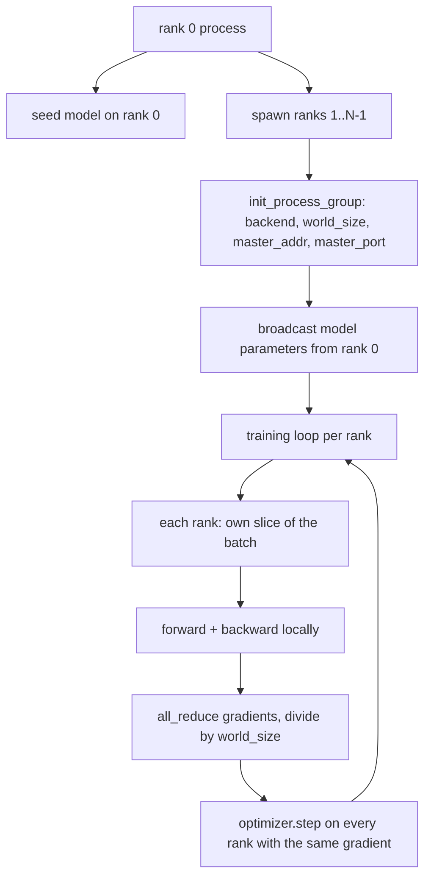
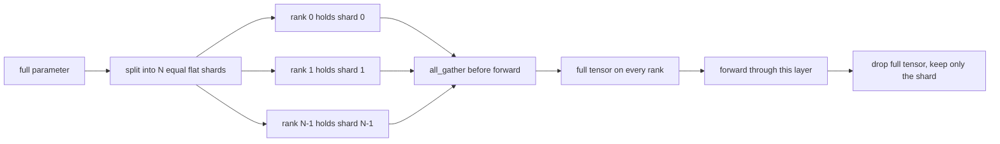

# Distributed Data Parallel and FSDP from Scratch | 分布式 并行 FSDP

> Multi-rank training is two collectives and one rule. Broadcast the parameters at startup, average the gradients after backward, never let the ranks disagree about what step they are on.

> **【中文解读】** 本节是综合项目——实现分布式训练 FSDP/DDP。


**Type:** Build | **类型:** Build
**Languages:** Python | **语言:** Python
**Prerequisites:** Phase 19 lessons 42 to 45 | **前置知识:** Phase 19 lessons 42 to 45

> 🔗 【前置】Track B 19/20。Track C 第 7 节。Phase 10·33（分布式训练）的从零版。
> 💡 多 rank 训练 = "两个集合通信+一条规则"。启动时广播参数+反向后平均梯度+永不许 rank 对步数有分歧。DDP（数据并行）和 FSDP（完全分片数据并行）都基于这个核心。
**Time:** ~90 minutes | **时间:** ~90 minutes

## Learning Objectives | 学习目标

- Bring up a process group across N ranks with the `gloo` backend, no special hardware.
  中文翻译：Bring up a process group across N ranks with the `gloo` backend, no special hardware.
- Implement a minimal DDP wrapper that broadcasts parameters at construction and all-reduces gradients after backward.
  中文翻译：Implement a minimal DDP wrapper that broadcasts parameters at construction and all-reduces gradients after backward.
- Prove that the all-reduce of per-rank gradients matches a single-process gradient on the concatenated input.
  中文翻译：Prove that the all-reduce of per-rank gradients matches a single-process gradient on the concatenated input.
- Sketch FSDP parameter sharding: each rank holds a slice, the full tensor is gathered for the forward pass and dropped after.
  中文翻译：Sketch FSDP parameter sharding: each rank holds a slice, the full tensor is gathered for the forward pass and dropped after.

## The Problem | 问题

> **【中文解读】** 模型可以装在单设备上，但数据集不能，优化预算要求每秒看到 N 倍的样本。数据并行（DDP）让每个 rank 在不同批次切片上运行相同模型，然后平均梯度。FSDP 解决模型也装不下的情况——每个 rank 只保存一部分参数，在前向传播时逐层重建完整张量。关键风险：参数跨 rank 漂移导致训练静默损坏；平均梯度但不平均损失导致仪表板说谎。

> **【拓展：DDP 和 FSDP 在 LLaMA 训练中的实际配置】** LLaMA 2 70B 使用 FSDP 在 2000+ A100 GPU 上训练。每个 GPU 仅持有约 35M 参数（70B / 2000），前向传播时通过 all-gather 重建完整层。PyTorch FSDP 的生产版本还包含：CPU offload（将不活跃的分片卸载到 CPU 内存）、计算与通信重叠（在计算当前层时预取下一层的参数），以及选择性激活检查点以减少内存占用。

The model fits on one device. The dataset does not. The optimization budget says you want to see N times the examples per wallclock second. The first lever is data parallel: each rank runs the same model on a different slice of the batch, then averages gradients before the optimizer step. The second lever is FSDP: the model does not fit on one device either, so each rank holds a fraction of every parameter and reconstructs the full tensors layer by layer during the forward pass.

> model fits on one device. The dataset does not. The optimization budget says you want to see N times the examples per wallclock second. The first lever is data parallel: each rank runs the same model on a different slice of the batch, then averages gradients before the optimizer step. The second lever is FSDP: the model does not fit on one device either, so each rank holds a fraction of every parameter and reconstructs the full tensors layer by layer during the forward pass.


The pain is the bookkeeping. If parameters drift across ranks the run is silently corrupt. If you average gradients but not the loss the dashboard lies. If the collective backend cannot agree on a topology the run hangs forever. The fix is to write the collectives by hand once and never trust a wrapper you cannot reproduce.

> pain is the bookkeeping. If parameters drift across ranks the run is silently corrupt. If you average gradients but not the loss the dashboard lies. If the collective backend cannot agree on a topology the run hangs forever. The fix is to write the collectives by hand once and never trust a wrapper you cannot reproduce.


This lesson runs on CPU. CUDA is not assumed. The `gloo` backend ships with every PyTorch build and accepts `torch.multiprocessing` workers; the same code switches to `nccl` on a multi-GPU node without changing structure.

> 这个lesson runs on CPU. CUDA is not assumed. The `gloo` backend ships with every PyTorch build and accepts `torch.multiprocessing` workers; the same code switches to `nccl` on a multi-GPU node without changing structure.


## The Concept | 概念



### The two collectives that matter

> **【中文解读】** 分布式训练只需要三个集合通信操作：`broadcast`（从一个 rank 复制张量到所有 rank，用于参数初始化）、`all_reduce`（跨 rank 求和/平均张量，用于梯度同步）、`all_gather`（每个 rank 贡献一个张量，所有 rank 获得拼接结果，用于 FSDP 参数重建）。DDP 的契约是构造时 broadcast + 反向传播后 all_reduce。

| Collective | What it does | When |
|------------|--------------|------|
| `broadcast` | Copy a tensor from one rank to all others | Parameter init, scheduler state, any one-to-all sync |
| `all_reduce` | Sum (or mean, or max) a tensor across all ranks, every rank gets the result | Gradient averaging after backward |
| `all_gather` | Each rank contributes a tensor, every rank gets the concatenation | Logits collection, FSDP parameter unshard |

The DDP contract is `broadcast` at construction and `all_reduce` after backward. The FSDP sketch adds `all_gather` before each layer's forward pass.

> DDP contract is `broadcast` at construction and `all_reduce` after backward. The FSDP sketch adds `all_gather` before each layer's forward pass.


### Gradient averaging matches single-process gradient

> **【中文解读】** 在 B 个样本上用 N 个 rank 训练的模型，必须产生与单进程在 N*B 样本上训练相同的梯度。关键洞察：将每 rank 梯度求和并除以 N，给出平均损失梯度——这就是 cross entropy 在 mean reduction 下对完整批次产生的结果。本课代码用 `max-abs-diff < 1e-3` 断言手动 all-reduce 梯度与参考单进程梯度一致。

A model trained on a batch of B examples across N ranks must produce the same gradient as a single process training on a batch of N*B. The trick is that summing per-rank gradients and dividing by N gives the average loss gradient, which is what cross entropy with mean reduction would produce on the full batch. The lesson code asserts this with `max-abs-diff < 1e-3` between the manual all-reduce gradient and the reference single-process gradient.

> 一个model trained on a batch of B examples across N ranks must produce the same gradient as a single process training on a batch of N*B. The trick is that summing per-rank gradients and dividing by N gives the average loss gradient, which is what cross entropy with mean reduction would produce on the full batch. The lesson code asserts this with `max-abs-diff < 1e-3` between the manual all-reduce gradient and the reference single-process gradient.


### FSDP sketch

> **【中文解读】** FSDP 的内存节省是精确的：每 rank 的参数内存降到 1/N。代价是每次前向传播的 all-gather 通信。生产 FSDP 将 gather 与前一层的计算重叠，使墙钟成本远低于朴素估算。本课对每个参数做 round-trip 并断言重建结果与原始比特级相等。

> **【拓展：FSDP vs Tensor Parallelism vs Pipeline Parallelism】** FSDP（ZeRO-3 风格）按层分片参数；Tensor Parallelism (TP) 将单个矩阵乘法切分到多个 GPU；Pipeline Parallelism (PP) 将不同层放在不同 GPU 上。LLaMA 2 70B 同时使用了 FSDP + TP + PP：TP 用于单节点内 8 个 GPU，PP 跨节点，FSDP 跨数据并行组。每种并行方式解决不同维度的扩展瓶颈。



The memory win is exact: per-rank memory for parameters drops to 1/N. The cost is the gather, which is paid every forward pass. Production FSDP overlaps the gather with the previous layer's compute so the wallclock cost is much smaller than the naive accounting predicts. The lesson does the round-trip on every parameter and asserts the reconstruction is bit-equal to the original.

> memory win is exact: per-rank memory for parameters drops to 1/N. The cost is the gather, which is paid every forward pass. Production FSDP overlaps the gather with the previous layer's compute so the wallclock cost is much smaller than the naive accounting predicts. The lesson does the round-trip on every parameter and asserts the reconstruction is bit-equal to the original.


### CPU and the gloo backend

CUDA is the production target, but the same code paths exist on CPU. `gloo` is the CPU collective backend. It is slower than `nccl` on GPUs by orders of magnitude, but the API surface is identical. The lesson's process group is initialized with `backend="gloo"` and ranks are spawned with `torch.multiprocessing` rather than `torchrun`; both end up at the same `torch.distributed` calls. On a multi-GPU node, the only changes are `backend="nccl"`, device tensors, and `torchrun` to launch.

> CUDA is the production target, but the same code paths exist on CPU.


## Build It | 动手构建

`code/main.py` is the runnable artifact.

### Step 1: bring up the process group

```python
os.environ["MASTER_ADDR"] = "127.0.0.1"
os.environ["MASTER_PORT"] = str(port)
dist.init_process_group(backend="gloo", rank=rank, world_size=world_size)
```

`MASTER_ADDR` and `MASTER_PORT` are the rendezvous: every rank dials the same port on the same host. The lesson picks a free port via a bind-and-close trick to avoid collisions when several runs share a machine.

> `MASTER_ADDR` and `MASTER_PORT` are the rendezvous: every rank dials the same port on the same host.


### Step 2: broadcast at construction

`MinimalDDP.__init__` walks every parameter and buffer and calls `dist.broadcast(tensor, src=0)`. Rank 0's values become the canonical init. Without this, each rank initializes with its own seed and the ranks diverge from step one.

> `MinimalDDP.


### Step 3: all-reduce gradients after backward

```python
def all_reduce_grads_(module, world_size):
    for p in module.parameters():
        if p.grad is None:
            p.grad = torch.zeros_like(p.data)
        dist.all_reduce(p.grad.data, op=dist.ReduceOp.SUM)
        p.grad.data.div_(world_size)
```

Every rank ends up with the same averaged gradient. The optimizer step is now a function of the same input on every rank, which is why the parameters stay in sync across the run.

> 每个rank ends up with the same averaged gradient. The optimizer step is now a function of the same input on every rank, which is why the parameters stay in sync across the run.


### Step 4: prove the equivalence

`manual_all_reduce_matches_single_process` builds the same model on rank 0 and compares the post-all-reduce gradient against the gradient a single process would compute on the concatenated input. The max-abs-diff is around 1e-8.

> `manual_all_reduce_matches_single_process` builds the same model on rank 0 and compares the post-all-reduce gradient against the gradient a single process would compute on the concatenated input.


### Step 5: FSDP round trip

`fsdp_round_trip_sketch` flattens each parameter, pads to a multiple of `world_size`, slices, all-gathers, and unpads. Every rank's reconstruction equals the original. This is the unshard step; the inverse (re-shard after the forward) is one slice off the gathered tensor.

> `fsdp_round_trip_sketch` flattens each parameter, pads to a multiple of `world_size`, slices, all-gathers, and unpads.


Run it:

```bash
python3 code/main.py
```

Default world size is 2. Two CPU processes spawn, talk to each other through `gloo`, and exit zero. The output `outputs/ddp-demo.json` captures parameter sums per rank, the gradient norm after all-reduce, the FSDP round-trip result, and the manual-vs-reference gradient diff.

> Default world size is 2.


## Use It | 使用方法

> **【拓展：从 DDP 到 FSDP 到混合并行的演进路线】** 小模型（<1B 参数）只需 DDP。中等模型（1-7B）需要 FSDP 或 ZeRO-3。大模型（70B+）需要 FSDP + Tensor Parallelism + Pipeline Parallelism 的组合。PyTorch 的 FSDP 在 2.x 版本已成为原生 API，取代了 FairScale 的实现。Megatron-LM 提供了 TP + PP 的参考实现。DeepSpeed 的 ZeRO 优化器提供了 FSDP 的替代方案，增加了 ZeRO-Offload（CPU 卸载）和 ZeRO-Infinity（NVMe 卸载）。

Production training stacks call the same primitives. PyTorch's `DistributedDataParallel` adds: post-backward gradient hooks that overlap all-reduce with backward, bucketed all-reduce that combines several small gradients into one collective, and the `no_sync` context lesson 46 used.

> Production training stacks call the same primitives.


PyTorch's FSDP adds: a flat parameter view per layer so each rank holds one contiguous buffer, overlap of the next layer's unshard with the current layer's compute, and optional CPU offload for the shards.

> PyTorch's FSDP adds: a flat parameter view per layer so each rank holds one contiguous buffer, overlap of the next layer's unshard with the current layer's compute, and optional CPU offload for the shards.


The shape stays the same: broadcast at startup, reduce after backward, shard parameters when they no longer fit.

> SHape stays the same: broadcast at startup, reduce after backward, shard parameters when they no longer fit.（翻译）


## Ship It | 部署上线

`outputs/skill-distributed-fsdp-ddp.md` carries the recipe for a new training script: spin up the process group with `gloo` for CPU and `nccl` for GPU, wrap the model in a DDP shell that broadcasts at construction and reduces after backward, optionally shard parameters with the all_gather pattern from the FSDP sketch.

> `outputs/skill-distributed-fsdp-ddp.


## Exercises | 练习题

1. Run with `--world-size 4` and confirm the param spread stays under 1e-3 across the run.
2. Replace the manual averaging with `dist.all_reduce(op=dist.ReduceOp.AVG)` and time the difference.
3. Add a post-backward hook to the DDP wrapper so the all-reduce overlaps with the rest of the backward; measure the wallclock improvement.
4. Implement the FSDP re-shard step: after the forward pass, replace the full tensor with the local shard again. Confirm per-rank memory drops.
5. Switch the backend to `nccl` on a CUDA box. Note which environment variables change and which stay the same.

## Key Terms | 关键术语

| Term | What people say | What it actually means |
|------|-----------------|------------------------|
| Backend | "gloo or nccl" | The library that implements the collective ops; gloo is CPU, nccl is GPU |
| World size | "Total ranks" | Number of processes in the group; the group is the unit collectives operate on |
| Rank | "Worker id" | Process identifier within the group, zero indexed |
| All-reduce | "Sum the grads" | Sum a tensor across all ranks, every rank ends with the same result |
| Unshard | "Gather the params" | Reconstruct the full tensor from per-rank slices via all_gather |

## Further Reading | 延伸阅读

- PyTorch `torch.distributed` documentation for the collective semantics this lesson relies on.
  中文翻译：PyTorch `torch.distributed` documentation for the collective semantics this lesson relies on.
- The `gloo` library's collective list, identical in shape to the CUDA-backed `nccl` primitives.
  中文翻译：The `gloo` library's collective list, identical in shape to the CUDA-backed `nccl` primitives.
- Phase 19 lesson 46 for the gradient accumulation pattern that wraps the DDP all-reduce in `no_sync`.
  中文翻译：Phase 19 lesson 46 for the gradient accumulation pattern that wraps the DDP all-reduce in `no_sync`.
- Phase 19 lesson 47 for the checkpoint layout that survives DDP and FSDP runs.
  中文翻译：Phase 19 lesson 47 for the checkpoint layout that survives DDP and FSDP runs.
- PyTorch FSDP documentation for the production implementation of the parameter sharding sketched here.
  中文翻译：PyTorch FSDP documentation for the production implementation of the parameter sharding sketched here.
