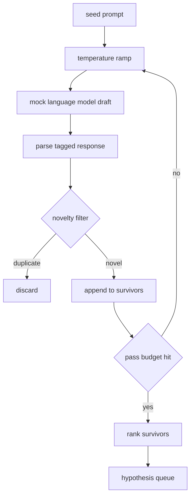

# Hypothesis Generator | 假设 生成器

> A research agent that asks the same question twice is wasting tokens. The trick is forcing each draft to land somewhere new.

> **【中文解读】** 本节是综合项目——构建假设生成器。


**Type:** Build | **类型:** Build
**Languages:** Python | **语言:** Python
**Prerequisites:** Phase 19 Track A lessons 20-29 | **前置知识:** Phase 19 Track A lessons 20-29

> 🔗 【前置】Track D 研究 Agent 第 1 节（50-57）。基于 Track A（20-29）harness。
> 💡 假设生成器 = "AI 研究的提问机器"。问同一问题两次=浪费 token。技巧：强制每次草稿落到新地方。本系列 8 节搭建自主研究 Agent：假设生成→文献检索→实验运行→结果评估→论文写作→批评循环→迭代调度→端到端演示。
**Time:** ~90 minutes | **时间:** ~90 minutes

## Learning Objectives | 学习目标
- Drive a sampler from a seed prompt and turn its outputs into typed hypothesis records.
  中文翻译：Drive a sampler from a seed prompt and turn its outputs into typed hypothesis records.
- Ramp the sampler temperature on each pass so the next draft drifts further from the last.
  中文翻译：Ramp the sampler temperature on each pass so the next draft drifts further from the last.
- Filter near duplicates with a small embedding model and a cosine distance threshold.
  中文翻译：Filter near duplicates with a small embedding model and a cosine distance threshold.
- Rank the survivors with a scoring function that blends novelty, specificity, and testability.
  中文翻译：Rank the survivors with a scoring function that blends novelty, specificity, and testability.
- Hold every step deterministic so the same seed always produces the same queue.
  中文翻译：Hold every step deterministic so the same seed always produces the same queue.

## Why generate, then filter

> **【中文解读】** 单次模型调用只产生一个假设，对研究循环不够。研究循环需要一个有深度的排序队列——当第一个假设失败时，下一个已就绪。两个技巧组合产生这个队列：温度递增（每次采样提高温度，后续草稿更发散）和新颖性过滤（用嵌入距离度量与前序候选的相似度，拒绝簇内重复）。本课使用模拟语言模型，足以演练完整路径。

> **【拓展：假设生成在 AI 科研中的前沿应用】** Google DeepMind 的 FunSearch 使用 LLM 生成数学函数假设并自动验证。Sakana AI 的 "The AI Scientist" 论文展示了完整的科研自动化流程：假设生成、文献检索、实验执行、论文撰写。关键挑战是新颖性与可行性之间的平衡——温度过低则输出与种子相似，过高则偏离主题且无法解析。本课默认 6 次从 0.2 到 1.2 的温度递增覆盖了这个甜蜜区。

A planner that asks one model one time gets one hypothesis. That is fine for a worked example. For a research loop it is the wrong shape. The loop wants a ranked queue with depth, so when the first hypothesis fails the runner has the next one ready without paying for another full sampling pass.

> 一次性问一个模型一个问题的规划器只得到一个假设。


Two ideas combine to produce that queue. The first is temperature ramping: each pass through the sampler raises the temperature a notch, so later drafts are encouraged to wander. The second is novelty filtering: after each draft, the generator measures the embedding distance from every prior survivor and rejects anything inside the cluster.

> 两个想法组合产生这个队列。


The lesson ships a mock language model that returns scripted token sequences for fixed prompts. The mock is enough to exercise the full path: seed prompt in, temperature ramp applied, candidates parsed, novelty filter run, ranked queue out.

> 本课附带一个模拟语言模型。


## The Hypothesis shape

> **【拓展：假设表示在 AI 科研中的标准化趋势】** 本课的 Hypothesis 结构（text、variables、metric、baseline_ref）映射到学术实验的标准组件：自变量（independent variables）、因变量（dependent variable / metric）、基线（control group / baseline_ref）。FunSearch 的假设是"函数签名 + 适应度函数"，AI-Scientist 的假设是"研究方向 + 验证方法"。标准化假设表示使得跨研究的元分析成为可能。

```text
Hypothesis
  id             : int           (monotonic within a run)
  text           : str           (the claim)
  variables      : list[str]     (what changes between conditions)
  metric         : str           (what the runner will measure)
  baseline_ref   : str | None    (which paper or run the comparison cites)
  draft_pass     : int           (which sampler pass produced this)
  temperature    : float         (the sampler setting at draft time)
  novelty_score  : float         (distance from prior survivors, 0..1)
  rank_score     : float         (weighted sum used for ordering)
```

`variables` and `metric` are not free text. The parser pulls them from a tagged response. The runner in lesson fifty-two reads these fields directly when it builds the experiment config.

> `variables` 和 `metric` 不是自由文本，解析器从标记响应中提取它们。


`baseline_ref` is optional but recommended. The evaluator in lesson fifty-three needs a baseline to compare against. If the hypothesis omits one, the evaluator falls back to the previous run on the same metric.

> `baseline_ref` 可选但推荐。评估器需要一个基线进行比较。


## Architecture | 架构



The loop is straight forward. The interesting part is each box has a hard contract.

> 循环很直接。有趣的部分是每个盒子都有硬性契约。


## Temperature ramp

> **【中文解读】** 温度递增从 `t_min` 到 `t_max` 均匀分布，每步调用采样器。模拟模型通过温度桶（bucket）切换不同脚本响应——小温度变化切换到不同桶产生不同草稿。默认 6 次从 0.2 到 1.2 的递增在填充队列和不产生被新颖性过滤器拒绝的样本之间取得平衡。

Start at `t_min`, end at `t_max`, step `(t_max - t_min) / (n_passes - 1)`. Each pass calls the sampler at the current temperature, producing `n_passes` evenly spaced values from `GeneratorConfig.schedule()`. The mock model honors temperature by switching between a small set of scripted responses keyed on `(prompt, temp_bucket)`. The buckets are open intervals so a small change in temperature picks a different bucket and produces a different draft. In production the sampler would be a real model with `temperature=t` passed through.

> Start at `t_min`, end at `t_max`, step `(t_max - t_min) / (n_passes - 1)`.


The default schedule is six passes from `0.2` to `1.2`. Six is enough to fill the queue without paying for samples that the novelty filter will reject anyway. Below `0.2` the model parrots the seed back. Above `1.2` the responses tend to drift off topic and fail the parser.

> default schedule is six passes from `0.2` to `1.2`. Six is enough to fill the queue without paying for samples that the novelty filter will reject anyway. Below `0.2` the model parrots the seed back. Above `1.2` the responses tend to drift off topic and fail the parser.


## Novelty filter

> **【中文解读】** 新颖性过滤器使用哈希词袋嵌入（hashed bag-of-words）和余弦距离。每个草稿的嵌入与所有已接受假设比较，最小距离低于阈值（默认 0.25）则拒绝。这个嵌入不花哨但确定性高、零依赖、足以捕获"两个草稿共享大部分名词"的明显重复。生产部署可替换为小型句向量模型。

After each draft is parsed, the generator embeds the text and compares against every accepted hypothesis. The embedding is a small hashed bag of word tokens, normalised to unit length. Cosine distance between two unit vectors is `1 - dot(a, b)`. A draft passes if its minimum distance to any prior survivor is above `novelty_threshold`. Default is `0.25`.

> 在each draft is parsed, the generator embeds the text and compares against every accepted hypothesis. The embedding is a small hashed bag of word tokens, normalised to unit length. Cosine distance between two unit vectors is `1 - dot(a, b)`. A draft passes if its minimum distance to any prior survivor is above `novelty_threshold`. Default is `0.25`.


The hashed embedding is not fancy. It is deterministic, has zero dependencies, and is enough to catch the obvious case: two drafts that share most of their nouns. A production deployment would swap in a small sentence model. The interface stays the same.

> hashed embedding is not fancy. It is deterministic, has zero dependencies, and is enough to catch the obvious case: two drafts that share most of their nouns. A production deployment would swap in a small sentence model. The interface stays the same.


## Rank score

> **【中文解读】** 排名分数是三个子分数的加权和：novelty_score（与已有候选的最小嵌入距离，权重 0.4）、specificity_score（假设中具体变量数量除以目标数量，权重 0.3）、testability_score（有度量和基线则 1.0，仅有度量则 0.5，否则 0.0，权重 0.3）。权重在生成器配置中可调。

```text
rank_score = w_novelty * novelty_score
           + w_specificity * specificity_score
           + w_testability * testability_score
```

Three sub scores. `novelty_score` is the minimum embedding distance from prior survivors. `specificity_score` is the count of concrete variables in the hypothesis divided by a target count. `testability_score` is one if the hypothesis specifies both a metric and a baseline, half if it only has a metric, zero otherwise.

> Three sub scores.


Default weights are `0.4`, `0.3`, `0.3`. The weights live in the generator config so a downstream lesson can shift them without forking the code.

> Default weights are `0.


## Mock language model

```python
class MockLLM:
    def sample(self, prompt: str, temperature: float, seed: int) -> str:
        ...
```

The sampler is deterministic given a `(prompt, temperature, seed)` triple. The mock keeps a scripted response table keyed on `(prompt_signature, temperature_bucket)`. If the table has no entry for a key, the sampler returns a fallback that fails the parser. The fallback path is exercised by one of the tests.

> sampler is deterministic given a `(prompt, temperature, seed)` triple. The mock keeps a scripted response table keyed on `(prompt_signature, temperature_bucket)`. If the table has no entry for a key, the sampler returns a fallback that fails the parser. The fallback path is exercised by one of the tests.


The seed is mixed into the response so the same `(prompt, temperature)` pair with different seeds produces different drafts. In tests we pin the seed to keep results reproducible. In a real deployment the seed would come from a system clock or a counter.

> seed is mixed into the response so the same `(prompt, temperature)` pair with different seeds produces different drafts. In tests we pin the seed to keep results reproducible. In a real deployment the seed would come from a system clock or a counter.


## Output queue

> **【中文解读】** 输出是按 `rank_score` 降序排列的 `Hypothesis` 列表。实验运行器弹出队首，运行实验，评估器写回判定。如果假设错误，运行器弹下一个。队列为空时，调度器可以拓宽种子提示重新生成或报告预算耗尽。

> **【拓展：假设队列与 UCB 调度的配合】** 排名队列与 Lesson 56 的迭代调度器配合使用。调度器使用 UCB（Upper Confidence Bound）公式选择下一个假设：高平均奖励的分支保持高分直到其他分支追上，运行多次但奖励低的分支被更少运行的替代方案超越。这是探索-利用（exploration-exploitation）平衡在科研自动化中的直接应用。

The output is a list of `Hypothesis` records sorted by `rank_score` descending. The runner in lesson fifty-two pops the head, runs the experiment, and the evaluator in lesson fifty-three writes a verdict back. If the verdict says the hypothesis was wrong, the runner pops the next one.

> output is a list of `Hypothesis` records sorted by `rank_score` descending. The runner in lesson fifty-two pops the head, runs the experiment, and the evaluator in lesson fifty-three writes a verdict back. If the verdict says the hypothesis was wrong, the runner pops the next one.


The queue is finite. When it is empty the orchestrator can either widen the seed prompt and run the generator again or stop and report the budget exhausted.

> queue is finite. When it is empty the orchestrator can either widen the seed prompt and run the generator again or stop and report the budget exhausted.


## How to read the code

`code/main.py` defines `Hypothesis`, `MockLLM`, `HypothesisGenerator`, and a deterministic demo. The generator exposes a single `run(seed_prompt)` method that returns a sorted queue; the pass count is read from `GeneratorConfig.n_passes` rather than passed as an argument. The embedding is a hashed bag of tokens. The novelty filter is a single function. The rank score is a single function. Nothing depends on `numpy`; the embedding math is pure stdlib so the lesson stays portable.

> `code/main.


`code/tests/test_generator.py` covers the linear path, the duplicate rejection path, the parser failure path, the temperature ramp boundaries, and the rank ordering.

> `code/tests/test_generator.


## Where this slots in

Lesson fifty produces the queue. Lesson fifty-one takes the head of the queue and runs a literature search to confirm or refute it. Lesson fifty-two takes the same head and runs an actual experiment. Lesson fifty-three reads both outputs and writes a verdict. The four lessons compose into a research loop with no human in it; a human can step in at any boundary.

> Lesson fifty produces the queue.

