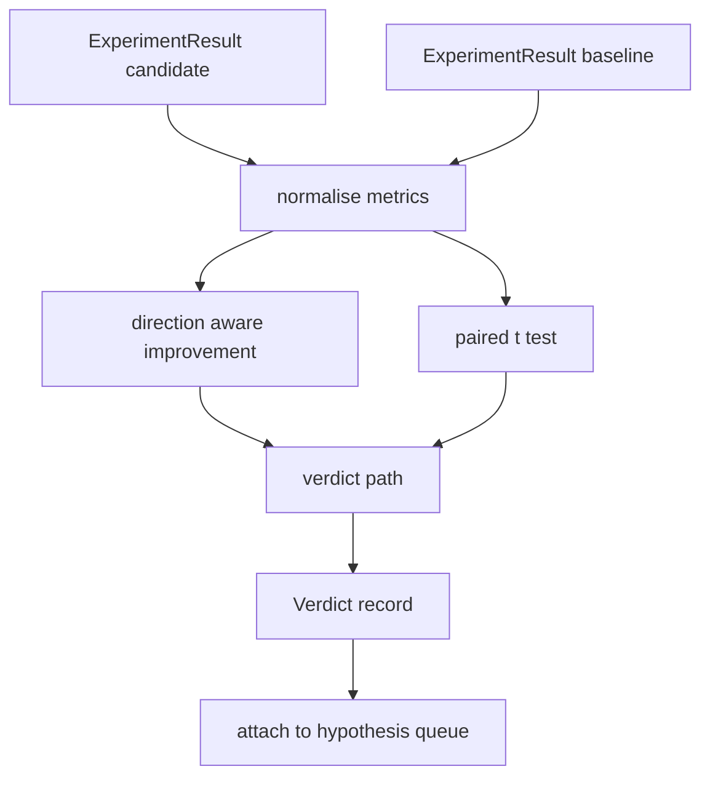

# Result Evaluator | 评估器 结果

> The runner produced numbers. The evaluator decides whether those numbers are an improvement, a regression, or noise. Build the verdict path that turns metrics into a one line conclusion.

> **【中文解读】** 本节是综合项目——构建结果评估器。


**Type:** Build | **类型:** Build
**Languages:** Python | **语言:** Python
**Prerequisites:** Phase 19 Track A lessons 20-29 | **前置知识:** Phase 19 Track A lessons 20-29
**Time:** ~90 minutes | **时间:** ~90 minutes

## Learning Objectives | 学习目标
- Compare a candidate run against a baseline using direction aware improvement and a fixed threshold.
  中文翻译：Compare a candidate run against a baseline using direction aware improvement and a fixed threshold.
- Run a paired t test from scratch over per seed metrics and read the resulting p value.
  中文翻译：Run a paired t test from scratch over per seed metrics and read the resulting p value.
- Normalise log scaled metrics so a downstream report can blend them with linear metrics.
  中文翻译：Normalise log scaled metrics so a downstream report can blend them with linear metrics.
- Emit a per hypothesis verdict that the orchestrator can attach to the queue from lesson fifty.
  中文翻译：Emit a per hypothesis verdict that the orchestrator can attach to the queue from lesson fifty.
- Keep every step pure so the same inputs always produce the same verdict.
  中文翻译：Keep every step pure so the same inputs always produce the same verdict.

## Why a paired test

> **【中文解读】** 运行器的单个数字不能说明变化是真实的——相同配置不同种子给出不同困惑度。配对 t 检验是正确比较：相同种子、相同数据，分别运行候选和基线。每个种子贡献一个差异值，差异的均值是效应，差异的标准误差是噪声底线。本课从零实现 t 检验——不依赖 scipy.stats，核心数学仅需约 60 行标准库代码。

> **【拓展：统计显著性在 AI 论文中的争议】** ML 社区对 p 值的使用存在争议。ACL 2023 的统计显著性教程推荐使用配对 bootstrap 检验而非 t 检验，因为 ML 度量通常不满足正态分布假设。但配对 t 检验因其简洁性仍被广泛使用——LLaMA 和 GPT 论文都报告了配对 t 检验的 p 值。关键是理解：p < 0.05 意味着"仅有 5% 的概率，差异来自随机波动"，而非"改进是真实的"。

A single number from the runner does not say whether the change is real. The same configuration with a different seed gives a different perplexity. The change might be noise. The right comparison is paired: the same seeds with the same data, ran once with the candidate and once with the baseline. Each seed contributes a difference. The mean of those differences is the effect. The standard error of those differences is the noise floor.

> 一个single number from the runner does not say whether the change is real. The same configuration with a different seed gives a different perplexity. The change might be noise. The right comparison is paired: the same seeds with the same data, ran once with the candidate and once with the baseline. Each seed contributes a difference. The mean of those differences is the effect. The standard error of those differences is the noise floor.


The lesson implements the test from scratch. There is no `scipy.stats`. The math is small enough to read in one screen.

> LEsson implements the test from scratch. There is no `scipy.stats`. The math is small enough to read in one screen.（翻译）


```text
diffs    = [a_i - b_i for i in seeds]
mean     = sum(diffs) / n
variance = sum((d - mean) ** 2 for d in diffs) / (n - 1)
t_stat   = mean / sqrt(variance / n)
df       = n - 1
p_value  = two_sided_p(t_stat, df)
```

The two sided p value uses a regularised incomplete beta function. The lesson ships a small implementation that uses the Lentz continued fraction. The whole thing is sixty lines of stdlib math.

> two sided p value uses a regularised incomplete beta function. The lesson ships a small implementation that uses the Lentz continued fraction. The whole thing is sixty lines of stdlib math.


## Direction aware improvement

> **【中文解读】** 有些指标上升为好（准确率、吞吐量），有些下降为好（损失、困惑度、墙钟时间）。评估器对每个指标携带方向字段：`higher_is_better` 时改进 = (candidate - baseline) / |baseline|；`lower_is_better` 时改进 = (baseline - candidate) / |baseline|。改进是带符号的，负值在 higher_is_better 上意味着候选更差。固定阈值（默认 2%）决定变化是否大到值得报告。

Some metrics improve when they go up (accuracy, throughput). Others improve when they go down (loss, perplexity, wall time). The evaluator carries a `direction` field on each metric.

> Some metrics improve when they go up (accuracy, throughput).


```text
if direction == "higher_is_better":
    improvement = (candidate - baseline) / abs(baseline)
elif direction == "lower_is_better":
    improvement = (baseline - candidate) / abs(baseline)
```

Improvement is signed. A negative improvement on a higher is better metric means the candidate is worse. The verdict path reads the sign and the magnitude together.

> Improvement is signed.


A flat threshold (`improvement_threshold=0.02`, two percent) decides whether the change is large enough to call. Below that the verdict is "noise" regardless of the p value; the loop is not interested in changes the user could not measure.

> 一个flat threshold (`improvement_threshold=0.02`, two percent) decides whether the change is large enough to call. Below that the verdict is "noise" regardless of the p value; the loop is not interested in changes the user could not measure.


## Architecture | 架构

> **【拓展：自动化评估在 MLOps 流水线中的位置】** 评估器位于 CI/CD 流水线的关键节点：模型训练完成后、部署之前。Google 的 Vertex AI Model Evaluation、AWS SageMaker Model Monitor 都提供类似的自动化评估。评估器输出的 Verdict 结构直接驱动部署决策——"improved" 触发金丝雀部署，"noise" 保持当前版本，"regressed" 阻止部署。本课的 Verdict 是这些系统的核心抽象。



The evaluator runs three independent computations and joins them in the verdict path. Each computation is a pure function with no shared state.

> evaluator runs three independent computations and joins them in the verdict path. Each computation is a pure function with no shared state.


## Log normalisation

> **【中文解读】** 困惑度是损失的指数——损失下降 0.1 在困惑度上是更大的下降。直接比较困惑度可以，但在单一报告中与线性指标混合需要归一化。本课对 `scale="log"` 的指标取自然对数后计算改进，阈值在对数空间应用。困惑度从 32 降到 28 在 lower_is_better 下是 `log(28) - log(32) = -0.133`，远超 2% 阈值。

Perplexity is exponential in loss. A 0.1 drop in loss is a much larger drop in perplexity. Comparing perplexity directly across two configurations is fine, but blending it with linear metrics in a single report requires normalisation.

> Perplexity is exponential in loss.


The lesson normalises any metric whose `scale` field is `"log"` by taking the natural log before computing the improvement. The threshold is then applied in log space. A perplexity drop from 32 to 28 is `log(28) - log(32) = -0.133` on a lower is better metric, which is well above the two percent threshold.

> lesson normalises any metric whose `scale` field is `"log"` by taking the natural log before computing the improvement. The threshold is then applied in log space. A perplexity drop from 32 to 28 is `log(28) - log(32) = -0.133` on a lower is better metric, which is well above the two percent threshold.


```text
if scale == "log":
    a = log(candidate)
    b = log(baseline)
else:
    a = candidate
    b = baseline
```

Metrics with `scale="linear"` (default) skip the transform. The same code path handles both.

> Metrics with `scale="linear"` (default) skip the transform. The same code path handles both.（翻译）


## Per seed paired test

The runner from lesson fifty-two emits one final metrics blob per run. For the paired test the evaluator needs one blob per seed for the candidate and one per seed for the baseline. The orchestrator runs the same experiment under both configurations across a list of seeds and hands the evaluator two lists of `ExperimentResult` records.

> runner from lesson fifty-two emits one final metrics blob per run. For the paired test the evaluator needs one blob per seed for the candidate and one per seed for the baseline. The orchestrator runs the same experiment under both configurations across a list of seeds and hands the evaluator two lists of `ExperimentResult` records.


The evaluator pairs them by seed (the seed lives in `result.metrics["seed"]`) and walks the requested metric. If the seeds do not match across the two lists, the evaluator raises a `PairingError`. The orchestrator should re run.

> evaluator pairs them by seed (the seed lives in `result.metrics["seed"]`) and walks the requested metric. If the seeds do not match across the two lists, the evaluator raises a `PairingError`. The orchestrator should re run.


## The Verdict shape

> **【中文解读】** 判定（Verdict）是评估器的核心输出，包含假设 id、度量名、方向、尺度、候选/基线均值、改进量、p 值和判定结果。判定路径是五步决策表：1）候选有失败终端 -> "failed"；2）改进量 < 阈值 -> "noise"；3）p 值不显著 -> "noise"；4）改进 > 0 -> "improved"；5）否则 -> "regressed"。判定附带一行人类可读的理由供调度器记录。

> **【拓展：自动化判定在 CI/CD 中的应用】** 评估器的 Verdict 形状与回归测试中的 pass/fail 判定异曲同工。Meta 的 CI 系统在每次 LLaMA 模型变更后自动运行基准测试，比较与上一版本的差异，差异超过阈值则阻止合并。这种"自动化判定 + 人工审核"模式是 AI 工程质量保障的标准实践。

```text
Verdict
  hypothesis_id          : int
  metric                 : str
  direction              : "higher_is_better" | "lower_is_better"
  scale                  : "linear" | "log"
  candidate_mean         : float
  baseline_mean          : float
  improvement            : float       (signed, fraction; see direction rules)
  p_value                : float | None  (None if n < 2)
  significance_threshold : float
  improvement_threshold  : float
  verdict                : "improved" | "regressed" | "noise" | "failed"
  rationale              : str
```

The verdict path is a small decision table:

```text
1. If any candidate result has terminal != "ok": verdict = "failed"
2. else if |improvement| < improvement_threshold:  verdict = "noise"
3. else if p_value is None or p_value > significance: verdict = "noise"
4. else if improvement > 0:                          verdict = "improved"
5. else:                                             verdict = "regressed"
```

Rationale is a one line human readable sentence the orchestrator can log against the hypothesis id.

> Rationale is a one line human readable sentence the orchestrator can log against the hypothesis id.（翻译）


## How to read the code

`code/main.py` defines `MetricSpec`, `Verdict`, `Evaluator`, the t statistic and incomplete beta helpers, and a deterministic demo. The t test is implemented in pure stdlib math; numpy is used only to read the metrics list and compute means and variances.

> `code/main.


`code/tests/test_evaluator.py` covers the improved path, the regressed path, the noise path (small improvement), the noise path (low n), the failed terminal path, the log normalised path, the t test against a known reference value, and the pairing error.

> `code/tests/test_evaluator.


## Where this slots in

Lesson fifty produced the hypothesis queue. Lesson fifty-one filtered out anything the literature settled. Lesson fifty-two ran the experiment under candidate and baseline configurations across seeds. Lesson fifty-three reads those runs and writes the verdict. The orchestrator stitches the four together:

> Lesson fifty produced the hypothesis queue.


```text
for hypothesis in queue:
    literature = retrieval.search(hypothesis.text)
    if literature_settles(hypothesis, literature):
        attach(hypothesis, verdict="settled")
        continue
    candidates = runner.run_all(specs_for(hypothesis))
    baselines  = runner.run_all(baseline_specs_for(hypothesis))
    metric_spec = MetricSpec("perplexity", direction=LOWER, scale=LOG)
    verdict = evaluator.evaluate(hypothesis.id, metric_spec, candidates, baselines)
    attach(hypothesis, verdict)
```

That orchestrator is not in this lesson; the four lessons compose into it without any glue beyond the dataclasses each one defines.

> That orchestrator is not in this lesson; the four lessons compose into it without any glue beyond the dataclasses each one defines.

