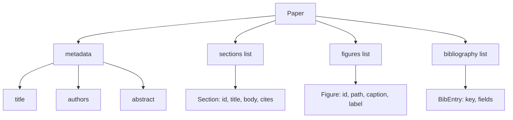
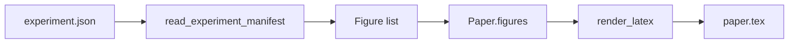
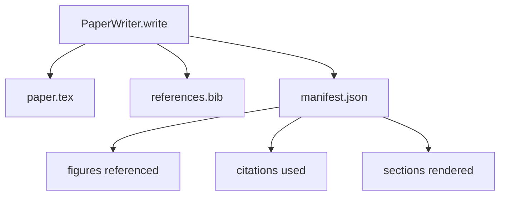

# Paper Writer | 写作者 论文

> A LaTeX skeleton is a contract between the researcher and the typesetter. If the contract is broken the document does not compile, and the failure is loud. Build the skeleton first, then fill it.

> **【中文解读】** 本节是综合项目——构建论文写作者 Agent。

**Type:** Build | **类型:** Build
**Languages:** Python | **语言:** Python
**Prerequisites:** Phase 19 lessons 50-53 | **前置知识:** Phase 19 lessons 50-53

> 🔗 【前置】Track D 5/8。基于 50-53。
> 💡 论文写作器 = "LaTeX 骨架的契约精神"。LaTeX 骨架是研究者和排版者的契约——契约破了文档不编译，失败响亮。先建骨架，再填内容。AI Scientist v2（Phase 15·05）的写作模块。
**Time:** ~90 minutes | **时间:** ~90 minutes

## Learning Objectives | 学习目标

- Treat a research paper as a structured artifact with a known section graph, not a freeform document.
  中文翻译：Treat a research paper as a structured artifact with a known section graph, not a freeform document.
- Generate a LaTeX skeleton that declares its abstract, sections, figure slots, and bibliography keys before any prose is written.
  中文翻译：Generate a LaTeX skeleton that declares its abstract, sections, figure slots, and bibliography keys before any prose is written.
- Inject figures from experiment outputs (paths and captions) into the skeleton through a deterministic slot mechanism.
  中文翻译：Inject figures from experiment outputs (paths and captions) into the skeleton through a deterministic slot mechanism.
- Wire a mocked prose generator that fills each section from a structured outline so the harness is testable without a model.
  中文翻译：Wire a mocked prose generator that fills each section from a structured outline so the harness is testable without a model.
- Emit a single `paper.tex` plus a `references.bib` plus a manifest that lists every figure referenced and every citation used.
  中文翻译：Emit a single `paper.tex` plus a `references.bib` plus a manifest that lists every figure referenced and every citation used.

## Why a skeleton first

> **【中文解读】** 以散文开始的草稿积累结构性债务：引言混入相关工作、图表在定义前被引用、参考文献出现重复键。骨架反转了这一过程——结构先声明为数据：章节是有名称和顺序的槽位，图表是有 id 和标题的槽位，文献键在顶部声明。Harness 可以在写任何散文之前验证每个图表有槽位、每个引用有条目、每个章节出现在目录中。

> **【拓展：LaTeX 骨架在 AI 科研自动化中的应用】** Sakana AI 的 "The AI Scientist" 和多个学术论文生成系统都采用"骨架优先"策略。学术论文有严格的章节结构（Abstract、Introduction、Related Work、Method、Experiments、Results、Conclusion），每个章节有特定的写作目标。将论文视为结构化产物（而非自由文档）使得自动化验证成为可能——编译错误就是结构错误。

A draft that starts as prose accumulates structural debt. The introduction grows three paragraphs that should be in related work. A figure gets referenced before it is defined. The bibliography ends up with three keys for the same paper. By the time the author notices, the rewriting cost is higher than the writing cost.

> 一个draft that starts as prose accumulates structural debt. The introduction grows three paragraphs that should be in related work. A figure gets referenced before it is defined. The bibliography ends up with three keys for the same paper. By the time the author notices, the rewriting cost is higher than the writing cost.

A skeleton inverts that. The structure is declared up front as data. Sections are slots with names and order. Figures are slots with ids and captions. Bibliography keys are declared at the top with the entries they point at. Prose is generated into those slots one at a time. The harness can validate, before any prose is written, that every figure has a slot, every citation has an entry, and every section appears in the table of contents.

> 一个skeleton inverts that. The structure is declared up front as data. Sections are slots with names and order. Figures are slots with ids and captions. Bibliography keys are declared at the top with the entries they point at. Prose is generated into those slots one at a time. The harness can validate, before any prose is written, that every figure has a slot, every citation has an entry, and every section appears in the table of contents.

This is the same discipline that earlier lessons applied to plans, tool calls, and traces. The structure is the contract.

> 这个is the same discipline that earlier lessons applied to plans, tool calls, and traces. The structure is the contract.

## The Paper shape

Every field is plain Python data. The renderer is a pure function from `Paper` to a LaTeX string. The harness can introspect the paper before rendering: count sections, list missing figure files, check that every `\cite{key}` has a matching `BibEntry`.

> 每个field is plain Python data. The renderer is a pure function from `Paper` to a LaTeX string. The harness can introspect the paper before rendering: count sections, list missing figure files, check that every `\cite{key}` has a matching `BibEntry`.

## The render contract

> **【中文解读】** 渲染器保证三个属性：1）每个图表槽位输出 `\begin{figure}` 块并有稳定标签 `fig:<id>`；2）每个章节输出 `\section{}` 并有稳定标签 `sec:<id>`；3）参考文献输出 `\bibliography` 块，`references.bib` 包含精确声明的条目。违反任何一项是渲染错误而非警告——骨架是契约，静默丢弃图表是违约。

The renderer guarantees three properties. First, every figure slot in the skeleton emits a `\begin{figure}` block with a stable label of the form `fig:<id>`. Second, every section emits a `\section{}` with a stable label of the form `sec:<id>` so cross-references work. Third, the bibliography emits a `\bibliography` block whose `references.bib` contains exactly the entries declared on the paper, no more and no fewer.

> renderer guarantees three properties. First, every figure slot in the skeleton emits a `\begin{figure}` block with a stable label of the form `fig:<id>`. Second, every section emits a `\section{}` with a stable label of the form `sec:<id>` so cross-references work. Third, the bibliography emits a `\bibliography` block whose `references.bib` contains exactly the entries declared on the paper, no more and no fewer.

Violating any of these is a render error, not a warning. The skeleton is the contract; a render that silently drops a figure is a contract break.

> Violating any of these is a render error, not a warning.

## Figure injection from experiments

> **【中文解读】** 实验输出发出 JSON manifest，包含工件路径和简短标题。论文写作者读取 manifest 并产生 `Figure` 记录。图表 id 从实验名称加单调计数器派生，标题来自 manifest，路径相对于论文输出目录归一化——这样即使实验输出在磁盘其他位置，LaTeX 也能编译。

The earlier lessons in this track produced experiment outputs as JSON manifests. Each manifest carries a list of artifacts with paths and short captions. The paper writer reads that manifest and produces `Figure` records.

> earlier lessons in this track produced experiment outputs as JSON manifests. Each manifest carries a list of artifacts with paths and short captions. The paper writer reads that manifest and produces `Figure` records.

The injection is deterministic. Figure ids are derived from the experiment name plus a monotonic counter. Captions come from the manifest. Paths are normalised relative to the paper's output directory so the LaTeX compiles even when the experiment outputs sit elsewhere on disk.

> injection is deterministic. Figure ids are derived from the experiment name plus a monotonic counter. Captions come from the manifest. Paths are normalised relative to the paper's output directory so the LaTeX compiles even when the experiment outputs sit elsewhere on disk.

## The mocked prose generator

> **【拓展：LLM 论文生成的当前能力与局限】** 2024-2026 年的 LLM 在论文生成方面取得了显著进展：Claude Opus 和 GPT-4 可以生成结构良好的学术散文，但仍然缺乏精确的数学公式推导、实验数据的准确解释和文献引用的准确性。Sakana AI 的 AI-Scientist 使用"骨架 + 逐节填充"策略，本课的 MockProseGenerator 是其教育性简化。生产版本的 prose generator 需要访问实验数据、文献数据库和 LaTeX 模板库。

The lesson does not call a model. A `MockProseGenerator` reads an outline shape and emits prose deterministically. The outline shape is one short string per section. The generator expands that string into two short paragraphs with the section title woven in. The generated prose name-drops figures and citations exactly when the outline declares them.

> lesson does not call a model. A `MockProseGenerator` reads an outline shape and emits prose deterministically. The outline shape is one short string per section. The generator expands that string into two short paragraphs with the section title woven in. The generated prose name-drops figures and citations exactly when the outline declares them.

This is enough to test every behaviour of the writer. A real implementation would swap the generator for a model call. The harness around it does not change. That is the value of declaring the prose generator as a callable: the test substitutes a deterministic one, production substitutes a model one, the rest of the pipeline is identical.

> 这个is enough to test every behaviour of the writer. A real implementation would swap the generator for a model call. The harness around it does not change. That is the value of declaring the prose generator as a callable: the test substitutes a deterministic one, production substitutes a model one, the rest of the pipeline is identical.

## The manifest output

The writer emits three files into the output directory.

The manifest is what a downstream evaluator or critic loop reads. It does not parse LaTeX; it reads the manifest. The next lesson, the critic loop, takes this manifest as input and produces a feedback list. That is why the manifest is part of the contract and the LaTeX is not.

> manifest is what a downstream evaluator or critic loop reads. It does not parse LaTeX; it reads the manifest. The next lesson, the critic loop, takes this manifest as input and produces a feedback list. That is why the manifest is part of the contract and the LaTeX is not.

## Validation gates

> **【中文解读】** 写作者在写文件前运行四个验证门：1）每个图表 id 在论文中唯一；2）每个章节的 `cites` 字段引用了论文声明的文献键；3）摘要非空；4）标题非空。失败的门抛出 `PaperValidationError` 并附带精确原因。没有部分写入——要么三个文件全部发出，要么一个都不发出。

> **【拓展：验证门在自动化出版流水线中的价值】** 学术出版平台（如 arXiv、OpenReview）的自动化系统也使用类似的验证门：检查 LaTeX 编译、图表文件存在性、引用完整性。本课的验证门是"编译前检查"——在 LaTeX 编译器看到文件之前就捕获了结构错误。这种"左移"（shift-left）验证思想在软件工程中也是最佳实践。

The writer runs four gates before writing any file.

1. Every figure id is unique within the paper.
2. Every section's `cites` field references a bibliography key that is declared on the paper.
3. The abstract is non-empty.
4. The title is non-empty.

A failed gate raises `PaperValidationError` with a precise reason. The harness surfaces the reason as the failure mode. There is no partial write: either all three files are emitted, or none.

> 一个failed gate raises `PaperValidationError` with a precise reason. The harness surfaces the reason as the failure mode. There is no partial write: either all three files are emitted, or none.

## How to read the code

`code/main.py` defines `Paper`, `Section`, `Figure`, `BibEntry`, `PaperValidationError`, `MockProseGenerator`, `PaperWriter`, and a `render_latex` function. The `write` method takes an output directory and emits `paper.tex`, `references.bib`, and `manifest.json`. The `read_experiment_manifest` helper converts a list of experiment manifests into `Figure` records.

> `code/main.

`code/tests/test_paper_writer.py` covers: skeleton render with no sections, full render with two sections and two figures, missing-citation gate, duplicate-figure-id gate, manifest content, and the LaTeX-string contract (every section emits a `\section{}`, every figure emits a `\begin{figure}`).

> `code/tests/test_paper_writer.

## Going further

Two extensions a real implementation will want. First, multi-format render: the same `Paper` shape compiles to Markdown for blog posts and HTML for previews. The renderer becomes a strategy on `Paper`. Second, citation enrichment: the writer fetches BibTeX entries from a citation key, given a local cache of DOIs. Both add value, both can be added without touching the skeleton contract.

> Two extensions a real implementation will want.

The skeleton is the bet. Sections, figures, and citations declared as data, prose generated into slots, manifest emitted alongside the LaTeX. Every other improvement composes on top.

> skeleton is the bet. Sections, figures, and citations declared as data, prose generated into slots, manifest emitted alongside the LaTeX. Every other improvement composes on top.

