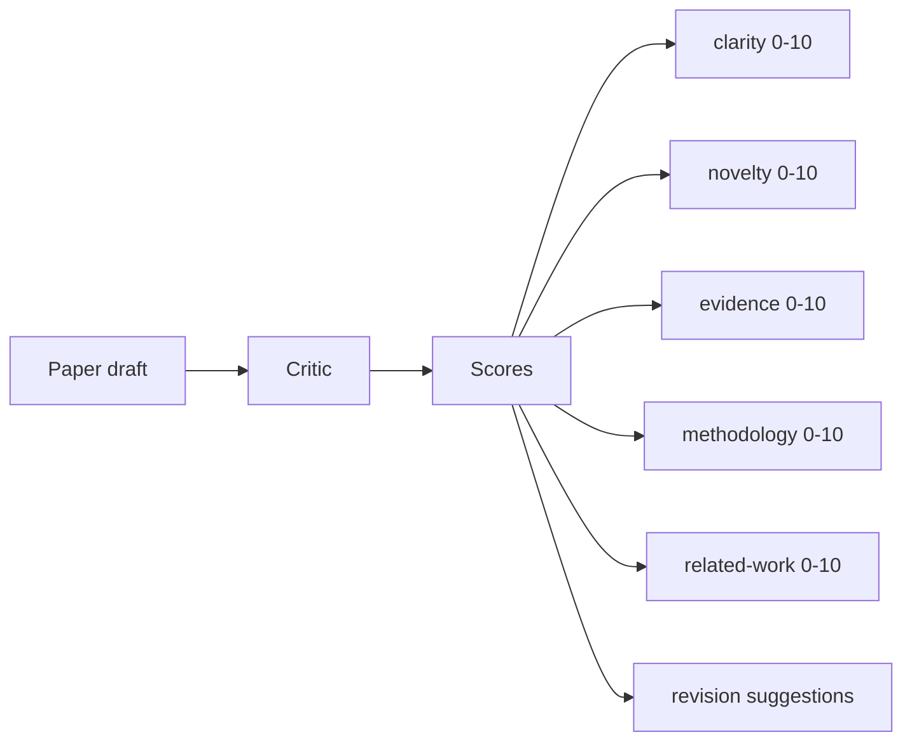
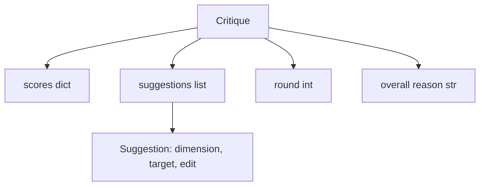
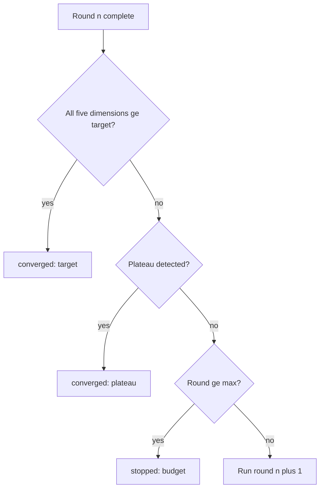
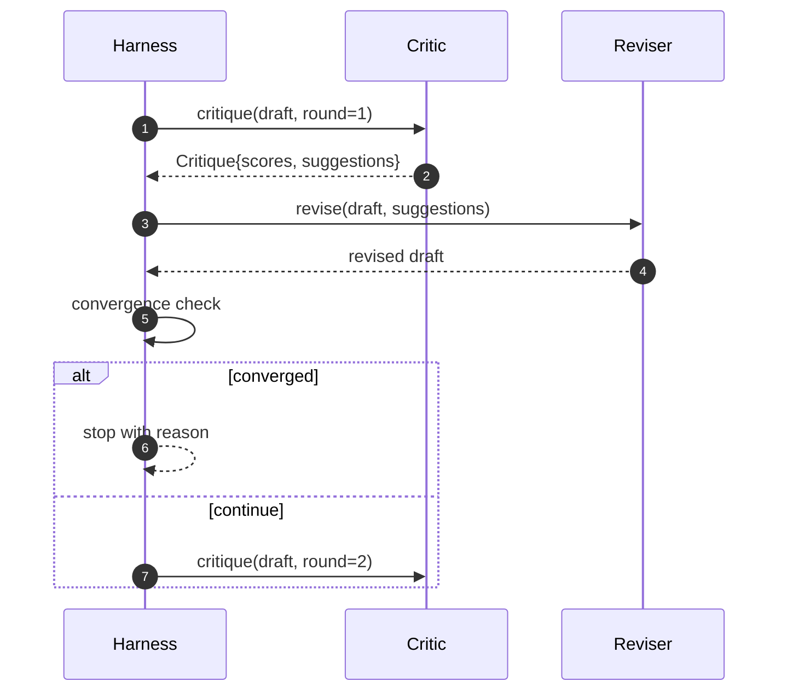

# Critic Loop | 批评者

> A critic that returns "looks good" the first time is broken. A critic that always returns "needs work" is broken. The interesting critic is the one that converges, and you have to engineer convergence.

> **【中文解读】** 本节是综合项目——构建 Agent 线束循环和契约验证系统。


**Type:** Build | **类型:** Build
**Languages:** Python | **语言:** Python
**Prerequisites:** Phase 19 lessons 50-53 | **前置知识:** Phase 19 lessons 50-53
**Time:** ~90 minutes | **时间:** ~90 minutes

## Learning Objectives | 学习目标

- Score a paper draft across five fixed dimensions: clarity, novelty, evidence, methodology, related-work.
  中文翻译：Score a paper draft across five fixed dimensions: clarity, novelty, evidence, methodology, related-work.
- Apply each round's critique as a structured revision diff rather than a freeform rewrite.
  中文翻译：Apply each round's critique as a structured revision diff rather than a freeform rewrite.
- Detect convergence by comparing scores across rounds; stop on plateau, target met, or budget exhausted.
  中文翻译：Detect convergence by comparing scores across rounds; stop on plateau, target met, or budget exhausted.
- Cap rounds with a max-iteration budget so a non-converging critic does not run forever.
  中文翻译：Cap rounds with a max-iteration budget so a non-converging critic does not run forever.
- Emit a per-round trace so the dashboard or the next stage can render the score trajectory.
  中文翻译：Emit a per-round trace so the dashboard or the next stage can render the score trajectory.

## Why five fixed dimensions

> **【中文解读】** 自由形式的批评者返回一段建议，下一轮修订将其视为环境上下文——修订是否解决了批评无法验证，因为批评从未有结构。五个维度（清晰度、新颖性、证据、方法论、相关工作）给 Harness 一个契约：分数是向量，Harness 可以跨轮监控每个维度。提高清晰度但降低证据的修订在证据维度上是回归——收敛检查能看到。

> **【拓展：结构化评审在学术出版中的对应物】** 学术同行评审（peer review）通常使用评分量表（1-10 分）覆盖多个维度：novelty（新颖性）、soundness（方法可靠性）、clarity（清晰度）、significance（重要性）、reproducibility（可复现性）。OpenReview 平台将这些评分公开。本课的五个维度和 0-10 评分系统是学术同行评审的结构化模拟，使得自动化的批评循环可以像人类评审一样提供可操作的反馈。

A freeform critic is a model that returns a paragraph of suggestions. The next round's revision treats the paragraph as ambient context. Whether the rewrite addresses the criticism is unverifiable because the criticism never had structure.

> 一个freeform critic is a model that returns a paragraph of suggestions. The next round's revision treats the paragraph as ambient context. Whether the rewrite addresses the criticism is unverifiable because the criticism never had structure.


Five dimensions give the harness a contract.



The score is a vector. The harness watches each dimension across rounds. A revision that raises clarity but tanks evidence is a regression on evidence, and the convergence check sees it. A model-only critic cannot offer that guarantee.

> score is a vector. The harness watches each dimension across rounds. A revision that raises clarity but tanks evidence is a regression on evidence, and the convergence check sees it. A model-only critic cannot offer that guarantee.


## The Critique shape

> **【拓展：结构化批评在 AI 对齐中的应用】** Anthropic 的 Constitutional AI 使用"原则 + 批评 + 修订"循环来对齐模型。OpenAI 的 CriticGPT 专门训练了一个批评模型来检测 GPT-4 代码输出中的错误。本课的五维度评分（clarity、novelty、evidence、methodology、related_work）与 OpenReview 的同行评审量表直接对应。关键设计原则：批评是结构化的（向量而非段落），修订是定向的（每个建议指定维度和目标章节），收敛是可检测的（分数向量跨轮可比较）。



Every suggestion carries the dimension it improves, the section it targets, and an `edit` instruction the reviser can apply. The reviser is also a callable. The lesson ships a deterministic reviser that interprets the edit instruction as an append-to-section operation. A model-driven reviser would interpret the same field as a prompt. The contract does not change.

> 每个suggestion carries the dimension it improves, the section it targets, and an `edit` instruction the reviser can apply. The reviser is also a callable. The lesson ships a deterministic reviser that interprets the edit instruction as an append-to-section operation. A model-driven reviser would interpret the same field as a prompt. The contract does not change.


## Convergence rules, in order

> **【中文解读】** 批评循环的终止条件按优先级排序：1）所有五个维度 >= 目标分数（默认 8.0）→ "target" 收敛；2）连续两轮均值改进低于 plateau_epsilon（默认 0.1）→ "plateau"；3）达到最大轮次（默认 5）→ "budget"。优先级顺序很重要：如果第三轮同时满足目标和平台检测，结果是 target 而非 plateau。

The critic loop terminates when any one of three conditions fires.

> CRitic loop terminates when any one of three conditions fires.（翻译）




The target is the strictest case: every one of the five dimensions (clarity, novelty, evidence, methodology, related_work) must hit `>= target_score` (default `8.0`) before the loop returns success. A high mean with one weak dimension is not enough. Plateau detection compares the current round's mean to the previous round's mean. If the improvement is below `plateau_epsilon` (default `0.1`) for two consecutive rounds, the loop exits with `plateau`. The budget is a hard cap on rounds (default `5`) and exits with `budget`.

> target is the strictest case: every one of the five dimensions (clarity, novelty, evidence, methodology, related_work) must hit `>= target_score` (default `8.0`) before the loop returns success. A high mean with one weak dimension is not enough. Plateau detection compares the current round's mean to the previous round's mean. If the improvement is below `plateau_epsilon` (default `0.1`) for two consecutive rounds, the loop exits with `plateau`. The budget is a hard cap on rounds (default `5`) and exits with `budget`.


The order matters. Target wins over plateau wins over budget. If round three hits the target on the same iteration that would also trigger a plateau, the result is `target`, not `plateau`.

> order matters. Target wins over plateau wins over budget. If round three hits the target on the same iteration that would also trigger a plateau, the result is `target`, not `plateau`.


## Why plateau detection runs over two rounds

A one-round plateau is noise. A real critic returns a slightly different score each iteration even on a fixed draft, because deterministic scoring still depends on which suggestions were applied and in what order. Requiring two consecutive plateau rounds filters that noise out. If the harness reports a plateau, the draft has genuinely stopped improving.

> 一个one-round plateau is noise. A real critic returns a slightly different score each iteration even on a fixed draft, because deterministic scoring still depends on which suggestions were applied and in what order. Requiring two consecutive plateau rounds filters that noise out. If the harness reports a plateau, the draft has genuinely stopped improving.


## The deterministic critic in this lesson

> **【中文解读】** 本课的确定性批评者基于三个信号评分：章节平均正文长度（清晰度）、图表和引用数量（证据）、论文元数据的 `originality_tag`（新颖性）。修订者将每个建议解释为定向追加——追加正文提高清晰度，设置 originality_tag="high" 提高新颖性，添加图表引用提高证据。一轮后 Harness 可以观察到分数上升。

The lesson does not call a model. The shipped critic is a callable that scores a draft based on three signals: average section body length (clarity), figure count and citation count (evidence), and an `originality_tag` field on the paper metadata (novelty). The reviser knows how to push each score upward.

> lesson does not call a model. The shipped critic is a callable that scores a draft based on three signals: average section body length (clarity), figure count and citation count (evidence), and an `originality_tag` field on the paper metadata (novelty). The reviser knows how to push each score upward.


```text
clarity      grows when the average section body length increases
novelty      grows when originality_tag is set to "high"
evidence     grows when a section's figure_refs is non-empty
methodology  grows when a section titled "Method" exists with body
related-work grows when a section titled "Related Work" exists with body
```

The reviser interprets each suggestion as a targeted append. After round one, the harness can observe the score going up. The tests use this property to assert the loop reduces the gap.

> reviser interprets each suggestion as a targeted append. After round one, the harness can observe the score going up. The tests use this property to assert the loop reduces the gap.


## The full loop contract



The harness owns the round counter, the trace, and the convergence check. The critic owns the score. The reviser owns the diff. None of the three touches the others' state.

> harness owns the round counter, the trace, and the convergence check. The critic owns the score. The reviser owns the diff. None of the three touches the others' state.


## The Trace output

Every round emits one trace event with the round number, the score vector, the suggestion count, and the convergence verdict. The full trace is returned alongside the final draft. A downstream dashboard can render the score-per-round chart. The next lesson, the iteration scheduler, reads the trace to decide whether the branch is worth keeping.

> 每个round emits one trace event with the round number, the score vector, the suggestion count, and the convergence verdict. The full trace is returned alongside the final draft. A downstream dashboard can render the score-per-round chart. The next lesson, the iteration scheduler, reads the trace to decide whether the branch is worth keeping.


## Budgets that protect against bad critics

> **【中文解读】** 产生无效建议的批评者会将循环锁定到最大轮次上限。轨迹（Trace）使问题可见：五轮后分数平坦、verdict 为 "budget"。用户读到的是批评者 bug 而非草稿 bug。仅显示最终草稿的替代方案会隐藏诊断。Trace-first 设计暴露了问题。

> **【拓展：批评循环与 LLM 自我改进的关系】** OpenAI 的"critic"模型用于对齐（alignment）：一个模型生成输出，另一个模型批评并建议改进。Anthropic 的 Constitutional AI 也使用类似循环：模型根据预设原则自我批评和修订。本课的批评循环是这些方法的通用框架——结构化的维度评分、确定性的收敛检测、预算保护使得批评循环可以在无人干预下运行。

A critic that produces suggestions that never improve the score will lock the loop into the max-iteration ceiling. The trace makes that visible: five rounds, scores flat, verdict `budget`. The user reads that as a critic bug, not a draft bug. The alternative, surfacing only the final draft, hides the diagnosis. Trace-first design surfaces it.

> 一个critic that produces suggestions that never improve the score will lock the loop into the max-iteration ceiling. The trace makes that visible: five rounds, scores flat, verdict `budget`. The user reads that as a critic bug, not a draft bug. The alternative, surfacing only the final draft, hides the diagnosis. Trace-first design surfaces it.


## How to read the code

`code/main.py` defines `Critique`, `Suggestion`, `Critic` protocol, `Reviser` protocol, `CriticLoop`, and a `make_deterministic_critic_pair` factory that returns the deterministic critic and a matching reviser. A minimal `Paper` shape is included so the lesson stands alone.

> `code/main.


`code/tests/test_critic_loop.py` covers: monotone improvement after round one, target convergence on a tuned draft, plateau detection after two flat rounds, budget exhaustion when no suggestion improves, suggestion application by the reviser, and trace shape.

> `code/tests/test_critic_loop.


## Going further

Two extensions a real implementation will want. First, dimension weights: a paper for a workshop weights novelty higher than methodology; a journal weights the inverse. The convergence check becomes a weighted mean. Second, paired critics: one critic scores, a second critic adjudicates the suggestions before the reviser sees them. Both add value, both compose on the same `Critique` shape.

> Two extensions a real implementation will want.


The bet is the score vector. Once the critique is structured, every other improvement, convergence rule, dashboard, paired critic, drops in without changing the loop.

> bet is the score vector. Once the critique is structured, every other improvement, convergence rule, dashboard, paired critic, drops in without changing the loop.

