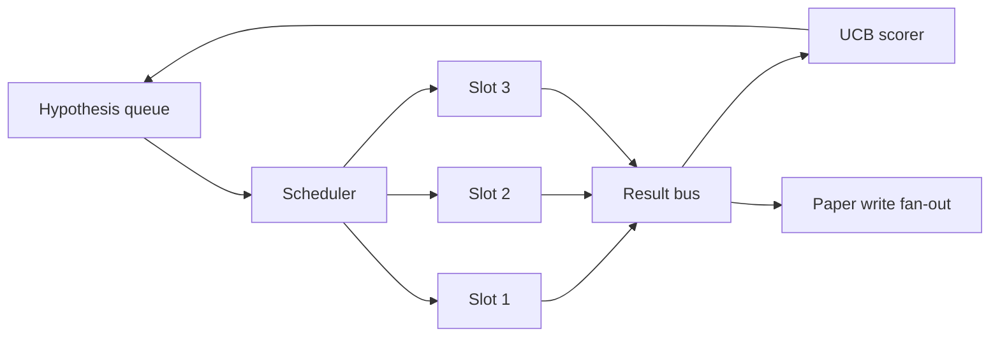
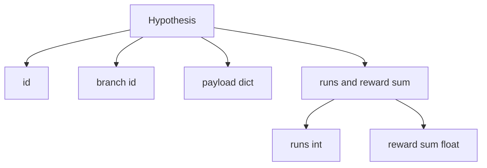
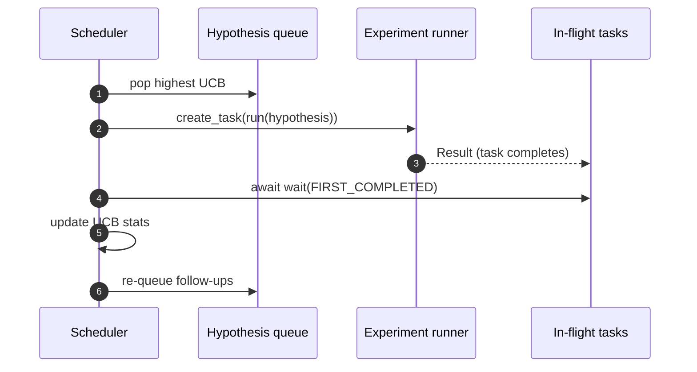

# Iteration Scheduler | 迭代 调度器

> A research loop without a scheduler is a queue with delusions. The scheduler is where the loop decides what to stop exploring, and that decision is the whole game.

> **【中文解读】** 本节是综合项目——构建迭代调度器。


**Type:** Build | **类型:** Build
**Languages:** Python | **语言:** Python
**Prerequisites:** Phase 19 lessons 50-53 | **前置知识:** Phase 19 lessons 50-53

> 🔗 【前置】Track D 7/8。参考 Phase 15·03 AlphaEvolve 进化选择 + Phase 15·13 Cost Governors。
> 💡 迭代调度器 = "研究循环的放弃艺术"。无调度器的研究循环=有妄想的队列。调度器是循环决定停止探索什么的地方，这个决定就是整个游戏。预算约束下的资源分配。
**Time:** ~90 minutes | **时间:** ~90 minutes

## Learning Objectives | 学习目标

- Model a research workflow as a hypothesis queue feeding parallel experiment slots whose results fan back in.
  中文翻译：Model a research workflow as a hypothesis queue feeding parallel experiment slots whose results fan back in.
- Run multiple experiments concurrently with asyncio so the scheduler can keep all slots busy.
  中文翻译：Run multiple experiments concurrently with asyncio so the scheduler can keep all slots busy.
- Score each hypothesis branch with UCB so the scheduler can prune low-yield branches without abandoning exploration.
  中文翻译：Score each hypothesis branch with UCB so the scheduler can prune low-yield branches without abandoning exploration.
- Fan out finished results to a paper-write stage and a re-queue stage so a high-yield branch spawns follow-up hypotheses.
  中文翻译：Fan out finished results to a paper-write stage and a re-queue stage so a high-yield branch spawns follow-up hypotheses.
- Surface a per-iteration trace with branch scores, slot occupancy, and pruning decisions.
  中文翻译：Surface a per-iteration trace with branch scores, slot occupancy, and pruning decisions.

## Why a scheduler, not a worklist

> **【中文解读】** 平面工作列表按提交顺序运行作业，但研究不是独立的——实验三的结果改变了实验四五的优先级。调度器读取结果扇入并重排队列，每单位计算获得更多有用工作。核心设计选择是评分规则：贪婪评分者永远选择当前领导者不探索；均匀评分者永远不利用。UCB（Upper Confidence Bound）是中间路径：利用领导者同时为尝试较少的分支保留容量。

> **【拓展：UCB 在推荐系统和 AutoML 中的应用】** UCB 算法源自多臂老虎机（Multi-Armed Bandit）问题，广泛应用于推荐系统（新闻推荐、广告投放）和 AutoML（自动超参数搜索）。Google Vizier 使用改进的 UCB 变体进行超参数优化。在科研自动化中，每个"研究分支"是一个臂——UCB 自动平衡"深入有前途的方向"和"探索新方向"之间的权衡。

A flat worklist runs jobs in submission order. That is fine when each job is independent. Research is not independent: a finding from experiment three changes the priority of experiments four and five. A scheduler that reads the result fan-in and reorders the queue gets more useful work done per unit of compute.

> 一个flat worklist runs jobs in submission order. That is fine when each job is independent. Research is not independent: a finding from experiment three changes the priority of experiments four and five. A scheduler that reads the result fan-in and reorders the queue gets more useful work done per unit of compute.


The interesting design choice is the scoring rule. A greedy scorer always picks the current leader and never explores. A uniform scorer never exploits. UCB (upper confidence bound) is the middle path: exploit the leader while reserving capacity for branches that have been tried less.

> interesting design choice is the scoring rule. A greedy scorer always picks the current leader and never explores. A uniform scorer never exploits. UCB (upper confidence bound) is the middle path: exploit the leader while reserving capacity for branches that have been tried less.


## The system shape



The queue holds hypotheses. The scheduler picks the highest-UCB hypothesis when a slot frees. Each slot runs an experiment asynchronously. Finished experiments fan their result onto the bus. The bus updates UCB statistics on the originating branch and fans out to the paper-write stage when a branch's yield crosses a threshold.

> queue holds hypotheses. The scheduler picks the highest-UCB hypothesis when a slot frees. Each slot runs an experiment asynchronously. Finished experiments fan their result onto the bus. The bus updates UCB statistics on the originating branch and fans out to the paper-write stage when a branch's yield crosses a threshold.


## The Hypothesis shape



`branch` is the key for UCB statistics. Multiple hypotheses may share a branch (the branch is the research direction; the hypothesis is one trial within it). `runs` is the count of completed experiments for that branch, `reward_sum` is the cumulative reward. UCB reads both.

> `branch` is the key for UCB statistics.


## UCB scoring

> **【中文解读】** UCB1 公式：`ucb(branch) = mean_reward + c * sqrt(ln(total_runs) / runs(branch))`。c 默认为 sqrt(2)。零次运行的分支获得 +inf，保证未尝试分支优先调度。高均值奖励的分支保持高分直到其他分支追上；运行多次但奖励低的分支被更少运行的替代方案超越。剪枝门在至少 3 次试验后移除均值奖励低于绝对地板（默认 0.2）的分支。

The UCB formula used in this lesson is the classic UCB1.

```text
ucb(branch) = mean_reward(branch) + c * sqrt( ln(total_runs) / runs(branch) )
```

`total_runs` is the count of all experiments completed across all branches. `c` is the exploration weight; the lesson defaults to `sqrt(2)`. A branch with zero runs gets `+inf` so untried branches are always scheduled first. A branch with high mean reward keeps a high score until other branches catch up; a branch that runs many times without much reward gets eclipsed by less-run alternatives.

> `total_runs` is the count of all experiments completed across all branches.


The pruning gate is separate from the picker. Pruning removes a branch from future scheduling when its mean reward falls below an absolute floor (default `0.2`) after at least `prune_after_runs` trials (default `3`). This keeps the queue bounded.

> pruning gate is separate from the picker. Pruning removes a branch from future scheduling when its mean reward falls below an absolute floor (default `0.2`) after at least `prune_after_runs` trials (default `3`). This keeps the queue bounded.


## Parallel slots with asyncio

> **【中文解读】** 调度器使用 `asyncio.create_task` 驱动实验，每个任务运行异步实验运行器。主循环通过 `asyncio.wait(..., return_when=FIRST_COMPLETED)` 等待飞行中的任务集，每次完成时触发评分更新。三个并发槽位持续调度——队列空且无飞行任务时停止。调度器永不阻塞在单个实验上。

> **【拓展：异步调度在工业级科研平台中的应用】** 带有 GPU 集群的科研平台（如 Determined AI、Ray Tune）使用类似的异步调度模式。Ray Tune 的 AsyncHyperBandScheduler 使用异步结果收集 + 动态资源分配，与本课的 asyncio + UCB 架构在概念上一致。区别在于规模：Ray 管理数千个 GPU 槽位，本课管理 3 个 asyncio 任务。

The scheduler drives experiments with `asyncio.create_task`. Each task runs the experiment runner (an `async def` callable) that returns a `Result`. The main loop waits on the set of in-flight tasks with `asyncio.wait(..., return_when=asyncio.FIRST_COMPLETED)` and fires the scoring update on each completion.

> 调度确定研究循环的下一步。




Three slots run concurrently. The main loop never blocks on a single experiment. The scheduler keeps starting new tasks as soon as a slot frees, until both the queue is empty and no tasks are in flight.

> Three slots run concurrently.


## Fan-out: paper triggers

> **【拓展：研究自动化中的探索-利用平衡】** 科研中的探索-利用困境是真实存在的：持续深入一个研究方向（利用）可能错过更好的替代方案（探索）。本课的 UCB 调度器自动平衡这两者。在实际科研管理中，Google DeepMind 使用"20% time"政策鼓励探索，Microsoft Research 使用"研究赌注"组合管理。UCB 是这些管理策略的数学形式化——c 参数（默认 sqrt(2)）直接控制探索强度。

When a branch's mean reward crosses `paper_threshold` (default `0.7`) and that branch has not yet produced a paper, the scheduler fans a `paper.trigger` event onto an output list. Downstream the paper writer from lesson fifty-four would pick this up. In this lesson the trigger is captured as a list so tests can assert it.

> 当a branch's mean reward crosses `paper_threshold` (default `0.7`) and that branch has not yet produced a paper, the scheduler fans a `paper.trigger` event onto an output list. Downstream the paper writer from lesson fifty-four would pick this up. In this lesson the trigger is captured as a list so tests can assert it.


## Fan-out: follow-up hypotheses

When a high-yield result lands, the scheduler can call the user-supplied `expander` to produce one or more follow-up hypotheses on the same branch. The expander is a pure function from `Result` to `list[Hypothesis]`. The lesson ships a deterministic expander that produces two follow-ups for any result whose reward exceeds the paper threshold.

> 当a high-yield result lands, the scheduler can call the user-supplied `expander` to produce one or more follow-up hypotheses on the same branch. The expander is a pure function from `Result` to `list[Hypothesis]`. The lesson ships a deterministic expander that produces two follow-ups for any result whose reward exceeds the paper threshold.


## Budgets

> **【中文解读】** 两个预算保护调度器免于失控循环：`max_experiments`（跨所有分支的总实验数）和 `max_seconds`（墙钟上限）。任一触发时，调度器停止调度新任务，等待飞行中的任务完成，返回最终轨迹。轨迹包含 `stop_reason` 供下游使用。

Two budgets protect the scheduler from runaway loops.

```text
max_experiments    : total count of experiments run across all branches
max_seconds        : wall-clock cap (asyncio time)
```

When either fires, the scheduler stops scheduling new tasks, awaits the in-flight ones, and returns the final trace. The trace includes a `stop_reason`.

> 当either fires, the scheduler stops scheduling new tasks, awaits the in-flight ones, and returns the final trace. The trace includes a `stop_reason`.


## The Trace and final report

Each scheduling decision (pick, dispatch, result, prune, fan-out) emits one event. The final report summarises per-branch stats, total runs, total wall-clock, and the paper triggers fired. The next lesson, the end-to-end demo, reads this report to drive the paper writer.

> 每个scheduling decision (pick, dispatch, result, prune, fan-out) emits one event. The final report summarises per-branch stats, total runs, total wall-clock, and the paper triggers fired. The next lesson, the end-to-end demo, reads this report to drive the paper writer.


## How to read the code

`code/main.py` defines `Hypothesis`, `Result`, `BranchStats`, `IterationScheduler`, and a `make_deterministic_runner` factory that returns an asyncio experiment runner with predictable rewards. The runner sleeps for a fixed `delay_ms` (default `5ms`) so concurrency is observable.

> `code/main.


`code/tests/test_scheduler.py` covers: UCB picks untried branches first, parallel slot occupancy, paper triggers when threshold is crossed, branch pruning after low-yield trials, fan-out follow-up hypotheses, and budget exit (both experiment count and wall clock).

> `code/tests/test_scheduler.


## Going further

Three extensions a real implementation will want. First, persistent UCB stats across sessions: the current statistics live in memory; a real scheduler would checkpoint them so a restart preserves the exploration budget already spent. Second, multi-objective scoring: instead of a scalar reward, each result emits a vector and UCB becomes a Pareto-style picker. Third, contextual bandits: the picker conditions on hypothesis features (length, complexity) so similar hypotheses share exploration.

> Three extensions a real implementation will want.


The scheduler is the place where research becomes more than a worklist. Once UCB is wired and the slots run in parallel, every other improvement composes on top.

> 调度确定研究循环的下一步。

