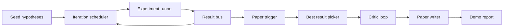
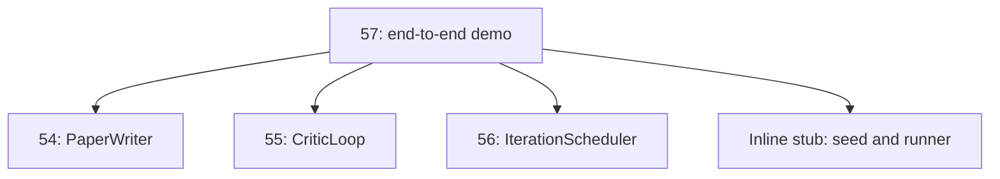
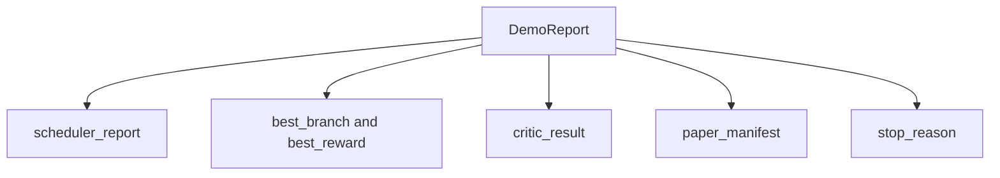

# End-to-End Research Demo | 研究 演示

> A demo is the place where every contract you wrote earlier has to compose. If any one of them leaks, the demo is the lesson that catches it.

> **【中文解读】** 本节是综合项目——端到端研究演示的完整集成。


**Type:** Build | **类型:** Build
**Languages:** Python | **语言:** Python
**Prerequisites:** Phase 19 lessons 50-53 | **前置知识:** Phase 19 lessons 50-53
**Time:** ~90 minutes | **时间:** ~90 minutes

## Learning Objectives | 学习目标

- Wire the auto-research loop end to end: hypothesis seed, experiment runner, scheduler, critic loop, paper writer.
  中文翻译：Wire the auto-research loop end to end: hypothesis seed, experiment runner, scheduler, critic loop, paper writer.
- Compose the primitives from the four earlier Track D lessons through plain Python imports, not a framework.
  中文翻译：Compose the primitives from the four earlier Track D lessons through plain Python imports, not a framework.
- Run the loop to a self-terminating end and emit a single demo report that lists every stage's output.
  中文翻译：Run the loop to a self-terminating end and emit a single demo report that lists every stage's output.
- Keep the demo deterministic so the test suite can assert the final shape.
  中文翻译：Keep the demo deterministic so the test suite can assert the final shape.
- Surface a clear failure mode when any stage's contract breaks, so the next stage does not run with a broken input.
  中文翻译：Surface a clear failure mode when any stage's contract breaks, so the next stage does not run with a broken input.

## What composes here

> **【中文解读】** 端到端研究演示组合了 Track D 的四个先前课程：种子假设送入迭代调度器，调度器用 UCB 选择假设并运行实验，结果触发论文写作，批评循环迭代草稿到收敛，论文写作者输出最终 LaTeX/BibTeX/Manifest。五个阶段通过纯 Python 导入连接，而非框架。每个阶段要么成功要么抛出类型化错误——失败短路整个演示。

> **【拓展：端到端科研自动化的里程碑】** Sakana AI 的 "The AI Scientist"（2024）首次展示了从假设生成到论文撰写的完整自动化流程，在 ICLR 2024 的研讨会上被评为 Top-10。Google DeepMind 的 FunSearch 使用 LLM 发现新的数学算法并发表在 Nature 上。本课的端到端演示是这些系统的教育性简化——展示了完整的科研循环骨架，每个组件都可以替换为真实的 LLM 驱动版本。



Five stages. The seed is a list of three hypotheses. The scheduler runs six experiments across them with three parallel slots. The bus reports one or more paper triggers. The picker selects the single best result. The critic loop iterates on a draft built from that result. The paper writer emits the final LaTeX, BibTeX, and manifest.

> Five stages.


## Why import, not copy

Each earlier lesson ships a `main.py` with public dataclasses and functions. The demo imports them by adjusting `sys.path` to the parent directory of each lesson. This is not framework wiring; it is the same import the test files in the earlier lessons already use.

> 每个earlier lesson ships a `main.py` with public dataclasses and functions. The demo imports them by adjusting `sys.path` to the parent directory of each lesson. This is not framework wiring; it is the same import the test files in the earlier lessons already use.




The inline stub stands in for lessons fifty through fifty-three: a small generator of seed hypotheses and a synchronous reward function. The user can swap the inline stub for the real primitives from those lessons by adjusting two imports.

> inline stub stands in for lessons fifty through fifty-three: a small generator of seed hypotheses and a synchronous reward function. The user can swap the inline stub for the real primitives from those lessons by adjusting two imports.


## Determinism guarantees

> **【中文解读】** 演示按构造确定性：实验运行器使用种子 numpy，批评循环的修订者按固定顺序遍历固定维度，论文写作者的散文生成器是模拟的，调度器的 UCB 选择器用迭代顺序（而非随机选择）打破平局。相同种子产生相同报告——测试通过运行两次演示并比较 manifest 来断言此属性。

The demo is deterministic by construction. The experiment runner is seeded numpy. The critic loop's reviser walks fixed dimensions in fixed order. The paper writer's prose generator is the mocked one from lesson fifty-four. The scheduler's UCB picker breaks ties on iteration order, not random choice.

> demo is deterministic by construction. The experiment runner is seeded numpy. The critic loop's reviser walks fixed dimensions in fixed order. The paper writer's prose generator is the mocked one from lesson fifty-four. The scheduler's UCB picker breaks ties on iteration order, not random choice.


Given the same seed, the demo emits the same report. The test asserts this property by running the demo twice and comparing the manifest.

> Given the same seed, the demo emits the same report.


## The demo report shape

> **【拓展：组合式架构在 AI 系统中的优势】** 本课的端到端演示证明了"组合即架构"（composition is architecture）：五个课程通过纯 Python 导入连接，无框架依赖。这种设计使得每个组件可以独立测试、独立替换、独立演进。LangGraph 和 CrewAI 提供了框架级的多 Agent 组合方案，但本课展示了最小可行的组合模式——当框架过于重量级时，这种朴素的方法更有教育价值和实际灵活性。



Each field comes verbatim from the upstream stage. The demo does not transform any output; it composes them. That is the test the demo is.

> 每个field comes verbatim from the upstream stage. The demo does not transform any output; it composes them. That is the test the demo is.


## Failure mode handling

> **【中文解读】** 每个阶段要么成功要么抛出类型化错误：调度器返回带 stop_reason 的报告，最佳结果选取在无触发器时抛出 NoTriggerError，批评循环返回带状态的 LoopResult，论文写作者在契约违反时抛出 PaperValidationError。任何阶段的失败用类型化异常短路演示——测试断言下游阶段不会被调用。

Each stage either succeeds or raises a typed error.

```text
Scheduler ........ returns SchedulerReport with stop_reason
                   in {queue_empty, max_experiments, deadline}
Best-result pick . raises NoTriggerError if no paper trigger fired
Critic loop ...... returns LoopResult with status converged or stopped
Paper writer ..... raises PaperValidationError on contract break
```

A failure in any stage short-circuits the demo with a typed exception. The tests pin this contract: `test_no_triggers_raises_typed_error` and `test_best_picker_raises_when_no_triggers` assert the picker raises `NoTriggerError` / `BestResultError` when no branch fired a trigger, and the writer is never invoked.

> 一个failure in any stage short-circuits the demo with a typed exception. The tests pin this contract: `test_no_triggers_raises_typed_error` and `test_best_picker_raises_when_no_triggers` assert the picker raises `NoTriggerError` / `BestResultError` when no branch fired a trigger, and the writer is never invoked.


## The best-result picker

> **【中文解读】** 调度器按分支发出论文触发器。选取器选择所有触发器中均值奖励最高的分支，平局按分支 id 字母序打破以保证确定性。选取器是一个小型纯函数。`mini_to_full_paper` 将收敛的 MiniPaper 升级为完整 Paper——附加选中分支的图表和合成参考文献。

The scheduler emits paper triggers per branch. The picker selects the branch with the highest mean reward across all triggers. Ties break alphabetically by branch id so the demo is deterministic. The picker is a small pure function; the test pins it on a fixed scheduler report.

> 调度确定研究循环的下一步。


## Wiring the critic loop

The critic loop in lesson fifty-five operates on a `MiniPaper`. The demo builds a `MiniPaper` from the picked branch by populating the abstract with the branch id, seeding two sections (Introduction and Results), and setting `originality_tag` from the branch's mean reward (high if `>= 0.8`, medium if `>= 0.6`, low otherwise).

> 批评循环审查并迭代草稿。


The reviser then iterates the draft to convergence. The output goes into the paper writer.

> REviser then iterates the draft to convergence. The output goes into the paper writer.（翻译）


## Wiring the paper writer

The paper writer in lesson fifty-four operates on the full `Paper` shape with figures and bibliography. The demo upgrades the converged `MiniPaper` via `mini_to_full_paper`, which attaches one figure for the selected branch and a small synthetic bibliography built from the union of cite keys the critic suggested. Every cite the demo adds is also added to the bibliography list, so validation passes.

> 论文写作者产生 LaTeX 草稿。


## How to read the code

`code/main.py` defines `BestResultError`, `NoTriggerError`, `DemoReport`, `pick_best_branch`, `build_mini_paper`, `mini_to_full_paper`, and `run_demo`. The imports at the top adjust `sys.path` once and pull `PaperWriter`, `CriticLoop`, and `IterationScheduler` from their lessons.

> `code/main.


`code/tests/test_e2e.py` covers: demo runs end to end and emits a report with all five fields populated, determinism across two runs, NoTriggerError when no branch crosses the threshold, PaperValidationError when the writer's contract breaks, paper manifest contains the picked branch's figure, and the scheduler stop reason is one of the expected values.

> `code/tests/test_e2e.


## Going further

Three extensions worth wiring once the demo is green. First, persistent state: each stage's result writes to a small JSON store so a restart can resume without re-running the cheap stages. Second, a dashboard: the trace events from the scheduler and critic loop render as a single timeline. Third, real model calls: swap the mocked prose generator and the deterministic critic for model-driven ones; the wiring does not change.

> Three extensions worth wiring once the demo is green.


The demo's job is to prove that composition is the architecture. Five lessons, four imports, one report. The next time you add a stage, the wiring grows by exactly one line.

> demo's job is to prove that composition is the architecture. Five lessons, four imports, one report. The next time you add a stage, the wiring grows by exactly one line.

