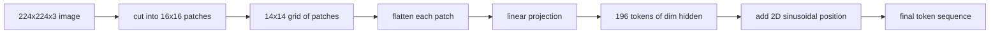

# 视觉编码器分块

> 读像素的视觉模型需要一个"像素分词器"，图像块嵌入就是这个分词器。把图像切成方块网格，每块展平，过一个线性层投影，再加一个二维位置信号，Transformer 就知道每块原来在图中的位置。

> **【中文解读】** 本课是多模态视觉路线的第一课：视觉编码器的分块（patch embedding）前端。视觉模型读的是像素，而 Transformer 吃的是向量序列——分块嵌入就是像素世界的"分词器"。学完本课你应能：把图像分块成固定长度的嵌入序列、用 `Conv2d` 实现与"展开 + 线性"数学等价的投影、构建确定性的二维正弦位置嵌入，并在合成测试图上验证等价性。

> **【拓展：多模态视觉路线→整个 VLM 栈的地基】** CLIP、SigLIP、DINOv2、Qwen-VL、InternVL——2025-2026 年所有主流开源视觉-语言模型的视觉侧都从这个"Conv2d 分块投影 + 位置信号"前端起步。本课（58）搭建前端，59 课在其上叠 12 层 Transformer，60 课做模态对齐投影，61 课做交叉注意力融合，62 课做视觉-语言预训练——五课合成一条完整的多模态视觉路线。

> 🔗 **【前置】** 学本课前请先掌握：Phase 19 · 30-37（Track B 基础：BPE 分词器、位置嵌入、注意力机制从零实现）——本课把"序列 + 嵌入 + 位置"的同一套语言搬到图像域。

**类型：** 构建
**语言：** Python
**前置条件：** Phase 19 · 30-37（Track B 基础）
**预计用时：** 约 90 分钟

## 学习目标

- 把一张图像分块成固定长度的图像块嵌入序列。
- 实现基于 `Conv2d` 的图像块投影，其数学结果与"展开后再线性"完全一致。
- 构建确定性的二维正弦位置嵌入，让词元顺序携带空间位置信息。
- 在合成测试图上验证图像块数量、嵌入形状以及 `Conv2d` 与 unfold 的等价性。

## 问题引入

> **【中文解读】** 本节算清"为什么必须分块"这笔账：逐像素当词元让序列平方级爆炸，整图压一个向量又丢掉局部性。答案是 196 块的中庸方案——每块概括一个方形区域，序列长度是 Transformer 养得起的。

Transformer 吃的是向量序列，而图像是三通道网格。把每个像素当一个词元会让序列长度爆炸：一张 224x224 的 RGB 图是 150,528 个词元，12 层 Transformer 的注意力根本养不起。把整张图读成一个巨大的扁平向量又丢掉了局部性，注意力层也无法把它找回来。编码器前端的任务就是把像素网格压缩成几百个词元，每个词元概括一块方形区域。

图像块嵌入用一次线性投影解决这个问题。224x224 的图切成 16x16 的块得到 14x14 网格共 196 块。每块从 `(3, 16, 16) = 768` 个像素值展平成一个向量，再由线性层映射到模型的隐藏维度。Transformer 看到 196 个维度为 `hidden`（通常是 768）的词元外加一个 CLS 词元。这才是后续网络嚼得动的序列。

## 核心概念

> 💡 **【类比】** 分块像把一幅大拼图按 16x16 的格子"预组装"成 196 块中等碎片再交给整理师（Transformer）。逐像素等于把一万多粒散沙倒上台面，整理师连两两配对都做不完（注意力平方爆炸）；整图压一块等于把拼图直接绞碎成粉末，局部图案信息彻底没了。16x16 的碎片刚好保留"这一格里有猫耳朵边缘"级别的信号，又把整理量压到 196 件。



### 为什么用图像块而不是像素

注意力开销与序列长度成平方关系。196 个词元的序列每头每层只需 `196 * 196 = 38,416` 个注意力分数；150,528 个词元的序列需要 `150,528 * 150,528 = 226 亿`。分块换来约 59 万倍的注意力算力缩减，而单个 16x16 区域携带的信号足以支撑高层视觉任务。代价是块内细粒度空间细节的丢失——这正是下游多模态栈在需要精细定位时另跑一条高分辨率分支的原因。

### 为什么一层线性投影就够了

> **【中文解读】** 投影层学到的不是"猫脸检测器"而是一组低层基：边缘、颜色、简单纹理。高层语义交给后面的 Transformer。这也是为什么一层线性就够——ViT-Base 的投影只有 59 万参数，训练飞快。

每个图像块被当作独立向量处理。投影层学出的是一组基：边缘检测器、颜色滤波器、简单纹理。单层线性层很小（ViT-Base 为 `768 * 768 = 589,824` 个参数）且训练快。更深的卷积前端也存在（"混合式"ViT），但扁平的线性投影才是标准做法，大多数现代开源权重编码器出厂就是这个形状。

### `Conv2d` 技巧

`Conv2d(in_channels=3, out_channels=hidden, kernel_size=patch_size, stride=patch_size)` 不加 padding 时与"展开 + 线性"给出相同的数值结果，因为每个输出位置就是把图像块像素与一个滤波器做点积。这个卷积就是图像块投影，大多数生产代码库都这么写，因为 GPU 上更快、还省一次 reshape。

### 位置嵌入

词元走出投影层时并不携带顺序信息。二维正弦位置嵌入给每个词元一个固定信号，编码其 `(行, 列)` 位置：嵌入维度的一半用多频率 sin/cos 编码行位置，另一半编码列位置。该编码是确定性的，因此不重训也能换分辨率，还能干净地插值到训练时从未见过的网格。

| 组件 | 形状 | 参数量 |
|------|------|--------|
| 图像块投影（`Conv2d`） | `(hidden, 3, patch, patch)` | `3 * P * P * hidden + hidden` |
| 位置嵌入（固定） | `(num_patches, hidden)` | 0（计算得出，不学习） |
| CLS 词元（可学习） | `(1, hidden)` | `hidden` |

对 224 分辨率的 ViT-Base/16：投影层 590,592 个参数，CLS 词元 768 个，正弦位置编码零个。下一课（59）在这个前端之上叠一个 12 层 Transformer。

### 用等价性做健全性检查

> **【中文解读】** `Conv2d` 和"展开 + 线性"是同一数学的两种拼法，同样权重必须输出同样结果。本课测试专门验证这一点——如果两种拼法不一致，说明展开的数学写错了，后面 12 层编码器就是建在沙子上。

图像块这一步有两种拼法：`Conv2d` 投影和显式的"展开 + 线性"。同样的权重必须产生同样的输出。如果不一样，说明展开的数学写错了，编码器其余部分就是建在沙子上。本课的测试专门验证这个等价性。

```figure
ch-patch-tokenizer
```

## 动手实现

> **【中文解读】** 代码把规范变成可运行的四部件：`PatchEmbed`（Conv2d 投影）、`sinusoidal_2d`（无状态位置表）、`VisionFrontEnd`（分块 + CLS 前置 + 位置相加）、`synthesize_image(seed)`（确定性测试图）。跑完 demo 看到 `(1, 197, 768)` 的输出，正弦签名（行内范数均匀）也就看到了。

`code/main.py` 实现了：

- `PatchEmbed`：包着 `Conv2d` 做图像块投影的 `nn.Module`。
- `sinusoidal_2d(grid_h, grid_w, dim)`：构建二维位置表的无状态函数。
- `VisionFrontEnd`：把图像块嵌入、CLS 前置、位置相加组合成一次前向。
- `synthesize_image(seed)`：用 `numpy.random` 构造确定性 224x224x3 测试图的辅助函数。
- 一个 demo：把一张测试图跑过前端，打印输出形状、CLS 词元范数和位置嵌入的一行。

运行：

```bash
python3 code/main.py
```

输出：224x224 测试图被分块为形状 `(1, 197, 768)` 的序列。第一个词元是 CLS，后面 196 个是图像块词元。位置嵌入的范数在同一行内均匀一致，这正是正弦编码的签名。

## 用框架实现

同一个分块前端出现在每一个现代视觉-语言模型中：CLIP ViT-L/14、SigLIP、DINOv2、Qwen-VL 家族和 InternVL 栈都从 `Conv2d` 分块投影加位置信号开始。各家族之间的差异都在下游（CLS 池化 vs 无 CLS 池化、register 词元、14 vs 16 的块大小差异、通过位置插值实现动态分辨率）。本课的前端是所有这些模型共同站立的地基。

## 测试

`code/test_main.py` 覆盖：

- 图像块数量等于 `(image_size / patch_size) ** 2`。
- 输出形状为 `(batch, num_patches + 1, hidden)`。
- 在小测试图上，`Conv2d` 投影与手工"展开 + 线性"逐位一致。
- 正弦位置表跨调用保持确定性。
- CLS 词元在 batch 维度上广播且不发生串扰。

运行：

```bash
python3 -m unittest code/test_main.py
```

## 练习题

1. 把正弦位置换成可学习的 `nn.Parameter`，在微型合成分类任务上比较第一个 epoch 的损失。固定分辨率下可学习位置更优；训练后换分辨率则正弦编码胜出。

2. 把 `Conv2d` 换成显式的 `nn.Unfold` 加 `nn.Linear`，断言输出在浮点容差内一致。同一套数学，两种拼法。

3. 增加对非方形图像块的支持（如宽高比输入用 32x16），并验证位置表能处理非方形网格。

4. 在 batch 为 1、8、64 下给分块步骤做性能剖析。图像块投影很少是瓶颈；下游的注意力层才占大头。

5. 把前端当冻结特征提取器，在四类合成形状数据集（圆、方、三角、星）上训练。CLS 词元输出应能被线性分开。

## 术语速查表

| 术语 | 含义 |
|------|------|
| Patch（图像块） | 图像的方形子区域，通常为 14x14 或 16x16 |
| Patch embedding（块嵌入） | 把一个展平的图像块线性投影到隐藏维度 |
| Sequence length（序列长度） | 分块后的词元数量，通常再加 CLS |
| Sinusoidal position（正弦位置） | 编码二维网格坐标的固定 sin/cos 信号 |
| CLS token（CLS 词元） | 前置到序列中作为池化头的可学习向量 |

## 延伸阅读

- 《An Image is Worth 16x16 Words》（ViT，2021）——图像块嵌入的开山之作。
- 《Attention Is All You Need》（2017）——本课改编为二维的正弦位置公式出处。
- DINOv2 论文——register 词元的出处，可作为附加练习自行扩展。
