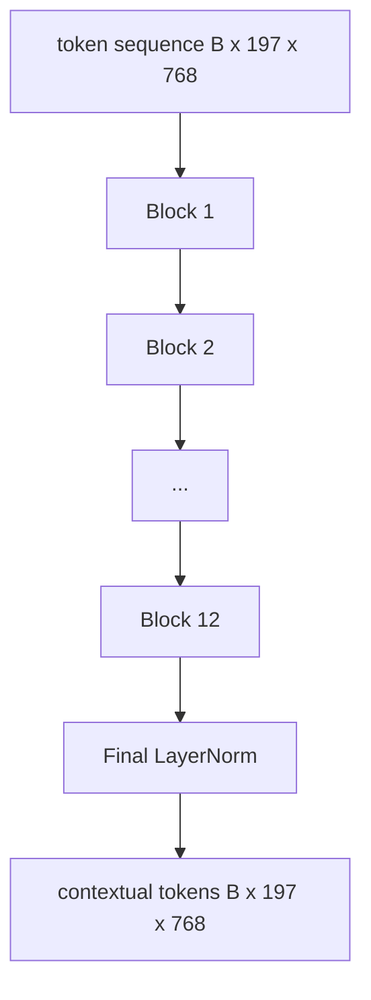

# Vision Transformer Encoder | Vision Transformer 编码器

> Patches alone do not see. A 12-layer pre-LN transformer with 12 attention heads turns the sequence of patch tokens into a sequence of contextual tokens, with the CLS token pooling whole-image features in its final hidden state. This lesson is the engine room of every modern vision-language model.

> **【中文解读】** 光有图像块还不够——块与块之间互不相识。本课在 58 课的分块前端之上叠 12 层 pre-LN Transformer、12 个注意力头，把"各顾各"的图像块词元变成携带上下文的词元序列；CLS 词元在最后一层把整图特征汇聚进自己的隐藏状态。这里是每一个现代视觉-语言模型的机房。

> **【拓展：一块稳定的积木→读任何 VLM 论文的通行证】** "12 层深、12 头宽、pre-LayerNorm、GELU、前馈 4 倍扩展"这一配方是 CLIP ViT-L、SigLIP、DINOv2、Qwen-VL、InternVL 等所有 2025-2026 开源视觉编码器的共同脊柱。配方稳定到你可以直接读这些论文并默认就是这个块形状，除非作者明确说不是。宽度深度变了（ViT-L 1024/24/16，So400M 1152/27/16），块本身没变。

> 🔗 **【前置】** 学本课前请先掌握：本阶段 58 课（视觉编码器分块）——本课代码直接 import 58 课的 `VisionFrontEnd`；Track B 的注意力与前馈基础（30-37）——多头自注意力、LayerNorm、残差连接的从零实现。

**Type:** Build | **类型:** 构建
**Languages:** Python | **语言:** Python
**Prerequisites:** Phase 19 lessons 30-37 (Track B foundations) | **前置知识:** Phase 19 · 30-37（Track B 基础）
**Time:** ~90 minutes | **时间:** 约 90 分钟

## Learning Objectives | 学习目标

- Implement a pre-LN transformer block with multi-head self-attention and a feed-forward sub-layer.
  中文翻译：实现一个 pre-LN Transformer 块，包含多头自注意力和一个前馈子层。
- Stack 12 blocks with 12 heads to form a ViT-Base encoder.
  中文翻译：堆叠 12 个块、12 个头，组成 ViT-Base 编码器。
- Wire the patch front end from lesson 58 into the encoder and run a forward pass.
  中文翻译：把 58 课的图像块前端接进编码器并跑一次前向。
- Verify that the CLS token aggregates information from every patch.
  中文翻译：验证 CLS 词元汇聚了来自每一个图像块的信息。

## The Problem | 问题引入

> **【中文解读】** 本节回答"为什么块之上还需要 Transformer"。分块嵌入产出的 197 个词元彼此毫无感知：一张猫图需要每块知道哪些块是胡须、哪些是背景、哪些是眼睛。注意力逐层建立这种感知。标准配方：12 层深、12 头宽、pre-LN、GELU、前馈 4 倍扩展——稳定到可以当默认值。

The patch embedding produces a sequence of 197 tokens, each one a vector with no awareness of any other patch. A picture of a cat needs every patch to know which patches contain whiskers, which contain background, and which contain the eye. The transformer is the mechanism that builds that awareness, one attention layer at a time. Without it, the patch front end is a clever tokenizer with no understanding.

> 分块嵌入产出 197 个词元的序列，每个词元都是一个对其他块毫无感知的向量。一张猫的图片需要每个图像块知道哪些块装着胡须、哪些装着背景、哪些装着眼睛。Transformer 就是一次一层建立这种感知的机制。没有它，图像块前端只是一个没有理解力的聪明分词器。

The standard recipe is twelve blocks deep, twelve heads wide, with pre-LayerNorm placement, GELU activation, and a feed-forward expansion of 4x. That recipe is the spine of CLIP ViT-L, SigLIP, DINOv2, the Qwen-VL family, InternVL, and every other open-weight vision encoder of 2025-2026. The recipe is stable enough that you can read any of those papers and assume this block shape unless they explicitly say otherwise.

> 标准配方是 12 层深、12 头宽、pre-LayerNorm 摆放、GELU 激活、前馈 4 倍扩展。这个配方是 CLIP ViT-L、SigLIP、DINOv2、Qwen-VL 家族、InternVL 以及 2025-2026 年所有其他开源权重视觉编码器的脊柱。配方足够稳定，你读其中任何一篇论文都可以默认就是这个块形状，除非作者明确说不是。

## The Concept | 核心概念




### Pre-LN vs post-LN | Pre-LN 与 post-LN

> 💡 **【类比】** Pre-LN 像给每层流水线工位前加一道"标准化预处理台"：材料先归一化再进工位，深层流水线（12+ 层）跑得稳。Post-LN 像把质检台放在工位后——早期梯度经过十几道缩放容易越传越弱或越传越炸，得靠学习率热身这类"扶稳"技巧才不翻车。前向只差一行代码，12 层以上的梯度流却是天壤之别。

Original Transformer placed LayerNorm after the residual. Pre-LN (LayerNorm before each sub-layer) is the version every modern vision-language model uses, because it trains stably without learning-rate warm-up tricks. The difference is one line in the forward pass, and the gradient flow at depth 12+ is night and day.

> 原始 Transformer 把 LayerNorm 放在残差之后。Pre-LN（每个子层之前做 LayerNorm）是所有现代视觉-语言模型采用的版本，因为它不需要学习率热身技巧就能稳定训练。区别只是前向传播里的一行代码，而 12 层以上深度的梯度流却是天壤之别。

### Multi-head self-attention | 多头自注意力

Each head projects the token vector to its own `(query, key, value)` triple with dimension `head_dim = hidden / num_heads`. With `hidden = 768` and `heads = 12`, each head has `dim = 64`. The 12 heads attend in parallel, then their outputs concat back to dimension 768 and pass through an output projection. The point of multi-head is that one head can learn "attend to the cat eye" while another learns "attend to the background gradient" without interference.

> 每个头把词元向量投影到自己的 `(query, key, value)` 三元组，维度为 `head_dim = hidden / num_heads`。`hidden = 768`、`heads = 12` 时每个头维度为 64。12 个头并行做注意力，输出拼接回 768 维再过一个输出投影。多头的意义在于：一个头可以学"盯住猫眼"，另一个头同时学"盯住背景渐变"，互不干扰。

### Why the 4x feed-forward expansion | 为什么前馈层扩展 4 倍

The FFN goes `hidden -> 4 * hidden -> hidden` with GELU in the middle. The factor 4 is empirical and has held across language and vision transformers since 2017. Smaller (2x) underfits; larger (8x) overfits at fixed data budget. The MLP is where the model stores most of its learned facts, and the wider middle is where they sit.

> 前馈层走 `hidden -> 4 * hidden -> hidden`，中间夹 GELU。倍数 4 是经验值，自 2017 年起在语言和视觉 Transformer 中一直成立。更小（2 倍）欠拟合；更大（8 倍）在固定数据预算下过拟合。MLP 是模型存放大部分已学事实的地方，更宽的中间层就是它们的座位。

| Component | Parameters at ViT-Base scale |
|-----------|------------------------------|
| qkv projection per block | `3 * 768 * 768 = 1.77M` |
| output projection per block | `768 * 768 = 590K` |
| FFN per block (4x expansion) | `2 * 768 * 4 * 768 = 4.72M` |
| LayerNorm per block | `4 * 768 = 3K` |
| Total per block | about 7.1M |
| 12 blocks | about 85M |
| Plus front end | about 86M total |

ViT-Base is a 86M-parameter encoder. That is small by 2026 standards (SigLIP-So400M is 400M, the Qwen-VL ViT is 675M), but the architecture is identical up to width and depth.

> ViT-Base 是一个 8600 万参数的编码器。按 2026 年的标准这算小的（SigLIP-So400M 是 4 亿，Qwen-VL 的 ViT 是 6.75 亿），但架构在宽度和深度之外完全一致。

### Causal mask or not? | 要不要因果掩码？

> **【中文解读】** 视觉 Transformer 是纯编码器、双向的：词元 `i` 可以看任意词元 `j`，无掩码。61 课解码器侧的交叉注意力才用因果掩码；视觉编码器内部注意力是全连接的。

Vision Transformers are encoder-only and bidirectional: token `i` may attend to token `j` for any pair. No mask. The decoder-side cross-attention in lesson 61 will use a causal mask, but inside the vision encoder, attention is fully connected.

> 视觉 Transformer 是纯编码器且双向的：任意一对词元 `i`、`j` 之间都可以互相注意。没有掩码。61 课解码器侧的交叉注意力会用因果掩码，但在视觉编码器内部，注意力是全连接的。

### What the CLS token learns | CLS 词元学到了什么

The CLS token starts as a learned parameter, has no patch content of its own, and accumulates information through attention across every block. By the final layer, the CLS row is a vector summary of the whole image; downstream heads project this single vector into class logits, contrastive embeddings, or cross-attention keys for a text decoder.

> CLS 词元起始只是一个可学习参数，自身没有任何图像块内容，靠每一层的注意力积累信息。到最后一层，CLS 那一行已经是整张图的向量摘要；下游头部把这个单一向量投影成类别 logits、对比嵌入，或供文本解码器使用的交叉注意力键。

```figure
ch-cls-funnel
```

## Build It | 动手实现

> **【中文解读】** `code/main.py` 自底向上实现 `MultiHeadSelfAttention`（qkv + 输出投影 + 缩放点积）、`FeedForward`（4 倍 GELU MLP）、`Block`（pre-LN + 双子层残差）、`ViT`（12 块 + 最终 LayerNorm）、`VisionEncoder`（接线 58 课前端，前向返回上下文序列与 CLS 池化向量）。demo 打印输入输出形状、参数量（约 86M）和每隔一层的 CLS 范数——范数随层数上漂、在最终 LayerNorm 处稳定。

`code/main.py` implements:

- `MultiHeadSelfAttention`, with `qkv` and output projections, the scaled-dot-product attention math, and shape assertions.
- `FeedForward`, the 4x-expansion GELU MLP.
- `Block`, a pre-LN block composing attention and feed-forward sub-layers with residuals.
- `ViT`, a stack of 12 blocks with a final LayerNorm.
- `VisionEncoder`, which wires `VisionFrontEnd` from lesson 58 to the `ViT` stack and exposes a `forward()` returning the contextual sequence and the pooled CLS vector.
- A demo that runs a synthesized 224x224 fixture image through the full encoder and prints input shape, output shape, parameter count, and the CLS norm at every other layer.

Run it:

```bash
python3 code/main.py
```

Output: the fixture is encoded to a `(1, 197, 768)` tensor. The CLS norm drifts upward as the layers compose, then stabilizes at the final LayerNorm. Total parameters report at about 86M.

> 输出：测试图被编码为 `(1, 197, 768)` 张量。CLS 范数随层叠加向上漂移，在最终 LayerNorm 处稳定下来。总参数量约 86M。

## Use It | 用框架实现

> **【中文解读】** 这里定义的编码器在宽度和深度之外，就是 2025-2026 年每个开源 VLM 里出厂的那个块栈。差异只有四处：宽深（ViT-L 1024/24/16、So400M 1152/27/16）、池化头（CLS/平均/注意力池化）、位置处理（固定正弦/可学习 1D/ALiBi/2D RoPE）、register 词元（DINOv2 前置 4 个额外可学习词元，一行代码的事）。块数学不变——这是 60-63 课共同站立的基座。

The encoder defined here is, up to width and depth, the same block stack that ships inside every open-weight VLM in 2025-2026. Differences live in:

- **Width and depth.** ViT-Large is `hidden=1024, depth=24, heads=16`; SigLIP So400M is `hidden=1152, depth=27, heads=16`. Same block.
  中文翻译：**宽度和深度。** ViT-Large 是 `hidden=1024, depth=24, heads=16`；SigLIP So400M 是 `hidden=1152, depth=27, heads=16`。同一个块。
- **Pooling head.** CLS pooling (this lesson) vs average pooling (SigLIP) vs attention pooling (later VLMs).
  中文翻译：**池化头。** CLS 池化（本课）对比平均池化（SigLIP）对比注意力池化（后来的 VLM）。
- **Position handling.** Fixed sinusoidal (lesson 58) vs learned 1D vs ALiBi vs 2D RoPE. The block math is unchanged.
  中文翻译：**位置处理。** 固定正弦（58 课）对比可学习 1D 对比 ALiBi 对比 2D RoPE。块数学不变。
- **Register tokens.** DINOv2 prepends 4 extra learned tokens. One line of code.
  中文翻译：**Register 词元。** DINOv2 前置 4 个额外可学习词元。一行代码的事。

This block stack is the substrate. The next lessons (60-63) stand on top of it.

> 这个块栈是基座。接下来的课（60-63）都站在它上面。

## Tests | 测试

`code/test_main.py` covers:

- a single block preserves shape and is invariant to input batch size
  中文翻译：单个块保持形状且对输入 batch 大小不敏感。
- attention scores sum to one along the key axis (softmax sanity)
  中文翻译：注意力分数沿键轴求和为 1（softmax 健全性）。
- residual paths are wired (zero input still produces non-zero output via the CLS token)
  中文翻译：残差路径接通（零输入仍能通过 CLS 词元产生非零输出）。
- a 4-layer stacked forward pass produces the right shape
  中文翻译：4 层堆叠前向产生正确形状。
- gradients flow to the patch projection from the CLS output
  中文翻译：梯度从 CLS 输出流回图像块投影。

Run them:

```bash
python3 -m unittest code/test_main.py
```

## Exercises | 练习题

1. Add register tokens (4 learned vectors prepended after CLS) and rerun. Compare attention map smoothness via the entropy of the softmax distribution on the last layer.
   中文翻译：添加 register 词元（4 个前置在 CLS 之后的可学习向量）并重跑。用最后一层 softmax 分布的熵比较注意力图的平滑度。

2. Swap pre-LN for post-LN and train for one epoch on a synthetic shape classifier. Observe which one trains stably without LR warm-up.
   中文翻译：把 pre-LN 换成 post-LN，在合成形状分类器上训练一个 epoch。观察哪一个不用学习率热身也能稳定训练。

3. Implement causal masking as an `attn_mask` argument so the same block can be reused as a decoder block. The mask shape is `(seq, seq)`, lower-triangular.
   中文翻译：把因果掩码实现为 `attn_mask` 参数，让同一个块可复用为解码器块。掩码形状是 `(seq, seq)` 的下三角。

4. Profile a forward pass at batch sizes 1, 8, 64 with `torch.profiler`. The MLP layer dominates wall time, not attention.
   中文翻译：用 `torch.profiler` 在 batch 为 1、8、64 下剖析前向。占壁钟时间大头的是 MLP 层，不是注意力。

5. Replace one attention head's q-k-v projections with a low-rank LoRA adapter, freeze the rest, and verify the gradient only flows where you expect.
   中文翻译：把一个注意力头的 q-k-v 投影换成低秩 LoRA 适配器，冻结其余部分，验证梯度只流向预期位置。

## Key Terms | 术语速查表

> **【中文解读】** 本课五个关键词：Pre-LN（子层前归一化）、Self-attention（同序列内互相注意）、Multi-head（隐藏维拆给 H 个独立头）、FFN expansion（前馈先扩到 4 倍再收缩）、CLS pooling（用第一个词元的最终隐藏状态作图像摘要）。60 课的投影层将直接消费这里的 CLS 池化输出。

| Term | What it means |
|------|---------------|
| Pre-LN | LayerNorm applied before each sub-layer instead of after |
| Self-attention | Each token attends to every other token in the same sequence |
| Multi-head | The hidden dim is split across `H` independent attention heads |
| FFN expansion | The feed-forward layer widens to `4 * hidden` before contracting |
| CLS pooling | Use the first token's final hidden state as the image summary |

## Further Reading | 延伸阅读

- An Image is Worth 16x16 Words (ViT, 2021) for the encoder recipe.
  中文翻译：《An Image is Worth 16x16 Words》（ViT，2021）——编码器配方的出处。
- DINOv2 (2023) for register tokens and the self-supervised pretraining objective.
  中文翻译：DINOv2（2023）——register 词元与自监督预训练目标。
- SigLIP (2023) for the average-pooling variant and the sigmoid contrastive loss used in lesson 62.
  中文翻译：SigLIP（2023）——平均池化变体与 62 课将用的 sigmoid 对比损失。
