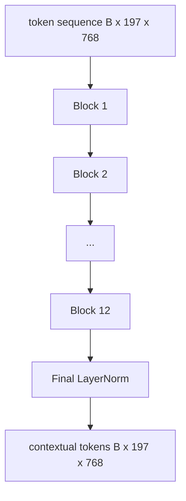
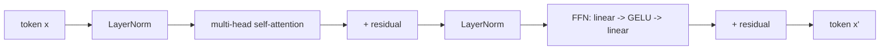

# Vision Transformer 编码器

> 光有图像块还看不见。一个 12 层、12 头的 pre-LN Transformer 把图像块词元序列变成携带上下文的词元序列，CLS 词元在自己的最终隐藏状态里汇聚整图特征。本课是每一个现代视觉-语言模型的机房。

> **【中文解读】** 本课在 58 课的分块前端之上叠出完整的 ViT-Base 编码器：pre-LN 块、多头自注意力、4 倍扩展前馈、残差连接，最后接一层 LayerNorm。学完本课你应能实现标准 Transformer 块、堆出 12 层编码器、把 58 课的前端接进来跑通前向，并验证 CLS 词元确实汇聚了每个图像块的信息。

> **【拓展：一块稳定的积木→读任何 VLM 论文的通行证】** "12 层深、12 头宽、pre-LayerNorm、GELU、前馈 4 倍扩展"这一配方是 CLIP ViT-L、SigLIP、DINOv2、Qwen-VL、InternVL 等所有 2025-2026 开源视觉编码器的共同脊柱。配方稳定到你可以直接读这些论文并默认就是这个块形状，除非作者明确说不是。宽度深度变了（ViT-L 1024/24/16，So400M 1152/27/16），块本身没变。

> 🔗 **【前置】** 学本课前请先掌握：本阶段 58 课（视觉编码器分块）——本课代码直接 import 58 课的 `VisionFrontEnd`；Track B 的注意力与前馈基础（30-37）——多头自注意力、LayerNorm、残差连接的从零实现。

**类型：** 构建
**语言：** Python
**前置条件：** Phase 19 · 30-37（Track B 基础）
**预计用时：** 约 90 分钟

## 学习目标

- 实现一个 pre-LN Transformer 块，包含多头自注意力和一个前馈子层。
- 堆叠 12 个块、12 个头，组成 ViT-Base 编码器。
- 把 58 课的图像块前端接进编码器并跑一次前向。
- 验证 CLS 词元汇聚了来自每一个图像块的信息。

## 问题引入

> **【中文解读】** 分块嵌入产出的 197 个词元彼此毫无感知；注意力逐层建立"哪些块是胡须、哪些是背景"的全局感知。标准配方 12 层深、12 头宽、pre-LN、GELU、4 倍前馈——稳定到可以当读论文时的默认值。

分块嵌入产出 197 个词元的序列，每个词元都是一个对其他块毫无感知的向量。一张猫的图片需要每个图像块知道哪些块装着胡须、哪些装着背景、哪些装着眼睛。Transformer 就是一次一层建立这种感知的机制。没有它，图像块前端只是一个没有理解力的聪明分词器。

标准配方是 12 层深、12 头宽、pre-LayerNorm 摆放、GELU 激活、前馈 4 倍扩展。这个配方是 CLIP ViT-L、SigLIP、DINOv2、Qwen-VL 家族、InternVL 以及 2025-2026 年所有其他开源权重视觉编码器的脊柱。配方足够稳定，你读其中任何一篇论文都可以默认就是这个块形状，除非作者明确说不是。

## 核心概念





### Pre-LN 与 post-LN

> 💡 **【类比】** Pre-LN 像给每层流水线工位前加一道"标准化预处理台"：材料先归一化再进工位，深层流水线（12+ 层）跑得稳。Post-LN 像把质检台放在工位后——早期梯度经过十几道缩放容易越传越弱或越传越炸，得靠学习率热身这类"扶稳"技巧才不翻车。

原始 Transformer 把 LayerNorm 放在残差之后。Pre-LN（每个子层之前做 LayerNorm）是所有现代视觉-语言模型采用的版本，因为它不需要学习率热身技巧就能稳定训练。区别只是前向传播里的一行代码，而 12 层以上深度的梯度流却是天壤之别。

### 多头自注意力

每个头把词元向量投影到自己的 `(query, key, value)` 三元组，维度为 `head_dim = hidden / num_heads`。`hidden = 768`、`heads = 12` 时每个头维度为 64。12 个头并行做注意力，输出拼接回 768 维再过一个输出投影。多头的意义在于：一个头可以学"盯住猫眼"，另一个头同时学"盯住背景渐变"，互不干扰。

### 为什么前馈层扩展 4 倍

前馈层走 `hidden -> 4 * hidden -> hidden`，中间夹 GELU。倍数 4 是经验值，自 2017 年起在语言和视觉 Transformer 中一直成立。更小（2 倍）欠拟合；更大（8 倍）在固定数据预算下过拟合。MLP 是模型存放大部分已学事实的地方，更宽的中间层就是它们的座位。

| 组件 | ViT-Base 规模下的参数量 |
|------|--------------------------|
| 每块 qkv 投影 | `3 * 768 * 768 = 1.77M` |
| 每块输出投影 | `768 * 768 = 590K` |
| 每块前馈（4 倍扩展） | `2 * 768 * 4 * 768 = 4.72M` |
| 每块 LayerNorm | `4 * 768 = 3K` |
| 单块合计 | 约 7.1M |
| 12 块 | 约 85M |
| 加前端 | 总计约 86M |

ViT-Base 是一个 8600 万参数的编码器。按 2026 年的标准这算小的（SigLIP-So400M 是 4 亿，Qwen-VL 的 ViT 是 6.75 亿），但架构在宽度和深度之外完全一致。

### 要不要因果掩码？

> **【中文解读】** 纯编码器、双向、无掩码——视觉词元之间没有时间顺序，全连接注意力是合法的。因果掩码是 61 课解码器侧的事。

视觉 Transformer 是纯编码器且双向的：任意一对词元 `i`、`j` 之间都可以互相注意。没有掩码。61 课解码器侧的交叉注意力会用因果掩码，但在视觉编码器内部，注意力是全连接的。

### CLS 词元学到了什么

CLS 词元起始只是一个可学习参数，自身没有任何图像块内容，靠每一层的注意力积累信息。到最后一层，CLS 那一行已经是整张图的向量摘要；下游头部把这个单一向量投影成类别 logits、对比嵌入，或供文本解码器使用的交叉注意力键。

```figure
ch-cls-funnel
```

## 动手实现

> **【中文解读】** 代码自底向上：`MultiHeadSelfAttention`（qkv + 输出投影 + 缩放点积 + 形状断言）、`FeedForward`、`Block`（pre-LN 残差）、`ViT`（12 块 + 最终 LayerNorm）、`VisionEncoder`（接线 58 课前端）。demo 打印形状、约 86M 参数量、每隔一层的 CLS 范数——范数随层上漂、在最终 LayerNorm 处稳定。

`code/main.py` 实现了：

- `MultiHeadSelfAttention`：带 `qkv` 和输出投影、缩放点积注意力数学和形状断言。
- `FeedForward`：4 倍扩展 GELU MLP。
- `Block`：pre-LN 块，组合注意力与前馈双子层及残差。
- `ViT`：12 个块的堆叠加最终 LayerNorm。
- `VisionEncoder`：把 58 课的 `VisionFrontEnd` 接到 `ViT` 栈上，`forward()` 返回上下文序列和 CLS 池化向量。
- 一个 demo：把合成的 224x224 测试图跑过整个编码器，打印输入形状、输出形状、参数量和每隔一层的 CLS 范数。

运行：

```bash
python3 code/main.py
```

输出：测试图被编码为 `(1, 197, 768)` 张量。CLS 范数随层叠加向上漂移，在最终 LayerNorm 处稳定下来。总参数量约 86M。

## 用框架实现

这里定义的编码器在宽度和深度之外，就是 2025-2026 年每个开源 VLM 里出厂的那个块栈。差异在四处：

- **宽度和深度。** ViT-Large 是 `hidden=1024, depth=24, heads=16`；SigLIP So400M 是 `hidden=1152, depth=27, heads=16`。同一个块。
- **池化头。** CLS 池化（本课）对比平均池化（SigLIP）对比注意力池化（后来的 VLM）。
- **位置处理。** 固定正弦（58 课）对比可学习 1D 对比 ALiBi 对比 2D RoPE。块数学不变。
- **Register 词元。** DINOv2 前置 4 个额外可学习词元。一行代码的事。

这个块栈是基座。接下来的课（60-63）都站在它上面。

## 测试

`code/test_main.py` 覆盖：

- 单个块保持形状且对输入 batch 大小不敏感。
- 注意力分数沿键轴求和为 1（softmax 健全性）。
- 残差路径接通（零输入仍能通过 CLS 词元产生非零输出）。
- 4 层堆叠前向产生正确形状。
- 梯度从 CLS 输出流回图像块投影。

运行：

```bash
python3 -m unittest code/test_main.py
```

## 练习题

1. 添加 register 词元（4 个前置在 CLS 之后的可学习向量）并重跑。用最后一层 softmax 分布的熵比较注意力图的平滑度。

2. 把 pre-LN 换成 post-LN，在合成形状分类器上训练一个 epoch。观察哪一个不用学习率热身也能稳定训练。

3. 把因果掩码实现为 `attn_mask` 参数，让同一个块可复用为解码器块。掩码形状是 `(seq, seq)` 的下三角。

4. 用 `torch.profiler` 在 batch 为 1、8、64 下剖析前向。占壁钟时间大头的是 MLP 层，不是注意力。

5. 把一个注意力头的 q-k-v 投影换成低秩 LoRA 适配器，冻结其余部分，验证梯度只流向预期位置。

## 术语速查表

| 术语 | 含义 |
|------|------|
| Pre-LN | LayerNorm 放在每个子层之前而不是之后 |
| Self-attention（自注意力） | 同一序列内每个词元互相注意 |
| Multi-head（多头） | 隐藏维拆分给 `H` 个独立的注意力头 |
| FFN expansion（前馈扩展） | 前馈层先拓宽到 `4 * hidden` 再收缩 |
| CLS pooling（CLS 池化） | 用第一个词元的最终隐藏状态作图像摘要 |

## 延伸阅读

- 《An Image is Worth 16x16 Words》（ViT，2021）——编码器配方的出处。
- DINOv2（2023）——register 词元与自监督预训练目标。
- SigLIP（2023）——平均池化变体与 62 课将用的 sigmoid 对比损失。
