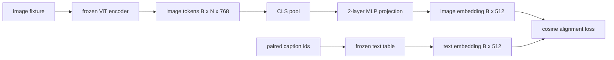

# Projection Layer for Modality Alignment | 模态对齐投影层

> A vision encoder produces image tokens. A text decoder consumes text tokens. The two live in different vector spaces. A small two-layer MLP projects image tokens into the text embedding space, and a cosine alignment loss against a paired caption pulls the two spaces into agreement. That projection is the smallest piece of a vision-language model and the one that matters most for transfer.

> **【中文解读】** 视觉编码器产出图像词元，文本解码器消费文本词元——两者活在不同的向量空间里。本课用一个小两层 MLP 把图像特征投影进文本嵌入空间，再用与配对描述文本的余弦对齐损失把两个空间拉拢。这块投影是视觉-语言模型里最小的部件，却是对迁移最要命的那一块。

> **【拓展：适配器范式→LLaVA 2023 的原点】** 冻结 86M 视觉编码器、冻结文本表，只训 1.3M 参数的投影桥——这就是 LLaVA 2023 年的原始配方，BLIP-2 把它重新包装成 Q-Former，此后每个开源 VLM 都以某种形式采纳。本课用逐对余弦损失把训练动力学看清楚；62 课再升级成批量对比（InfoNCE）。

> 🔗 **【前置】** 学本课前请先掌握：本阶段 58、59 课（分块前端 + ViT 编码器）——本课直接 import 59 课的编码器并冻结；Track B 的 MLP、嵌入表与损失函数基础（30-37）。

**Type:** Build | **类型:** 构建
**Languages:** Python | **语言:** Python
**Prerequisites:** Phase 19 lessons 30-37 (Track B foundations) | **前置知识:** Phase 19 · 30-37（Track B 基础）
**Time:** ~90 minutes | **时间:** 约 90 分钟

## Learning Objectives | 学习目标

- Build a two-layer MLP projection that maps image features into the text embedding space.
  中文翻译：构建一个两层 MLP 投影，把图像特征映射进文本嵌入空间。
- Construct a mock text embedding table (no pretrained tokenizer, no real corpus).
  中文翻译：构造一个模拟文本嵌入表（不需要预训练分词器，也不需要真实语料）。
- Compute a cosine alignment loss between projected image tokens and a paired caption embedding.
  中文翻译：计算投影后图像词元与配对描述文本嵌入之间的余弦对齐损失。
- Train the projection alone with a frozen vision encoder and a frozen text table.
  中文翻译：在冻结视觉编码器和冻结文本表的前提下，只训练投影层。

## The Problem | 问题引入

> **【中文解读】** 问题很具体：编码器（58-59 课）输出维度 `vision_hidden = 768` 的词元，解码器要接的是 `text_hidden = 512` 的文本形词元。图像词元住在"纯视觉预训练学出的基"里，与解码器的词向量毫无关系。两层 MLP（线性-GELU-线性）补上这道缝：约 1.3M 参数、单卡几分钟训完，而且是对齐阶段唯一要学的东西——编码器冻结、文本表冻结，只有投影在动。

You have a vision encoder (lessons 58-59) producing tokens of dimension `vision_hidden = 768`. You have a text decoder you want to bolt on top with embedding dimension `text_hidden = 512` (any other number is just as plausible). The decoder expects text-shaped tokens. The image tokens are not text-shaped: they live in a basis the encoder learned during vision-only pretraining, with no relationship to the decoder's word vectors.

> 你有一个视觉编码器（58-59 课），产出维度 `vision_hidden = 768` 的词元。你有一个想接在上面的文本解码器，嵌入维度 `text_hidden = 512`（换成别的数也一样合理）。解码器期待的是文本形状的词元。图像词元不是文本形状的：它们住在编码器在纯视觉预训练中学到的基里，与解码器的词向量毫无关系。

Two-layer MLP projection (linear, GELU, linear) bridges the gap. It is small enough (about `768 * 1024 + 1024 * 512 = 1.3M` parameters) to train in minutes on a single GPU, and it is the only piece that has to learn during the alignment phase. The vision encoder stays frozen. The text embedding table stays frozen. Only the projection moves. This is the recipe LLaVA shipped in 2023, that BLIP-2 reframed as a Q-Former, and that every open-weight VLM since has adopted in some form.

> 两层 MLP 投影（线性、GELU、线性）补上这道缝。它足够小（约 `768 * 1024 + 1024 * 512 = 1.3M` 参数），单张 GPU 几分钟就能训完，而且是对齐阶段唯一需要学习的部件。视觉编码器保持冻结，文本嵌入表保持冻结，只有投影在动。这就是 LLaVA 2023 年交付的配方、BLIP-2 重新包装成 Q-Former 的东西，也是此后每个开源 VLM 以某种形式采纳的做法。

## The Concept | 核心概念



### Pooling before projection | 投影前先池化

The vision encoder emits 197 tokens. The text side has a single caption-level embedding. To align them you need one image-level vector per sample. CLS pooling is the simplest: take the first token from the encoder and project it. Mean pooling over all 197 tokens is another option and is what SigLIP uses. Either pools 197 vectors down to one.

> 视觉编码器吐出 197 个词元，而文本侧只有单个描述级嵌入。要对齐，每个样本就需要一个图像级向量。CLS 池化最简单：取编码器的第一个词元去投影。对全部 197 个词元做平均池化是另一个选项，SigLIP 用的就是它。两者都把 197 个向量收成一个。

### Why two layers and not one | 为什么两层而不是一层

> 💡 **【类比】** 单层线性投影像"只能平移旋转缩放地图的坐标系"——两个空间若只是摆放角度不同，转一转就对上了；但若一个空间有弯、一个平（曲率不匹配），光转坐标系永远对不齐。夹在两个线性层中间的 GELU 给投影加了一次"折纸"式的非线性弯折，经验上刚好够把 CLIP 风格特征折进语言模型嵌入的空间。

A single linear projection can rotate and rescale but cannot fix the basis if the two spaces have curvature mismatches. GELU between two linear layers gives the projection one non-linear bend, which is empirically enough to align CLIP-style features to language model embeddings. Deeper projections (LLaVA-NeXT used GLU; Qwen-VL used a stack of attention layers) are extensions; two-layer MLP is the canonical baseline and is what BLIP-2's Q-Former projection head ships with under the hood.

> 单层线性投影能旋转和缩放，但若两个空间存在曲率失配就无法修复基。两个线性层之间夹一层 GELU 给投影一次非线性弯折，经验上足以把 CLIP 风格特征对齐到语言模型嵌入。更深的投影（LLaVA-NeXT 用了 GLU；Qwen-VL 用了一叠注意力层）是扩展；两层 MLP 是经典基线，也是 BLIP-2 的 Q-Former 投影头内部搭载的东西。

| Layer | Shape | Parameters |
|-------|-------|------------|
| fc1 | `(vision_hidden, projection_hidden)` | `768 * 1024 + 1024` |
| activation | GELU | 0 |
| fc2 | `(projection_hidden, text_hidden)` | `1024 * 512 + 512` |

About 1.3M parameters for a `768 -> 1024 -> 512` head.

> 一个 `768 -> 1024 -> 512` 的投影头约 1.3M 参数。

### Cosine alignment loss | 余弦对齐损失

> **【中文解读】** "对齐"不等于 `image_emb == text_emb`。对齐是指 `image_emb` 在联合空间中与 `text_emb` 指向同一方向。余弦损失 `1 - cos_sim(image, text)` 取值从 0（完全同向）到 2（完全反向），训练把每个配对往零推。62 课把它推广成批量对比（InfoNCE）——每张图必须离自己的描述比离批内其他任何描述都近；本课用逐对版本，让动力学看得见。

Align does not mean `image_emb == text_emb`. Align means `image_emb` points in the same direction as `text_emb` in the joint space. The cosine loss is `1 - cos_sim(image, text)`, ranging from 0 (perfectly aligned) to 2 (opposite). Training drives this toward zero per pair. Lesson 62 generalizes to a contrastive batch (InfoNCE) where every image must be closer to its own caption than to any other caption in the batch; this lesson uses the per-pair version so the dynamics are visible.

> 对齐不等于 `image_emb == text_emb`。对齐是指 `image_emb` 在联合空间中与 `text_emb` 指向同一方向。余弦损失是 `1 - cos_sim(image, text)`，取值从 0（完全对齐）到 2（完全相反）。训练把每个配对往零推。62 课把它推广为批量对比（InfoNCE），其中每张图必须比批内任何其他描述都更靠近自己的描述；本课用逐对版本，让动力学看得见。

### Frozen encoder is the trick | 冻结编码器是诀窍

The vision encoder has 86M parameters. The text table has another few million. Training all of them from a mock corpus is a non-starter. Freezing both means the projection's 1.3M parameters are the only thing changing, and a few hundred steps on synthetic pairs is enough to drive the loss down. This is exactly the operational shape of every adapter-based VLM: the heavy parts stay frozen, the light bridge trains.

> 视觉编码器有 86M 参数，文本表另有几百万。用模拟语料从头训它们全无可能。把两者都冻结意味着投影的 1.3M 参数是唯一在变的东西，合成配对上几百步就足够把损失压下去。这正是每个适配器式 VLM 的操作形态：重部件保持冻结，轻量桥负责训练。

```figure
ch-projection-bridge
```

## Build It | 动手实现

> **【中文解读】** `code/main.py` 实现 `MLPProjector`（两层 GELU MLP）、`MockTextEmbedding`（种子确定性初始化的冻结嵌入表）、`make_pair(seed, vocab_size)`（合成"图像 + 描述 id 序列"配对，描述嵌入由词元嵌入平均池化）、`cosine_alignment_loss`（逐对 `1 - cos_sim`）。训练循环在 32 个合成配对上跑 200 步（循环复用），每 25 步打印损失——从约 1.07 降到约 0.80，证明光靠投影就能把图像词元拉向文本空间。

`code/main.py` implements:

- `MLPProjector(in_dim, hidden_dim, out_dim)`, two-layer linear MLP with GELU activation.
- `MockTextEmbedding(vocab_size, dim)`, a frozen embedding table with deterministic init from a seed.
- `make_pair(seed, vocab_size)`, which synthesizes one paired (image, caption) sample. Captions are short id sequences; the caption embedding is mean-pooled over token embeddings.
- `cosine_alignment_loss(image_emb, text_emb)`, the per-pair `1 - cos_sim` objective.
- A training loop that runs the projection for 200 steps over 32 synthetic pairs (cycled), with the vision encoder and text table frozen, and prints the loss every 25 steps.

Run it:

```bash
python3 code/main.py
```

Output: training reports drop from initial loss around 1.07 down to about 0.80 within 200 steps, demonstrating that the projection alone can pull image tokens toward the text space. The final cosine similarity per pair is also printed.

> 输出：训练报告显示损失在 200 步内从初始约 1.07 降到约 0.80，证明单靠投影就能把图像词元拉向文本空间。最终每个配对的余弦相似度也会打印出来。

## Use It | 用框架实现

> **【中文解读】** 同一模式出现在每个开源 VLM 里：LLaVA 1.5（CLIP-ViT-L 隐藏维到 LLaMA 嵌入维的两层 GELU MLP，第一阶段只训投影）、BLIP-2（Q-Former 用 32 个可学习查询词元对图像词元做交叉注意力，末端投影头就是本课 MLP 的对应物）、MiniGPT-4（单线性投影）、Qwen-VL（多层交叉注意力适配器，最后一块仍是投到 LM 嵌入维的投影）。形状各异，角色相同：池化图像词元、投到文本嵌入维、单独训练。

The same pattern shows up in every open-weight VLM:

- **LLaVA 1.5.** Two-layer GELU MLP projection from CLIP-ViT-L hidden to LLaMA embedding dim. Frozen vision encoder, frozen LLM, train only the projection (then unfreeze the LLM in stage two).
  中文翻译：**LLaVA 1.5。** 从 CLIP-ViT-L 隐藏维到 LLaMA 嵌入维的两层 GELU MLP 投影。冻结视觉编码器、冻结 LLM，只训投影（第二阶段再解冻 LLM）。
- **BLIP-2.** Q-Former takes 32 learned query tokens through cross-attention against image tokens, then projects to the LLM embedding dim. The projection head at the very end of Q-Former is the analog of this lesson's MLP.
  中文翻译：**BLIP-2。** Q-Former 让 32 个可学习查询词元对图像词元做交叉注意力，再投影到 LLM 嵌入维。Q-Former 最末端的投影头就是本课 MLP 的对应物。
- **MiniGPT-4.** Single linear projection from BLIP-2 Q-Former output to Vicuna embedding dim.
  中文翻译：**MiniGPT-4。** 从 BLIP-2 Q-Former 输出到 Vicuna 嵌入维的单线性投影。
- **Qwen-VL.** Cross-attention adapter with several layers, but the final piece is again a projection to the LM embedding dim.
  中文翻译：**Qwen-VL。** 多层交叉注意力适配器，但最后一块仍是投到 LM 嵌入维的投影。

The shape varies but the role is identical: pool image tokens, project to text embedding dim, train alone.

> 形状各异，角色相同：池化图像词元，投影到文本嵌入维，单独训练。

## Tests | 测试

`code/test_main.py` covers:

- projector output shape matches the configured `out_dim`
  中文翻译：投影器输出形状与配置的 `out_dim` 一致。
- frozen text embedding table has zero `requires_grad` parameters
  中文翻译：冻结文本嵌入表的 `requires_grad` 参数为零。
- cosine loss is zero on identical vectors and is 2 on anti-parallel vectors
  中文翻译：相同向量上余弦损失为零，反向平行向量上为 2。
- projector gradient flows after one backward pass
  中文翻译：一次反向传播后投影器梯度正常流动。
- the training loop reduces loss between step 0 and step 200
  中文翻译：训练循环在第 0 步与第 200 步之间降低损失。

Run them:

```bash
python3 -m unittest code/test_main.py
```

## Exercises | 练习题

1. Replace CLS pooling with mean pooling over the 196 patch tokens and compare final loss after 200 steps. Mean pooling usually trains faster on synthetic data; CLS is more sample-efficient on natural images.
   中文翻译：把 CLS 池化换成对 196 个图像块词元的平均池化，比较 200 步后的最终损失。合成数据上平均池化通常训得更快；自然图像上 CLS 更省样本。

2. Add a learned scalar temperature to the cosine loss (`cos / tau`) and observe what happens when `tau` is too small (gradient noise) or too large (loss plateaus high).
   中文翻译：给余弦损失加一个可学习标量温度（`cos / tau`），观察 `tau` 太小（梯度噪声）或太大（损失高位停滞）时会发生什么。

3. Swap the two-layer MLP for a single linear layer and quantify the loss gap. The non-linearity matters more on natural image features and less on synthetic ones.
   中文翻译：把两层 MLP 换成单层线性并量化损失差距。非线性在自然图像特征上更重要，在合成特征上影响较小。

4. Add a small L2 penalty on the projector weights and watch how it interacts with cosine alignment (cosine is scale-invariant, so the penalty mostly shrinks unused directions).
   中文翻译：给投影器权重加一个小的 L2 惩罚，观察它与余弦对齐的相互作用（余弦对尺度不变，惩罚主要收缩未使用的方向）。

5. Persist projector weights, then reload and run inference without the vision encoder backward pass to verify that only the projector is needed at deploy time.
   中文翻译：持久化投影器权重，然后重载并在无视觉编码器反向传播的情况下推理，验证部署时只需要投影器。

## Key Terms | 术语速查表

> **【中文解读】** 五个词：Modality alignment（模态对齐——让图文嵌入在共享空间可比）、Projection head（投影头——通常两层 MLP）、Cosine similarity（余弦相似度——点积除以 L2 范数之积）、Frozen encoder（冻结编码器——全部参数 `requires_grad=False`）、Mock corpus（模拟语料——免数据集下载依赖的合成配对）。

| Term | What it means |
|------|---------------|
| Modality alignment | The act of making image and text embeddings comparable in one shared space |
| Projection head | The small module that maps one space to another, usually a 2-layer MLP |
| Cosine similarity | Dot product divided by the product of L2 norms |
| Frozen encoder | The vision (or text) model has all parameters with `requires_grad=False` |
| Mock corpus | Synthetic pairs used so training has no dataset download dependency |

## Further Reading | 延伸阅读

- LLaVA paper for the two-stage train (project, then unfreeze LM).
  中文翻译：LLaVA 论文——两阶段训练（先投影，再解冻 LM）。
- BLIP-2 paper for Q-Former as a learnable projection alternative.
  中文翻译：BLIP-2 论文——Q-Former 作为可学习投影的替代方案。
- Qwen-VL technical report for cross-attention adapters as deeper projection heads.
  中文翻译：Qwen-VL 技术报告——交叉注意力适配器作为更深的投影头。
