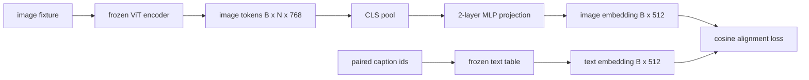

# 模态对齐投影层

> 视觉编码器产出图像词元，文本解码器消费文本词元，两者活在不同的向量空间里。一个小两层 MLP 把图像词元投影进文本嵌入空间，与配对描述文本的余弦对齐损失把两个空间拉拢。这块投影是视觉-语言模型里最小的部件，却是对迁移最要命的那一块。

> **【中文解读】** 本课做 VLM 的"轻量桥"：冻结 58-59 课的视觉编码器和一张模拟文本嵌入表，只训一个 1.3M 参数的两层 MLP 投影，目标是逐对的余弦对齐。学完你应能构建投影头、造模拟嵌入表、算余弦对齐损失，并亲眼看到"只动投影"就把损失从 1.07 压到 0.80。

> **【拓展：适配器范式→LLaVA 2023 的原点】** 冻结 86M 视觉编码器、冻结文本表，只训 1.3M 参数的投影桥——这就是 LLaVA 2023 年的原始配方，BLIP-2 把它重新包装成 Q-Former，此后每个开源 VLM 都以某种形式采纳。本课用逐对余弦损失把训练动力学看清楚；62 课再升级成批量对比（InfoNCE）。

> 🔗 **【前置】** 学本课前请先掌握：本阶段 58、59 课（分块前端 + ViT 编码器）——本课直接 import 59 课的编码器并冻结；Track B 的 MLP、嵌入表与损失函数基础（30-37）。

**类型：** 构建
**语言：** Python
**前置条件：** Phase 19 · 30-37（Track B 基础）
**预计用时：** 约 90 分钟

## 学习目标

- 构建一个两层 MLP 投影，把图像特征映射进文本嵌入空间。
- 构造一个模拟文本嵌入表（不需要预训练分词器，也不需要真实语料）。
- 计算投影后图像词元与配对描述文本嵌入之间的余弦对齐损失。
- 在冻结视觉编码器和冻结文本表的前提下，只训练投影层。

## 问题引入

> **【中文解读】** 图像词元（768 维）与文本词元（512 维）分属两套毫无关系的基；两层 MLP 补缝，且是对齐阶段唯一要学的部件——这就是适配器式 VLM 的操作形态。

你有一个视觉编码器（58-59 课），产出维度 `vision_hidden = 768` 的词元。你有一个想接在上面的文本解码器，嵌入维度 `text_hidden = 512`（换成别的数也一样合理）。解码器期待的是文本形状的词元。图像词元不是文本形状的：它们住在编码器在纯视觉预训练中学到的基里，与解码器的词向量毫无关系。

两层 MLP 投影（线性、GELU、线性）补上这道缝。它足够小（约 `768 * 1024 + 1024 * 512 = 1.3M` 参数），单张 GPU 几分钟就能训完，而且是对齐阶段唯一需要学习的部件。视觉编码器保持冻结，文本嵌入表保持冻结，只有投影在动。这就是 LLaVA 2023 年交付的配方、BLIP-2 重新包装成 Q-Former 的东西，也是此后每个开源 VLM 以某种形式采纳的做法。

## 核心概念



### 投影前先池化

> **【中文解读】** 编码器 197 个词元对文本侧 1 个描述级嵌入，先收成一个图像级向量再投影。CLS 池化最简单；SigLIP 用平均池化。殊途同归。

视觉编码器吐出 197 个词元，而文本侧只有单个描述级嵌入。要对齐，每个样本就需要一个图像级向量。CLS 池化最简单：取编码器的第一个词元去投影。对全部 197 个词元做平均池化是另一个选项，SigLIP 用的就是它。两者都把 197 个向量收成一个。

### 为什么两层而不是一层

> 💡 **【类比】** 单层线性投影像"只能平移旋转缩放地图的坐标系"——两个空间若只是摆放角度不同，转一转就对上了；但若一个空间有弯、一个平（曲率不匹配），光转坐标系永远对不齐。夹在两个线性层中间的 GELU 给投影加了一次"折纸"式的非线性弯折，经验上刚好够。

单层线性投影能旋转和缩放，但若两个空间存在曲率失配就无法修复基。两个线性层之间夹一层 GELU 给投影一次非线性弯折，经验上足以把 CLIP 风格特征对齐到语言模型嵌入。更深的投影（LLaVA-NeXT 用了 GLU；Qwen-VL 用了一叠注意力层）是扩展；两层 MLP 是经典基线，也是 BLIP-2 的 Q-Former 投影头内部搭载的东西。

| 层 | 形状 | 参数量 |
|----|------|--------|
| fc1 | `(vision_hidden, projection_hidden)` | `768 * 1024 + 1024` |
| 激活 | GELU | 0 |
| fc2 | `(projection_hidden, text_hidden)` | `1024 * 512 + 512` |

一个 `768 -> 1024 -> 512` 的投影头约 1.3M 参数。

### 余弦对齐损失

对齐不等于 `image_emb == text_emb`。对齐是指 `image_emb` 在联合空间中与 `text_emb` 指向同一方向。余弦损失是 `1 - cos_sim(image, text)`，取值从 0（完全对齐）到 2（完全相反）。训练把每个配对往零推。62 课把它推广为批量对比（InfoNCE），其中每张图必须比批内任何其他描述都更靠近自己的描述；本课用逐对版本，让动力学看得见。

### 冻结编码器是诀窍

> **【中文解读】** 86M 编码器 + 几百万文本表，用模拟语料从头训是不可能的。冻结两者后，投影的 1.3M 参数是唯一在变的东西，几百步就见损失下降。重部件冻结、轻量桥训练——每个适配器式 VLM 的操作形态。

视觉编码器有 86M 参数，文本表另有几百万。用模拟语料从头训它们全无可能。把两者都冻结意味着投影的 1.3M 参数是唯一在变的东西，合成配对上几百步就足够把损失压下去。这正是每个适配器式 VLM 的操作形态：重部件保持冻结，轻量桥负责训练。

```figure
ch-projection-bridge
```

## 动手实现

> **【中文解读】** 代码四件套：`MLPProjector`、`MockTextEmbedding`（冻结）、`make_pair`（合成配对）、`cosine_alignment_loss`。训练循环 200 步、每 25 步打印损失——从约 1.07 降到约 0.80。

`code/main.py` 实现了：

- `MLPProjector(in_dim, hidden_dim, out_dim)`：带 GELU 激活的两层线性 MLP。
- `MockTextEmbedding(vocab_size, dim)`：种子确定性初始化的冻结嵌入表。
- `make_pair(seed, vocab_size)`：合成一个配对的（图像, 描述）样本。描述是短 id 序列；描述嵌入由词元嵌入平均池化得到。
- `cosine_alignment_loss(image_emb, text_emb)`：逐对 `1 - cos_sim` 目标函数。
- 一个训练循环：在 32 个合成配对（循环复用）上跑 200 步，视觉编码器与文本表冻结，每 25 步打印损失。

运行：

```bash
python3 code/main.py
```

输出：训练报告显示损失在 200 步内从初始约 1.07 降到约 0.80，证明单靠投影就能把图像词元拉向文本空间。最终每个配对的余弦相似度也会打印出来。

## 用框架实现

同一模式出现在每个开源 VLM 里：

- **LLaVA 1.5。** 从 CLIP-ViT-L 隐藏维到 LLaMA 嵌入维的两层 GELU MLP 投影。冻结视觉编码器、冻结 LLM，只训投影（第二阶段再解冻 LLM）。
- **BLIP-2。** Q-Former 让 32 个可学习查询词元对图像词元做交叉注意力，再投影到 LLM 嵌入维。Q-Former 最末端的投影头就是本课 MLP 的对应物。
- **MiniGPT-4。** 从 BLIP-2 Q-Former 输出到 Vicuna 嵌入维的单线性投影。
- **Qwen-VL。** 多层交叉注意力适配器，但最后一块仍是投到 LM 嵌入维的投影。

形状各异，角色相同：池化图像词元，投影到文本嵌入维，单独训练。

## 测试

`code/test_main.py` 覆盖：

- 投影器输出形状与配置的 `out_dim` 一致。
- 冻结文本嵌入表的 `requires_grad` 参数为零。
- 相同向量上余弦损失为零，反向平行向量上为 2。
- 一次反向传播后投影器梯度正常流动。
- 训练循环在第 0 步与第 200 步之间降低损失。

运行：

```bash
python3 -m unittest code/test_main.py
```

## 练习题

1. 把 CLS 池化换成对 196 个图像块词元的平均池化，比较 200 步后的最终损失。合成数据上平均池化通常训得更快；自然图像上 CLS 更省样本。

2. 给余弦损失加一个可学习标量温度（`cos / tau`），观察 `tau` 太小（梯度噪声）或太大（损失高位停滞）时会发生什么。

3. 把两层 MLP 换成单层线性并量化损失差距。非线性在自然图像特征上更重要，在合成特征上影响较小。

4. 给投影器权重加一个小的 L2 惩罚，观察它与余弦对齐的相互作用（余弦对尺度不变，惩罚主要收缩未使用的方向）。

5. 持久化投影器权重，然后重载并在无视觉编码器反向传播的情况下推理，验证部署时只需要投影器。

## 术语速查表

| 术语 | 含义 |
|------|------|
| Modality alignment（模态对齐） | 让图像与文本嵌入在一个共享空间中可比 |
| Projection head（投影头） | 把一个空间映射到另一个空间的小模块，通常是两层 MLP |
| Cosine similarity（余弦相似度） | 点积除以 L2 范数之积 |
| Frozen encoder（冻结编码器） | 视觉（或文本）模型全部参数 `requires_grad=False` |
| Mock corpus（模拟语料） | 让训练不依赖数据集下载的合成配对 |

## 延伸阅读

- LLaVA 论文——两阶段训练（先投影，再解冻 LM）。
- BLIP-2 论文——Q-Former 作为可学习投影的替代方案。
- Qwen-VL 技术报告——交叉注意力适配器作为更深的投影头。
