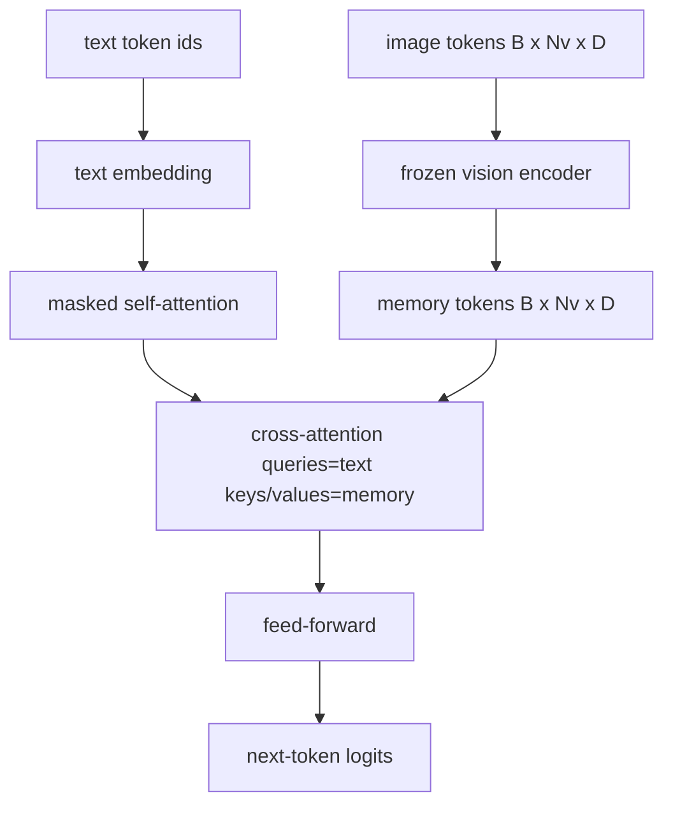
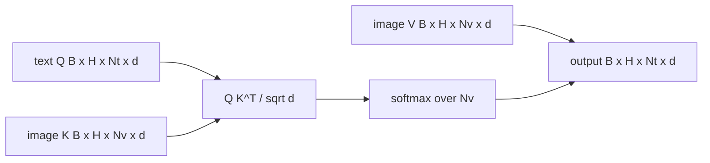

# Cross-Attention Fusion | 交叉注意力融合

> The projection layer aligns one image vector with one caption vector. A real vision-language decoder needs every text token to attend to every patch token, so the model can ground each word in a region. Cross-attention is how that grounding happens. The text queries; the vision keys and values answer. This lesson builds the cross-attention block, the causal text self-attention, and the mask shapes that keep both legal.

> **【中文解读】** 60 课的投影层只对齐"一个图像向量 vs 一个描述向量"。真正的视觉-语言解码器需要每个文本词元都能看到每个图像块词元，把每个词锚定到某个图像区域——交叉注意力就是实现这种锚定的机制：文本出查询（Q），视觉出键和值（K、V）作答。本课造三样东西：交叉注意力块、带因果掩码的文本自注意力、以及让两者都合法的掩码形状。

> **【拓展：早融合 vs 晚融合→两条产品路线】** 把图文词元拼成一条序列（早融合）是 Chameleon、Emu3 的路；交叉注意力（晚融合）是 Flamingo 开创、此后所有 Flamingo 形解码器沿用的路。晚融合两大红利：文本流干净（保留纯文本能力）、图像流一次算好反复复用（长描述生成也便宜）。代价是每块多一个注意力子层。

> 🔗 **【前置】** 学本课前请先掌握：59 课（多头自注意力、pre-LN 块）——交叉注意力与它是同一数学，只是 Q 和 K/V 来自不同流；60 课（模态对齐）——理解"图像词元作为解码器的记忆"这一角色。

**Type:** Build | **类型:** 构建
**Languages:** Python | **语言:** Python
**Prerequisites:** Phase 19 lessons 30-37 (Track B foundations) | **前置知识:** Phase 19 · 30-37（Track B 基础）
**Time:** ~90 minutes | **时间:** 约 90 分钟

## Learning Objectives | 学习目标

- Implement multi-head cross-attention where the query stream is text and the key/value stream is vision.
  中文翻译：实现多头交叉注意力，查询流是文本、键/值流是视觉。
- Compose a decoder block: causal self-attention + cross-attention + feed-forward.
  中文翻译：组合一个解码器块：因果自注意力 + 交叉注意力 + 前馈。
- Get the mask shapes right: causal mask for self-attention, no mask for cross-attention.
  中文翻译：把掩码形状搞对：自注意力用因果掩码，交叉注意力不用掩码。
- Run a forward pass with batched text tokens and a fixed pool of image tokens.
  中文翻译：用成批的文本词元和固定的图像词元池跑一次前向。

## The Problem | 问题引入

> **【中文解读】** 本节对比两种融合路线。早融合把图像块词元与文本词元拼成一条序列（Chameleon、Emu3 的路）；晚融合让文本解码器跑在纯文本词元上，每层通过交叉注意力伸手进图像流（Flamingo 开创、后续 Flamingo 形解码器沿用）。晚融合的优势：文本流保持干净、模型保住纯文本能力；图像流每图只算一次、每个解码步复用，长描述生成也便宜。代价是每块多一个注意力子层。

Concatenating image tokens and text tokens into one sequence is one fusion option (early fusion, the path Chameleon and Emu3 take). Cross-attention is the other (late fusion, the path Flamingo introduced and that every Flamingo-shaped decoder since has copied). In late fusion, the text decoder runs on text-only tokens and reaches over into the image stream through cross-attention at every layer.

> 把图像词元和文本词元拼进一条序列是一种融合选项（早融合，Chameleon 和 Emu3 走的路）。交叉注意力是另一种（晚融合，Flamingo 引入、此后每个 Flamingo 形解码器都照抄的路）。在晚融合中，文本解码器跑在纯文本词元上，每一层都通过交叉注意力伸手进图像流。

Late fusion has two advantages. First, the text stream stays clean and the model preserves text-only capabilities. Second, the image stream is computed once per image and reused for every decode step, so generation is cheap even for long captions. The cost is one extra attention sub-layer per block.

> 晚融合有两大优势。第一，文本流保持干净，模型保得住纯文本能力。第二，图像流每张图只算一次、每个解码步复用，所以即使描述很长生成也便宜。代价是每块多一个注意力子层。

## The Concept | 核心概念





### Mask shapes | 掩码形状

> ⚠️ **【易错点】** 场景：把自注意力的因果掩码顺手也加到交叉注意力上（文本词元只能看到前几个图像块）/ 后果：模型对图像的下半部分"失明"，损失曲线看不出明显异常，纯靠隐蔽的幻觉退化 / 修复：自注意力掩码是 `(Nt, Nt)` 下三角，交叉注意力无掩码——整张图对每个文本位置可见。本课的形状校验函数把"搞混两种掩码"变成一个 `ValueError`，而不是一条悄悄坏掉的损失曲线。

The two attentions inside a decoder block need different masks:

> 解码器块里的两种注意力需要不同的掩码：

| Attention | Query length | Key length | Mask | Why |
|-----------|--------------|------------|------|-----|
| Self-attention | `Nt` (text) | `Nt` (text) | Causal: lower-triangular `(Nt, Nt)` | Text tokens may not look ahead during autoregression |
| Cross-attention | `Nt` (text) | `Nv` (vision) | No mask | The whole image is visible to every text position |

The lesson includes one shape-validation function so the mistake of mixing them up surfaces as a `ValueError` instead of a silently broken loss curve.

> 本课包含一个形状校验函数，让"把两种掩码搞混"这个错误以 `ValueError` 的形式暴露出来，而不是一条悄悄坏掉的损失曲线。

### Why no mask on cross-attention | 交叉注意力为什么不用掩码

The image is fully observed before any text is generated. Token `t` of the caption may attend to any patch of the image; there is no temporal order on image patches. Some Flamingo variants add a per-sample masking pattern when interleaving multiple images and text segments, but for a single image plus a caption, cross-attention sees everything.

> 图像在任何文本生成之前就被完整观测。描述的第 `t` 个词元可以注意图像的任意图像块；图像块之间没有时间顺序。一些 Flamingo 变体在交错多图多段文本时加入逐样本掩码模式，但对单图加一条描述而言，交叉注意力看到的是全部。

### Key/value caching | 键/值缓存

> **【中文解读】** 图像的键和值在解码开始时算一次并放进缓存，之后每个新文本词元直接复用缓存、不再重算。这正是推理时看图描述快的原因：重 ViT 只跑一次，交叉注意力每步复用其 K/V。本课把缓存暴露出来并测试了缓存命中路径。

The image keys and values are computed once at the start of the decode and held in a cache. Each new text token uses the cache without recomputation. This is what makes captioning fast at inference: the heavy ViT runs once; the cross-attention reuses its keys and values for every step. The lesson exposes the cache and tests the cache-hit path.

> 图像的键和值在解码开始时计算一次并保存在缓存里。每个新的文本词元直接使用缓存、不做重算。这正是推理时图像描述快的原因：沉重的 ViT 只跑一次，交叉注意力每一步复用它的键和值。本课把缓存暴露出来并测试缓存命中路径。

### Block composition | 块的组合

A decoder block runs: pre-LN -> self-attention -> residual -> pre-LN -> cross-attention -> residual -> pre-LN -> feed-forward -> residual. Three sub-layers, each with its own LayerNorm. The Flamingo paper added a learned gate on cross-attention so the model could opt out of the image path at training-time stability cost; the canonical baseline (used here) has no gate.

> 解码器块的流程：pre-LN -> 自注意力 -> 残差 -> pre-LN -> 交叉注意力 -> 残差 -> pre-LN -> 前馈 -> 残差。三个子层，各配自己的 LayerNorm。Flamingo 论文在交叉注意力上加了一个可学习门控，让模型可以退出图像路径，代价是训练稳定性；经典基线（本课所用）没有门控。

```python
class DecoderBlock:
  def forward(self, text_tokens, image_tokens, text_mask, cross_mask):
      text_tokens = text_tokens + self.self_attn(self.ln1(text_tokens),
                                                 mask=text_mask)
      text_tokens = text_tokens + self.cross_attn(self.ln2(text_tokens),
                                                  image_tokens,
                                                  mask=cross_mask)
      text_tokens = text_tokens + self.ffn(self.ln3(text_tokens))
      return text_tokens
```

```figure
ch-crossattn-fan
```

## Build It | 动手实现

> **【中文解读】** `code/main.py` 实现 `CrossAttention`（独立的 q 与 kv 投影）、`CausalSelfAttention`（标准解码器的掩码自注意力）、`DecoderBlock`（三个子层 pre-LN 残差组合）、`VisionLanguageDecoder`（模拟视觉编码器输出 + 小文本嵌入表喂养的四层解码器）、`causal_mask(length)`（下三角布尔张量）。demo 喂两条长度 10 的文本序列加 197 长度的图像记忆，打印输出形状、自注意力掩码形状和每个位置的交叉注意力输出范数。

`code/main.py` implements:

- `CrossAttention(hidden, heads)`, multi-head cross-attention with separate `q` and `kv` projections.
- `CausalSelfAttention(hidden, heads)`, the masked self-attention from a standard decoder.
- `DecoderBlock`, composing the three sub-layers with pre-LN residuals.
- `VisionLanguageDecoder`, four-layer decoder fed by a mock vision encoder output and a small text embedding table.
- `causal_mask(length)` returning a `(length, length)` lower-triangular boolean tensor.
- A demo that feeds a batch of two text sequences of length 10 with image memory of length 197 and prints output shape, the self-attention mask shape, and the cross-attention output norm per position.

Run it:

```bash
python3 code/main.py
```

Output: decoder produces a `(2, 10, text_vocab)` logits tensor. Mask shape is `(10, 10)`. The KV-cache reuse check confirms identical logits between the cached and uncached paths.

> 输出：解码器产出 `(2, 10, text_vocab)` 的 logits 张量。掩码形状是 `(10, 10)`。KV 缓存复用检查确认缓存路径与无缓存路径的 logits 完全一致。

## Use It | 用框架实现

> **【中文解读】** 交叉注意力在生产里有两大门派：Flamingo/IDEFICS——每 K 个语言模型块插一个交叉注意力子层、LM 冻结，视觉-语言适配器就是交叉注意力块加门控；BLIP-2——Q-Former 让固定的 32 个查询词元对图像特征做交叉注意力，再把查询投进 LM 嵌入空间。本课的块形状直接映射到两派；掩码纪律（自注意因果、交叉无掩码）完全相同。

Cross-attention shows up in two production families:

- **Flamingo and IDEFICS.** Insert a cross-attention sub-layer every K language model blocks, with a frozen LM. The vision-language adapter is the cross-attention block plus its gate.
  中文翻译：**Flamingo 与 IDEFICS。** 每 K 个语言模型块插一个交叉注意力子层，LM 冻结。视觉-语言适配器就是交叉注意力块加它的门控。
- **BLIP-2.** The Q-Former uses cross-attention from a fixed set of 32 query tokens into the image features, then projects the queries into the LM embedding space.
  中文翻译：**BLIP-2。** Q-Former 让一组固定的 32 个查询词元对图像特征做交叉注意力，再把查询投影进 LM 嵌入空间。

The shape of the block in this lesson maps directly onto both. The mask discipline (causal on self, none on cross) is the same.

> 本课的块形状直接映射到两者。掩码纪律（自注意力因果、交叉注意力无掩码）是相同的。

## Tests | 测试

`code/test_main.py` covers:

- causal mask is lower-triangular and matches expected boolean shape
  中文翻译：因果掩码是下三角且匹配预期的布尔形状。
- cross-attention output shape is `(B, Nt, hidden)` regardless of key length
  中文翻译：无论键长多少，交叉注意力输出形状都是 `(B, Nt, hidden)`。
- KV-cache path matches uncached path to float tolerance
  中文翻译：KV 缓存路径与无缓存路径在浮点容差内一致。
- shape mismatch between text and image streams raises a clear `ValueError`
  中文翻译：文本流与图像流的形状失配会抛出清晰的 `ValueError`。
- a full decoder forward pass produces the right batch and sequence shape
  中文翻译：完整解码器前向产生正确的批与序列形状。

Run them:

```bash
python3 -m unittest code/test_main.py
```

## Exercises | 练习题

1. Add a learned tanh gate to the cross-attention residual (the Flamingo trick) and verify training converges from a near-zero initial gate. The gate starts at 0; the model recovers text-only behavior before mixing the image stream in.
   中文翻译：给交叉注意力残差加一个可学习 tanh 门控（Flamingo 技巧），验证训练从近零初始门控开始收敛。门控从 0 起步；模型先恢复纯文本行为，再把图像流混进来。

2. Implement interleaved attention where the same decoder consumes multiple images plus multiple text segments. Build the per-sample cross-attention mask that prevents text segment 2 from attending to image 1.
   中文翻译：实现交错注意力，让同一个解码器消费多张图加多段文本。构造防止文本段 2 注意到图 1 的逐样本交叉注意力掩码。

3. Profile the cross-attention vs the self-attention layer at `Nt=64, Nv=576` (a 24x24 grid at higher resolution). The cross-attention cost is `Nt * Nv` and dominates at high image resolution.
   中文翻译：在 `Nt=64, Nv=576`（更高分辨率的 24x24 网格）下剖析交叉注意力与自注意力层。交叉注意力开销是 `Nt * Nv`，在高图像分辨率下占主导。

4. Add a query-side dropout on the cross-attention map and measure caption diversity on the demo (caption sample variance increases with dropout in the cross map).
   中文翻译：给交叉注意力图加查询侧 dropout，在 demo 上测量描述多样性（交叉图上的 dropout 越大，描述样本方差越大）。

5. Swap the cross-attention layer for a Q-Former-style attention block where a fixed 32-token query pool attends to image features once per layer.
   中文翻译：把交叉注意力层换成 Q-Former 式注意力块——固定的 32 词元查询池每层对图像特征做一次注意。

## Key Terms | 术语速查表

> **【中文解读】** 五个词：Late fusion（晚融合——图文分流、逐块交叉注意力搭桥）、Cross-attention（Q 与 K/V 来自不同流）、Causal mask（自回归防偷看的下三角布尔掩码）、KV cache（图像 K/V 算一次、每步复用）、Memory tokens（解码器伸手去取的冻结图像词元）。这套词汇直接延续到 62 课的预训练。

| Term | What it means |
|------|---------------|
| Late fusion | Text and vision stay in separate streams; cross-attention bridges them at every block |
| Cross-attention | Q comes from one stream, K and V from another |
| Causal mask | Lower-triangular boolean mask that prevents looking ahead during autoregression |
| KV cache | Image keys and values stored once and reused for every decode step |
| Memory tokens | The frozen image tokens that the decoder reaches into |

## Further Reading | 延伸阅读

- Flamingo (2022) for the canonical late-fusion design with gated cross-attention.
  中文翻译：Flamingo（2022）——带门控交叉注意力的经典晚融合设计。
- BLIP-2 (2023) for the Q-Former, which is a cross-attention block dressed as a learned query pool.
  中文翻译：BLIP-2（2023）——Q-Former，一个扮成"可学习查询池"的交叉注意力块。
- IDEFICS (2023) for an open-weight reproduction of the Flamingo recipe.
  中文翻译：IDEFICS（2023）——Flamingo 配方的开源权重复刻。
