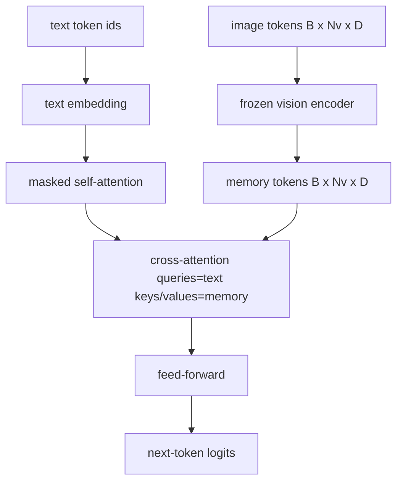
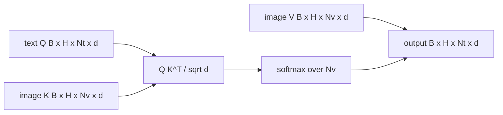

# 交叉注意力融合

> 投影层对齐的是一个图像向量与一个描述向量。真正的视觉-语言解码器需要每个文本词元都能注意到每个图像块词元，把每个词锚定到某个图像区域——交叉注意力就是锚定发生的地方。文本出查询，视觉的键和值作答。本课构建交叉注意力块、带因果掩码的文本自注意力，以及让两者都合法的掩码形状。

> **【中文解读】** 本课把 59 课的自注意力推广成"Q 与 K/V 来自不同流"的交叉注意力，并按晚融合路线组装解码器块：因果自注意力 + 交叉注意力 + 前馈，三个子层各配 pre-LN 和残差。掩码纪律是全课的脊梁——自注意力因果、交叉注意力无掩码，搞混就是隐蔽的模型退化。

> **【拓展：早融合 vs 晚融合→两条产品路线】** 把图文词元拼成一条序列（早融合）是 Chameleon、Emu3 的路；交叉注意力（晚融合）是 Flamingo 开创、此后所有 Flamingo 形解码器沿用的路。晚融合两大红利：文本流干净（保留纯文本能力）、图像流一次算好反复复用（长描述生成也便宜）。代价是每块多一个注意力子层。

> 🔗 **【前置】** 学本课前请先掌握：59 课（多头自注意力、pre-LN 块）——交叉注意力与它是同一数学，只是 Q 和 K/V 来自不同流；60 课（模态对齐）——理解"图像词元作为解码器的记忆"这一角色。

**类型：** 构建
**语言：** Python
**前置条件：** Phase 19 · 30-37（Track B 基础）
**预计用时：** 约 90 分钟

## 学习目标

- 实现多头交叉注意力，查询流是文本、键/值流是视觉。
- 组合一个解码器块：因果自注意力 + 交叉注意力 + 前馈。
- 把掩码形状搞对：自注意力用因果掩码，交叉注意力不用掩码。
- 用成批的文本词元和固定的图像词元池跑一次前向。

## 问题引入

> **【中文解读】** 融合有两条路：早融合（图文拼一条序列，Chameleon/Emu3）与晚融合（文本解码器逐层伸手进图像流，Flamingo 一脉）。晚融合保住纯文本能力，且图像流一图一算、步步复用。

把图像词元和文本词元拼进一条序列是一种融合选项（早融合，Chameleon 和 Emu3 走的路）。交叉注意力是另一种（晚融合，Flamingo 引入、此后每个 Flamingo 形解码器都照抄的路）。在晚融合中，文本解码器跑在纯文本词元上，每一层都通过交叉注意力伸手进图像流。

晚融合有两大优势。第一，文本流保持干净，模型保得住纯文本能力。第二，图像流每张图只算一次、每个解码步复用，所以即使描述很长生成也便宜。代价是每块多一个注意力子层。

## 核心概念





### 掩码形状

> ⚠️ **【易错点】** 把因果掩码错加到交叉注意力上，模型会对部分图像"失明"且损失曲线无明显异常。正确做法：自注意力掩码 `(Nt, Nt)` 下三角，交叉注意力无掩码。本课的形状校验把搞混变成 `ValueError` 而不是隐蔽退化。

解码器块里的两种注意力需要不同的掩码：

| 注意力 | 查询长度 | 键长度 | 掩码 | 原因 |
|--------|----------|--------|------|------|
| 自注意力 | `Nt`（文本） | `Nt`（文本） | 因果：`(Nt, Nt)` 下三角 | 自回归中文本词元不得偷看未来 |
| 交叉注意力 | `Nt`（文本） | `Nv`（视觉） | 无掩码 | 整张图对每个文本位置可见 |

本课包含一个形状校验函数，让"把两种掩码搞混"这个错误以 `ValueError` 的形式暴露出来，而不是一条悄悄坏掉的损失曲线。

### 交叉注意力为什么不用掩码

> **【中文解读】** 图像先于任何文本被完整观测；图像块之间没有时间顺序，因此每个描述词元可以看任意图像块。多图交错的 Flamingo 变体才需要逐样本掩码。

图像在任何文本生成之前就被完整观测。描述的第 `t` 个词元可以注意图像的任意图像块；图像块之间没有时间顺序。一些 Flamingo 变体在交错多图多段文本时加入逐样本掩码模式，但对单图加一条描述而言，交叉注意力看到的是全部。

### 键/值缓存

图像的键和值在解码开始时计算一次并保存在缓存里。每个新的文本词元直接使用缓存、不做重算。这正是推理时图像描述快的原因：沉重的 ViT 只跑一次，交叉注意力每一步复用它的键和值。本课把缓存暴露出来并测试缓存命中路径。

### 块的组合

> **【中文解读】** 三个子层——自注意力、交叉注意力、前馈——各配 pre-LN 和残差。Flamingo 加了可学习门控以便模型退出图像路径（以训练稳定性为代价）；本课的经典基线无门控。

解码器块的流程：pre-LN -> 自注意力 -> 残差 -> pre-LN -> 交叉注意力 -> 残差 -> pre-LN -> 前馈 -> 残差。三个子层，各配自己的 LayerNorm。Flamingo 论文在交叉注意力上加了一个可学习门控，让模型可以退出图像路径，代价是训练稳定性；经典基线（本课所用）没有门控。

```python
class DecoderBlock:
  def forward(self, text_tokens, image_tokens, text_mask, cross_mask):
      text_tokens = text_tokens + self.self_attn(self.ln1(text_tokens),
                                                 mask=text_mask)
      text_tokens = text_tokens + self.cross_attn(self.ln2(text_tokens),
                                                  image_tokens,
                                                  mask=cross_mask)
      text_tokens = text_tokens + self.ffn(self.ln3(text_tokens))
      return text_tokens
```

```figure
ch-crossattn-fan
```

## 动手实现

> **【中文解读】** 代码把掩码纪律写成可执行断言：`CrossAttention`（独立 q/kv 投影）、`CausalSelfAttention`、`DecoderBlock`、`VisionLanguageDecoder`（四层）、`causal_mask(length)`。demo 验证 KV 缓存路径与无缓存路径 logits 逐位一致——这是"图像流一图一算"的测试化表达。

`code/main.py` 实现了：

- `CrossAttention(hidden, heads)`：带独立 `q` 和 `kv` 投影的多头交叉注意力。
- `CausalSelfAttention(hidden, heads)`：标准解码器的掩码自注意力。
- `DecoderBlock`：用 pre-LN 残差组合三个子层。
- `VisionLanguageDecoder`：由模拟视觉编码器输出和小文本嵌入表喂养的四层解码器。
- `causal_mask(length)`：返回 `(length, length)` 下三角布尔张量。
- 一个 demo：喂一批两条长度 10 的文本序列加长度 197 的图像记忆，打印输出形状、自注意力掩码形状和每个位置的交叉注意力输出范数。

运行：

```bash
python3 code/main.py
```

输出：解码器产出 `(2, 10, text_vocab)` 的 logits 张量。掩码形状是 `(10, 10)`。KV 缓存复用检查确认缓存路径与无缓存路径的 logits 完全一致。

## 用框架实现

交叉注意力在生产里有两大门派：

- **Flamingo 与 IDEFICS。** 每 K 个语言模型块插一个交叉注意力子层，LM 冻结。视觉-语言适配器就是交叉注意力块加它的门控。
- **BLIP-2。** Q-Former 让一组固定的 32 个查询词元对图像特征做交叉注意力，再把查询投影进 LM 嵌入空间。

本课的块形状直接映射到两者。掩码纪律（自注意力因果、交叉注意力无掩码）是相同的。

## 测试

`code/test_main.py` 覆盖：

- 因果掩码是下三角且匹配预期的布尔形状。
- 无论键长多少，交叉注意力输出形状都是 `(B, Nt, hidden)`。
- KV 缓存路径与无缓存路径在浮点容差内一致。
- 文本流与图像流的形状失配会抛出清晰的 `ValueError`。
- 完整解码器前向产生正确的批与序列形状。

运行：

```bash
python3 -m unittest code/test_main.py
```

## 练习题

1. 给交叉注意力残差加一个可学习 tanh 门控（Flamingo 技巧），验证训练从近零初始门控开始收敛。门控从 0 起步；模型先恢复纯文本行为，再把图像流混进来。

2. 实现交错注意力，让同一个解码器消费多张图加多段文本。构造防止文本段 2 注意到图 1 的逐样本交叉注意力掩码。

3. 在 `Nt=64, Nv=576`（更高分辨率的 24x24 网格）下剖析交叉注意力与自注意力层。交叉注意力开销是 `Nt * Nv`，在高图像分辨率下占主导。

4. 给交叉注意力图加查询侧 dropout，在 demo 上测量描述多样性（交叉图上的 dropout 越大，描述样本方差越大）。

5. 把交叉注意力层换成 Q-Former 式注意力块——固定的 32 词元查询池每层对图像特征做一次注意。

## 术语速查表

| 术语 | 含义 |
|------|------|
| Late fusion（晚融合） | 文本与视觉分流，每块用交叉注意力搭桥 |
| Cross-attention（交叉注意力） | Q 来自一个流，K 和 V 来自另一个流 |
| Causal mask（因果掩码） | 防止自回归时偷看未来的下三角布尔掩码 |
| KV cache（KV 缓存） | 图像键值算一次、每个解码步复用 |
| Memory tokens（记忆词元） | 解码器伸手去取的冻结图像词元 |

## 延伸阅读

- Flamingo（2022）——带门控交叉注意力的经典晚融合设计。
- BLIP-2（2023）——Q-Former，一个扮成"可学习查询池"的交叉注意力块。
- IDEFICS（2023）——Flamingo 配方的开源权重复刻。
